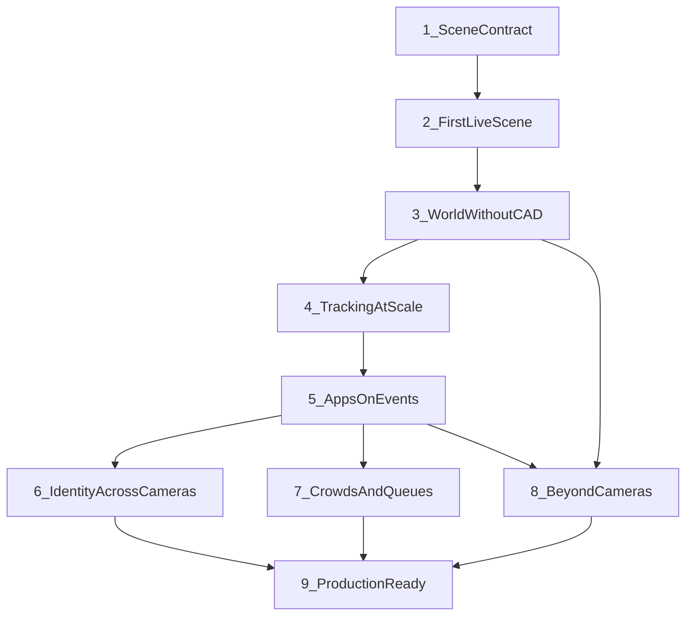

<!--
SPDX-FileCopyrightText: (C) 2026 Intel Corporation
SPDX-License-Identifier: Apache-2.0
-->

# Scenescape Progressive Blog Series — Plan

Shareable plan for a **deep (~9-post)** developer/customer blog series. The series showcases flexibility and value by **progressively unlocking** Scenescape capabilities available since the Open Edge Platform **2025.1**-era baseline (Scenescape `v1.4.0`), through current `main`.

This document is the series plan and post briefs outline only. It is **not** wired into the Sphinx user-guide toctree. Full post drafts are out of scope here.

**Authoring choice:** detailed post briefs (story arc, unlocks, doc/code pointers) — writers or agents expand later. No version-specific “what’s new in 2026.x” framing; teach capability unlocks.

**Internal coverage baseline (do not publish as version walkthrough):** OEP 2025.1 ≈ Scenescape `v1.4.0` → tip = `main` / `2026.2.0-rc1`.

---

## Audience and goal

- **Primary:** solution developers and ISVs building apps on scene data (MQTT/REST), not camera-pipeline specialists alone.
- **Secondary:** architects evaluating Scenescape for retail, campus, warehouse, and intersection deployments.
- **Goal:** completeness for showcasing and enabling use of capabilities delivered since 2025.1, via a progressive path (each post unlocks the next).

---

## Progressive unlock spine

Posts **01–05** are linear. Posts **06–08** are parallel advanced unlocks after the application contract (05). Post **09** consolidates production paths.

---

## Series TOC

| # | Working title | Capability unlock |
|---|---------------|-------------------|
| 01 | The Scene Contract | Scene-centric apps; Controller → Analytics message model |
| 02 | First Live Scene | Deploy, cameras, DL Streamer → verified tracks |
| 03 | A World Without CAD | Mapping/reconstruction + calibration choice tree |
| 04 | Tracking at Scale | C++ Tracker, pose occlusion, physics fields, eval mindset |
| 05 | Apps on Events | Analytics: regions, tripwires, regulated MQTT consumers |
| 06 | Identity Across Cameras | Extended Re-ID, vector DBs, hierarchy provenance |
| 07 | Crowds and Queues | Cluster Analytics (groups, shapes, motion patterns) |
| 08 | Beyond Cameras | Geospatial LLA, perceptual sensors, V2X bridge |
| 09 | Production Ready | K8s/Helm, model download, multi-controller, hardening, OTel |

---

## Post briefs

### 01 — The Scene Contract

- **Audience:** architects and app developers new to Scenescape.
- **Unlock:** Scene-centric apps vs per-camera pipelines; MQTT/REST mental model (Controller publishes unregulated tracks; Analytics publishes regulated detections and events).
- **Customer value:** Change cameras/sensors without rewriting business logic.
- **Prerequisites:** None.
- **Story arc:** Problem (brittle camera apps) → scene graph idea → architecture sketch → before/after app sketch (image ROI vs scene region subscription) → point to deploy next.
- **Pointers:**
  - [docs/user-guide/index.md](../user-guide/index.md)
  - [controller/data_formats.md](../user-guide/microservices/controller/data_formats.md)
  - [analytics/data_formats.md](../user-guide/microservices/analytics/data_formats.md)
  - Architecture figure in user-guide index
- **Include:** Simple before/after consumer sketch; glossary (scene, track, regulated vs unregulated).
- **Next unlock:** First live scene (02).

### 02 — First Live Scene

- **Audience:** developers standing up a lab or PoC.
- **Unlock:** Deploy stack + cameras + DL Streamer pipelines → first multi-object tracks in UI/MQTT.
- **Customer value:** Hours-to-demo path for solution builders.
- **Prerequisites:** 01.
- **Story arc:** Install/prebuilt path → sample Retail/Queueing or RTSP → pipeline config → UI verification → “tracking verified” checklist. Sidebar: Geti / custom models / attributes / LPR as vision enrichment.
- **Pointers:**
  - [get-started/installation.md](../user-guide/get-started/installation.md)
  - [deploy-scenescape-using-prebuilt-containers.md](../user-guide/how-to-guides/deploy-scenescape-using-prebuilt-containers.md)
  - [integrate-cameras-and-sensors.md](../user-guide/how-to-guides/integrate-cameras-and-sensors.md)
  - [ui-tutorial.md](../user-guide/how-to-guides/ui-tutorial.md)
  - DL Streamer / Geti topics under `docs/user-guide/other-topics/`
  - [.github/skills/scenescape-setup/](../../.github/skills/scenescape-setup/) (automation parallel: bootstrap → verify tracking)
- **Include:** Minimal RTSP → pipeline → scene checklist; what “good” looks like in UI and MQTT.
- **Next unlock:** Spatial map and calibration (03).

### 03 — A World Without CAD

- **Audience:** deployers and SIs bringing up a real site without CAD.
- **Unlock:** Scene map from cameras (Mapping Service reconstruction) + calibration choice tree (markerless / AprilTag / 2D–3D UI) + point-cloud / blueprint alternatives.
- **Customer value:** Spatial truth without CAD; faster site onboarding.
- **Prerequisites:** 02.
- **Story arc:** Why a map matters → generate mesh / map from images or video → choose calibration path → verify camera poses → optional upload GLB/point cloud. Geospatial basemap mentioned; deep dive in 08.
- **Pointers:**
  - [generate-scene-map.md](../user-guide/how-to-guides/build-a-scene/generate-scene-map.md)
  - [mapping-service.md](../user-guide/microservices/mapping-service/mapping-service.md)
  - [calibrate-cameras/](../user-guide/how-to-guides/calibrate-cameras/)
  - Auto-calibration API under `docs/user-guide/microservices/auto-calibration/`
- **Include:** Decision table: reconstruct vs upload GLB/point cloud vs geospatial basemap.
- **Next unlock:** Tracking at scale (04).

### 04 — Tracking at Scale

- **Audience:** developers hitting dense scenes or needing physics-ready tracks.
- **Unlock:** High-performance C++ Tracker path (`demo-tracker` / tracker profile), time-chunking, pose-aware occlusion mitigation, physics-friendly track fields, tracker evaluation mindset.
- **Customer value:** Dense scenes (path toward ~1000 objects); trustworthy tracks for apps and simulation.
- **Prerequisites:** 03 (calibrated multi-camera scene).
- **Story arc:** Limits of default path → Tracker microservice compose profile → what changes in the pipeline → pose adjustment for occlusion → velocity/quaternion/COM fields → how to think about evaluation.
- **Pointers:**
  - [tracker/](../../tracker/)
  - [docs/design/tracker-service.md](../design/tracker-service.md)
  - [pose_adjustment.md](../user-guide/microservices/controller/pose_adjustment.md)
  - Tracker how-tos / controller tracker config
  - Tracker evaluation design docs under `docs/design/`
  - Controller data formats (physics-oriented fields)
- **Include:** Compose profile contrast (controller-embedded vs tracker microservice); what apps should consume.
- **Next unlock:** Application events (05).

### 05 — Apps on Events

- **Audience:** application developers (primary series payoff).
- **Unlock:** Analytics microservice as the application contract—regions, tripwires, sensor correlation, regulated MQTT.
- **Customer value:** Footfall, dwell, queues, alerts without custom vision math.
- **Prerequisites:** 04 (stable tracks).
- **Story arc:** Define regions/tripwires in UI → consume regulated topics → one vertical vignette (retail dwell or entrance count) → enrich with detection attributes (cross-link to 02 custom vision). Emphasize Analytics vs Controller split.
- **Pointers:**
  - [analytics.md](../user-guide/microservices/analytics/analytics.md)
  - [configure-spatial-analytics.md](../user-guide/how-to-guides/build-a-scene/configure-spatial-analytics.md)
  - [work-with-spatial-analytics-data.md](../user-guide/how-to-guides/work-with-spatial-analytics-data.md)
  - [.github/skills/scenescape-setup/references/using-scene-output.md](../../.github/skills/scenescape-setup/references/using-scene-output.md)
- **Include:** End-to-end consumer sketch (subscribe → parse event → business action).
- **Next unlock:** Parallel paths 06 / 07 / 08, then production (09).

### 06 — Identity Across Cameras

- **Audience:** multi-camera and multi-scene solution builders.
- **Unlock:** Extended Re-ID (2-tier hybrid: metadata filter + vector similarity), arbitrary embeddings, VDMS/Qdrant, hierarchy write-authority / provenance.
- **Customer value:** Stable person/object identity across FOVs and linked scenes.
- **Prerequisites:** 05.
- **Story arc:** When track ID is not enough → enable Extended Re-ID → enrollment vs recognition → vector DB choice → hierarchy rules for who writes identity.
- **Pointers:**
  - [Extended-ReID.md](../user-guide/microservices/controller/Extended-ReID.md)
  - How-to enable re-identification (other-topics)
  - [configure-hierarchy-of-scenes.md](../user-guide/how-to-guides/build-a-scene/configure-hierarchy-of-scenes.md)
  - Re-ID metrics topics under other-topics
- **Include:** Enrollment vs recognition narrative; when Re-ID is required vs track ID alone.
- **Next unlock:** Production (09), or other advanced posts.

### 07 — Crowds and Queues

- **Audience:** retail / public-space analytics builders.
- **Unlock:** Cluster Analytics (DBSCAN groups, shapes, velocity patterns) via experimental/demo profiles.
- **Customer value:** Group/crowd/queue behavior without rolling your own clustering.
- **Prerequisites:** 05.
- **Story arc:** ROI counts vs group behavior → enable cluster analytics → interpret cluster topics → retail queue / plaza crowd vignette → how clusters complement tripwires.
- **Pointers:**
  - [cluster-analytics.md](../user-guide/microservices/cluster-analytics/cluster-analytics.md)
  - ADR on cluster analytics under `docs/adr/` (context for “why”)
- **Include:** Clear MQTT topic complement to region/tripwire events.
- **Next unlock:** Production (09), or other advanced posts.

### 08 — Beyond Cameras

- **Audience:** campus, city, and multimodal / ITS integrators.
- **Unlock:** Geospatial maps and LLA output; perceptual / point-cloud calibration (LiDAR/depth/stereo); V2X PSM bridge as multimodal outbound.
- **Customer value:** Campus/city context and non-camera sensors; bridge to ITS/V2X ecosystems—same scene contract, richer I/O.
- **Prerequisites:** 03 (map/calibration concepts) and 05 (app contract).
- **Story arc:** Local scene coords → geospatial basemap and LLA on MQTT → perceptual localization → V2X pedestrian safety sample (`tools/v2x`).
- **Pointers:**
  - [configure-geospatial-coordinates.md](../user-guide/how-to-guides/build-a-scene/configure-geospatial-coordinates.md)
  - [configure-geospatial-map-service-api-keys.md](../user-guide/how-to-guides/build-a-scene/configure-geospatial-map-service-api-keys.md)
  - Auto-calibration perceptual / point-cloud paths
  - [tools/v2x/](../../tools/v2x/)
- **Include:** “Same scene contract, richer inputs/outputs” framing.
- **Next unlock:** Production (09).

### 09 — Production Ready

- **Audience:** platform and DevOps owners moving from PoC to ops.
- **Unlock:** Kubernetes/Helm (dynamic cameras, Gateway API, USB), model download orchestration, multi-controller / hierarchy ops, Debian/non-root hardening, experimental observability.
- **Customer value:** From lab demo to operable edge deployment.
- **Prerequisites:** At least 05; ideally one of 06–08 for a realistic workload.
- **Story arc:** Compose demos → Kind/Helm → model download hooks → multi-controller/hierarchy ops → security posture → observability (honest experimental limits).
- **Pointers:**
  - [kubernetes/README.md](../../kubernetes/README.md)
  - [model_download/](../../model_download/)
  - [deploy-multi-controller-on-one-host.md](../user-guide/how-to-guides/build-a-scene/deploy-multi-controller-on-one-host.md)
  - Hierarchy how-to; observability how-to; hardening/upgrade under additional-resources
- **Include:** Deploy-mode map (Compose → Kind/Helm → multi-scene); call out experimental OTel limits.
- **Next unlock:** Series close — links back to user-guide and sample verticals.

---

## Capability coverage matrix

Ensures major themes since 2025.1 are assigned to a post (completeness check; not for published copy as a changelog).

| Theme since 2025.1 | Primary post |
|---|---|
| Scene paradigm + Analytics microservice split | 01, 05 |
| Deploy / DL Streamer / Geti / custom vision | 02 (+ attribute cross-link in 05) |
| Mapping / reconstruction / map upload | 03 |
| Calibration REST + markerless / AprilTag / UI | 03 |
| C++ Tracker + evaluation + pose + physics fields | 04 |
| ROI / tripwire / regulated events | 05 |
| Extended Re-ID + vector DB options | 06 |
| Cluster analytics | 07 |
| Geospatial maps / LLA | 08 |
| Perceptual sensors + V2X | 08 |
| K8s / Helm + model download + hardening + OTel | 09 |
| Hierarchy / multi-controller | 06 (identity) + 09 (ops) |

---

## Writing conventions (for later drafts)

- Progressive: each post assumes prior unlocks; never lead with release version numbers.
- Prefer solution vignettes (retail floor, intersection, warehouse aisle) over feature lists.
- Every post ends with verify steps and a clear next unlock.
- Point to user-guide how-tos for procedures; series content holds narrative, contracts, and pointers.
- SPDX headers on all new Markdown files.

---

## Out of scope (this plan artifact)

- Full Medium / Open Edge Platform prose drafts
- Per-post brief files (`01-….md` …) — expand later if needed
- Sphinx toctree / published docs integration
- New sample apps or product code changes
- Version migration / changelog posts
