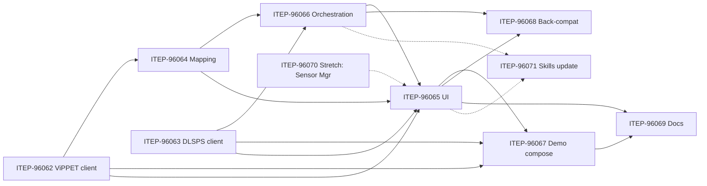

<!--
SPDX-FileCopyrightText: (C) 2026 Intel Corporation
SPDX-License-Identifier: Apache-2.0
-->

# Implementation Plan — MLOps MVP (Scenescape scope)

Epic: **[ITEP-94802] MLOps: Integration and reuse - Phase 3 - MVP** (fixVersion `EAL-2026.3`, component `SceneScape`).

This plan covers **only the Scenescape scope** of the MVP: consuming ViPPET pipeline
definitions, driving DLSPS 2.0's runtime API, surfacing this in the Manager UI, wiring it
into the shared demo, and doing so **additively** without breaking existing pipeline-building
workflows.

## References

- ADR: [docs/adr/0012-mlops-integration-reuse.md](../../docs/adr/0012-mlops-integration-reuse.md)
- Design: [docs/design/mlops-integration-reuse.md](../../docs/design/mlops-integration-reuse.md)

## Scope and constraints

Derived from the epic scope, the MVP feature "Not in scope" list, and the ADR/design constraints.

**In scope (MVP):**

- ViPPET client library — REST pull of pipeline list/definitions.
- DLSPS 2.0 client library — pipeline CRUD + start/stop via runtime REST API.
- Scene-level pipeline-to-camera mapping (persisted Scenescape-side, definition embedded by value).
- Manager UI surface to load pipelines, map to cameras, and control/monitor lifecycle.
- Pipeline lifecycle orchestration wiring, including an **auto-start** option (default on).
- Shared demo Docker Compose integration (Scenescape + ViPPET + DLSPS 2.0 + shared model volume + shared Model Downloader).
- Backward-compatibility validation of the legacy static-JSON pipeline flow.
- Integration documentation.
- *(Stretch)* Sensor Manager client for camera discovery.

**Already completed (2026.2 release) — not part of this MVP:**

- `model_installer` removal and Model Downloader runtime coupling changes (design delta 3).
- `gvapython` → Gst Analytics Python API adapter migration (design delta 7).

**Out of scope (MVP) — deferred to later ADR-12 phases:**

- Pipeline parametrization inside the Scenescape UI.
- Kubernetes deployment; separate dev/deploy topologies.
- Scene export/import format changes (design delta 6).
- Removal of legacy mechanisms (they must **coexist** with the new flow at MVP).

**Cross-cutting constraints:**

- Manager stays a **monolith** for the MVP. The design's "Manager (Backend)" / "Pipeline
  Orchestrator" split is a recommendation only; all responsibilities land inside the current
  `manager/` service.
- New flow is **additive**: the static-JSON Docker Compose pipeline flow under
  [dlstreamer-pipeline-server/](../../dlstreamer-pipeline-server/) stays intact.
- Client libraries own transport/auth/certs, typed API, schema validation, bounded retries +
  backoff, structured logging, OTEL spans, version negotiation, and shipped test doubles
  (per design §5.3, §5.4.1). Recommended location analyzed below.
- Wire-level API shapes for ViPPET / DLSPS 2.0 / Sensor Manager are owned by those teams; client
  libraries absorb the wire detail behind a stable typed Python API.

## Client-library location — analysis and recommendation

This section reconsiders the location against four aspects: the base-image blast radius, the
**existing repo convention**, the per-image size delta, and packaging effort.

**How `scene_common` is structured and consumed today.**

- Packaged from [scene_common/src/setup.py](../../scene_common/src/setup.py) with
  `find_packages()`; built once as the `scenescape-common-base` image and copied into **every**
  service image (e.g. [controller/Dockerfile](../../controller/Dockerfile) line 102). It is the
  base layer all services depend on. Its runtime deps are intentionally minimal —
  [scene_common/requirements.txt](../../scene_common/requirements.txt) pins only `numpy`,
  `msgpack`, `setuptools`, `wheel`.

**Aspect 1 — base-image stability / blast radius.** `scene_common` is a *stable base*. Client
libraries to **external** services (ViPPET, DLSPS 2.0, Sensor Manager) are, by contrast, among the
most volatile code in this effort — their wire contracts are still owned and evolving on the OEP
side. Putting volatile external-integration code (and its dependencies) into the base image means
every change re-touches the layer all services build on, and a late-in-cycle client fix forces a
rebuild/re-validation of **all** services. That is the opposite of what a base image should absorb.

**Aspect 2 — existing repo convention (decisive).** Scenescape already has a client-library
pattern, and it does **not** put concrete clients in `scene_common`:

- `scene_common` holds only the **shared transport base** — `RESTClient`
  ([scene_common/src/scene_common/rest_client.py](../../scene_common/src/scene_common/rest_client.py))
  and a dynamic composition factory
  ([scene_common/src/scene_common/client_factory.py](../../scene_common/src/scene_common/client_factory.py)).
- **Concrete clients live in the owning/consuming service** and subclass `RESTClient`:
  [autocalibration/src/autocalibration_client.py](../../autocalibration/src/autocalibration_client.py)
  (`AutoCalibrationClient(RESTClient)`) and
  [mapping/src/mapping_client.py](../../mapping/src/mapping_client.py) (`MappingClient(RESTClient)`).
- `client_factory` composes them via `importlib.import_module` with `service_src_dirs` on
  `sys.path` and try/except fallback — so `scene_common` has **no import-time dependency** on any
  concrete client. This is exactly the "base in common, concrete client in the service" split.

**Aspect 3 — per-image size delta if placed in `scene_common`.** The new clients' realistic deps
and where they live today:

| Dependency | Purpose | Already in base? | Installed-size delta if added to base |
| --- | --- | --- | --- |
| `requests` | HTTP transport | Used by `RESTClient`; not pinned in base | ~0 (already effectively present) |
| `jsonschema==4.25.1` | schema validation | Only in `manager`, tests, tools | ~2–5 MB (adds attrs, referencing, rpds-py) |
| `opentelemetry-api/sdk` + `exporter-otlp-proto-grpc==1.38.0` | telemetry (design §5.3) | **Only in `controller`, `analytics`, tests** | **~50–90 MB** (pulls `grpcio` + `protobuf`); ~15–30 MB if the HTTP exporter is used instead |
| `tenacity`/`backoff` (optional) | retries | Not present | ~0.5 MB |

Placing the client libraries in the base would push this — dominated by the OTEL/gRPC stack —
into services that deliberately don't carry it today (`manager`, `autocalibration`, `mapping`, and
`scene_common`-only consumers), i.e. roughly a **~50–90 MB** increase per such image for
functionality most of them never call. The heavy OTEL exporter is currently confined to the two
services that actually emit telemetry; the base image has stayed lean by design.

**Aspect 4 — packaging effort.** A standalone shared package would keep unrelated images lean but
adds a new build unit, Dockerfile COPY wiring, Makefile target, and CI plumbing (New Service
Checklist). For the MVP that effort is not justified when the repo already has a lighter,
convention-aligned option.

**Options.**

- **Option A — subpackage under `scene_common` (`scene_common/integration/<component>/`).**
  *Pros:* zero packaging wiring; one import path. *Cons:* violates Aspects 1–3 — pushes volatile
  external-integration code and a ~50–90 MB dep footprint into the stable base image consumed by
  all services; breaks the established base-vs-service split.
- **Option B — standalone shared package (`integration_clients/`).** *Pros:* lean unrelated
  images; independent cadence. *Cons:* new packaging/build/CI unit (Aspect 4); premature for MVP.
- **Option C — concrete clients in the consuming service (Manager), reusing the `scene_common`
  transport base and `client_factory` pattern.** *Pros:* matches the existing convention
  (`mapping_client`, `autocalibration_client`); confines volatile deps and the size delta to
  Manager, which already carries `requests` + `jsonschema` (only OTEL is new, and only for
  Manager); keeps `scene_common` stable; no new build unit. *Cons:* if a second service later
  needs the same client, shared parts must be promoted deliberately (mitigated by keeping the
  transport base and any shared models in `scene_common`).

**Recommendation (revised).** Choose **Option C**. Place the ViPPET and DLSPS 2.0 client libraries
in **Manager** (the consumer), following the existing `*_client.py` convention — subclassing
`RESTClient` from `scene_common` and composing via `client_factory`. Group them under
`manager/src/manager/integration/` for a clear boundary. Keep only genuinely shared, low-dependency
pieces (transport base, shared data models, test-double helpers) in `scene_common`. This keeps the
stable base image lean, confines the ~50–90 MB OTEL/gRPC footprint to the one service that needs it,
and aligns with the pattern already in the codebase. Revisit promotion to a standalone package
(Option B) only if/when a second service (e.g. Auto Camera Calibration or Mapping consuming Sensor
Manager) needs the same clients. This refines design §5.4.1 (which listed candidates A/B/C as open);
the codebase evidence resolves it to C.

## Decisions (locked)

1. **Client-library location:** concrete clients in the consuming service — `manager/src/manager/integration/<component>/`
   — subclassing `scene_common`'s `RESTClient` and composed via `client_factory` (Option C above);
   shared low-dep pieces stay in `scene_common`; promote to a standalone package later only if a
   second service needs them.
2. **[ITEP-96066 Orchestration](https://jira.devtools.intel.com/browse/ITEP-96066) scope:** pipeline lifecycle orchestration (incl. auto-start) stays a **standalone story**.
3. **Auto-start default:** `auto_start` defaults to **enabled** to preserve today's behavior
   (currently there is no start/stop — all pipelines start automatically).

## JIRA stories

| # | Summary | Type | Depends on |
|---|---------|------|------------|
| [ITEP-96062 ViPPET client](https://jira.devtools.intel.com/browse/ITEP-96062) | ViPPET client library (REST pull of pipeline list) | Story | — |
| [ITEP-96063 DLSPS client](https://jira.devtools.intel.com/browse/ITEP-96063) | DLSPS 2.0 client library (pipeline CRUD + start/stop) | Story | — |
| [ITEP-96064 Mapping](https://jira.devtools.intel.com/browse/ITEP-96064) | Scene-level pipeline-to-camera mapping (backend persistence) | Story | [ITEP-96062 ViPPET client](https://jira.devtools.intel.com/browse/ITEP-96062) |
| [ITEP-96065 UI](https://jira.devtools.intel.com/browse/ITEP-96065) | Manager UI: load pipelines, map to cameras, lifecycle + monitor | Story | [ITEP-96062 ViPPET client](https://jira.devtools.intel.com/browse/ITEP-96062), [ITEP-96063 DLSPS client](https://jira.devtools.intel.com/browse/ITEP-96063), [ITEP-96064 Mapping](https://jira.devtools.intel.com/browse/ITEP-96064), [ITEP-96066 Orchestration](https://jira.devtools.intel.com/browse/ITEP-96066) |
| [ITEP-96066 Orchestration](https://jira.devtools.intel.com/browse/ITEP-96066) | Pipeline lifecycle orchestration wiring (incl. auto-start, default on) | Story | [ITEP-96063 DLSPS client](https://jira.devtools.intel.com/browse/ITEP-96063), [ITEP-96064 Mapping](https://jira.devtools.intel.com/browse/ITEP-96064) |
| [ITEP-96067 Demo compose](https://jira.devtools.intel.com/browse/ITEP-96067) | Shared demo Docker Compose integration | Story | [ITEP-96062 ViPPET client](https://jira.devtools.intel.com/browse/ITEP-96062), [ITEP-96063 DLSPS client](https://jira.devtools.intel.com/browse/ITEP-96063), [ITEP-96065 UI](https://jira.devtools.intel.com/browse/ITEP-96065) |
| [ITEP-96068 Back-compat](https://jira.devtools.intel.com/browse/ITEP-96068) | Backward-compatibility validation | Story | [ITEP-96065 UI](https://jira.devtools.intel.com/browse/ITEP-96065), [ITEP-96066 Orchestration](https://jira.devtools.intel.com/browse/ITEP-96066) |
| [ITEP-96069 Docs](https://jira.devtools.intel.com/browse/ITEP-96069) | Integration documentation | Story | [ITEP-96065 UI](https://jira.devtools.intel.com/browse/ITEP-96065), [ITEP-96066 Orchestration](https://jira.devtools.intel.com/browse/ITEP-96066), [ITEP-96067 Demo compose](https://jira.devtools.intel.com/browse/ITEP-96067) |
| [ITEP-96070 Stretch: Sensor Mgr](https://jira.devtools.intel.com/browse/ITEP-96070) | *(Stretch)* Sensor Manager client (camera discovery) | Story | — |
| [ITEP-96071 Skills update](https://jira.devtools.intel.com/browse/ITEP-96071) | Update existing skills for the MLOps flow (placeholder) | Story | [ITEP-96062 ViPPET client](https://jira.devtools.intel.com/browse/ITEP-96062), [ITEP-96063 DLSPS client](https://jira.devtools.intel.com/browse/ITEP-96063), [ITEP-96064 Mapping](https://jira.devtools.intel.com/browse/ITEP-96064), [ITEP-96065 UI](https://jira.devtools.intel.com/browse/ITEP-96065), [ITEP-96066 Orchestration](https://jira.devtools.intel.com/browse/ITEP-96066) |

## Per-story implementation plan

### [ITEP-96062 ViPPET client](https://jira.devtools.intel.com/browse/ITEP-96062) — ViPPET client library (REST pull of pipeline list)

**Goal.** As Manager backend, fetch the list of ViPPET-authored pipeline definitions (and a
selected definition body) via REST so a user can select one for a scene.

**Location.** New client under `manager/src/manager/integration/vippet/`, subclassing
`scene_common`'s `RESTClient` and composed via `client_factory` (per the location analysis above).

**Steps.**

1. Define typed request/response data classes for the pipeline list and pipeline definition body
   (definition body + metadata; models referenced by identifier, not embedded — design §5.5.2).
2. Implement the REST client: transport, auth/cert injection, timeouts, bounded retries with
   backoff, deterministic single-error failure mode.
3. Add versioned schema validation of inbound pipeline definitions; surface version mismatch as
   one configuration error.
4. Add structured logging (via `scene_common` logging) and OTEL spans/metrics named `vippet.*`
   (e.g. `vippet.get_pipeline_definition`), aligned with `controller/observability/` conventions.
5. Ship a fake/mock (in-package test double) that serves canned pipeline lists/definitions.

**Files (new).** `manager/src/manager/integration/vippet/{__init__.py,client.py,models.py,schema.py,fakes.py}`; schema JSON under the same package; tests under `tests/sscape_tests/integration/vippet/`.

**Verification.** Unit tests against the fake (no live ViPPET): list fetch, definition fetch,
schema-valid and schema-invalid payloads, retry-exhaustion → single deterministic error, version
mismatch → single config error.

**AC.** Fetches pipeline list + definition body; validates against a versioned schema;
unit-tested against fakes with no live ViPPET; fetch failure surfaces as one deterministic error.

### [ITEP-96063 DLSPS client](https://jira.devtools.intel.com/browse/ITEP-96063) — DLSPS 2.0 client library (pipeline CRUD + start/stop)

**Goal.** As Manager backend (Pipeline Orchestrator role), drive DLSPS 2.0 runtime pipeline
lifecycle via REST.

**Location.** New client under `manager/src/manager/integration/dlsps/`, subclassing
`scene_common`'s `RESTClient` and composed via `client_factory` (per the location analysis above).

**Steps.**

1. Define typed data classes for a pipeline-instance descriptor: resolved pipeline definition +
   source binding (RTSP/file; Sensor Manager handle later) + per-instance parameters (design §5.5.3).
2. Implement REST operations: create / read / update / delete + start / stop of pipeline instances.
3. Same cross-cutting concerns as [ITEP-96062 ViPPET client](https://jira.devtools.intel.com/browse/ITEP-96062) (auth/certs, retries/backoff, deterministic failures, version negotiation).
4. Add structured logging (via `scene_common` logging) and OTEL spans/metrics named `dlsps.*`.
5. Ship a stateful fake that tracks created/started/stopped instances for downstream tests.

**Files (new).** `manager/src/manager/integration/dlsps/{__init__.py,client.py,models.py,fakes.py}`; tests under `tests/sscape_tests/integration/dlsps/`.

**Verification.** Unit tests against the fake: full CRUD + start/stop; no static JSON; no container
recreation; failures surface deterministically.

**AC.** All CRUD + start/stop operations work against the DLSPS fake; unit-tested; no static JSON,
no container recreation.

### [ITEP-96064 Mapping](https://jira.devtools.intel.com/browse/ITEP-96064) — Scene-level pipeline-to-camera mapping (backend persistence)

**Goal.** Persist the binding of a ViPPET pipeline definition to one or more scene cameras
(one-to-many), with the fetched definition **embedded by value** so the scene is self-contained.

> **Persistence design is part of this story.** Do not fix a specific DB structure up front.
> Investigate the existing Manager scene/camera models first and decide the best approach as part
> of the story. **Reusing existing fields and making additive, backward-compatible changes is
> preferred** over introducing new tables/models where an existing structure fits.

**Steps.**

1. Investigate the current Manager scene/camera data model and identify where a
   pipeline-to-camera binding fits; decide reuse-vs-extend, favoring additive changes.
2. Persist, per binding: the target camera(s) (one-to-many), the pipeline definition embedded
   by value, and the per-camera parameter values needed downstream (e.g. source ID, confidence
   threshold, NTP usage, source address — design §5.5.2 / §5.7). Exact storage shape decided in step 1.
3. Add any DB migration required (follow `manager/MIGRATIONS.md`); keep it backward-compatible.
4. Extend the Manager REST API with CRUD for the mapping (server-side authorization).
5. Ensure legacy scenes with no mapping are unaffected (absent mapping = legacy flow).

**Files.** Model/serializer/view changes + any migration under `manager/src/manager/`; tests under
`manager/test/` or `tests/sscape_tests/`.

**Verification.** Unit tests: mapping persists; definition stored by value; one-to-many bindings;
per-camera params round-trip; legacy scene (no mapping) unaffected; migration is backward-compatible.

**AC.** Mapping persists scene-side; definition stored by value; legacy scenes unaffected;
persistence approach documented in the story; unit-tested.

### [ITEP-96065 UI](https://jira.devtools.intel.com/browse/ITEP-96065) — Manager UI: load pipelines, map to cameras, lifecycle control + monitor

**Goal.** Let a user load the ViPPET pipeline list ([ITEP-96062 ViPPET client](https://jira.devtools.intel.com/browse/ITEP-96062)), assign a pipeline to each scene camera
([ITEP-96064 Mapping](https://jira.devtools.intel.com/browse/ITEP-96064)), and start/stop/monitor them ([ITEP-96063 DLSPS client](https://jira.devtools.intel.com/browse/ITEP-96063) via [ITEP-96066 Orchestration](https://jira.devtools.intel.com/browse/ITEP-96066)). **No parameter editing in-UI** (out of MVP scope).

> **UI approach is part of this story.** Do not decide up front whether to add a new UI surface
> or extend the existing camera-configuration UI. Evaluate both during the story and choose the
> approach that best fits the existing Manager UX; whichever is chosen, the change must be
> **additive** and leave the legacy flow intact.

**Steps.**

1. Evaluate new-surface vs. extend-existing-camera-config; decide and justify within the story.
2. Load ViPPET pipelines via the [ITEP-96062 ViPPET client](https://jira.devtools.intel.com/browse/ITEP-96062)-backed backend endpoint.
3. Assign a pipeline to each scene camera and persist via the [ITEP-96064 Mapping](https://jira.devtools.intel.com/browse/ITEP-96064) mapping API.
4. Start/stop controls and a running-status/monitor view wired to the [ITEP-96066 Orchestration](https://jira.devtools.intel.com/browse/ITEP-96066) orchestration endpoints.
5. Keep the legacy UI flow untouched and reachable; the change is purely additive.

**Files.** Templates + static JS under `manager/src/manager/` (follow the JavaScript skill);
views/routes; UI tests under `tests/ui/` where applicable.

**Verification.** UI test: user with a ≥2-camera scene loads the list, assigns per camera, starts/stops,
and sees running status; legacy UI flow still works.

**AC.** User with a ≥2-camera scene loads the list, assigns per camera, starts/stops, and sees
running status; UI approach decided within the story; legacy UI flow untouched.

### [ITEP-96066 Orchestration](https://jira.devtools.intel.com/browse/ITEP-96066) — Pipeline lifecycle orchestration wiring (incl. auto-start)

**Goal.** Backend logic that turns a mapping ([ITEP-96064 Mapping](https://jira.devtools.intel.com/browse/ITEP-96064)) into a DLSPS pipeline-instance descriptor
(resolved definition + source binding + per-instance params) and invokes the [ITEP-96063 DLSPS client](https://jira.devtools.intel.com/browse/ITEP-96063) client for
start/stop; reflects status back to the UI.

**Auto-start.**

- Each mapping carries an `auto_start` flag, **defaulting to enabled**, preserving today's
  behavior (no start/stop today — all pipelines start automatically).
- When `auto_start` is enabled, orchestration starts the pipeline as soon as the mapping is
  created/loaded. Manual start/stop from the UI ([ITEP-96065 UI](https://jira.devtools.intel.com/browse/ITEP-96065)) can override.
- When explicitly disabled, the pipeline stays stopped until started from the UI.

**Steps.**

1. Add an orchestration module in `manager/src/manager/` that builds the DLSPS instance descriptor
   from a mapping and calls the [ITEP-96063 DLSPS client](https://jira.devtools.intel.com/browse/ITEP-96063) client.
2. Implement start/stop entry points invoked by the UI ([ITEP-96065 UI](https://jira.devtools.intel.com/browse/ITEP-96065)) and status reflection back to the UI.
3. Add the `auto_start` field to the [ITEP-96064 Mapping](https://jira.devtools.intel.com/browse/ITEP-96064) mapping model (default `True`) + migration; on
   mapping create/load, auto-start when enabled.
4. Surface lifecycle-call failures to the UI (design §5.5.3 failure mode).

**Files.** New orchestration module + migration under `manager/src/manager/`; tests under
`tests/sscape_tests/`.

**Verification.** Unit/functional tests against the DLSPS fake:

- `auto_start` default → mapped pipelines come up automatically (no regression vs. today).
- `auto_start` disabled → pipeline stays stopped until UI start.
- UI start/stop → corresponding DLSPS instance created/started/stopped via REST.
- Lifecycle failure → surfaced to UI.

**AC.** With `auto_start` at its default, mapped pipelines come up automatically as they do today;
when disabled, a pipeline stays stopped until started from the UI; UI start/stop creates/starts/stops
the DLSPS instance via REST; failures surface to the UI.

### [ITEP-96067 Demo compose](https://jira.devtools.intel.com/browse/ITEP-96067) — Shared demo Docker Compose integration

**Goal.** Single-device Compose stack: Scenescape + ViPPET + DLSPS 2.0 + shared model volume +
shared Model Downloader; models resolved by DLSPS through the shared volume (no copies by Scenescape).

> **Depends on [ITEP-96065 UI](https://jira.devtools.intel.com/browse/ITEP-96065).** The end-to-end demo drives the flow through the Manager UI (load → map →
> start/stop), so the UI story must be in place for the demo to exercise the full user flow.

**Steps.**

1. Add a demo Compose override (under `sample_data/` alongside the existing override files, e.g.
   `docker-compose.mlops-mvp-override.yml`) composing Scenescape with ViPPET + DLSPS 2.0.
2. Define the shared named model volume mounted into DLSPS and the population job; wire the shared
   Model Downloader instance (design §5.8).
3. Configure ViPPET / DLSPS 2.0 service URLs + credentials via environment for the client libraries.
4. Point the demo at the in-house synthetic multi-camera dataset.

**Files.** New override under `sample_data/`; env/config wiring; a short demo run script if needed.

**Verification.** One `docker compose` brings up the full stack; demo runs end-to-end on the
synthetic multi-camera dataset without manual pipeline-file editing.

**AC.** One `docker compose` brings up the full stack; demo runs end-to-end on the synthetic
multi-camera dataset without manual pipeline-file editing.

### [ITEP-96068 Back-compat](https://jira.devtools.intel.com/browse/ITEP-96068) — Backward-compatibility validation

**Goal.** Confirm the existing static-JSON pipeline-building flow still works and coexists with the
new flow; add regression coverage.

**Steps.**

1. Add regression tests exercising a legacy static-JSON pipeline scene end-to-end.
2. Add a coexistence test: one deployment running a legacy scene and a new ViPPET-mapped scene.
3. Extend `tests/functional/test_basic_acceptance.py` with one happy-path check for the new flow.

**Files.** Tests under `tests/functional/` (and `tests/functional/mlops/` per design §8).

**Verification.** Legacy scenes/pipelines run with no regressions; both flows coexist in one deployment.

**AC.** Legacy scenes/pipelines run with no regressions; both flows coexist in one deployment.

### [ITEP-96069 Docs](https://jira.devtools.intel.com/browse/ITEP-96069) — Integration documentation

**Goal.** Setup, configuration, and known-limitations guide for the Scenescape ↔ ViPPET ↔ DLSPS 2.0 flow.

**Steps.**

1. Add a user-guide page under [docs/user-guide/](../../docs/user-guide/) covering setup, the demo
   Compose stack, pipeline load/map/start/stop, auto-start behavior, and known limitations.
2. Cross-link from the relevant microservice docs and the demo override.
3. Follow the documentation-how skill for placement.

**Files.** New/updated pages under `docs/user-guide/`; service `README.md` pointers as needed.

**Verification.** Docs reviewed and published; steps reproduce the demo.

**AC.** Published and reviewed under `docs/user-guide/`.

### [ITEP-96070 Stretch: Sensor Mgr](https://jira.devtools.intel.com/browse/ITEP-96070) — *(Stretch)* Sensor Manager client (camera discovery)

**Goal.** Client library to load a sensor/camera list and pre-populate scene camera entries.

**Location.** New client under `manager/src/manager/integration/sensor_manager/`, subclassing
`scene_common`'s `RESTClient` and composed via `client_factory` (per the location analysis above).

**Steps.**

1. Typed client for the Sensor Manager sensor-list / livestream-replay endpoints (design §5.5.4).
2. Optional-dependency loading: when Sensor Manager is absent, the client is not loaded and source
   binding falls back to direct RTSP/file sources.
3. Manager backend consumer to pre-populate scene camera entries from the sensor list.
4. Add structured logging (via `scene_common` logging) and OTEL spans/metrics named `sensor_manager.*`.
5. Ship a fake for tests.

**Files.** `manager/src/manager/integration/sensor_manager/{...}`; consumer in `manager/src/`; tests.

**Verification.** Camera discovery loads a sensor list and pre-populates cameras; absence of Sensor
Manager causes no regression.

**AC.** Camera discovery loads a sensor list and pre-populates cameras; optional dependency, no
regression when absent.

### [ITEP-96071 Skills update](https://jira.devtools.intel.com/browse/ITEP-96071) — Update existing skills for the MLOps flow (placeholder)

**Goal.** Keep the repository's agent skills consistent with the new MLOps integration flow.
Placeholder for now — concrete scope is refined once [ITEP-96062 ViPPET client](https://jira.devtools.intel.com/browse/ITEP-96062)–[ITEP-96066 Orchestration](https://jira.devtools.intel.com/browse/ITEP-96066) land.

**Steps (to refine).**

1. Review skills under `.github/skills/` (e.g. `external-source-adapter`, `python`, `javascript`,
   `testing`, `documentation-how`) for statements affected by the ViPPET / DLSPS 2.0 client
   libraries and the new pipeline load/map/lifecycle flow.
2. Update the affected skills (and any service `Agents.md` pointers) to reference the new flow and
   the `manager/src/manager/integration/` client libraries.
3. Add a short skill (or section) describing the client-library pattern if a canonical reference is warranted.

**Files.** `.github/skills/**`; service `Agents.md` where impacted.

**Verification.** Skills accurately describe the new flow; no stale references to removed/legacy-only behavior.

**AC.** Impacted skills updated (or explicitly confirmed unaffected); placeholder scope finalized during implementation.

## Sequencing

Suggested order: **[ITEP-96062 ViPPET client](https://jira.devtools.intel.com/browse/ITEP-96062) + [ITEP-96063 DLSPS client](https://jira.devtools.intel.com/browse/ITEP-96063) (parallel)** → **[ITEP-96064 Mapping](https://jira.devtools.intel.com/browse/ITEP-96064)** → **[ITEP-96066 Orchestration](https://jira.devtools.intel.com/browse/ITEP-96066)** → **[ITEP-96065 UI](https://jira.devtools.intel.com/browse/ITEP-96065)** → **[ITEP-96067 Demo compose](https://jira.devtools.intel.com/browse/ITEP-96067)** → **[ITEP-96068 Back-compat](https://jira.devtools.intel.com/browse/ITEP-96068)** → **[ITEP-96069 Docs](https://jira.devtools.intel.com/browse/ITEP-96069)**;
**[ITEP-96070 Stretch: Sensor Mgr](https://jira.devtools.intel.com/browse/ITEP-96070)** anytime after [ITEP-96062 ViPPET client](https://jira.devtools.intel.com/browse/ITEP-96062) patterns are established (stretch); **[ITEP-96071 Skills update](https://jira.devtools.intel.com/browse/ITEP-96071)** after [ITEP-96062 ViPPET client](https://jira.devtools.intel.com/browse/ITEP-96062)–[ITEP-96066 Orchestration](https://jira.devtools.intel.com/browse/ITEP-96066) land.

## Testing strategy

Per design §8 and the testing skill:

- **Client libraries ([ITEP-96062 ViPPET client](https://jira.devtools.intel.com/browse/ITEP-96062), [ITEP-96063 DLSPS client](https://jira.devtools.intel.com/browse/ITEP-96063), [ITEP-96070 Stretch: Sensor Mgr](https://jira.devtools.intel.com/browse/ITEP-96070)):** unit tests against in-package fakes; no live OEP components.
- **Scenescape services ([ITEP-96064 Mapping](https://jira.devtools.intel.com/browse/ITEP-96064), [ITEP-96065 UI](https://jira.devtools.intel.com/browse/ITEP-96065), [ITEP-96066 Orchestration](https://jira.devtools.intel.com/browse/ITEP-96066)):** service-level unit/functional tests consuming the client-library fakes.
- **Integration ([ITEP-96068 Back-compat](https://jira.devtools.intel.com/browse/ITEP-96068)):** functional suite under `tests/functional/mlops/`, one test per delta area; run against fakes/stubs.
- **End-to-end ([ITEP-96067 Demo compose](https://jira.devtools.intel.com/browse/ITEP-96067), [ITEP-96068 Back-compat](https://jira.devtools.intel.com/browse/ITEP-96068)):** extend `tests/functional/test_basic_acceptance.py` with a new-flow happy path.
- **Runtime gate:** rebuild affected images before running containerized tests (test-verification-gate skill).

## Cross-cutting requirements

- **Licensing:** every new file gets the SPDX header + `(C) 2026 Intel Corporation` (`make add-licensing FILE=<file>`); REUSE-checked in CI.
- **Python style:** 2-space indentation (`make indent-check`); follow the Python skill.
- **Security:** treat all inbound OEP payloads as untrusted (schema-validate at the client-library boundary); credentials via env/secrets, never hard-coded; server-side authorization for Manager endpoints.
- **Observability:** structured logging (via `scene_common` logging) plus per-component OTEL spans/metrics (latency, error rate, retry count) inside each client library.

## Open items to confirm during implementation

- Exact ViPPET pipeline-definition format (parametrization syntax, version envelope) — owned by the ViPPET team; absorbed inside the [ITEP-96062 ViPPET client](https://jira.devtools.intel.com/browse/ITEP-96062) client library.
- Exact DLSPS 2.0 runtime REST API shape — owned by the DLSPS team; absorbed inside the [ITEP-96063 DLSPS client](https://jira.devtools.intel.com/browse/ITEP-96063) client library.
- Sensor Manager sensor-list / livestream-replay API shape — owned by the Sensor Manager team ([ITEP-96070 Stretch: Sensor Mgr](https://jira.devtools.intel.com/browse/ITEP-96070), stretch).
