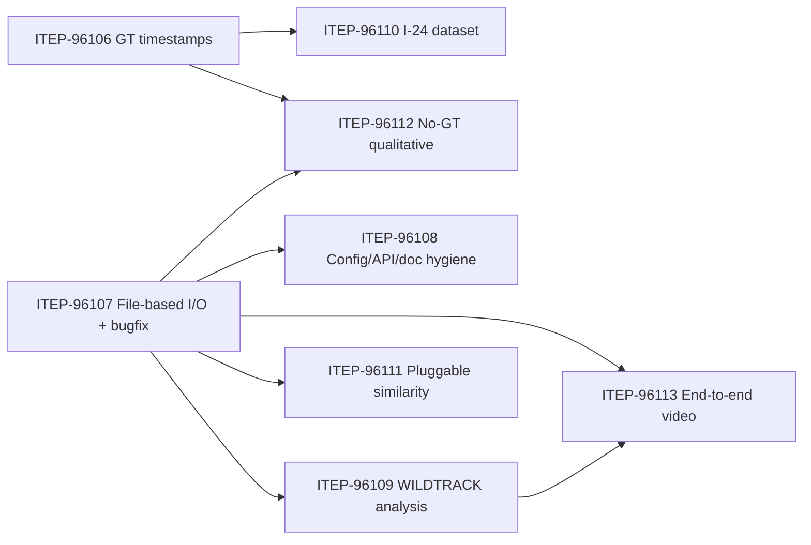

<!--
SPDX-FileCopyrightText: (C) 2026 Intel Corporation
SPDX-License-Identifier: Apache-2.0
-->

# Tracker Metrics Evaluation — Phase 2 Plan (ITEP-92875)

**Release:** Scenescape 2026.3
**Basis:** [ADR 9 — Tracking Evaluation Strategy](../../docs/adr/0009-tracking-evaluation.md)

## Scope summary

Phase 2 expands tracker evaluation to real-world motion diversity and larger multi-camera scale
with end-to-end coverage. It merges the seven epic items with validated technical debt from
previous releases into 8 stories. Each story lists the specific technical debt it retires so it
is self-contained.

## Priorities & dependencies

- **P1 (foundational):** [ITEP-96106 GT timestamps](https://jira.devtools.intel.com/browse/ITEP-96106), [ITEP-96107 File-based I/O](https://jira.devtools.intel.com/browse/ITEP-96107), [ITEP-96109 WILDTRACK analysis](https://jira.devtools.intel.com/browse/ITEP-96109)
- **P2 (core features):** [ITEP-96108 Config/API/doc hygiene](https://jira.devtools.intel.com/browse/ITEP-96108), [ITEP-96110 I-24 dataset](https://jira.devtools.intel.com/browse/ITEP-96110), [ITEP-96111 Pluggable similarity](https://jira.devtools.intel.com/browse/ITEP-96111)
- **P3 (extending reach):** [ITEP-96112 No-GT qualitative](https://jira.devtools.intel.com/browse/ITEP-96112), [ITEP-96113 End-to-end video](https://jira.devtools.intel.com/browse/ITEP-96113)

## Stories

### [ITEP-96106](https://jira.devtools.intel.com/browse/ITEP-96106) — Adopt canonical timestamp-based ground truth `[P1]`
Replace frame-number-indexed ground truth with a canonical format keyed on absolute timestamps
across datasets, harnesses and evaluators. Frame-based datasets convert frames→absolute time
internally. Work exists on branch `tracker-eval-gt-use-timestamps`; this story finalizes, hardens
and merges it.

**Technical debt addressed:** remove FPS inference from tracker-output timestamps in evaluators —
with absolute timestamps, either require `set_base_fps` or eliminate the frame-number conversion
entirely; the current inference fallback (`num_frames / time_span`) must not silently apply.

**Acceptance criteria:**
- Canonical GT + tracker-output records carry absolute timestamps; no evaluator relies on frame indices as identity.
- Frame-based datasets convert to absolute time via configured/derived FPS; conversion unit-tested.
- WILDTRACK and Unity datasets pass evaluation end-to-end on the new format.
- Design doc + READMEs updated; existing tests green.

### [ITEP-96107](https://jira.devtools.intel.com/browse/ITEP-96107) — Tech-debt: file-based I/O contract + shared evaluator code `[P1]`
Align intermediate artifacts on files (not in-memory iterators) and unify duplicated logic across
harnesses/evaluators. Fold in correctness fixes: `MotChallenge3DPoint._load_raw_file` column
indices, and improved resolution of multiple tracker frames into a single GT frame.

**Technical debt addressed:**
- `process_inputs` / `process_tracker_outputs` pass iterators instead of file paths.
- `MotChallenge3DPoint._load_raw_file` reads conf/class/visibility from wrong columns — CoPilot [#2](https://github.com/open-edge-platform/scenescape/pull/987#discussion_r2805832131), [#3](https://github.com/open-edge-platform/scenescape/pull/987#discussion_r2805832105).
- Improve resolving multiple tracker frames into a single ground-truth frame.
- Iterator exhaustion in PipelineEngine already resolved (`list(...)`, CoPilot [#1](https://github.com/open-edge-platform/scenescape/pull/987#discussion_r2805832164)); keep covered by the file-based contract.

**Acceptance criteria:**
- `TrackerHarness.process_inputs` returns a path to a canonical tracker-output file; all harnesses updated.
- `TrackerEvaluator.process_tracker_outputs` accepts paths; all evaluators updated.
- Pipeline stores tracker-output + GT files under `<output>/tracker/`.
- `MotChallenge3DPoint` reads confidence/class/visibility from correct columns; regression test proves correct CLEAR/HOTA when conf/class differ.
- Common conversion/loading helpers deduplicated into shared utils; design doc + READMEs + docstrings updated.

### [ITEP-96108](https://jira.devtools.intel.com/browse/ITEP-96108) — Config validation, FPS API cleanup & doc hygiene `[P2]`
Replace manual pipeline-config validation with jsonschema; remove `set_camera_fps` in favor of a
`camera_fps` argument on `set_cameras`; move `create_motchallenge_seqinfo` into the trackeval
evaluator; rename `write_jsonl` outputs to `*.jsonl`; align design doc to template and sync method names.

**Technical debt addressed:**
- Remove `set_camera_fps`, fold into `set_cameras`.
- Move `create_motchallenge_seqinfo` into the trackeval evaluator.
- jsonschema pipeline-config validation replacing manual checks — CoPilot [suggestion](https://github.com/open-edge-platform/scenescape/pull/987#discussion_r2812244426).
- `write_jsonl` output named `inputs.json` → `.jsonl`.
- Align design doc to template and sync PipelineEngine method names.

**Acceptance criteria:**
- Pipeline YAML validated against a JSON schema with actionable error messages; invalid configs rejected.
- `set_camera_fps` removed; `set_cameras(..., camera_fps=...)` supported; FPS optional when derivable from timestamps.
- `create_motchallenge_seqinfo` lives in the trackeval evaluator; JSONL files use `.jsonl` extension.
- Design doc matches template; method names consistent across doc and code.

### [ITEP-96109](https://jira.devtools.intel.com/browse/ITEP-96109) — Investigate WILDTRACK result differences across trackers `[P1]`
Analyze why evaluation metrics differ between tracker implementations on the already-integrated
WILDTRACK dataset and document root causes (association, projection, timing, config).

**Acceptance criteria:**
- Reproducible comparison across tracker variants (controller immediate, controller time-chunked, tracker service) on WILDTRACK.
- Written analysis explaining metric deltas with evidence (per-metric breakdown + ≥1 qualitative case).
- Findings captured under `docs/` (or evaluation README) with actionable follow-ups.

### [ITEP-96110](https://jira.devtools.intel.com/browse/ITEP-96110) — Adopt a real vehicle dataset (I-24) `[P2]`
Integrate a real vehicle dataset (e.g. I-24) to validate higher-speed motion, large-footprint
objects and vehicle dynamics. Includes a data-acquisition/access spike before integration.

**Acceptance criteria:**
- Spike documents dataset access, licensing and format; go/no-go recorded (with fallback dataset if I-24 blocked).
- A `TrackingDataset` implementation loads the vehicle dataset into canonical format (timestamps, scene/camera config, GT).
- Evaluation pipeline runs end-to-end and produces HOTA/MOTA/IDF1 plus diagnostic metrics.
- Dataset README + config example added.

### [ITEP-96111](https://jira.devtools.intel.com/browse/ITEP-96111) — Pluggable similarity scoring `[P2]`
Make the similarity/association score pluggable (currently Euclidean distance) and add at least one
new scorer (e.g. 2D IoU projected to the scene), with user documentation.

**Technical debt addressed:** the previously-recorded "pluggable similarity scoring" debt item is the
same work as this epic feature (deduplicated here).

**Acceptance criteria:**
- A similarity-scorer interface selectable via pipeline config; Euclidean distance refactored behind it.
- ≥1 additional scorer implemented and unit-tested.
- User docs explain available scorers, config and trade-offs; design doc updated.

### [ITEP-96112](https://jira.devtools.intel.com/browse/ITEP-96112) — Qualitative evaluation without ground truth `[P3]`
Allow the pipeline to run on demo datasets lacking ground truth so tracking quality can be compared
across trackers qualitatively. Evaluation runs on tracker outputs directly, so no GT format
conversions are needed (depends on [ITEP-96106 GT timestamps](https://jira.devtools.intel.com/browse/ITEP-96106)).

**Acceptance criteria:**
- Pipeline runs to completion with no GT configured (no crash on missing GT).
- GT-independent outputs produced (e.g. jitter/jerk, track counts/continuity, side-by-side summary) enabling cross-tracker comparison.
- Documented workflow + example config on a demo dataset.

### [ITEP-96113](https://jira.devtools.intel.com/browse/ITEP-96113) — End-to-end evaluation from camera video (design + prototype) `[P3]`
Design end-to-end evaluation starting from raw camera video through the upstream analytics pipeline
to cover vector-enhanced tracking and re-identification; deliver a design plus a minimal prototype.

**Acceptance criteria:**
- Design document covering video-in → analytics → tracker → evaluation data flow, including reID/vector handling and metric strategy.
- Minimal prototype demonstrates the flow on one short clip (may be scoped/mocked at boundaries).
- Gaps, risks and follow-up work explicitly listed.
