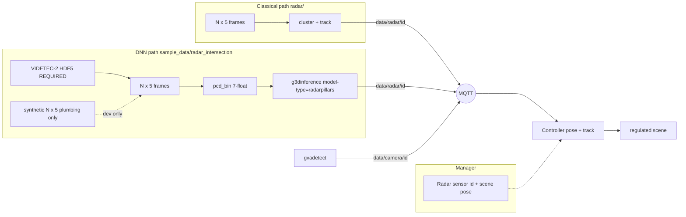

<!--
SPDX-FileCopyrightText: (C) 2026 Intel Corporation
SPDX-License-Identifier: Apache-2.0
-->

# Plan: First-Class Radar + RadarPillars / `g3dinference`

**Canonical radar plan** (densify / NMS / g3dinference product path).

Status on `feature/radar-support` (SceneScape) and
`feature/g3dinference-multi-model` (DLStreamer). **Updated 2026-10-08:**
demo densify default **past=4**, FT2 **`nms_thresh=0.05`**, camera-GT eval
harness + classical/roadside comparison landed; **FT6 abandoned** (failed
camera-GT gate; IR/trainer discarded) — ship **FP16_ft2**. Earlier
(2026-09-29): C5/P1 demo live; causal densify + FT2 OV quality parity; Intel
latency Stages 1–2b; Controller late fusion accepted; first-deploy VIDETEC
automated.

See *Results rollup* and *Phase: camera-GT densify, NMS, FT6* below.
Acceptance numbers: `sample_data/radar_intersection/VIDETEC_ACCEPTANCE.md`.

Related Cursor drafts (not in-repo): `videtec_radar_demo_ca4bfda2`,
`radarpillars_openvino_dls_8576cfc8`. Chat: [radar g3dinference work](6ee327ad-6ae8-4889-9694-8ee4881d810f).

---

## Phase-1 alternate perception (2026-09-27)

**Criterion = sparsity robustness** (not mean full-window recall). Offline
VIDETEC 2100–4100 stride 5; stratified by points within 3 m of GNSS.

| Method | 1-pt @3m recall (H=0) | Miss when support≥1 (H=0) | N=1 cloud recall |
| --- | ---: | ---: | ---: |
| classical | **96.9%** | **2.6%** | 47% |
| roadside (weak GNSS PointNet) | **96.9%** | **2.6%** | 47% |
| RadarPillars FT2 | 30.2% | 60.3% | **0%** |

Artifacts: `sample_data/radar_intersection/baselines/`,
`VIDETEC-2/phase1_baselines/PHASE1_COMPARE.md` + `sparsity_robustness.json`.
**Takeaway:** classical/roadside are sparsity-robust; RP is not (fails
single-point roadside cases; densify helps means, not the hard sparse bin).
Roadside ≈ classical on sparse recall, cleaner under empty support.
**Commercial path:** roadside weights are **VIDETEC-only** (CC BY 4.0) —
`phase1_baselines/roadside_videtec_ccby.pt`; see `baselines/PROVENANCE.md`.
No RoadsideRadar (CC BY-NC-SA) data/weights.

---

## Phase-2 Intel stack (2026-09-27) — locked product call

**Product requirement:** classical and roadside go through **`g3dinference`**
so parse → OD meta → `gvametaconvert` → publish is **one stack** (not a
parallel Python publisher path).

| `RADAR_PERCEPTION` | `g3dinference model-type` | Input |
| --- | --- | --- |
| `classical` (default) | `classical` | `frames_bin` 5-float VIDETEC |
| `roadside` | `roadside` | `frames_bin` 5-float + OV PointNetSeg |
| `radarpillars` | `radarpillars` | `pcd_bin` 7-float VoD |

DLS: `classical_runtime.*`, `roadside_runtime.*` in
`dlstreamer/.../g3dinference/`. SceneScape: shared
`radar_file_playback` / `radar_publisher` / `radar_sensor_contract`.
Bake: always `make build-dlsps-g3d` for `demo-radar`.

---

## Current priority (locked)

**Dense-cloud PyTorch performance is locked in as good.** Do **not** treat
sparse single-frame VoD→gantry as “model broken” when support is present.
Ladder completed **VoD-free** (no View-of-Delft val mAP / paper regen).

**SceneScape MQTT demo is live** (FT2 densify + multi-cam / dual-radar).
Controller late fusion is **accepted as-is** (camera can keep a track alive
without radar). Remaining plan work: upstream DLS bake, optional
voxelize/scatter, INT8 / zero-copy later.

| Priority | Work | Status |
| --- | --- | --- |
| **P0-A** | **Fixed-input parity:** PyTorch OpenPCDet ckpt vs host+OV IR on synthetic + VIDETEC bins | **Done** (`parity_pytorch_vs_ov.json`) |
| **P0-B** | **VIDETEC GNSS:** stride-5 window, PyTorch vs OV (VRU / all-class) | **Done** — baseline both fail VRU on sparse 3000–5000; see acceptance |
| **P0-D** | Fine-tune + densify diagnosis | **Done (dense lock-in)** — FT2 ep11 + **±5 accumulate** on **2100–4100** → **~51% VRU@3m**; associable subset **≥92–99%**. Single-frame full-window still capped by missing near-GT returns |
| **P0-E / C4** | Runtime densify in OV + g3d playback bins | **Done** — OV densify + `pcd_bin_acc5` |
| **P0-F** | FT2→OV re-export + densify re-eval | **Done** — `FP16_ft2` OV ±5 → **52.4%** VRU@3m (≈ PyTorch 51.4%) |
| P1 | SceneScape real-data MQTT demo | **Done** (2026-09-27 verify; **2026-09-28** multi-sensor) — see below |
| P2 | Upstream DLS / DLSPS bake drop | Open — after quality / PR land |

**P1 demo state (2026-09-28):**

- FT2 / `pcd_bin_acc5` + classical + roadside → MQTT + regulated scene
- **8 cameras** (s110 o/n/w/s + s120 o/n/w/s) via `CAM_SENSOR_IDS` + staged
  `camera_demo/`
- **2 radars** (`intersection-radar1` dataset 51, `intersection-radar2`
  dataset 52) time-aligned `3270–4100` ↔ `3098–3928`
- GNSS XY/yaw-fit radar1 + relative radar2; UI-calibrated cameras locked in
  `RadarIntersection.json` + scene-import ZIP (`pack_radar_scene_import.py`,
  `radar_scene_init.py` re-sync on every `demo-radar`)
- Default score thr **0.1** (radarpillars); avoid 0.03 clutter on densify slice

**Dense-cloud gate (locked):** when radar returns exist near GNSS (associable
frames), FT2/FT4 hit **≥80–99% VRU@3m**. Failure mode for sparse full windows
is **support density**, not a broken detector.

**Full-window radar-only GNSS gate (recorded, not a product blocker — 2026-09-29):**
OV-FT2 on 2100–4100 stride 5: **H=5 @ score≥0.01 → 52.4% VRU@3m** (associable
**92.4%** on 170 frames); **@ demo score 0.1 → 26.4%**. Causal past=10 ≈ **52.7%**.
**Live default is past=4** (camera-GT + map FP on 3270–4100; past=10 loses
recall and raises vegetation clutter — see VIDETEC_ACCEPTANCE C4d).
**FT5** failed to lift (~39% H=5). Keep FT2 demo weights. This metric is
**radar detections only** (no Controller, no cameras). Product bar is scene
tracking with Controller late fusion — **accepted**; do **not** pursue extra
camera→radar detection fusion or mid-tier fuse for this gap.

### Why detection (not just classification) can fail

RadarPillars is a **3D detector** (objectness + box + class). Low VIDETEC
scores / empty frames at thr=0.1 are primarily an **objectness / localization**
failure on that input distribution — class confusion is secondary. Causes can
be: wrong PCD features/coords, VoD↔OV numerical drift, score calibration, FOV /
`point_cloud_range` mismatch, **or** ego→gantry domain gap. The ladder below
separates those.

---

## Locked decisions

| Decision | Choice |
| --- | --- |
| Product surface | First-class **radar sensor** in Manager + Controller (not fake Cam, not ADR 16 `external_source`) |
| MQTT | `scenescape/data/radar/{sensor_id}` (`DATA_RADAR`); radar-local metres; Controller applies pose |
| Native detection list | VIDETEC-style `(N,5)`: range, doppler, az, el, magnitude |
| Example archive | [VIDETEC-2](https://zenodo.org/records/17799385) (CC BY 4.0) — convert HDF5 → frames offline |
| Classical perception | `g3dinference model-type=classical` (host cluster/track; shared OD publish) |
| Roadside perception | `g3dinference model-type=roadside` (OV PointNetSeg + host instances) |
| Pillar DNN path | RadarPillars → **partial** OpenVINO BEV/detect + host VFE/attn; `model-type=radarpillars` |
| DLStreamer element | **Generalize** `g3dinference` with `model-type=pointpillars\|radarpillars\|classical\|roadside` — do **not** invent `g3dradarinfer` |

| Radar PCD for DNN | VoD-style **7 float32**/point: `x, y, z, rcs, v_r, v_r_comp, time` |
| Acceptance data | **Real [VIDETEC-2](https://zenodo.org/records/17799385)** through convert → PCD → `g3dinference` → MQTT → Controller. Synthetic frames are plumbing-only; they do **not** close the demo. |
| Accuracy gate | Measure RadarPillars on real VIDETEC using **RTK-GNSS VRU first**; camera tracks only as weak secondary after sync/pose proof |
| Cameras | Unchanged `gvadetect` → `data/camera/{id}`; **Controller late fusion** (pose + track). Camera-only updates may keep a track alive without radar — **accepted; no further fusion work** |
| Demo scene portability | `RadarIntersection.json` is pose SoT; ZIP for fresh import; `radar_scene_init` always re-syncs sensors |
| Demo score (radarpillars) | **`RADAR_SCORE_THRESHOLD=0.1`** on densify slice (~1 VRU); `0.03` is clutter |
| LiDAR (unchanged debt) | Still overloads `data/camera/{id}` — **not** standardized like radar |
| VoD val mAP | **Dropped** — not a gate; ladder stays VIDETEC/GNSS-only |

---

## OpenVINO optimization status

Current RadarPillars deployment under
`sample_data/radar_intersection/model_installer/FP16_ft2/` (demo) /
`FP16/` (VoD baseline):

| Stage | Implementation | Precision / accel |
| --- | --- | --- |
| Voxelize | Host C++ loops in `g3dinference` `radarpillars_runtime` | FP32 host |
| PillarVFE feature build | Host C++ (15-d features) | FP32 host |
| PillarVFE linear+BN+ReLU | **OpenVINO** `radarpillars_vfe_linear.xml` when configured | FP32 OV |
| PillarAttention + FFN | **OpenVINO** `radarpillars_attention.xml` when configured | FP32 OV |
| Scatter to BEV canvas | Host C++ | FP32 host |
| BEV backbone + detection head | OpenVINO IR (`radarpillars_bev_detect.xml/.bin`) | **FP16** OV |
| Postproc (decode / NMS) | Host C++; **score-gated on NCHW** (no full rearrange) | FP32 host |

**What this is now:** OV-accelerated **VFE affine + attention + BEV/detect**, with
host voxelize / feature-build / scatter / gated postproc. Not yet a single fused
graph or INT8.

**Contrast:** LiDAR PointPillars also uses an OV `voxel_model`; RadarPillars
voxelize remains host.

### Results rollup (quality + latency)

#### Quality (VIDETEC-2 GNSS VRU gate, 2100–4100, OV-FT2 unless noted)

| Milestone | Setup | VRU@3m | Notes |
| --- | --- | ---: | --- |
| Baseline VoD IR | H=0 / H=5 @0.01 | 23.7% / 37.4% | Pre-finetune |
| FT2 PyTorch | H=0 / H=5 @0.01 | 18.5% / **51.4%** | ep11 gantry |
| FT2→OV re-export | H=0 / H=5 @0.01 | 35.9% / **52.4%** | `FP16_ft2/` |
| FT2 OV demo thr | H=5 @**0.1** | **26.4%** | Operational demo threshold |
| Associable subset | H=5 @0.01, support≥1 | **≥92%** | Dense-cloud lock-in |
| **FT5** train ±5 densify | H=5 @0.01 | **~39%** | **Miss** — keep FT2 |
| **Causal past=10** (live) | @0.01, every frame | **52.7%** | Parity with non-causal H=5 |
| Causal past=10 | @0.01 @1m / @2m | 40.3% / 48.8% | 1055 hits / 2001 frames |

Artifacts: `gnss_w2100_4100_ft2_ov_summary.json`,
`gnss_ft2_causal10_thr001.json`, FT5 curve under `VIDETEC-2/`.

#### Latency (Python parity ≈ C++ ranking; CPU)

**VIDETEC demo slice 3270–3319, FT2, score 0.1 (sparse — typical live demo):**

| Step | past=0 total | past=0 postproc | past=10 total |
| --- | ---: | ---: | ---: |
| Stage 1 baseline | 107 ms | 67 ms (62%) | 112 ms |
| **Stage 2a** score-gated postproc | **53 ms (~2×)** | **9 ms (17%)** | **48 ms** |
| After 2a bottleneck | OV BEV ~34–39 ms (~70% of remaining) | | |
| **P1 CPU LATENCY hint** (no GPU) | **~47 ms** | ~10 ms | **~53 ms** |

**Priority-1 BEV device (2026-09-29):** Host = i7-14700F, OpenVINO
`devices=[CPU]`, **no `/dev/dri`**. Compose now passes `/dev/dri` + render
cgroup (same pattern as LiDAR); set `RADAR_DEVICE=GPU` (or config
`bev_device` / `preproc_device`) on GPU hosts. Python + C++ compile with
`ov::hint::PerformanceMode::LATENCY`. Bare-BEV microbench speedup is **noisy**
on this CPU (~0.9–1.35×); e2e past=0 median **~47 ms** (was ~53 after 2a).
Artifact: `VIDETEC-2/profile_stages_ft2_bev_latency_hint.json`. g3d image
rebuilt with LATENCY compile.

**Synthetic dense stress (shows why OV preproc matters for denser radars):**

| N pts | Stage1 total | Stage1 attn | **Stage 2b** total | **Stage 2b** attn |
| ---: | ---: | ---: | ---: | ---: |
| 500 | 366 ms | 88 ms (24%) | **64 ms (~5.7×)** | **1.7 ms** |
| 2k | 547 | 271 (50%) | **100 (~5.5×)** | **13** |
| 5k | 1038 | 610 (59%) | **165 (~6.3×)** | **46** |
| 10k | 2630 | 1974 (75%) | (not re-run; attn was dominant) | — |

Parity after 2b: VFE max\|err\| ~1e-6, attention ~5e-7 vs host numpy.
Artifacts: `profile_stages_ft2_3270_3319.json`,
`profile_stages_ft2_synthetic.json`,
`profile_stages_ft2_postproc_opt.json`,
`profile_stages_ft2_ov_preproc_synth.json`.

#### Live demo stack (current)

```text
single-frame pcd_bin + g3dinference accumulate-past=4
+ FP16_ft2 (BEV FP16 + VFE/attn FP32 IRs) + score 0.1
+ score-gated C++ postproc
```

### Tracked stages (VIDETEC ROI order)

1. **Profile** — **DONE** (2026-09-28).
2. **OV-ify VFE + PillarAttention** — **DONE** (2026-09-29):
   `export_radarpillars_preproc_ov.py` → `vfe_linear_model` / `attention_model`.
3. **BEV on GPU (+ CPU LATENCY hint)** — **DONE on this host as CPU substitute**
   (2026-09-29): compose dri passthrough; `bev_device`/`preproc_device`;
   LATENCY compile in Python + `radarpillars_runtime.cpp`. **Re-measure on a
   real iGPU/dGPU host** before claiming GPU win.
4. **Upstream DLS bake** — pending (await confirm).
5. **Camera–radar fusion (quality)** — **DONE / out of scope** (2026-09-29):
   scene late fusion already in Controller; product accepted as-is. Offline
   ~52% radar-only VRU@3m is **not** a fused-track metric and is not a fuse
   work item.
6. **Voxelize + scatter** — pending (optional; await confirm).
7. **Bounded/sparse attention** — only if denser captures still blow up N.
8. **Optional later:** INT8 / NNCF; zero-copy iGPU.

**Acceptance:** tight numeric parity; no VRU@3m regression on causal past=10;
document latency before/after. Do **not** claim fully fused e2e OV until
voxelize/scatter are on OV (or explicitly scoped out).

---

## RadarPillars metrics approach (real VIDETEC-2)

### Ground-truth reality

VIDETEC **radar is not manually box-annotated**. Zenodo: labels come from an
**external** ground-truth system. Available references:

| Reference | Strength | Role |
| --- | --- | --- |
| **RTK-GNSS** of instrumented VRU (`gnss.zip` / `vru-rtk-track.csv`) | Strong absolute trajectory for **one** person or cyclist | **Primary** accuracy reference |
| Camera tracks / 3D boxes (`tracking_results*`, runs_vru) | Multi-object, same claimed local frame + NTP | **Secondary / pseudo-GT only** after sync+pose proof |
| Radar HDF5 `/detections` | Model **input**, not labels | Never use as GT |

### Local frame

Published VIDETEC Cartesian origin: **UTM 32N** E=**695310.500** m,
N=**5347376.094** m (X-east, Y-north, Z-up). Eval:
`--videtec-origin` + `/sensor` pose → radar-local. See
`sample_data/radar_intersection/videtec_local_origin.json`.

### Baseline results (VoD-ego IR, score≥0.03, calibrated origin)

| Slice | VRU recall @ 3 m | All-class recall @ 3 m | Notes |
| --- | --- | --- | --- |
| Stride-5 frames 3000–5000 (401) | **≈ 0.25%** | ≈ 15.7% | Near-GNSS hits ≈ low-score `vehicle` clutter |
| Dense 3760–3810 (51) | ≈ 0% | ≈ 2% | VRU ~35 m ahead in that window |

Time sync is healthy (p95 \|Δt\| ≈ 74–85 ms). At demo default score **0.1**,
dense-window detections are **empty** (max offline score ≈ 0.095).

**Verdict (baseline):** instrumentation + sparse-window baseline **closed**;
demo quality **failed** on 3000–5000 single-frame.

**Verdict (post FT + densify):** dense-support PyTorch path **validated**.
Best offline: FT2 ep11, window **2100–4100**, `--accumulate-half-window 5` →
**51.4% VRU@3m** (associable **≥92%**). H=10 regresses. See acceptance
“Window + density” section.

Details: `sample_data/radar_intersection/VIDETEC_ACCEPTANCE.md`.

### Domain-gap hypotheses (drive fine-tune)

1. **VoD ego vs gantry** — weights/anchors trained for vehicle-mounted VoD.
2. **PC range** — VoD `point_cloud_range` is forward-only `[0, 51.2]` × `[-25.6, 25.6]`; a large fraction of GNSS samples in radar-local XY sit **outside** that box (including negative X).
3. **Height / elevation** — gantry mount ~4.5 m + pitch; VIDETEC spherical→XYZ may place points outside VoD Z anchors `[-3, 2]`.
4. **Sparse detections** — VIDETEC frames often have ≪ VoD point density.
5. **Pseudo-label path** — no box GT; fine-tune must use GNSS (and later camera) weak labels.

---

## Architecture (as built)



---

## Phase A — First-class radar sensor

| Item | Status | Where |
| --- | --- | --- |
| Manager `Radar` model / API / UI | **Done** | `f0c20b38` |
| Migration + scene import of radars | **Done** | Manager migration `0004` (and follow-ons as renumbered) |
| `PubSub.DATA_RADAR` + schema | **Done** | `scene_common` |
| Controller subscribe + `processRadarData` | **Done** | `scene_controller.py` / `scene.py` |
| Classical publisher `(N,5)` → MQTT | **Done** | `radar/` |
| VIDETEC HDF5 → frames converter | **Done** | `radar/videtec_hdf5_to_frames.py` |
| Docs: add/use radar + CC BY | **Done** | `docs/.../add-and-use-radar-sensors.md` |
| Functional / BAT coverage for radar ingest | **Done** (as committed); re-verify on tip if migrations moved | `tests/` |

---

## Phase B — RadarPillars OpenVINO + DLStreamer (plumbing)

| Item | Status | Where |
| --- | --- | --- |
| HF RadarPillars → **partial** OV IR (host preproc + FP16 BEV/detect) | **Done** (incomplete OV optimization) | `model_installer/FP16/` |
| RPW1 preproc weights + config | **Done** | `*.rpw1`, `preproc_weights_rpw1` |
| Interim Python OV infer (`radarpillars_infer.py`) | **Done** (offline / eval) | `sample_data/radar_intersection/` |
| Generalize `g3dinference` (`pointpillars` / `radarpillars`) | **Done** | DLStreamer `e4c0a90f` |
| `g3dlidarparse point-features` (4 or 7) | **Done** | DLStreamer `a7156ac7` |
| `gvametaconvert` accept `application/x-radar` (source) | **Done** in DLS tree; **not** in stock DLSPS image yet | `gstgvametaconvert.c` |
| Bake local DLSPS with rebuilt `libgst3delements.so` | **Done** (interim) | `make build-dlsps-g3d` |
| `demo-radar` compose + synthetic data-init | **Done** (plumbing) | `docker-compose.radar-override.yml` |
| Real VIDETEC ingest / convert / data-init prefer-real | **Done** | `VIDETEC-2/`, `prepare_radar_demo_data.py` |
| GStreamer smoke on real bins | **Done** | DLSPS `…-g3d` |
| GNSS metrics + UTM origin | **Done** (baseline fail; dense lock-in later) | `VIDETEC_ACCEPTANCE.md` |
| SceneScape MQTT E2E on real frames | **Done** — FT2 densify + multi-cam / dual-radar | `make demo-radar`, how-to |

---

## Phase C — Verification ladder then fine-tune / densify (**done**)

Ordered diagnosis (user-agreed, **VoD-free**). View-of-Delft val mAP was
dropped from the ladder (not a gate).

| Step | Goal | Status |
| --- | --- | --- |
| **C0. Fixed-input parity** | Same synthetic + VIDETEC `(N,7)` clouds through PyTorch ckpt vs host+OV IR; report matched XY / score deltas | **Done** — synthetic tops agree (~0.5–0.6 m XY); OV emits many extra low-score boxes; sparse VIDETEC often empty on PyTorch |
| **C1. VIDETEC GNSS PyTorch vs OV** | Stride-5 3000–5000: VRU / all-class recall @ 1/2/3 m for both backends | **Done** — both fail VRU on that sparse window; PyTorch quieter than OV |
| **C3. Fine-tune + densify** | Close gantry gap; separate model vs support-density failure | **Done (dense lock-in)** — FT2/FT4; best window 2100–4100; ±5 accumulate → **51.4%** VRU@3m; associable **≥92–99%** |
| **C4. Runtime densify / OV re-export** | Port H≈5 accumulate into OV + g3d playback; re-export FT2 OV; re-eval | **Done** — densify + **FT2→OV** (`FP16_ft2`); OV-FT2 ±5 **52.4%** VRU@3m |
| **C5. SceneScape MQTT demo** | FT2 IR + densified bins on real frames (+ fusion) | **Done** — 2026-09-27 single-radar verify; 2026-09-28 multi-cam / dual-radar / portable scene |

Prior FOV notes remain useful diagnostics: 194/401 GNSS samples outside VoD
PC range on the old eval slice; associability scan shows **2100–4100** is the
better 401-frame window (~10× more near-GT support than 3000–5000).

---

## What is left (ordered)

### Done through C5 / P1 (do not re-open)

- C0–C4 + FT2→OV (`model_installer/FP16_ft2/`); offline OV-FT2 ±5 ≈ **52%** VRU@3m
- C5 MQTT E2E: FT2 + `pcd_bin_acc5`, classical, roadside; multi-cam + dual radar;
  GNSS-fit / UI poses in `RadarIntersection.json` (portable via ZIP + scene-init)

### Active next

| # | Work | Status |
| --- | --- | --- |
| **1** | **Upstream DLS / DLSPS** — land `feature/g3dinference-multi-model`, drop local `make build-dlsps-g3d` | **Next** |
| 2 | PR hygiene — BAT / functional radar re-verify; merge readiness | Ongoing |
| 3 | SceneScape cleanup — stock DLSPS tags; native `application/x-radar` | Later |
| 4 | Voxelize + scatter (optional latency) | Later |

Parallel (separate plan): camera auto-cal vs satellite map —
[`camera-autocalibration-satellite-map.md`](camera-autocalibration-satellite-map.md)
(**proposed, not started**).

**Accepted / done (do not re-open as product blockers):**

1. Full-window radar-only GNSS ~52% @0.01 — accepted as-is; not a fused-scene gate.
2. Causal live densify — **DONE**; live default **`RADAR_ACCUMULATE_PAST=4`**
   (past=10 ≈ H=5 GNSS but loses camera-GT recall — C4d).
3. Host preproc OV Stages 1–2b + P1 BEV-device — **DONE**.
4. Controller late fusion — **DONE / accepted**; no mid-tier fuse.
5. Camera-GT densify/NMS/CR eval (2026-10-05) — **DONE** (defaults + harness).
6. FT6 multi-class — **abandoned** (gate failed; artifacts discarded; keep FT2).

### Later (after preproc OV or metrics justify)

6. Bounded/sparse attention if N blows up.
7. INT8 / NNCF PTQ (BEV ± preproc) once fused graph exists.
8. Zero-copy iGPU / remote tensors (needs real GPU host).
9. First-class LiDAR; rename `g3dlidarparse` → generic point-cloud parse.

---

## Phase: camera-GT densify, NMS, FT6 (2026-10-05)

Product decisions locked for this phase:

- **`accumulate_past=4`** (not 10) for live radarpillars.
- **No** map-based dropping of road persons (priors/events only).
- **No** early fusion.
- NMS: config-only (`nms_thresh`); centre-distance suppression deferred.
- Retrain: base-VoD distillation for vehicle/cyclist + GNSS persons.

| Work item | Status |
| --- | --- |
| Densify default → 4 + docs | **Done** |
| NMS sweep; adopt 0.05 on FT2 | **Done** (boxes/hit 2.39 → 1.83, recall 100%) |
| Analysis harness (`sample_data/radar_intersection/analysis/`) | **Done** |
| Offline classical/roadside runners | **Done** |
| Classical / roadside vs radarpillars table | **Done** — keep radarpillars demo default |
| Distill tooling + `finetune_ds_ft6` (647 / 255 boxes) | **Done** (tooling kept; no shipped FT6 IR) |
| Train / export / promote FT6 | **Abandoned** — gate failed; artifacts discarded; keep **FP16_ft2** |

### NMS (config-only)

NMS is already class-agnostic. Duplicates survive because BEV IoU of ~0.7 m
person boxes offset by ≥0.5 m is under 0.1. Measured past=4, thr 0.1:

| `nms_thresh` | Boxes/hit | Recall@3 m |
| ---: | ---: | ---: |
| 0.1 | 2.39 | 100% |
| **0.05 (shipped)** | **1.83** | **100%** |
| 0.02 | 1.60 | 100% |
| 0.0 | 1.53 | 100% |

### Mode comparison (3270–4100, camera-GT)

| Mode | Person recall | Road % | Vehicles |
| --- | ---: | ---: | ---: |
| radarpillars past=4 thr 0.1 | **100%** | **12%** | 0 |
| classical default | 94% | 44% | 1091 |
| roadside | 94% | 29% | 289 |

Harness: `analysis/segment_map.py`, `detect_camera_frames.py`,
`project_camera_detections.py`, `metrics.py`, `offline_g3d_publish.py`;
also `baselines/classical_batch.py`. Details in `VIDETEC_ACCEPTANCE.md` C4d–f.

### FT6 multi-class — abandoned (2026-10-08)

CPU BEV/head fine-tune from FT2 + distilled Car/Cyclist missed the camera-GT
gate (person 96% vs 100%; road+veg 25% vs 17%; vehicles@0.3 ≈ 1). **Artifacts
discarded** (`FP16_ft6/`, CPU trainer, FT6 `.pth`). Demo remains **`FP16_ft2`**.
Distill helpers under `finetune/` stay for a possible later GPU OpenPCDet retry;
not on the critical path.

---

## Explicit non-goals (still)
- Using `g3dradarprocess` / raw ADC for this product path.
- Fake Cam / `data/camera` for radar.
- ADR 16 `external_source` as the infrastructure-radar path.
- PyTorch XPU inside DLS (OpenVINO IR only for the BEV/detect slice).
- Treating vision YOLO-on-RD-maps as the radar DNN.
- Treating camera tracks as primary GT without proven time/pose association.
- Extra camera→radar **detection** fusion or mid-tier fuse to chase the offline
  ~52% radar-only VRU@3m gate (Controller late fusion is enough for product).
- Claiming end-to-end OpenVINO or INT8 optimization **until** host preproc
  OV workstream above lands (BEV-only today).
- **View-of-Delft val mAP / paper regen** as an acceptance gate (dropped).
- Treating sparse full-window ~51% VRU@3m as “model broken” when associable
  frames already hit ≥80–99%.

---

## Key commands (current)

```bash
# Offline GNSS VRU gate (calibrated VIDETEC UTM origin)
python3 sample_data/radar_intersection/radarpillars/eval_radarpillars_gnss.py \
  --index sample_data/radar_intersection/VIDETEC-2/converted/frames/index.json \
  --detections sample_data/radar_intersection/VIDETEC-2/detections_stride5.jsonl \
  --gnss sample_data/radar_intersection/VIDETEC-2/gnss/rosbag2_2025_10_09-14_43_55/*_gps.csv \
  --sensor sample_data/radar_intersection/VIDETEC-2/converted/frames/sensor.json \
  --videtec-origin --categories person,cyclist

# Bake DLSPS with generalized g3dinference
# (clone https://github.com/saratpoluri/dlstreamer as ../dlstreamer)
make build-dlsps-g3d

# Live fusion demo (FT2 + causal densify + multi-cam / dual-radar)
SUPASS=<password> RADAR_PERCEPTION=radarpillars RADAR_REQUIRE_REAL=true \
  RADAR_IR_DIR=FP16_ft2 RADAR_ACCUMULATE_PAST=4 \
  RADAR_SCORE_THRESHOLD=0.1 make demo-radar

# Offline causal densify gate (past=10 ≈ H=5 span GNSS; live default is past=4)
python3 sample_data/radar_intersection/radarpillars/batch_radarpillars_infer.py \
  --frames-dir sample_data/radar_intersection/VIDETEC-2/converted/frames \
  --config sample_data/radar_intersection/model_installer/FP16_ft2/radarpillars_ov_config.json \
  --start-index 2100 --stop-index 4100 --accumulate-past 10 --score-threshold 0.01 \
  -o sample_data/radar_intersection/VIDETEC-2/detections_ft2_causal10_thr001.jsonl

# After pose edits: lock JSON → rebuild import ZIP for other machines
python3 sample_data/radar_intersection/scene/pack_radar_scene_import.py
```

Docs: [add-and-use-radar-sensors](../../docs/user-guide/how-to-guides/add-and-use-radar-sensors.md),
[run-radar-intersection-demo](../../docs/user-guide/how-to-guides/run-radar-intersection-demo.md),
[VIDETEC_ACCEPTANCE](../../sample_data/radar_intersection/VIDETEC_ACCEPTANCE.md).
