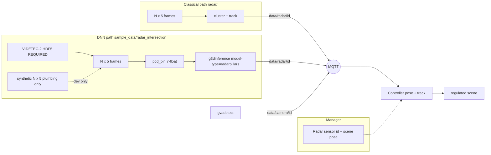

<!--
SPDX-FileCopyrightText: (C) 2026 Intel Corporation
SPDX-License-Identifier: Apache-2.0
-->

# Plan: First-Class Radar + RadarPillars / `g3dinference`

Status snapshot of the radar product path developed on
`feature/radar-support` (SceneScape) and `feature/g3dinference-multi-model`
(DLStreamer). Reconstructs the agreed plan from the prior design chats and
marks what landed vs what remains.

Related Cursor plan drafts (not in-repo): `videtec_radar_demo_ca4bfda2`,
`radarpillars_openvino_dls_8576cfc8`. Chat: [radar g3dinference work](6ee327ad-6ae8-4889-9694-8ee4881d810f).

---

## Current priority (locked)

**Do not advance SceneScape demo / MQTT / packaging work until RadarPillars
quality on real VIDETEC is acceptable.**

**VoD download is optional** (TU Delft access). Active ladder is **VoD-free**:
fixed-input PyTorch↔OV parity, then VIDETEC GNSS PyTorch vs OV, then fine-tune
only if both backends are healthy and VIDETEC is still bad.

| Priority | Work | Status |
| --- | --- | --- |
| **P0-A** | **Fixed-input parity:** PyTorch OpenPCDet ckpt vs host+OV IR on synthetic + VIDETEC bins | **Done** (`parity_pytorch_vs_ov.json`) |
| **P0-B** | **VIDETEC GNSS:** same stride-5 window, PyTorch dets vs OV dets (VRU / all-class) | **Done** — both fail VRU; see acceptance |
| **P0-C** | Optional VoD val mAP (if access appears) — paper regen, not a hard gate | Optional |
| P0-D | Fine-tune + re-export OV | FT2 ep11 best full-window (**11.5%**). FT4: freeze attention → stable associated train; **80%** on 10 associable frames; full-window still ~5.7%. Bottleneck = missing near-GT radar returns |
| P1 | SceneScape real-data MQTT demo | **Deferred** |
| P2 | Upstream DLS / DLSPS bake drop | After quality |

**Quality gate (before SceneScape resume):** fine-tune (or other model fix)
must lift GNSS **VRU** recall @ 2 m / 3 m on the PyTorch path, then re-export
OV and re-check. ~0.25% OV all-class proximity was largely vehicle clutter.

### Why detection (not just classification) can fail

RadarPillars is a **3D detector** (objectness + box + class). Low VIDETEC
scores / empty frames at thr=0.1 are primarily an **objectness / localization**
failure on that input distribution — class confusion is secondary. Causes can
be: wrong PCD features/coords, VoD↔OV numerical drift, score calibration, FOV /
`point_cloud_range` mismatch, **or** ego→gantry domain gap. The ladder below
separates those.

---

## Locked decisions

| Decision | Choice |
| --- | --- |
| Product surface | First-class **radar sensor** in Manager + Controller (not fake Cam, not ADR 16 `external_source`) |
| MQTT | `scenescape/data/radar/{sensor_id}` (`DATA_RADAR`); radar-local metres; Controller applies pose |
| Native detection list | VIDETEC-style `(N,5)`: range, doppler, az, el, magnitude |
| Example archive | [VIDETEC-2](https://zenodo.org/records/17799385) (CC BY 4.0) — convert HDF5 → frames offline |
| Classical perception | `radar/` cluster/track publisher (v1, non-DNN) |
| DNN path | RadarPillars (VoD) → **partial** OpenVINO: FP16 BEV/detect IR + **host** VFE/PillarAttention; **not** full-graph OV, **not** INT8 |
| DLStreamer element | **Generalize** `g3dinference` with `model-type=pointpillars\|radarpillars` — do **not** invent `g3dradarinfer` |
| Radar PCD for DNN | VoD-style **7 float32**/point: `x, y, z, rcs, v_r, v_r_comp, time` |
| Acceptance data | **Real [VIDETEC-2](https://zenodo.org/records/17799385)** through convert → PCD → `g3dinference` → MQTT → Controller. Synthetic frames are plumbing-only; they do **not** close the demo. |
| Accuracy gate | Measure RadarPillars on real VIDETEC using **RTK-GNSS VRU first**; camera tracks only as weak secondary after sync/pose proof |
| Cameras | Unchanged `gvadetect` → `data/camera/{id}`; fusion is Controller’s job |
| LiDAR (unchanged debt) | Still overloads `data/camera/{id}` — **not** standardized like radar |

---

## OpenVINO optimization status (incomplete)

Current RadarPillars deployment under
`sample_data/radar_intersection/model_installer/FP16/`:

| Stage | Implementation | Precision |
| --- | --- | --- |
| Voxelize / PillarVFE / velocity decomp / PillarAttention / scatter | **Host** C++ in `g3dinference` radarpillars runtime (RPW1/NPZ weights) | FP32-style host math |
| BEV backbone + detection head | OpenVINO Runtime IR (`radarpillars_bev_detect.xml/.bin`) | **FP16** weights (mixed FP16/FP32 graph; typical OV compress) |
| Postproc (decode / NMS / score filter) | Host in radarpillars runtime | FP32 |

**What this is:** OpenVINO-accelerated **BEV/detect** slice only, FP16.

**What this is not:**
- Fully fused RadarPillars graph in OpenVINO (preproc still outside IR)
- INT8 / NNCF quantized model
- Claim that the whole detector is “OV-optimized end-to-end”

**Defer** fuller OV fusion / INT8 until GNSS VRU metrics justify it.

---

## RadarPillars metrics approach (real VIDETEC-2)

### Ground-truth reality

VIDETEC **radar is not manually box-annotated**. Zenodo: labels come from an
**external** ground-truth system. Available references:

| Reference | Strength | Role |
| --- | --- | --- |
| **RTK-GNSS** of instrumented VRU (`gnss.zip` / `vru-rtk-track.csv`) | Strong absolute trajectory for **one** person or cyclist | **Primary** accuracy reference |
| Camera tracks / 3D boxes (`tracking_results*`, runs_vru) | Multi-object, same claimed local frame + NTP | **Secondary / pseudo-GT only** after sync+pose proof |
| Radar HDF5 `/detections` | Model **input**, not labels | Never use as GT |

### Local frame

Published VIDETEC Cartesian origin: **UTM 32N** E=**695310.500** m,
N=**5347376.094** m (X-east, Y-north, Z-up). Eval:
`--videtec-origin` + `/sensor` pose → radar-local. See
`sample_data/radar_intersection/videtec_local_origin.json`.

### Baseline results (VoD-ego IR, score≥0.03, calibrated origin)

| Slice | VRU recall @ 3 m | All-class recall @ 3 m | Notes |
| --- | --- | --- | --- |
| Stride-5 frames 3000–5000 (401) | **≈ 0.25%** | ≈ 15.7% | Near-GNSS hits ≈ low-score `vehicle` clutter |
| Dense 3760–3810 (51) | ≈ 0% | ≈ 2% | VRU ~35 m ahead in that window |

Time sync is healthy (p95 \|Δt\| ≈ 74–85 ms). At demo default score **0.1**,
dense-window detections are **empty** (max offline score ≈ 0.095).

**Verdict:** instrumentation + baseline **closed**; **quality gate failed**.
Do not treat SceneScape fusion demo as done.

Details: `sample_data/radar_intersection/VIDETEC_ACCEPTANCE.md`.

### Domain-gap hypotheses (drive fine-tune)

1. **VoD ego vs gantry** — weights/anchors trained for vehicle-mounted VoD.
2. **PC range** — VoD `point_cloud_range` is forward-only `[0, 51.2]` × `[-25.6, 25.6]`; a large fraction of GNSS samples in radar-local XY sit **outside** that box (including negative X).
3. **Height / elevation** — gantry mount ~4.5 m + pitch; VIDETEC spherical→XYZ may place points outside VoD Z anchors `[-3, 2]`.
4. **Sparse detections** — VIDETEC frames often have ≪ VoD point density.
5. **Pseudo-label path** — no box GT; fine-tune must use GNSS (and later camera) weak labels.

---

## Architecture (as built)



---

## Phase A — First-class radar sensor

| Item | Status | Where |
| --- | --- | --- |
| Manager `Radar` model / API / UI | **Done** | `f0c20b38` |
| Migration + scene import of radars | **Done** | Manager migration `0004` (and follow-ons as renumbered) |
| `PubSub.DATA_RADAR` + schema | **Done** | `scene_common` |
| Controller subscribe + `processRadarData` | **Done** | `scene_controller.py` / `scene.py` |
| Classical publisher `(N,5)` → MQTT | **Done** | `radar/` |
| VIDETEC HDF5 → frames converter | **Done** | `radar/videtec_hdf5_to_frames.py` |
| Docs: add/use radar + CC BY | **Done** | `docs/.../add-and-use-radar-sensors.md` |
| Functional / BAT coverage for radar ingest | **Done** (as committed); re-verify on tip if migrations moved | `tests/` |

---

## Phase B — RadarPillars OpenVINO + DLStreamer (plumbing)

| Item | Status | Where |
| --- | --- | --- |
| HF RadarPillars → **partial** OV IR (host preproc + FP16 BEV/detect) | **Done** (incomplete OV optimization) | `model_installer/FP16/` |
| RPW1 preproc weights + config | **Done** | `*.rpw1`, `preproc_weights_rpw1` |
| Interim Python OV infer (`radarpillars_infer.py`) | **Done** (offline / eval) | `sample_data/radar_intersection/` |
| Generalize `g3dinference` (`pointpillars` / `radarpillars`) | **Done** | DLStreamer `e4c0a90f` |
| `g3dlidarparse point-features` (4 or 7) | **Done** | DLStreamer `a7156ac7` |
| `gvametaconvert` accept `application/x-radar` (source) | **Done** in DLS tree; **not** in stock DLSPS image yet | `gstgvametaconvert.c` |
| Bake local DLSPS with rebuilt `libgst3delements.so` | **Done** (interim) | `make build-dlsps-g3d` |
| `demo-radar` compose + synthetic data-init | **Done** (plumbing) | `docker-compose.radar-override.yml` |
| Real VIDETEC ingest / convert / data-init prefer-real | **Done** | `VIDETEC-2/`, `prepare_radar_demo_data.py` |
| GStreamer smoke on real bins | **Done** | DLSPS `…-g3d` |
| GNSS metrics + UTM origin | **Done (quality fail)** | `VIDETEC_ACCEPTANCE.md` |
| SceneScape MQTT E2E on real frames | **Deferred** until quality gate | needs `SUPASS` + better weights |

---

## Phase C — Verification ladder then optional fine-tune (**active P0**)

Ordered diagnosis (user-agreed, **VoD-free**). Fine-tune is **not** the
default next step. VoD paper regen remains optional if access appears.

| Step | Goal | Status |
| --- | --- | --- |
| **C0. Fixed-input parity** | Same synthetic + VIDETEC `(N,7)` clouds through PyTorch ckpt vs host+OV IR; report matched XY / score deltas | **Done** — synthetic tops agree (~0.5–0.6 m XY, 4/5 pytorch dets matched); OV emits many extra low-score boxes (NMS/score); sparse VIDETEC often empty on PyTorch |
| **C1. VIDETEC GNSS PyTorch vs OV** | Stride-5 3000–5000: VRU / all-class recall @ 1/2/3 m for both backends | **Done** — see acceptance; both fail VRU; PyTorch quieter than OV |
| **C2. Optional VoD val mAP** | Reproduce ~52.56 mAP if VoD lands on disk | Optional / not blocking |
| **C3. Fine-tune (conditional)** | Gantry gap confirmed on **both** backends after C0/C1 | FT4 stabilizes associated train (freeze PillarAttention). Associable-subset VRU@3m **80%**; full-window capped by sparse returns |
| **C4. Re-export OV + VIDETEC re-eval** | After a justified fine-tune ckpt | Parked |
| **C5. SceneScape MQTT demo** | After quality gate | Deferred |

Prior FOV notes remain useful diagnostics but do **not** authorize fine-tune
alone: 194/401 GNSS samples outside VoD PC range; in-FOV OV VRU@3m still
≈0.5% on the **unproven-vs-PyTorch** path until C1 closes.

### VoD data prerequisite

```text
RadarPillar expects:
  data/VoD/view_of_delft_PUBLIC/radar_5frames/
    ImageSets/{train,val,test}.txt
    training/{velodyne,label_2,calib,image_2}/
```

Register / download from https://viewofdelft-dataset.tudelft.nl/ (institutional
email). Place under `~/mainline/RadarPillar/data/VoD/...`, then:

```bash
cd ~/mainline/RadarPillar && source .venv/bin/activate
python -m pcdet.datasets.vod.vod_dataset create_vod_infos \
  tools/cfgs/dataset_configs/vod_dataset_radar.yaml
CUDA_VISIBLE_DEVICES=0 python tools/test.py \
  --cfg_file tools/cfgs/vod_models/vod_radarpillar_rot.yaml \
  --ckpt weights/radarpillar_vod_best_map52.56.pth
```

Target: Car/Ped/Cyc 3D AP near the published rot checkpoint (~52.56 mAP R11).

---

## What is left (ordered)

### Active — RadarPillars quality

1. **C0** Fixed-input PyTorch↔OV parity (synthetic + VIDETEC bins) — harness done;
   synthetic matched tops ~0.5–0.6 m; OV over-produces low-score boxes.
2. **C1** VIDETEC GNSS PyTorch vs OV (stride-5) — **both fail VRU**; PyTorch
   nearly silent (8 dets / 401); OV all-class ~15.7% is vehicle clutter. Domain
   gap (not OV-only) is the leading explanation.
3. **C3** Fine-tune is now the candidate next step (stack healthy enough on
   synthetic control; VIDETEC bad on **both** backends). Optional VoD mAP remains
   nice-to-have, not a hard gate.
4. Re-export / SceneScape MQTT only after the quality gate.

### Deferred — SceneScape product path (after quality gate)

3. Full MQTT `demo-radar` on real frames (radar-only + fusion) — was P0 item 4; **parked**.
4. Land DLS PRs (`feature/g3dinference-multi-model`) + DLSPS bump + drop `build-dlsps-g3d`.
5. SceneScape cleanup: stock DLSPS tags, native `application/x-radar` end-to-end.
6. BAT / functional radar re-verify; PR hygiene.

### Later (after metrics justify)

7. Deeper OpenVINO fusion / optional INT8 PTQ.
8. Zero-copy iGPU / remote tensors.
9. First-class LiDAR; rename `g3dlidarparse` → generic point-cloud parse.

---

## Explicit non-goals (still)

- Using `g3dradarprocess` / raw ADC for this product path.
- Fake Cam / `data/camera` for radar.
- ADR 16 `external_source` as the infrastructure-radar path.
- PyTorch XPU inside DLS (OpenVINO IR only for the BEV/detect slice).
- Treating vision YOLO-on-RD-maps as the radar DNN.
- Treating camera tracks as primary GT without proven time/pose association.
- Claiming end-to-end OpenVINO or INT8 optimization for the current split graph.
- **Claiming the DNN demo complete while VRU GNSS recall remains ~0.**

---

## Key commands (current interim)

```bash
# Eval with calibrated VIDETEC UTM origin (offline Python / batch detections)
python3 sample_data/radar_intersection/eval_radarpillars_gnss.py \
  --index sample_data/radar_intersection/VIDETEC-2/converted/frames/index.json \
  --detections sample_data/radar_intersection/VIDETEC-2/detections_stride5.jsonl \
  --gnss sample_data/radar_intersection/VIDETEC-2/gnss/rosbag2_2025_10_09-14_43_55/*_gps.csv \
  --sensor sample_data/radar_intersection/VIDETEC-2/converted/frames/sensor.json \
  --videtec-origin --categories person,cyclist

# Bake DLSPS with generalized g3dinference (needs ../dlstreamer) — after new IR
make build-dlsps-g3d

# SceneScape fusion demo — DEFERRED until quality gate
# RADAR_REQUIRE_REAL=true RADAR_SCORE_THRESHOLD=0.03 SUPASS=<password> make demo-radar
```

Docs: [add-and-use-radar-sensors](../../docs/user-guide/how-to-guides/add-and-use-radar-sensors.md),
[run-radar-intersection-demo](../../docs/user-guide/how-to-guides/run-radar-intersection-demo.md),
[VIDETEC_ACCEPTANCE](../../sample_data/radar_intersection/VIDETEC_ACCEPTANCE.md).
