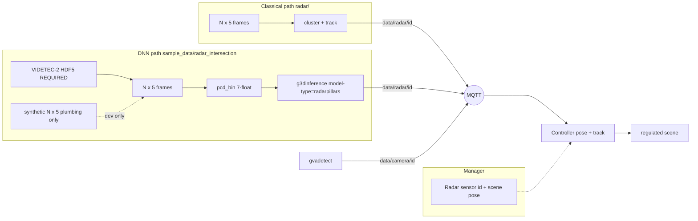

<!--
SPDX-FileCopyrightText: (C) 2026 Intel Corporation
SPDX-License-Identifier: Apache-2.0
-->

# Plan: First-Class Radar + RadarPillars / `g3dinference`

Status snapshot of the radar product path developed on
`feature/radar-support` (SceneScape) and `feature/g3dinference-multi-model`
(DLStreamer). Reconstructs the agreed plan from the prior design chats and
marks what landed vs what remains. **Updated 2026-09-28:** C5/P1 MQTT demo
live (multi-cam + dual-radar + portable scene); VoD val mAP dropped; causal
densify done; **host preproc → OV tracked as next Intel optimization**.

Related Cursor plan drafts (not in-repo): `videtec_radar_demo_ca4bfda2`,
`radarpillars_openvino_dls_8576cfc8`. Chat: [radar g3dinference work](6ee327ad-6ae8-4889-9694-8ee4881d810f).

---

## Phase-1 alternate perception (2026-09-27)

**Criterion = sparsity robustness** (not mean full-window recall). Offline
VIDETEC 2100–4100 stride 5; stratified by points within 3 m of GNSS.

| Method | 1-pt @3m recall (H=0) | Miss when support≥1 (H=0) | N=1 cloud recall |
| --- | ---: | ---: | ---: |
| classical | **96.9%** | **2.6%** | 47% |
| roadside (weak GNSS PointNet) | **96.9%** | **2.6%** | 47% |
| RadarPillars FT2 | 30.2% | 60.3% | **0%** |

Artifacts: `sample_data/radar_intersection/baselines/`,
`VIDETEC-2/phase1_baselines/PHASE1_COMPARE.md` + `sparsity_robustness.json`.
**Takeaway:** classical/roadside are sparsity-robust; RP is not (fails
single-point roadside cases; densify helps means, not the hard sparse bin).
Roadside ≈ classical on sparse recall, cleaner under empty support.
**Commercial path:** roadside weights are **VIDETEC-only** (CC BY 4.0) —
`phase1_baselines/roadside_videtec_ccby.pt`; see `baselines/PROVENANCE.md`.
No RoadsideRadar (CC BY-NC-SA) data/weights.

---

## Phase-2 Intel stack (2026-09-27) — locked product call

**Product requirement:** classical and roadside go through **`g3dinference`**
so parse → OD meta → `gvametaconvert` → publish is **one stack** (not a
parallel Python publisher path).

| `RADAR_PERCEPTION` | `g3dinference model-type` | Input |
| --- | --- | --- |
| `classical` (default) | `classical` | `frames_bin` 5-float VIDETEC |
| `roadside` | `roadside` | `frames_bin` 5-float + OV PointNetSeg |
| `radarpillars` | `radarpillars` | `pcd_bin` 7-float VoD |

DLS: `classical_runtime.*`, `roadside_runtime.*` in
`dlstreamer/.../g3dinference/`. SceneScape: shared
`radar_file_playback` / `radar_publisher` / `radar_sensor_contract`.
Bake: always `make build-dlsps-g3d` for `demo-radar`.

---

## Current priority (locked)

**Dense-cloud PyTorch performance is locked in as good.** Do **not** treat
sparse single-frame VoD→gantry as “model broken” when support is present.
Ladder completed **VoD-free** (no View-of-Delft val mAP / paper regen).

**SceneScape MQTT demo is live** (FT2 densify + multi-cam / dual-radar fusion).
Remaining work is host preproc → OV (Intel path), full-window quality /
fusion, and upstream DLS bake.

| Priority | Work | Status |
| --- | --- | --- |
| **P0-A** | **Fixed-input parity:** PyTorch OpenPCDet ckpt vs host+OV IR on synthetic + VIDETEC bins | **Done** (`parity_pytorch_vs_ov.json`) |
| **P0-B** | **VIDETEC GNSS:** stride-5 window, PyTorch vs OV (VRU / all-class) | **Done** — baseline both fail VRU on sparse 3000–5000; see acceptance |
| **P0-D** | Fine-tune + densify diagnosis | **Done (dense lock-in)** — FT2 ep11 + **±5 accumulate** on **2100–4100** → **~51% VRU@3m**; associable subset **≥92–99%**. Single-frame full-window still capped by missing near-GT returns |
| **P0-E / C4** | Runtime densify in OV + g3d playback bins | **Done** — OV densify + `pcd_bin_acc5` |
| **P0-F** | FT2→OV re-export + densify re-eval | **Done** — `FP16_ft2` OV ±5 → **52.4%** VRU@3m (≈ PyTorch 51.4%) |
| P1 | SceneScape real-data MQTT demo | **Done** (2026-09-27 verify; **2026-09-28** multi-sensor) — see below |
| P2 | Upstream DLS / DLSPS bake drop | Open — after quality / PR land |

**P1 demo state (2026-09-28):**

- FT2 / `pcd_bin_acc5` + classical + roadside → MQTT + regulated scene
- **8 cameras** (s110 o/n/w/s + s120 o/n/w/s) via `CAM_SENSOR_IDS` + staged
  `camera_demo/`
- **2 radars** (`intersection-radar1` dataset 51, `intersection-radar2`
  dataset 52) time-aligned `3270–4100` ↔ `3098–3928`
- GNSS XY/yaw-fit radar1 + relative radar2; UI-calibrated cameras locked in
  `RadarIntersection.json` + scene-import ZIP (`pack_radar_scene_import.py`,
  `radar_scene_init.py` re-sync on every `demo-radar`)
- Default score thr **0.1** (radarpillars); avoid 0.03 clutter on densify slice

**Dense-cloud gate (locked):** when radar returns exist near GNSS (associable
frames), FT2/FT4 hit **≥80–99% VRU@3m**. Failure mode for sparse full windows
is **support density**, not a broken detector.

**Full-window quality gate (still OPEN — reconfirmed 2026-09-28):** OV-FT2 on
2100–4100 stride 5: **H=5 @ score≥0.01 → 52.4% VRU@3m** (associable **92.4%**
on 170 frames); **@ demo score 0.1 → 26.4%**. Dense-cloud lock-in holds; the
operational full-window number has not lifted. **FT5** (train-time ±5 densify
+ associated + freeze `backbone_3d`, init FT2 ep11) **did not close the gate**:
H=5 plateau **~39%**, H=0 **11.5%** (like FT4), worse than FT2 H=5. Keep FT2
as the demo weights; next levers are causal runtime densify or fusion.

### Why detection (not just classification) can fail

RadarPillars is a **3D detector** (objectness + box + class). Low VIDETEC
scores / empty frames at thr=0.1 are primarily an **objectness / localization**
failure on that input distribution — class confusion is secondary. Causes can
be: wrong PCD features/coords, VoD↔OV numerical drift, score calibration, FOV /
`point_cloud_range` mismatch, **or** ego→gantry domain gap. The ladder below
separates those.

---

## Locked decisions

| Decision | Choice |
| --- | --- |
| Product surface | First-class **radar sensor** in Manager + Controller (not fake Cam, not ADR 16 `external_source`) |
| MQTT | `scenescape/data/radar/{sensor_id}` (`DATA_RADAR`); radar-local metres; Controller applies pose |
| Native detection list | VIDETEC-style `(N,5)`: range, doppler, az, el, magnitude |
| Example archive | [VIDETEC-2](https://zenodo.org/records/17799385) (CC BY 4.0) — convert HDF5 → frames offline |
| Classical perception | `g3dinference model-type=classical` (host cluster/track; shared OD publish) |
| Roadside perception | `g3dinference model-type=roadside` (OV PointNetSeg + host instances) |
| Pillar DNN path | RadarPillars → **partial** OpenVINO BEV/detect + host VFE/attn; `model-type=radarpillars` |
| DLStreamer element | **Generalize** `g3dinference` with `model-type=pointpillars\|radarpillars\|classical\|roadside` — do **not** invent `g3dradarinfer` |

| Radar PCD for DNN | VoD-style **7 float32**/point: `x, y, z, rcs, v_r, v_r_comp, time` |
| Acceptance data | **Real [VIDETEC-2](https://zenodo.org/records/17799385)** through convert → PCD → `g3dinference` → MQTT → Controller. Synthetic frames are plumbing-only; they do **not** close the demo. |
| Accuracy gate | Measure RadarPillars on real VIDETEC using **RTK-GNSS VRU first**; camera tracks only as weak secondary after sync/pose proof |
| Cameras | Unchanged `gvadetect` → `data/camera/{id}`; fusion is Controller’s job |
| Demo scene portability | `RadarIntersection.json` is pose SoT; ZIP for fresh import; `radar_scene_init` always re-syncs sensors |
| Demo score (radarpillars) | **`RADAR_SCORE_THRESHOLD=0.1`** on densify slice (~1 VRU); `0.03` is clutter |
| LiDAR (unchanged debt) | Still overloads `data/camera/{id}` — **not** standardized like radar |
| VoD val mAP | **Dropped** — not a gate; ladder stays VIDETEC/GNSS-only |

---

## OpenVINO optimization status (incomplete)

Current RadarPillars deployment under
`sample_data/radar_intersection/model_installer/FP16_ft2/` (demo) /
`FP16/` (VoD baseline):

| Stage | Implementation | Precision / accel |
| --- | --- | --- |
| Voxelize | Host C++ loops in `g3dinference` `radarpillars_runtime` | FP32, **no** OV / oneDNN |
| PillarVFE + velocity decomp | Host C++ (RPW1/NPZ weights) | FP32 host math |
| PillarAttention | Host C++ **O(N²)** over pillars | FP32; cost grows with causal densify |
| Scatter to BEV canvas | Host C++ | FP32 |
| BEV backbone + detection head | OpenVINO IR (`radarpillars_bev_detect.xml/.bin`) | **FP16** (OV → oneDNN / CPU|GPU) |
| Postproc (decode / NMS / score filter) | Host in radarpillars runtime | FP32 |

**What this is:** OpenVINO-accelerated **BEV/detect** slice only (~345 KB FP16 IR).
Preproc is **not** “numpy with Intel MKL underneath” on the live path — it is
hand-written C++. Offline Python parity uses numpy; only dense `@` matmuls may
hit BLAS, while voxelize / attention softmax / scatter loops do not.

**Contrast:** LiDAR **PointPillars** in the same plugin already runs voxelization
as an OpenVINO `voxel_model`. RadarPillars never got that treatment.

**What this is not (yet):**
- Fully fused RadarPillars graph in OpenVINO (preproc still outside IR)
- INT8 / NNCF quantized model
- Claim that the whole detector is “OV-optimized end-to-end”

### Tracked next: host preproc → Intel / OpenVINO (begin when kicked off)

Priority order (profile to confirm, expect attention to dominate under
`accumulate-past=10`):

1. **Profile** live `radarpillars` path (voxelize / VFE / attn / scatter / OV BEV /
   postproc) with and without causal densify. **DONE (Stage 1, 2026-09-28).**
2. **OV-ify matmul-heavy preproc** (PillarVFE linear+BN, PillarAttention QKV/out/FFN)
   — export small IRs or one fused preproc IR; compile `CPU` (then `GPU` if useful).
   Mirror PointPillars’ `voxel_model` pattern where practical. **Await confirm.**
3. **Voxelize + scatter** — vectorize or OV custom; avoid more numpy.
4. **Attention cost** — if pillar counts explode under densify, consider bounded /
   sparse attention (quality gate must stay at parity with FT2 causal ~52.7% VRU@3m).
5. **Optional later:** INT8 / NNCF on BEV (± preproc); zero-copy iGPU tensors.

#### Stage 1 profile results (Python parity path; ranking ≈ C++ live)

Tool: `sample_data/radar_intersection/profile_radarpillars_stages.py`.
Artifacts: `VIDETEC-2/profile_stages_ft2_3270_3319.json`,
`VIDETEC-2/profile_stages_ft2_synthetic.json`.

**A. Real VIDETEC demo slice (3270–3319, FT2, score 0.1)** — clouds are tiny
(~1–17 pts / ~1–13 pillars even with causal past=10):

| Mode | med pts | med pillars | voxelize | VFE | attn | scatter | OV BEV | **postproc** | total |
| --- | ---: | ---: | ---: | ---: | ---: | ---: | ---: | ---: | ---: |
| past=0 | 1 | 1 | 0.2 ms | 0.2 | 0.3 | 1.3 | 36 ms (34%) | **67 ms (62%)** | 107 ms |
| past=10 | 14 | 11 | 0.3 | 0.5 | 0.3 | 1.3 | 37 (33%) | **69 (62%)** | 112 ms |

**Read:** On current VIDETEC sparsity, host preproc is **noise**. Latency is
dominated by **anchor decode + NMS (postproc)** then **OV BEV**. Causal densify
does not make attention expensive here.

**B. Synthetic dense stress (uniform in gantry range)** — when pillars grow:

| N pts | med pillars | attn share | VFE | OV BEV | postproc | total |
| ---: | ---: | ---: | ---: | ---: | ---: | ---: |
| 100 | 100 | ~0% | 2 ms | 34 | 59 | 99 |
| 500 | 500 | **24%** | 30 | 143 | 76 | 366 |
| 2k | ~2k | **50%** | 79 | 105 | 70 | 547 |
| 5k | ~5k | **59%** | 237 | 100 | 74 | 1038 |
| 10k | ~10k | **75%** | 470 | 91 | 66 | 2630 |

**Read:** PillarAttention (O(N²)) + VFE become the bottleneck only for
**dense** clouds (hundreds–thousands of pillars). That is the Intel/OV preproc
target for denser radars / future densify; it is **not** the VIDETEC demo
critical path today.

**Stage 2a — postproc latency (DONE):** score-gated decode in
Python (`_postprocess_heads`); C++ skips full NCHW→HWAC rearrange and gates on
logits in-place. VIDETEC slice 3270–3319 (score 0.1):

| | past=0 total | past=0 postproc | past=10 total | past=10 postproc |
| --- | ---: | ---: | ---: | ---: |
| Before | 107 ms | 67 ms (62%) | 112 ms | 69 ms (62%) |
| After | **53 ms** | **9 ms (17%)** | **48 ms** | **8 ms (17%)** |

OV BEV (~33–39 ms, ~70% of remaining) is now the main cost on this sparse path.
Artifacts: `profile_stages_ft2_postproc_opt.json`.

**Stage 2b — OV VFE + PillarAttention (DONE, await confirm):** export
`radarpillars_vfe_linear.xml` + `radarpillars_attention.xml` (FP32, dynamic
shapes) via `export_radarpillars_preproc_ov.py`; wire Python + C++
`g3dinference` when config keys `vfe_linear_model` / `attention_model` are set.
Parity vs host: VFE ~1e-6, attention ~5e-7. Synthetic dense (post Stage 2a base):

| N pts | host attn (Stage1) | OV attn (2b) | host total | OV total |
| ---: | ---: | ---: | ---: | ---: |
| 500 | 88 ms (24%) | **1.7 ms (3%)** | 366 | **64** |
| 2k | 271 (50%) | **13 (13%)** | 547 | **100** |
| 5k | 610 (59%) | **46 (28%)** | 1038 | **165** |

Artifact: `profile_stages_ft2_ov_preproc_synth.json`. Live demo needs
`radar-model-init` + recreate `radar-stream` after bake.

**Stage 3 recommendation (await confirm):** vectorize/OV voxelize+scatter;
optional OV BEV `GPU` for remaining sparse-path cost.

**Acceptance for this workstream:** bit-exact or tight numeric parity vs current
host+OV on fixed bins; no VRU@3m regression on causal past=10 gate; document
latency before/after on demo hardware. Do **not** claim e2e OV until preproc
OV lands for the dense path.

---

## RadarPillars metrics approach (real VIDETEC-2)

### Ground-truth reality

VIDETEC **radar is not manually box-annotated**. Zenodo: labels come from an
**external** ground-truth system. Available references:

| Reference | Strength | Role |
| --- | --- | --- |
| **RTK-GNSS** of instrumented VRU (`gnss.zip` / `vru-rtk-track.csv`) | Strong absolute trajectory for **one** person or cyclist | **Primary** accuracy reference |
| Camera tracks / 3D boxes (`tracking_results*`, runs_vru) | Multi-object, same claimed local frame + NTP | **Secondary / pseudo-GT only** after sync+pose proof |
| Radar HDF5 `/detections` | Model **input**, not labels | Never use as GT |

### Local frame

Published VIDETEC Cartesian origin: **UTM 32N** E=**695310.500** m,
N=**5347376.094** m (X-east, Y-north, Z-up). Eval:
`--videtec-origin` + `/sensor` pose → radar-local. See
`sample_data/radar_intersection/videtec_local_origin.json`.

### Baseline results (VoD-ego IR, score≥0.03, calibrated origin)

| Slice | VRU recall @ 3 m | All-class recall @ 3 m | Notes |
| --- | --- | --- | --- |
| Stride-5 frames 3000–5000 (401) | **≈ 0.25%** | ≈ 15.7% | Near-GNSS hits ≈ low-score `vehicle` clutter |
| Dense 3760–3810 (51) | ≈ 0% | ≈ 2% | VRU ~35 m ahead in that window |

Time sync is healthy (p95 \|Δt\| ≈ 74–85 ms). At demo default score **0.1**,
dense-window detections are **empty** (max offline score ≈ 0.095).

**Verdict (baseline):** instrumentation + sparse-window baseline **closed**;
demo quality **failed** on 3000–5000 single-frame.

**Verdict (post FT + densify):** dense-support PyTorch path **validated**.
Best offline: FT2 ep11, window **2100–4100**, `--accumulate-half-window 5` →
**51.4% VRU@3m** (associable **≥92%**). H=10 regresses. See acceptance
“Window + density” section.

Details: `sample_data/radar_intersection/VIDETEC_ACCEPTANCE.md`.

### Domain-gap hypotheses (drive fine-tune)

1. **VoD ego vs gantry** — weights/anchors trained for vehicle-mounted VoD.
2. **PC range** — VoD `point_cloud_range` is forward-only `[0, 51.2]` × `[-25.6, 25.6]`; a large fraction of GNSS samples in radar-local XY sit **outside** that box (including negative X).
3. **Height / elevation** — gantry mount ~4.5 m + pitch; VIDETEC spherical→XYZ may place points outside VoD Z anchors `[-3, 2]`.
4. **Sparse detections** — VIDETEC frames often have ≪ VoD point density.
5. **Pseudo-label path** — no box GT; fine-tune must use GNSS (and later camera) weak labels.

---

## Architecture (as built)



---

## Phase A — First-class radar sensor

| Item | Status | Where |
| --- | --- | --- |
| Manager `Radar` model / API / UI | **Done** | `f0c20b38` |
| Migration + scene import of radars | **Done** | Manager migration `0004` (and follow-ons as renumbered) |
| `PubSub.DATA_RADAR` + schema | **Done** | `scene_common` |
| Controller subscribe + `processRadarData` | **Done** | `scene_controller.py` / `scene.py` |
| Classical publisher `(N,5)` → MQTT | **Done** | `radar/` |
| VIDETEC HDF5 → frames converter | **Done** | `radar/videtec_hdf5_to_frames.py` |
| Docs: add/use radar + CC BY | **Done** | `docs/.../add-and-use-radar-sensors.md` |
| Functional / BAT coverage for radar ingest | **Done** (as committed); re-verify on tip if migrations moved | `tests/` |

---

## Phase B — RadarPillars OpenVINO + DLStreamer (plumbing)

| Item | Status | Where |
| --- | --- | --- |
| HF RadarPillars → **partial** OV IR (host preproc + FP16 BEV/detect) | **Done** (incomplete OV optimization) | `model_installer/FP16/` |
| RPW1 preproc weights + config | **Done** | `*.rpw1`, `preproc_weights_rpw1` |
| Interim Python OV infer (`radarpillars_infer.py`) | **Done** (offline / eval) | `sample_data/radar_intersection/` |
| Generalize `g3dinference` (`pointpillars` / `radarpillars`) | **Done** | DLStreamer `e4c0a90f` |
| `g3dlidarparse point-features` (4 or 7) | **Done** | DLStreamer `a7156ac7` |
| `gvametaconvert` accept `application/x-radar` (source) | **Done** in DLS tree; **not** in stock DLSPS image yet | `gstgvametaconvert.c` |
| Bake local DLSPS with rebuilt `libgst3delements.so` | **Done** (interim) | `make build-dlsps-g3d` |
| `demo-radar` compose + synthetic data-init | **Done** (plumbing) | `docker-compose.radar-override.yml` |
| Real VIDETEC ingest / convert / data-init prefer-real | **Done** | `VIDETEC-2/`, `prepare_radar_demo_data.py` |
| GStreamer smoke on real bins | **Done** | DLSPS `…-g3d` |
| GNSS metrics + UTM origin | **Done** (baseline fail; dense lock-in later) | `VIDETEC_ACCEPTANCE.md` |
| SceneScape MQTT E2E on real frames | **Done** — FT2 densify + multi-cam / dual-radar | `make demo-radar`, how-to |

---

## Phase C — Verification ladder then fine-tune / densify (**done**)

Ordered diagnosis (user-agreed, **VoD-free**). View-of-Delft val mAP was
dropped from the ladder (not a gate).

| Step | Goal | Status |
| --- | --- | --- |
| **C0. Fixed-input parity** | Same synthetic + VIDETEC `(N,7)` clouds through PyTorch ckpt vs host+OV IR; report matched XY / score deltas | **Done** — synthetic tops agree (~0.5–0.6 m XY); OV emits many extra low-score boxes; sparse VIDETEC often empty on PyTorch |
| **C1. VIDETEC GNSS PyTorch vs OV** | Stride-5 3000–5000: VRU / all-class recall @ 1/2/3 m for both backends | **Done** — both fail VRU on that sparse window; PyTorch quieter than OV |
| **C3. Fine-tune + densify** | Close gantry gap; separate model vs support-density failure | **Done (dense lock-in)** — FT2/FT4; best window 2100–4100; ±5 accumulate → **51.4%** VRU@3m; associable **≥92–99%** |
| **C4. Runtime densify / OV re-export** | Port H≈5 accumulate into OV + g3d playback; re-export FT2 OV; re-eval | **Done** — densify + **FT2→OV** (`FP16_ft2`); OV-FT2 ±5 **52.4%** VRU@3m |
| **C5. SceneScape MQTT demo** | FT2 IR + densified bins on real frames (+ fusion) | **Done** — 2026-09-27 single-radar verify; 2026-09-28 multi-cam / dual-radar / portable scene |

Prior FOV notes remain useful diagnostics: 194/401 GNSS samples outside VoD
PC range on the old eval slice; associability scan shows **2100–4100** is the
better 401-frame window (~10× more near-GT support than 3000–5000).

---

## What is left (ordered)

### Done through C5 / P1 (do not re-open)

- C0–C4 + FT2→OV (`model_installer/FP16_ft2/`); offline OV-FT2 ±5 ≈ **52%** VRU@3m
- C5 MQTT E2E: FT2 + `pcd_bin_acc5`, classical, roadside; multi-cam + dual radar;
  GNSS-fit / UI poses in `RadarIntersection.json` (portable via ZIP + scene-init)

### Active next

1. **Full-window quality gate** — **OPEN** (2026-09-28 re-run: OV-FT2 H=5
   52.4% VRU@3m @0.01; 26.4% @ demo 0.1). **FT5 failed to lift** (~39% H=5).
   Keep FT2 demo weights. Causal densify preserves H=5 parity (~52.7%);
   remaining *quality* lever is camera–radar fusion.
2. **Causal live densify in `g3dinference`** — **DONE** (`accumulate-past`,
   `RADAR_ACCUMULATE_PAST=10`, offline `--accumulate-past`; ~52.7% VRU@3m).
3. **Host preproc → Intel / OpenVINO** — **Stages 1–2b DONE.** Profile showed
   postproc then OV BEV on VIDETEC sparsity; Stage 2a score-gated decode ~2×;
   Stage 2b OV VFE+attention cuts dense-path total ~5–6× (attn 610→46 ms at
   5k pts). **Await confirm for Stage 3** (voxelize/scatter ± BEV GPU).
4. **Upstream DLS / DLSPS** — land `feature/g3dinference-multi-model`, bump
   DLSPS image, drop local `make build-dlsps-g3d`.
5. **SceneScape cleanup** — stock DLSPS tags; native `application/x-radar`
   end-to-end (no bake workaround).
6. **PR hygiene** — BAT / functional radar re-verify on tip; merge readiness.

### Later (after preproc OV or metrics justify)

7. Camera–radar fusion for full-window quality uplift.
8. INT8 / NNCF PTQ (BEV ± preproc) once fused graph exists.
9. Zero-copy iGPU / remote tensors.
10. First-class LiDAR; rename `g3dlidarparse` → generic point-cloud parse.

---

## Explicit non-goals (still)

- Using `g3dradarprocess` / raw ADC for this product path.
- Fake Cam / `data/camera` for radar.
- ADR 16 `external_source` as the infrastructure-radar path.
- PyTorch XPU inside DLS (OpenVINO IR only for the BEV/detect slice).
- Treating vision YOLO-on-RD-maps as the radar DNN.
- Treating camera tracks as primary GT without proven time/pose association.
- Claiming end-to-end OpenVINO or INT8 optimization **until** host preproc
  OV workstream above lands (BEV-only today).
- **View-of-Delft val mAP / paper regen** as an acceptance gate (dropped).
- Treating sparse full-window ~51% VRU@3m as “model broken” when associable
  frames already hit ≥80–99%.

---

## Key commands (current)

```bash
# Offline GNSS VRU gate (calibrated VIDETEC UTM origin)
python3 sample_data/radar_intersection/eval_radarpillars_gnss.py \
  --index sample_data/radar_intersection/VIDETEC-2/converted/frames/index.json \
  --detections sample_data/radar_intersection/VIDETEC-2/detections_stride5.jsonl \
  --gnss sample_data/radar_intersection/VIDETEC-2/gnss/rosbag2_2025_10_09-14_43_55/*_gps.csv \
  --sensor sample_data/radar_intersection/VIDETEC-2/converted/frames/sensor.json \
  --videtec-origin --categories person,cyclist

# Bake DLSPS with generalized g3dinference (needs ../dlstreamer)
make build-dlsps-g3d

# Live fusion demo (FT2 + causal densify + multi-cam / dual-radar)
SUPASS=<password> RADAR_PERCEPTION=radarpillars RADAR_REQUIRE_REAL=true \
  RADAR_IR_DIR=FP16_ft2 RADAR_ACCUMULATE_PAST=10 \
  RADAR_SCORE_THRESHOLD=0.1 make demo-radar

# Offline causal densify gate (past=10 ≈ H=5 span, no future)
python3 sample_data/radar_intersection/batch_radarpillars_infer.py \
  --frames-dir sample_data/radar_intersection/VIDETEC-2/converted/frames \
  --config sample_data/radar_intersection/model_installer/FP16_ft2/radarpillars_ov_config.json \
  --start-index 2100 --stop-index 4100 --accumulate-past 10 --score-threshold 0.01 \
  -o sample_data/radar_intersection/VIDETEC-2/detections_ft2_causal10_thr001.jsonl

# After pose edits: lock JSON → rebuild import ZIP for other machines
python3 sample_data/radar_intersection/pack_radar_scene_import.py
```

Docs: [add-and-use-radar-sensors](../../docs/user-guide/how-to-guides/add-and-use-radar-sensors.md),
[run-radar-intersection-demo](../../docs/user-guide/how-to-guides/run-radar-intersection-demo.md),
[VIDETEC_ACCEPTANCE](../../sample_data/radar_intersection/VIDETEC_ACCEPTANCE.md).
