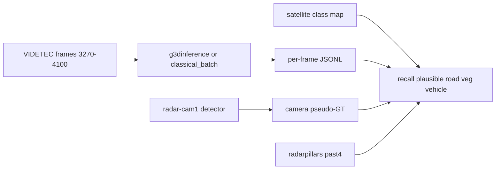

<!--
SPDX-FileCopyrightText: (C) 2026 Intel Corporation
SPDX-License-Identifier: Apache-2.0
-->

# Plan: Radar demo tuning, evaluation harness, and multi-class fine-tune

Status snapshot **2026-10-05** on `feature/radar-support`. Most of the plan
landed on the analysis host; **FT6 train → export → promote** remains for a
machine with RadarPillar + FT2 ep11 `.pth`.

Related: [`radar-first-class-and-g3dinference.md`](radar-first-class-and-g3dinference.md),
[`VIDETEC_ACCEPTANCE.md`](../../sample_data/radar_intersection/VIDETEC_ACCEPTANCE.md)
(C4b–C4f, FT6), [`finetune/README.md`](../../sample_data/radar_intersection/finetune/README.md).

---

## Status rollup

| # | Work item | Status |
| --- | --- | --- |
| 1 | `RADAR_ACCUMULATE_PAST` default → 4 + docs | **Done** |
| 2 | NMS IoU sweep; adopt config if safe | **Done** (`nms_thresh=0.05` on FT2) |
| 3a | Analysis harness (map seg, camera GT, metrics) | **Done** |
| 3b | Offline classical/roadside GST runners | **Done** |
| 3c | Classical / roadside vs radarpillars table | **Done** |
| 4a | Distill tooling + FT6 dataset build | **Done** (647 samples / 255 distilled) |
| 4b | Train FT6 from FT2 ep11 | **Open** — needs RadarPillar + FT2 `.pth` |
| 4c | Export `FP16_ft6` IR | **Open** — blocked on 4b |
| 4d | Promotion gate vs FT2; switch demo IR if pass | **Open** — blocked on 4c |
| 5 | Acceptance / docs for densify, NMS, CR, FT6 dataset | **Done** (FT6 train outcome TBD) |

---

## Decisions (locked)

- Use **`accumulate_past=4`** (camera-GT on 3270–4100: 100% recall@3 m, 13%
  road / 4% veg vs 53% / 17% / 15% at past=10).
- **No** map-based dropping of road persons in product (could hide real events).
  Segmentation stays evaluation-only.
- **No** early fusion (SceneScape late fusion already).
- NMS: **config-only** (`nms_thresh`); no C++ centre-distance change in this plan.
- Retrain labels: **base-VoD distillation** for vehicle/cyclist + GNSS persons.

## NMS finding (shapes step 2)

NMS is already class-agnostic (one argmax label, one greedy BEV pass in
`radarpillars_infer.py` / C++ `radarpillars_runtime.cpp`). Duplicate person
boxes survive because axis-aligned IoU of ~0.7 m boxes offset by ≥0.5 m falls
under `nms_thresh=0.1`. Lowering the threshold is the only config lever.

---

## 1. Default accumulate-past = 4 — Done

- [x] Makefile: `RADAR_ACCUMULATE_PAST ?= 4` for radarpillars
- [x] Docs: `run-radar-intersection-demo.md`, sample README, finetune README,
  `VIDETEC_ACCEPTANCE.md` C4b/C4d, `.github/plans/radar-first-class-and-g3dinference.md`
- [x] Note: old 52.7% GNSS VRU@3m was at score 0.01 with **no** FP metric

Live demo default is past=4.

## 2. NMS sweep (config only) — Done

Measured OV-FT2, past=4, person thr 0.1, 3270–4100:

| `nms_thresh` | Boxes/hit | Recall@3 m | Road % | Veg % |
| ---: | ---: | ---: | ---: | ---: |
| 0.1 (old) | 2.39 | 100% | 12% | 4% |
| **0.05 (adopted)** | **1.83** | **100%** | 13% | 4% |
| 0.02 | 1.60 | 100% | 13% | 3% |
| 0.0 | 1.53 | 100% | 14% | 4% |

- [x] Sweep via `batch_radarpillars_infer.py --nms-thresh`
- [x] Set `nms_thresh: 0.05` in `model_installer/FP16_ft2/radarpillars_ov_config.json`
- Residual duplicates would need centre-distance suppression (deferred / out of scope)

## 3. Classical / roadside evaluation — Done



### Harness (in repo)

`sample_data/radar_intersection/analysis/`:

| Script | Role |
| --- | --- |
| `segment_map.py` | Road / crosswalk / sidewalk / vegetation raster |
| `detect_camera_frames.py` | OMZ detector over staged JPEGs |
| `project_camera_detections.py` | Scene + radar-local projection (person + vehicle) |
| `metrics.py` | Recall@3 m, map split, plausible-on-footpath, vehicles |
| `offline_g3d_publish.py` | GST `gvametapublish` + `lidar_frame.frame_id` reindex |
| `offline_g3d_infer.py` | Appsink variant (meta extraction weaker) |

Also: `baselines/classical_batch.py` for exact classical indexing.

### Comparison (person thr as noted; vehicle thr 0.3 unless stated)

| Mode | Person recall | Road % | Veg % | Plausible % | Vehicles |
| --- | ---: | ---: | ---: | ---: | ---: |
| **radarpillars past=4 thr 0.1** | **100%** | **12%** | 4% | **81%** | 0 |
| classical default | 94% | 44% | 1% | 53% | 1091 |
| roadside thr 0 / 0.35 | 94% | 29% | 3% | 61% | 289 |

**Recommendation (done):** keep **radarpillars + past=4 + nms 0.05** as demo
default. Classical/roadside when vehicle tracks matter more than person purity.

- [x] Tunable classical sweeps (default / loose / tight)
- [x] Roadside via g3d publish
- [x] Table + recommendation in `VIDETEC_ACCEPTANCE.md` C4f

## 4. Multi-class fine-tune (FT6) — Partially done

### Why

FT2 person-only labels → vehicle returns become low-score `person` on the road.

### 4a. Distill + dataset — Done

- [x] `finetune/distill_base_labels.py` (base `FP16/` OV, not FT2)
- [x] `build_videtec_dataset.py --distill-jsonl` / `--distill-score`
- [x] Built `VIDETEC-2/finetune_ds_ft6`: **647** samples, **255** distilled
  Car/Cyclist boxes; exclude 3270–4100
- [x] Placeholder `model_installer/FP16_ft6/README.md`

Rebuild on another host if needed:

```bash
python3 sample_data/radar_intersection/finetune/distill_base_labels.py \
  --frames-dir sample_data/radar_intersection/VIDETEC-2/converted/frames \
  --config sample_data/radar_intersection/model_installer/FP16/radarpillars_ov_config.json \
  --device CPU --score-threshold 0.03 --stride 2 --min-points-near 1 \
  --start-index 0 --stop-index 6000 \
  -o sample_data/radar_intersection/VIDETEC-2/distill_base_vc.jsonl

GNSS=sample_data/radar_intersection/VIDETEC-2/gnss/rosbag2_2025_10_09-14_43_55/rosbag2_2025_10_09-14_43_55_0_gps.csv
python3 sample_data/radar_intersection/finetune/build_videtec_dataset.py \
  --frames-dir sample_data/radar_intersection/VIDETEC-2/converted/frames \
  --gnss "$GNSS" \
  --sensor sample_data/radar_intersection/VIDETEC-2/converted/frames/sensor.json \
  --vru-class Pedestrian --pc-range -20 -40 -5 60 40 3 \
  --min-points-near-gt 1 --exclude-start 3270 --exclude-end 4100 \
  --distill-jsonl sample_data/radar_intersection/VIDETEC-2/distill_base_vc.jsonl \
  --distill-score 0.03 \
  -o sample_data/radar_intersection/VIDETEC-2/finetune_ds_ft6
```

### 4b–4d. Train / export / promote — Open (run on RadarPillar host)

**Blocked on analysis host:** no RadarPillar/OpenPCDet tree, no
`radarpillar_videtec_gantry_ft2_ep11.pth`.

#### Preconditions

| Need | Notes |
| --- | --- |
| SceneScape with this plan’s tooling | Distill, `--distill-jsonl`, `analysis/` |
| VIDETEC frames + GNSS + sensor.json | `make prepare-radar-videtec` |
| RadarPillar env | `train_videtec_gantry.py` defaults to `/home/spoluri/mainline/RadarPillar` — edit or symlink |
| FT2 ep11 `.pth` | Init weights |
| `videtec_radarpillar_gantry.yaml` | PC range `[-20,-40,-5,60,40,3]` |
| Optional: copy `finetune_ds_ft6/` | Skip 4a rebuild |

#### Train

```bash
cd /path/to/RadarPillar   # DATA_PATH → finetune_ds_ft6

python3 /path/to/scenescape/sample_data/radar_intersection/finetune/train_videtec_gantry.py \
  --cfg_file tools/cfgs/vod_models/videtec_radarpillar_gantry.yaml \
  --batch_size 4 --epochs 12 --lr 3e-4 \
  --extra_tag videtec_gantry_ft6 \
  --pretrained_model /path/to/radarpillar_videtec_gantry_ft2_ep11.pth \
  --freeze-backbone-3d
```

Freeze `backbone_3d` (default on) — FT3/FT4 NaN grads in PillarAttention.
NaN-guarded trainer: skip non-finite loss; abort if weights NaN; no auto-resume.

#### Export (do not overwrite FT2)

```bash
python3 sample_data/radar_intersection/radarpillars/export_radarpillars_ov.py \
  --ckpt /path/to/checkpoint_epoch_N.pth \
  --gantry \
  --source-label radarpillar_videtec_gantry_ft6_epN \
  -o sample_data/radar_intersection/model_installer/FP16_ft6
```

Keep `nms_thresh: 0.05` in the exported config.

#### Promotion gate (past=4, thr 0.1, camera-GT loop)

| Gate | Pass if |
| --- | --- |
| Person recall@3 m | ≥ FT2 (~100% on 72 frames) |
| Road + veg person share | **Lower** than FT2 (~16% combined) |
| Vehicles | Non-trivial at conf ≥ 0.3; recall vs camera vehicles ≫ FT2 (0) |

```bash
python3 sample_data/radar_intersection/radarpillars/batch_radarpillars_infer.py \
  --frames-dir sample_data/radar_intersection/VIDETEC-2/converted/frames \
  --config sample_data/radar_intersection/model_installer/FP16_ft6/radarpillars_ov_config.json \
  --device CPU --score-threshold 0.01 \
  --start-index 3270 --stop-index 4100 --accumulate-past 4 \
  -o /tmp/ft6_past4.jsonl

python3 sample_data/radar_intersection/analysis/metrics.py \
  --dets /tmp/ft6_past4.jsonl --camera-gt /path/to/cam1_proj.json \
  --map sample_data/radar_intersection/RadarIntersection.png \
  --name ft6_past4 --person-thr 0.1 --vehicle-thr 0.3
```

If any gate fails: **keep shipping `FP16_ft2`**. Update
`VIDETEC_ACCEPTANCE.md` either way.

#### Demo (only after promote)

```bash
SUPASS=<password> RADAR_PERCEPTION=radarpillars RADAR_REQUIRE_REAL=true \
  RADAR_IR_DIR=FP16_ft6 RADAR_ACCUMULATE_PAST=4 RADAR_SCORE_THRESHOLD=0.1 \
  make demo-radar
```

## 5. Report — Done (pending FT6 train numbers)

- [x] C4d camera-GT densify sweep
- [x] C4e NMS sweep
- [x] C4f classical/roadside comparison
- [x] FT6 dataset section + blocked-train note
- [ ] FT6 train/export/promote results (after 4b–4d)

---

## Caveats

- Camera GT is one pedestrian (72 frames); plausible-on-footpath is a proxy.
- Distilled labels inherit base-VoD errors on this domain.
- `train_videtec_gantry.py` hard-codes RadarPillar path — patch or symlink.
- GST publish may drop empty frames; runners reindex via `frame_id` when present.

## Done when (remaining)

- [ ] FT6 ep* ckpt trained from FT2 ep11 with freeze + NaN guards
- [ ] `model_installer/FP16_ft6/` IR exported (`--gantry`)
- [ ] Promotion table filled vs FT2; demo IR switched only if promoted
- [ ] `VIDETEC_ACCEPTANCE.md` FT6 train outcome filled in
