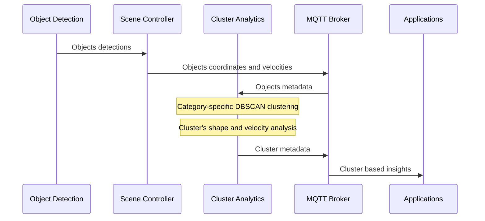

## Data Flow Diagram

```mermaid
sequenceDiagram
    participant OD as Object Detection
    participant SC as Scene Controller
    participant CA as Cluster Analytics
    participant MQTT as MQTT Broker
    participant APP as Applications
    
    OD->>SC: Objects detections
    SC->>MQTT: Objects coordinates and velocities
    MQTT->>CA: Objects metadata
    
    Note over CA: Category-specific DBSCAN clustering
    Note over CA: Cluster's shape and velocity analysis
    
    CA->>MQTT: Cluster metadata
    MQTT->>APP: Cluster based insights
```
