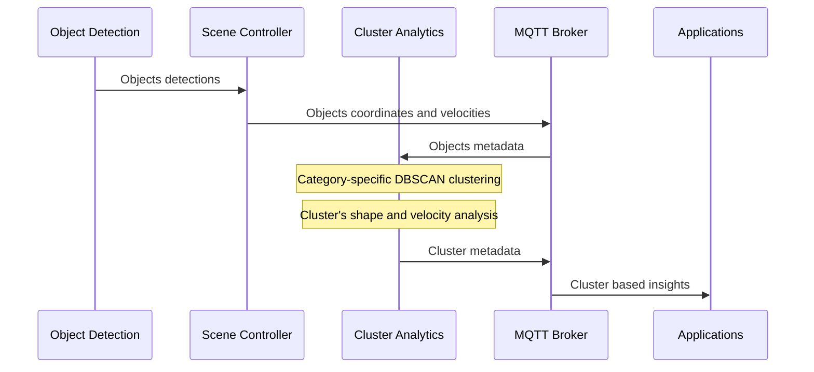
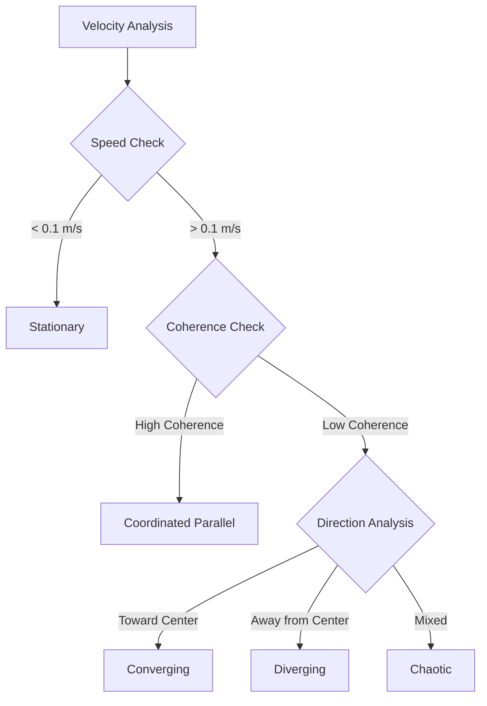
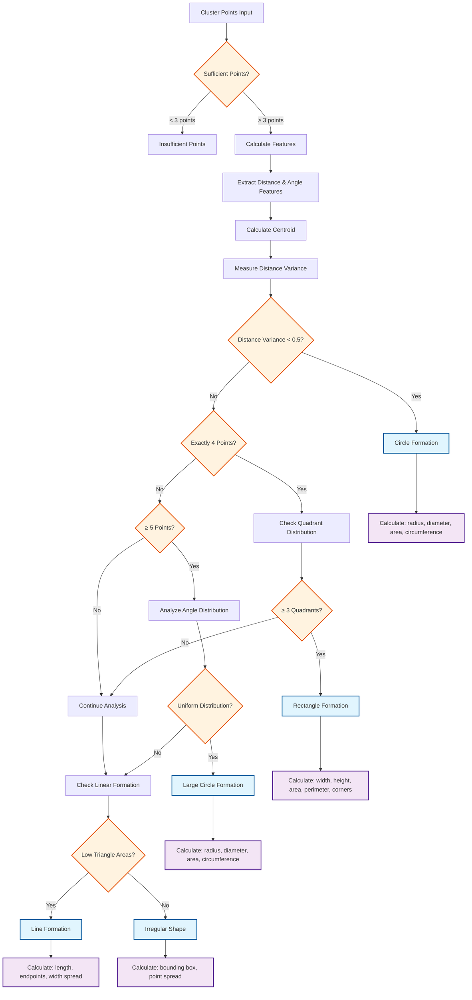

## Data Flow Diagram

```mermaid
sequenceDiagram
    participant OD as Object Detection
    participant SC as Scene Controller
    participant CA as Cluster Analytics
    participant MQTT as MQTT Broker
    participant APP as Applications
    
    OD->>SC: Objects detections
    SC->>MQTT: Objects coordinates and velocities
    MQTT->>CA: Objects metadata
    
    Note over CA: Category-specific DBSCAN clustering
    Note over CA: Cluster's shape and velocity analysis
    
    CA->>MQTT: Cluster metadata
    MQTT->>APP: Cluster based insights
```

## Velocity Analysis

```mermaid
graph TD
    A[Velocity Analysis] --> B{Speed Check}
    B -->|< 0.1 m/s| C[Stationary]
    B -->|> 0.1 m/s| D{Coherence Check}
    D -->|High Coherence| E[Coordinated Parallel]
    D -->|Low Coherence| F{Direction Analysis}
    F -->|Toward Center| G[Converging]
    F -->|Away from Center| H[Diverging]
    F -->|Mixed| I[Chaotic]
```

## Shape Detection

```mermaid
flowchart TD
    A[Cluster Points Input] --> B{Sufficient Points?}
    B -->|< 3 points| C[Insufficient Points]
    B -->|≥ 3 points| D[Calculate Features]
    
    D --> E[Extract Distance & Angle Features]
    E --> F[Calculate Centroid]
    F --> G[Measure Distance Variance]
    
    G --> H{Distance Variance < 0.5?}
    H -->|Yes| I[Circle Formation]
    H -->|No| J{Exactly 4 Points?}
    
    J -->|Yes| K[Check Quadrant Distribution]
    K --> L{≥ 3 Quadrants?}
    L -->|Yes| M[Rectangle Formation]
    L -->|No| N[Continue Analysis]
    
    J -->|No| O{≥ 5 Points?}
    O -->|Yes| P[Analyze Angle Distribution]
    P --> Q{Uniform Distribution?}
    Q -->|Yes| R[Large Circle Formation]
    Q -->|No| S[Check Linear Formation]
    
    S --> T{Low Triangle Areas?}
    T -->|Yes| U[Line Formation]
    T -->|No| V[Irregular Shape]
    
    O -->|No| N
    N --> S
    
    %% Shape calculations
    I --> I1[Calculate: radius, diameter, area, circumference]
    M --> M1[Calculate: width, height, area, perimeter, corners]
    R --> R1[Calculate: radius, diameter, area, circumference]
    U --> U1[Calculate: length, endpoints, width spread]
    V --> V1[Calculate: bounding box, point spread]
    
    %% Styling
    classDef shapeResult fill:#e1f5fe,stroke:#01579b,stroke-width:2px
    classDef calculation fill:#f3e5f5,stroke:#4a148c,stroke-width:2px
    classDef decision fill:#fff3e0,stroke:#e65100,stroke-width:2px
    
    class I,M,R,U,V shapeResult
    class I1,M1,R1,U1,V1 calculation
    class B,H,J,L,O,Q,T decision
```
