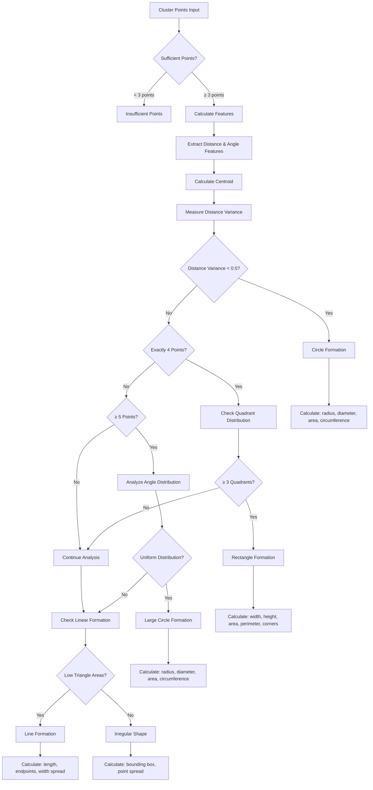
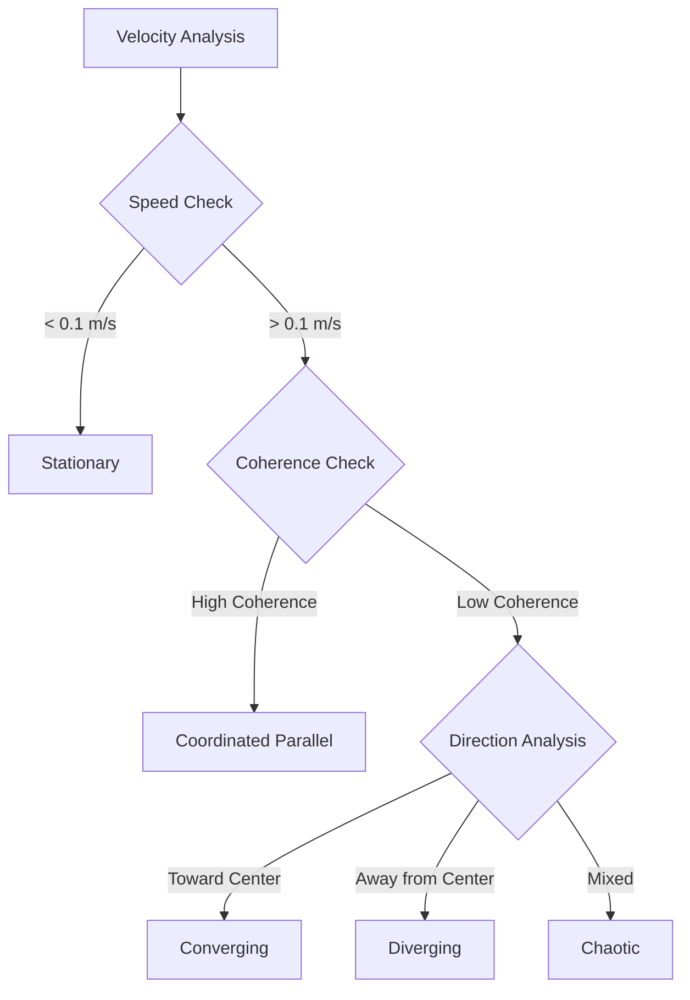
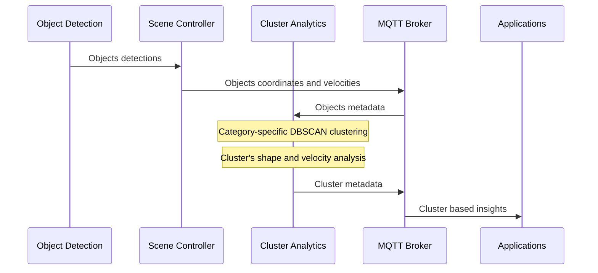

# Cluster Analytics Microservice - Intel® SceneScape

The Cluster Analytics microservice provides advanced object clustering and movement analysis capabilities for Intel® SceneScape using DBSCAN (Density-Based Spatial Clustering of Applications with Noise) algorithm combined with geometric shape detection and velocity pattern classification.

## Overview

This service processes real-time object detection data from SceneScape scenes, applies machine learning-based clustering algorithms, and publishes comprehensive analytics metadata including:

- **Spatial Clustering**: Groups objects by proximity using DBSCAN algorithm
- **Shape Analysis**: Detects geometric patterns (circle, rectangle, line, irregular) with size measurements
- **Velocity Analysis**: Classifies movement patterns and provides velocity statistics
- **Real-time Publishing**: Streams results via MQTT to `ANALYTICS_CLUSTERS` topic

## Features

### 🔍 DBSCAN Clustering

- **Configurable Parameters**:
  - `eps=1.5m` - Maximum distance between objects to be considered in same cluster
  - `min_samples=3` - Minimum objects required to form a cluster
- **World Coordinate System**: Uses translation coordinates for accurate spatial analysis
- **Category-based Clustering**: Analyzes objects grouped by detection category (person, vehicle, etc.)

#### Configuration Parameters

Category-specific DBSCAN parameters are automatically selected based on object type for optimal clustering:

```python
# Category-Specific DBSCAN Parameters
CATEGORY_DBSCAN_PARAMS = {
  'person': {
    'eps': 2.0,        # People clustering distance (social distancing, queues)
    'min_samples': 3   # Minimum 3 people for meaningful cluster
  },
  'vehicle': {
    'eps': 4.0,        # Vehicle clustering distance (parking, traffic)
    'min_samples': 2   # 2 vehicles can form significant cluster
  },
  'bicycle': {
    'eps': 1.5,        # Tight bicycle clustering (bike racks)
    'min_samples': 2   # 2 bicycles form cluster
  },
  'motorcycle': {
    'eps': 2.5,        # Moderate motorcycle clustering
    'min_samples': 2   # 2 motorcycles form cluster
  },
  'truck': {
    'eps': 5.0,        # Large truck clustering distance
    'min_samples': 2   # 2 trucks form significant cluster
  },
  'bus': {
    'eps': 6.0,        # Very large bus clustering distance
    'min_samples': 2   # 2 buses form cluster (bus stops, depots)
  }
}

# Default parameters for unknown categories
DEFAULT_DBSCAN_EPS = 1.5
DEFAULT_DBSCAN_MIN_SAMPLES = 3
```

### 📐 Shape Detection & Analysis

- **ML-based Shape Classification**: Detects geometric patterns using feature extraction
- **Size Calculations**: Provides precise measurements for each detected shape type
- **Supported Shapes**:
  - **Circle**: radius, diameter, area, circumference
  - **Rectangle**: width, height, area, perimeter, corner points
  - **Line**: length, endpoints, width spread
  - **Irregular**: bounding box dimensions, point spread

#### Configuration Parameters

```python
# Shape Detection
SHAPE_VARIANCE_THRESHOLD = 0.5      # Circle vs rectangle classification
```

#### Shape Detection Logic



### 🏃 Velocity Analysis & Movement Patterns

- **Movement Classification**: 6 distinct movement patterns
- **Velocity Statistics**: Comprehensive speed and direction analysis
- **Pattern Types**:
  - `stationary` - Objects with minimal movement
  - `coordinated_parallel` - Synchronized movement in same direction
  - `converging` - Objects moving toward cluster center
  - `diverging` - Objects moving away from cluster center
  - `loosely_coordinated` - Some coordination but not highly synchronized
  - `chaotic` - Random or unpredictable movement patterns

#### Configuration Parameters

```python
# Velocity Analysis
STATIONARY_THRESHOLD = 0.1          # Speed threshold for stationary classification (m/s)
VELOCITY_COHERENCE_THRESHOLD = 0.3  # Threshold for coordinated movement detection
```

#### Velocity Analysis Logic



## 🎯 Category-Specific Clustering

The service automatically optimizes DBSCAN parameters based on object categories, providing more accurate clustering for different object types:

### Benefits

- **Optimized Parameters**: Each object type uses clustering parameters optimized for its spatial characteristics
- **Better Accuracy**: Improved clustering accuracy by considering object-specific grouping behaviors
- **Automatic Selection**: Parameters are automatically selected based on detected object category
- **Fallback Support**: Unknown categories use sensible default parameters

### Category Optimization Examples

| Category  | eps (meters) | min_samples | Rationale                           |
| --------- | ------------ | ----------- | ----------------------------------- |
| `person`  | 2.0          | 3           | Social distancing, queue formations |
| `vehicle` | 4.0          | 2           | Parking lots, traffic clusters      |
| `bicycle` | 1.5          | 2           | Bike racks, tight groupings         |
| `truck`   | 5.0          | 2           | Large vehicle spacing requirements  |
| `bus`     | 6.0          | 2           | Bus stops, depot formations         |

### Usage in Analysis

The service automatically applies appropriate parameters when processing each object category:

```python
# Automatic parameter selection example
for category, objects in objects_by_category.items():
    dbscan_params = self.get_dbscan_params_for_category(category)
    clustering = DBSCAN(eps=dbscan_params['eps'],
                       min_samples=dbscan_params['min_samples'])
```

## MQTT Topics

### Input

- **Topic**: `scenescape/regulated/scene/{scene_id}`
- **Purpose**: Receives object detection data from SceneScape scenes
- **Format**: JSON with objects array containing detection results

### Output

- **Topic**: `scenescape/analytics/clusters/{scene_id}`
- **Purpose**: Publishes cluster analysis metadata
- **QoS**: 1 (at least once delivery)

## Output Data Structure

The Cluster Analytics service publishes detailed cluster metadata in the following JSON format:

```json
{
  "scene_id": "302cf49a-97ec-402d-a324-c5077b280b7b",
  "scene_name": "Queuing",
  "timestamp": "2025-09-26T10:05:37.909Z",
  "cluster_id": 0,
  "category": "person",
  "objects_in_cluster": 3,
  "cluster_center": {
    "x": 1.2745015325143443,
    "y": 4.5255218633986125
  },
  "shape_analysis": {
    "shape": "circle",
    "size": {
      "radius": 0.9358812235818265,
      "diameter": 1.871762447163653,
      "area": 2.751638270346687,
      "circumference": 5.880315153274585
    }
  },
  "velocity_analysis": {
    "movement_type": "chaotic",
    "average_velocity": [0.27474827466685303, -0.44303291002136014, 0.0],
    "velocity_magnitude": 0.5213106308089325,
    "movement_direction_degrees": -58.194747369123355,
    "velocity_coherence": 0.0
  },
  "object_ids": [
    "042ecb96-512b-44c0-8bb3-247a3cf45382",
    "fdd0b2be-cf2a-4b8c-8ea2-89578fbe5a7f",
    "e74563e6-28c3-4393-b8c7-d26f78e54c5b"
  ],
  "dbscan_params": {
    "eps": 2.0,
    "min_samples": 3,
    "category": "person"
  }
}
```

## Field Descriptions

### Core Metadata

| Field                | Type    | Description                                       |
| -------------------- | ------- | ------------------------------------------------- |
| `scene_id`           | String  | Unique identifier for the SceneScape scene        |
| `scene_name`         | String  | Human-readable name of the scene                  |
| `timestamp`          | String  | ISO 8601 timestamp when cluster was detected      |
| `cluster_id`         | Integer | Sequential ID for clusters within the category    |
| `category`           | String  | Object detection category (person, vehicle, etc.) |
| `objects_in_cluster` | Integer | Number of objects forming the cluster             |

### Spatial Information

| Field              | Type  | Description                                          |
| ------------------ | ----- | ---------------------------------------------------- |
| `cluster_center.x` | Float | X coordinate of cluster centroid (world coordinates) |
| `cluster_center.y` | Float | Y coordinate of cluster centroid (world coordinates) |

### Shape Analysis

| Field                  | Type   | Description                                                     |
| ---------------------- | ------ | --------------------------------------------------------------- |
| `shape_analysis.shape` | String | Detected shape type: `circle`, `rectangle`, `line`, `irregular` |
| `shape_analysis.size`  | Object | Shape-specific measurements (varies by shape type)              |

#### Shape-Specific Size Fields

**Circle:**

- `radius` - Circle radius in meters
- `diameter` - Circle diameter in meters
- `area` - Circle area in square meters
- `circumference` - Circle circumference in meters

**Rectangle:**

- `width` - Rectangle width in meters
- `height` - Rectangle height in meters
- `area` - Rectangle area in square meters
- `perimeter` - Rectangle perimeter in meters
- `corner_points` - Array of [x,y] corner coordinates

**Line:**

- `length` - Line length in meters
- `endpoints` - Array of two [x,y] endpoint coordinates
- `width_spread` - Standard deviation of perpendicular distances

**Irregular:**

- `bounding_width` - Bounding box width in meters
- `bounding_height` - Bounding box height in meters
- `bounding_area` - Bounding box area in square meters
- `point_spread` - Standard deviation of distances from centroid

### Velocity Analysis

| Field                        | Type         | Description                                 |
| ---------------------------- | ------------ | ------------------------------------------- |
| `movement_type`              | String       | Classified movement pattern                 |
| `average_velocity`           | Array[Float] | [vx, vy, vz] average velocity vector in m/s |
| `velocity_magnitude`         | Float        | Average speed magnitude in m/s              |
| `movement_direction_degrees` | Float        | Movement direction in degrees (-180 to 180) |
| `velocity_coherence`         | Float        | Movement synchronization measure (0-1)      |

### Movement Pattern Classifications

| Pattern                | Description             | Criteria                                     |
| ---------------------- | ----------------------- | -------------------------------------------- |
| `stationary`           | Minimal movement        | Average speed < 0.1 m/s                      |
| `coordinated_parallel` | Synchronized movement   | Velocity coherence > 0.3                     |
| `converging`           | Moving toward center    | >60% objects moving toward cluster center    |
| `diverging`            | Moving away from center | >60% objects moving away from cluster center |
| `loosely_coordinated`  | Some coordination       | Velocity coherence 0.2-0.3                   |
| `chaotic`              | Random movement         | Low velocity coherence, mixed directions     |

### Administrative Fields

| Field                       | Type          | Description                                             |
| --------------------------- | ------------- | ------------------------------------------------------- |
| `object_ids`                | Array[String] | List of individual object IDs in the cluster            |
| `dbscan_params.eps`         | Float         | DBSCAN epsilon parameter used for this category         |
| `dbscan_params.min_samples` | Integer       | DBSCAN minimum samples parameter used for this category |
| `dbscan_params.category`    | String        | Object category for which parameters were optimized     |

## Usage Examples

### Real-time Monitoring

Subscribe to the ANALYTICS_CLUSTERS topic to receive live cluster updates:

```bash
mosquitto_sub -h broker.scenescape.intel.com -t "scenescape/analytics/clusters/+" -v
```

### Processing Cluster Data

Example Python code to process cluster metadata:

```python
import json
import paho.mqtt.client as mqtt

def on_message(client, userdata, message):
    try:
        cluster_data = json.loads(message.payload.decode())

        scene_name = cluster_data['scene_name']
        category = cluster_data['category']
        object_count = cluster_data['objects_in_cluster']
        movement_type = cluster_data['velocity_analysis']['movement_type']
        shape = cluster_data['shape_analysis']['shape']

        print(f"Scene: {scene_name}")
        print(f"Detected {shape} cluster of {object_count} {category} objects")
        print(f"Movement pattern: {movement_type}")

        if shape == "circle":
            radius = cluster_data['shape_analysis']['size']['radius']
            print(f"Circle radius: {radius:.2f}m")
        elif shape == "rectangle":
            width = cluster_data['shape_analysis']['size']['width']
            height = cluster_data['shape_analysis']['size']['height']
            print(f"Rectangle: {width:.2f}m x {height:.2f}m")

    except Exception as e:
        print(f"Error processing cluster data: {e}")

client = mqtt.Client()
client.on_message = on_message
client.connect("broker.scenescape.intel.com", 1883, 60)
client.subscribe("scenescape/analytics/clusters/+")
client.loop_forever()
```

## Deployment

### Docker Deployment

```bash
# Build the analytics container
docker build -t scenescape-analytics .

# Run with environment variables
docker run -d \
  --name scenescape-analytics \
  -e MQTT_BROKER=broker.scenescape.intel.com \
  -e MQTT_PORT=1883 \
  scenescape-analytics
```

## Architecture

### Data Flow Diagram



## 📊 Optimized Logging

The service uses a two-tier logging approach to balance operational visibility with performance:

### Production Logging (INFO Level)

```bash
INFO : Scene scene_001: Found 2 clusters for category 'person' (8 objects, 1 noise points) using eps=2.0, min_samples=3
INFO : Scene scene_001: Cluster 1 for 'person' - 3 objects, shape: triangle, size: 2.3m
```

### Development Logging (DEBUG Level)

```bash
DEBUG: Published cluster 1 metadata for scene scene_001 category 'person'
DEBUG: Detailed cluster metadata: {
  "scene_id": "scene_001",
  "cluster_id": 1,
  "category": "person",
  "objects_in_cluster": 3,
  "cluster_center": {"x": 10.8, "y": 15.67},
  "shape_analysis": {"type": "triangle", "size": 2.3},
  "dbscan_params": {"eps": 2.0, "min_samples": 3, "category": "person"}
}
```

### Benefits

- **Reduced Log Volume**: Eliminates verbose JSON serialization in production
- **Performance**: Avoids expensive string formatting when not needed
- **Operational**: Clear cluster summaries for monitoring and alerting
- **Debugging**: Full metadata available when debug logging is enabled

## Contributing

When contributing to the Cluster Analytics service:

1. **Algorithm Improvements**: Enhance clustering accuracy or add new shape detection patterns
2. **Performance Optimization**: Optimize processing speed for high-volume scenarios
3. **New Movement Patterns**: Add additional velocity analysis classifications
4. **Testing**: Include unit tests for clustering and shape detection algorithms

## License

This project is licensed under the Apache 2.0 License. See the LICENSE file for details.

---

_Intel® SceneScape Cluster Analytics Microservice - Advanced Object Clustering and Movement Analysis_
