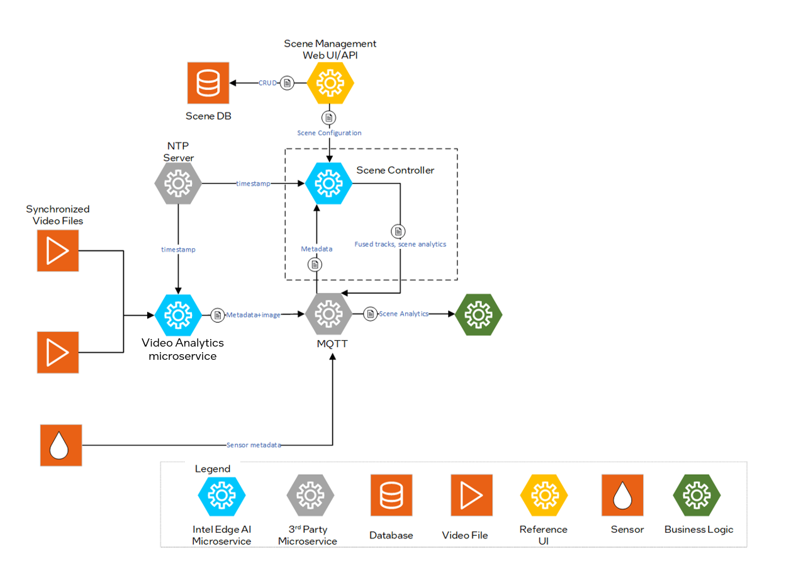
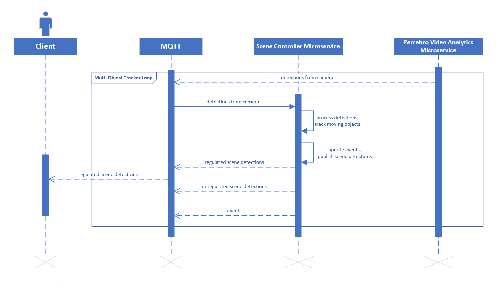

# Scene Controller Microservice

Scene Controller Microservice fuses multimodal sensor data to enable spatial analytics at the edge for multiple use cases.

## Overview

The Scene Controller Microservice answers the fundamental question of `What, When and Where`. It receives object detections from multimodal inputs (primarily multiple cameras), contextualizes them in a common reference frame, fuses them and tracks objects over time.

The Scene Controller's output provides various insights for the tracked objects in a scene, including location, object visibility across cameras, velocity, rotation, center of mass. Additionally, base analytics like regions of interest, tripwires, and sensor regions are supported out of the box to enable developers to build their applications quickly and realize business goals.

To deploy the scene controller service, refer to the [Get started](get-started.md) guide. The service supports configuration through specific arguments and flags, which default to predefined values unless explicitly modified.

### Configurable Arguments and Flags

`--maxlag`: Maximum allowable delay for incoming messages. If a message arrives more than 1 second late, it will be discarded by the Scene Controller. This threshold can be adjusted to accommodate longer inference times, ensuring no messages are discarded. Discarded messages will appear as "FELL BEHINDS" in the service logs.

`--broker`: Hostname or IP of the MQTT broker, optionally with `:port`.

`--brokerauth`: Authentication credentials for the MQTT broker. This can be provided as `user:password` or as a path to a JSON file containing the authentication details.

`--resturl`: Specifies the URL of the REST server used to provide scene configuration details through the REST API.

`--restauth`: Authentication credentials for the REST server. This can be provided as `user:password` or as a path to a JSON file containing the authentication details.

`--rootcert`: Path to the CA (Certificate Authority) certificate used for verifying the authenticity of the server's certificate.

`--cert`: Path to the client certificate file used for secure communication.

`--ntp`: NTP server.

`--tracker_config_file`: Path to the JSON file containing the tracker configuration. This file is used to enable and manage time-based parameters for the tracker.

`--schema_file`: Specifies the path to the JSON file that contains the metadata schema. By default, it uses [metadata.schema.json](../../schema/metadata.schema.json). This schema outlines the structure and format of the messages processed by the service.

`--visibility_topic`: Specifies the topic for publishing visibility information, which includes the visibility of objects in cameras. Options are `unregulated`, `regulated`, or `none`.

### Tracker Configuration

#### Tracker Configuration with Time-Based Parameters

##### Enabling Time-Based Parameters

A `tracker-config.json` file is pre-stored in the `controller` directory. The only change required is to mount this file to the Docker container in the `scene` service. The `scene` service in the `docker-compose.yml` file should look as follows. Note the `configs` section.

```yaml
scene:
    image: scenescape-controller:${VERSION:-latest}
    ...
    # mount the trackerconfig file to the container
    configs:
      - source: tracker-config
        target: /home/scenescape/SceneScape/tracker-config.json
    ...
```

The default content of the `tracker-config.json` file is shown below. It is recommended to keep the default values of these parameters unchanged.

```
{
  "max_unreliable_frames": 10,
  "non_measurement_frames_dynamic": 8,
  "non_measurement_frames_static": 16,
  "baseline_frame_rate": 30,
  "time_chunking_enabled": false
}
```

Here is a brief description of each time-based configuration parameter:

- `max_unreliable_frames`: Defines the number of frames the tracker will wait before publishing a tracked object to the web interface. Expects a positive integer.

- `non_measurement_frames_dynamic`: Defines the number of frames the tracker will wait before deleting a dead tracked object if the object was dynamic (i.e., had non-zero velocity). Expects a positive integer.

- `non_measurement_frames_static`: Defines the number of frames the tracker will wait before deleting a dead tracked object if the object was static (i.e., had zero velocity). Expects a positive integer.

- `baseline_frame_rate`: The frame rate (in FPS) for which the above three parameters are optimized. Expects a positive integer.

##### How Time-Based Parameters Work

Time-based tracker parameters enable automatic adjustment of the following three values as a function of the camera feed frame rate (instead of using fixed values):

- `max_unreliable_frames`

- `non_measurement_frames_dynamic`

- `non_measurement_frames_static`

For instance, if `max_unreliable_frames` is set to a fixed value, the wait time for publishing reliable tracklets will vary with camera FPS. This creates a significant lag between the camera feed and scene updates for low-FPS cameras. When `max_unreliable_frames = 10`, the wait time for a 10 FPS camera is 1 second, compared to 10 seconds for a 1 FPS camera (too long).

When time-based parameters are enabled, these three parameters are scaled as a linear function of the camera FPS:

```
updated max_unreliable_frames = (default max_unreliable_frames / baseline_frame_rate) × incoming camera frame rate
```

The default values of `max_unreliable_frames` and `baseline_frame_rate` are defined in the `tracker-config.json` file. The same applies to the other two parameters.

> **Note**: If the scene contains multiple cameras publishing at different frame rates, the minimum frame rate among all cameras is used for the update.

##### Note on Changing Camera Frame Rate

Restarting the Scene Controller is necessary if one or more camera frame rates are changed after the initial deployment. In these cases, first use `docker compose down` to terminate the current deployment, make the necessary modifications to video sources in the `docker-compose.yml` file, and then relaunch with `docker compose up`.

#### Time-Chunking Configuration

If time-chunking is disabled, the tracker processes each camera frame individually, meaning it processes data at a rate equal to the cumulative camera FPS (frames per second). Cumulative camera FPS is the sum of FPS for all cameras.

Enabling time-chunking changes how the tracker processes input data: the tracker processes data at a constant rate defined by `time_chunking_interval_milliseconds`. Detections from different cameras within the time interval are processed in one chunk. If multiple frames from a single camera fall within the time window, only the latest frame is included in the chunk.

##### When to Use Time-Chunking

Time-chunking should be used to reduce the load on the tracker when high cumulative camera FPS prevents the tracker from processing new detections within the given time budget, effectively causing input data to be dropped. This manifests as `Tracker work queue is not empty` warnings in controller logs. This typically occurs when the number of cameras is high, even if individual camera FPS is at the minimum acceptable level.

If high FPS from individual cameras is causing pressure on the tracker, it is recommended to first reconfigure the cameras to use the lowest acceptable FPS for the use case.

##### Enabling Time-Chunking

In the `configs` section of your `docker-compose.yml`, change the `tracker-config` to point to `controller/config/tracker-config-time-chunking.json`:

```yaml
configs:
  ...
  tracker-config:
    # Use this configuration file to run tracking with time-chunking enabled
    file: ./controller/config/tracker-config-time-chunking.json
    # file: ./controller/config/tracker-config.json
    ...
```

The content of the `tracker-config-time-chunking.json` file is shown below.

```json
{
  "max_unreliable_frames": 5,
  "non_measurement_frames_dynamic": 4,
  "non_measurement_frames_static": 8,
  "baseline_frame_rate": 30,
  "time_chunking_enabled": true,
  "time_chunking_interval_milliseconds": 66
}
```

Here is a brief description of the time-chunking-specific configuration parameters:

- `time_chunking_enabled`: Enables or disables the time-chunking feature. Set to `true` to enable.
- `time_chunking_interval_milliseconds`: Defines the interval in milliseconds at which the tracker processes data in chunks. The effective tracker processing rate is `1000 / time_chunking_interval_milliseconds` Hz. For example, if the interval is 66 ms, the tracker processing rate is 15.15 Hz.

##### How to Set Time-Chunking Interval

The rule of thumb for setting the time-chunking interval is to adjust it to the camera with the highest frame rate: `time_chunking_interval_milliseconds = 1000 / highest_camera_FPS`. This way, no input data will be dropped during time-chunking.

The time-chunking interval may be further increased beyond the recommended value if additional performance improvements are needed. However, in this case, more than one frame from a camera might fall within a time chunk, and the potential accuracy loss caused by dropped frames should be carefully balanced against performance benefits.

##### Adjusting Time-Based Parameters for Time-Chunking

The mechanism of time-based parameters described above still applies when time-chunking is enabled. What may change with time-chunking enabled is the track refresh rate, which is the rate at which a track is updated with new detections. When time-chunking is disabled, each track is refreshed at a rate equal to the cumulative FPS of cameras observing the object. With time-chunking enabled, each track is refreshed at the tracker processing rate, which is `1000 / time_chunking_interval_milliseconds` Hz.

This means that if all cameras use comparable FPS and time-chunking is enabled with the interval set as recommended above, the time-based parameters may need adjustment depending on camera overlap. For example, if most of the scene is covered by two cameras, the track refresh rate may drop by a factor of two after enabling time-chunking. To compensate, the time-based parameters (`max_unreliable_frames`, `non_measurement_frames_dynamic`, `non_measurement_frames_static`) may need to be reduced by a factor of 2. However, it should always be experimentally verified which parameters work best for a given use case.


## Architecture



Figure 1: Architecture Diagram

## Sequence Diagram: Scene Controller Workflow

The Client receives regulated scene detections via MQTT, which are the result of processing and filtering raw detections. The pipeline begins when the Scene Controller Microservice receives detections from the camera. It processes these to track moving objects, then publishes scene detections and events through MQTT. These messages may include both regulated (filtered and formatted) and unregulated (raw) scene detections. A Multi Object Tracker Loop is involved in managing detections within MQTT.



_Figure 2: Scene Controller Sequence diagram_

## Supporting Resources

- [Get Started Guide](get-started.md)
- [API Reference](api-reference.md)
