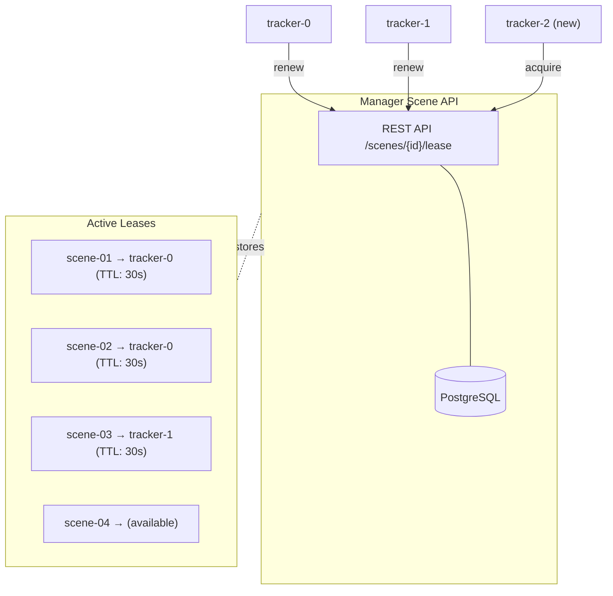

# ADR 8: Tracker Service Horizontal Scaling

- **Author(s)**: [Józef Daniecki](https://github.com/jdanieck)
- **Date**: 2025-12-31
- **Status**: `Proposed`

## Context

The Tracker Service MVP uses **static scene partitioning**: each instance is configured with a fixed set of scene IDs at startup via configuration files. While simple and sufficient for initial deployments, this approach has operational limitations:

- **Manual failover**: When an instance fails, administrators must manually reassign its scenes to other instances
- **Manual scaling**: Adding or removing instances requires configuration changes and restarts across the deployment
- **Configuration management**: Each instance requires unique configuration files mapping scene IDs to that instance
- **Zero-downtime updates**: Rolling updates require careful orchestration to maintain scene coverage

**Industry Context**: Lease-based coordination is a proven pattern for distributed systems. Kubernetes uses [lease objects for leader election](https://kubernetes.io/docs/concepts/architecture/leases/) and [etcd provides TTL-based leases](https://etcd.io/docs/latest/learning/api/#lease-api) for distributed coordination.

## Decision

Implement **lease-based dynamic scaling** where Tracker Service instances automatically acquire and maintain scene assignments through the **Manager Scene API** with TTL-based leases. Manager uses PostgreSQL internally for lease storage, providing a deployment-agnostic solution that works across both Docker Compose and Kubernetes environments.

### Architecture

### Operation

1. **Lease acquisition**: Instance calls `POST /api/v1/scenes/{scene_id}/lease` for available scenes
2. **Heartbeat renewal**: Instance periodically renews via `POST /api/v1/scenes/{scene_id}/lease/renew` (e.g., every 10s with 30s TTL)
3. **Automatic failover**: If heartbeat stops, lease expires after TTL; scene becomes available for other instances
4. **Dynamic load balancing**: New instances query for unleased scenes; existing instances can release via `DELETE /api/v1/scenes/{scene_id}/lease`

### Why Manager Scene API

- **Deployment parity**: Manager exists in both Docker Compose and Kubernetes deployments
- **Leverages existing infrastructure**: Extends Manager's PostgreSQL without additional dependencies
- **Consistent interface**: Tracker already interacts with Manager for scene configuration

## Alternatives Considered

### Static Scene Partitioning (Current MVP)

Fixed scene IDs configured per instance at startup.

**Pros**: Simple, no external dependencies, no coordination overhead  
**Cons**: Manual failover, scaling requires restarts, no automatic load balancing

**Decision**: Remains the MVP approach; lease-based scaling is a post-MVP enhancement.

### Central Coordinator Service

Dedicated service that monitors instance health and assigns scenes.

**Pros**: Centralized decision-making, sophisticated load balancing  
**Cons**: Additional service to maintain, single point of failure, more complex

**Decision**: Rejected in favor of distributed lease-based approach.

## Consequences

### Positive

- **Automatic failover**: Failed instances' scenes redistributed within TTL period (30-60s)
- **Elastic scaling**: Add/remove instances without configuration changes
- **Improved availability**: Graceful lease release enables zero-downtime deployments
- **Simplified operations**: No per-instance configuration files needed

### Negative

- **Manager API dependency**: Requires Manager availability for lease operations
- **Tracking state loss**: Scene ownership transfer resets tracking state (track IDs reassigned)
- **Network partition risk**: Isolated instance may continue after lease expiry (requires fencing tokens)
- **Complexity**: More moving parts than static partitioning

## Implementation Notes

- **Lease TTL**: Recommend 30s TTL with 10s renewal (3× safety margin)
- **Fencing tokens**: Manager provides monotonic `lease_version` to prevent split-brain; downstream consumers reject stale versions
- **Graceful handoff**: Instance enters drain period before releasing lease to minimize state loss

## References

- [ADR-0007: Tracker Service](./0007-tracker-service.md)
- [Tracker Service Design Document](../design/tracker-service.md)
- [How to do distributed locking](https://martin.kleppmann.com/2016/02/08/how-to-do-distributed-locking.html) - Martin Kleppmann
- [Kubernetes Leases](https://kubernetes.io/docs/concepts/architecture/leases/)
