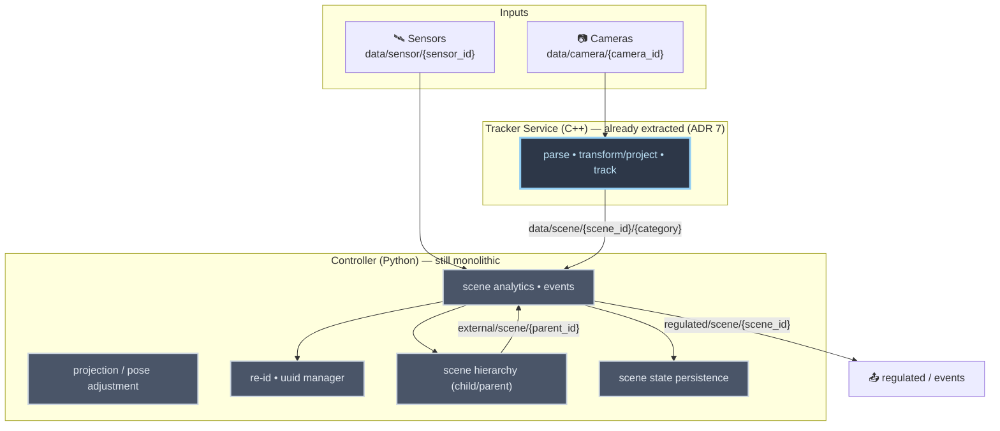
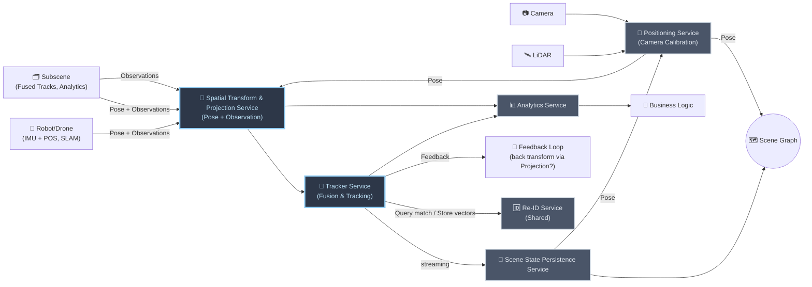

<!--
SPDX-FileCopyrightText: (C) 2026 Intel Corporation
SPDX-License-Identifier: Apache-2.0
-->

# ADR 13: Controller Breakdown into Functionality-Aligned Microservices

- **Author(s)**: [Tomasz Dorau](https://github.com/tdorauintc), [Sarat Poluri](https://github.com/saratpoluri), [Lukasz Talarczyk](https://github.com/ltalarcz), [Rob Watts](https://github.com/rawatts10)
- **Date**: 2026-06-11
- **Status**: `Proposed`

## TLDR

The Scene Controller still bundles several distinct responsibilities — spatial
transform/projection, multi-object tracking, scene analytics, re-identification,
hierarchy aggregation, and scene state persistence — into one deployable unit.
The first step of decomposition, extracting the **Tracker Service** (ADR 7),
proved the model works. This ADR proposes completing the breakdown by carving
the remaining functionalities into independent, self-contained microservices
that communicate over well-defined interfaces (gRPC for synchronous,
latency-sensitive paths; MQTT for asynchronous streaming). The goal is
independent evolution, scaling, and testability per functionality, a clean
recursive scene hierarchy, and support for emerging inputs (moving cameras,
SLAM-localized robots/drones, LiDAR). The proposed target is **full
microservice separation**; projection's inter-service latency is called out as
an explicit risk to be measured, not a blocker.

## Context

### Where we are today

SceneScape began as a single monolithic **Controller** that performed
projection, tracking, analytics, event detection, and persistence in one
Python process (calling C++ via pybind11 for hot paths). ADR 7
([Tracker Service](./0007-tracker-service.md)) took the first decomposition
step: it extracted real-time multi-object tracking into a dedicated pure-C++
**Tracker Service**, leaving the remaining responsibilities in the Controller
(now effectively an analytics-and-everything-else service).

That first split validated the approach — a functionality with distinct
performance characteristics and a well-defined input/output contract can be
cleanly separated and scaled on its own. The Controller, however, still hosts a
heterogeneous mix of concerns that have little in common beyond historical
co-location.

### Responsibilities still bundled in the Controller

The current Controller couples functionalities with very different runtime
profiles, languages of choice, scaling needs, and rates of change:

- **Spatial transform & projection** — 2D camera detections into the shared 3D
  coordinate system, surface placement, raycasting, depth-inaccuracy
  correction, and object-type-specific heuristics (see
  [`pose_adjustment/`](../../controller/src/controller/pose_adjustment)).
- **Multi-object tracking (MOT)** — already extracted to the Tracker Service
  (see [`tracking.py`](../../controller/src/controller/tracking.py),
  [`ilabs_tracking.py`](../../controller/src/controller/ilabs_tracking.py) for
  the legacy in-Controller path).
- **Scene analytics & events** — regions, tripwires, sensor attribute fusion,
  sub-detection projection, and camera visibility
  (see [`scene_controller.py`](../../controller/src/controller/scene_controller.py)).
- **Re-identification (Re-ID)** — embedding storage, query/match, and global ID
  assignment (see [`reid.py`](../../controller/src/controller/reid.py),
  [`uuid_manager.py`](../../controller/src/controller/uuid_manager.py),
  [`vdms_adapter.py`](../../controller/src/controller/vdms_adapter.py)).
- **Scene hierarchy** — aggregating child ("sub-scene") results into parent
  scenes (see
  [`child_scene_controller.py`](../../controller/src/controller/child_scene_controller.py)).
- **Scene state persistence** — maintaining and exposing current scene state.

### Why break it down further

- **Mixed critical paths.** Latency-critical projection/tracking is interleaved
  with non-real-time analytics and persistence, so one cannot scale or be
  tuned without affecting the others.
- **Independent evolution.** Projection is growing substantially more complex
  with moving cameras (body-worn, drones), SLAM-localized robots, probabilistic
  placement with error bars, and object-type-specific projection (flying vs.
  ground). This logic should evolve on its own cadence, not gated by the
  Controller release.
- **New input modalities.** LiDAR and other 3D sensors, plus pose feeds from
  IMU/SLAM, require a clean separation between *positioning* (calibration →
  pose) and *transform/projection* (pose + observation → world coordinates).
- **Well-defined contracts.** Once projection is its own service, the Tracker's
  input becomes a clean stream of observations already in the shared coordinate
  system — a precise, testable contract.
- **Recursive hierarchy.** Sub-scenes should feed parents through the same
  interfaces a scene exposes to its sources, so hierarchy is naturally
  recursive rather than special-cased.
- **Shared services.** Re-ID is consumed across scenes and should be a shared
  service rather than embedded per Controller instance.
- **Independent testability and fault isolation.** Each functionality can be
  validated, deployed, and fail independently.

### Current data flow

> Note: projection currently runs inside the Tracker path; the diagram groups
> the remaining Controller responsibilities to show what this ADR proposes to
> separate.

## Decision

Complete the decomposition of the Controller into **independent, self-contained
microservices**, each aligned to a single functionality and communicating over
explicit interfaces. We adopt **full microservice separation** as the target
(not a single-process, library-only split), while sequencing the work in phases
(see [Phased Implementation Plan](#phased-implementation-plan)) so that each
service is delivered and validated incrementally on top of the already-extracted
Tracker Service.

Interfaces follow the workload:

- **gRPC** for synchronous, latency-sensitive, query/response paths
  (positioning lookups, projection, Re-ID match/store).
- **MQTT** for asynchronous, fan-out streaming (observations, scene tracks,
  regulated output, events).

### Target architecture

> Terminology: this ADR uses the names from the target diagram above. They map
> to the [`controller-breakdown.mm.md`](./controller-breakdown.mm.md) markmap as
> follows — *Spatial Transform & Projection Service* = "Projection"; *Tracker
> Service* = "MOT Tracking"; *Analytics Service* = "Scene Analytics"; *Re-ID
> Service* = "UUID Manager + ReID"; the *Subscene* edges = "Scene Hierarchy".
> *Positioning Service*, *Scene State Persistence Service*, and the *Scene Graph*
> are introduced here as first-class elements.

### Services and responsibilities

#### Positioning Service

- **Role**: derive the **pose** (extrinsics/intrinsics) of sensors and platforms
  from calibration and localization inputs; the single source of truth for "where
  is this sensor/observer in the shared coordinate system."
- **Inputs**: camera/LiDAR calibration data; pose feedback from persisted scene
  state.
- **Outputs**: pose to the Spatial Transform & Projection Service and to the
  Scene Graph.
- **Communication**: gRPC (query/response) for pose lookups; configuration via
  the management layer.
- **Technology**: Python (calibration tooling already lives in
  `autocalibration/`); performance-critical math in C++ where needed.

#### Spatial Transform & Projection Service

- **Role**: turn observations into the shared 3D coordinate system using pose —
  surface placement, raycasting, depth-inaccuracy correction, and object-type
  heuristics (flying vs. ground). Produces a clean stream of world-space
  observations.
- **Inputs**: observations from cameras (via positioning), robots/drones
  (pose + observations), and sub-scenes; pose from the Positioning Service.
- **Outputs**: world-space observations to the Tracker Service and the Analytics
  Service.
- **Communication**: gRPC for the synchronous transform path (co-locatable with
  the Tracker to minimize latency); MQTT where async fan-out is acceptable.
- **Technology**: C++ for the hot path, mirroring the Tracker's data-oriented
  design.

#### Tracker Service (already extracted — ADR 7)

- **Role**: real-time multi-object fusion and tracking in 3D, producing reliable
  tracks with scene-local IDs.
- **Inputs**: world-space observations from the Spatial Transform & Projection
  Service.
- **Outputs**: streaming tracks to the Scene State Persistence Service and the
  Analytics Service; Re-ID match/store calls; optional feedback to projection.
- **Communication**: MQTT for track streams; gRPC for Re-ID queries.
- **Technology**: pure C++, data-oriented design (see
  [ADR 7](./0007-tracker-service.md),
  [ADR 8](./0008-tracker-service-horizontal-scaling.md)).

#### Re-ID Service (shared)

- **Role**: store embedding vectors, answer match queries, and assign/maintain
  global identities across scenes and over time.
- **Inputs**: query/store calls carrying embeddings and track context.
- **Outputs**: matched global identity / similarity results.
- **Communication**: gRPC synchronous query/response; shared across scenes and
  hierarchy levels.
- **Technology**: Python service over a vector store (see
  [ADR 10](./0010-reid-metadata-storage-architecture.md),
  [ADR 11](./0011-inner-product-reid-state-and-id-lineage.md)).

#### Scene State Persistence Service

- **Role**: maintain authoritative current scene state from the Tracker stream;
  expose it to the Scene Graph and feed pose back to the Positioning Service.
- **Inputs**: streaming tracks from the Tracker Service.
- **Outputs**: state to the Scene Graph; pose feedback to Positioning.
- **Communication**: MQTT ingest; gRPC/REST for state queries.
- **Technology**: Python.

#### Scene Graph

- **Role**: the shared, queryable representation of scenes, their relationships
  (parent/child), coordinate systems, and current state — the recursive backbone
  that lets a sub-scene present itself to a parent exactly as any source presents
  to a scene.
- **Inputs**: pose from Positioning; state from Persistence.
- **Communication**: query interface (gRPC/REST).

#### Analytics Service

- **Role**: scene analytics and events — regions, tripwires, sensor-attribute
  fusion, sub-detection projection, camera visibility — built on top of tracks
  and world-space observations. Accepts inputs from sources other than the
  Tracker (e.g., tracker-less deployments).
- **Inputs**: tracks from the Tracker Service; world-space observations from the
  Spatial Transform & Projection Service; sensor data; sub-scene results.
- **Outputs**: `regulated/scene/{scene_id}` and `events/+`; downstream Business
  Logic.
- **Communication**: MQTT.
- **Technology**: Python (with C++ for the most compute-expensive functions).

#### Clustering (existing service)

- Cluster analytics remains an independent downstream service
  ([ADR 4](./0004-cluster-analytics-service.md)) consuming `regulated/scene`
  output. It is unchanged by this ADR and listed for completeness.

#### Subscene

- **Role**: a child scene that contributes its fused tracks and analytics to a
  parent scene. A subscene is not a distinct service type — it is an instance of
  the full pipeline (its own Spatial Transform & Projection, Tracker, Analytics)
  whose output is presented to a parent as just another source. This is what
  makes the hierarchy recursive (see
  [Recursive hierarchy via sub-scenes](#recursive-hierarchy-via-sub-scenes)).
- **Inputs**: its own sources (cameras, sensors, robots/drones, and possibly its
  own subscenes).
- **Outputs**: pose + observations (fused tracks and analytics, already in the
  child coordinate system) to the parent's Spatial Transform & Projection
  Service, carrying the global identities assigned by the shared Re-ID Service.
- **Communication**: MQTT for streaming fused tracks/analytics upward
  (`external/scene/{parent_id}`); the parent treats it like any other
  observation source.
- **Technology**: same stack as a primary scene — a subscene *is* a scene.

### Recursive hierarchy via sub-scenes

A **sub-scene** presents its fused tracks and analytics to a parent through the
same interfaces a scene exposes to its sources (pose + observations). Hierarchy
is therefore *recursive by construction* rather than a special-cased path, and
the fused tracks and events flowing upward carry global identities assigned by
the shared Re-ID Service so that IDs persist up the hierarchy without
reassignment.

### Design principles

- **Separation of concerns**: each service owns one functionality and a clean
  contract; services are unaware of hierarchy specifics.
- **Recursive design**: parents and children speak the same interface; no
  special hierarchy plumbing.
- **Performance first**: service boundaries must not degrade real-time
  performance — co-locate latency-critical services and choose gRPC/MQTT per
  workload; measure before committing (see
  [Open Questions](#open-questions)).
- **Well-defined contracts**: positioning emits pose, projection emits
  world-space observations, the Tracker emits tracks — each independently
  testable.
- **Shared, not duplicated**: cross-scene capabilities (Re-ID, Scene Graph) are
  shared services rather than per-instance copies.

## Alternatives Considered

### 1. Keep the monolithic Controller (do nothing further)

- **Pros**: no migration effort; single deployment; no inter-service latency.
- **Cons**: latency-critical and non-critical paths stay coupled; projection
  cannot evolve independently for moving cameras/SLAM/LiDAR; hierarchy and Re-ID
  remain special-cased and per-instance; scaling one concern means scaling all.
  Does not address the drivers in [Context](#context).

### 2. Optimize the monolith in place (better threading/processes, no split)

- **Pros**: smaller change; reuses existing code paths.
- **Cons**: cannot give each functionality its own language, scaling unit, and
  release cadence; the Python orchestration layer still couples projection,
  analytics, and persistence; does not produce the clean, independently testable
  contracts the breakdown is meant to deliver.

### 3. Library-first split within a single process (defer microservices)

Keep the functionalities as separate libraries linked into one (or few)
processes, with the *option* to extract them into gRPC microservices later.

- **Pros**: avoids serialization/deserialization and network overhead initially
  (relevant for the latency-critical projection → tracking path); easier initial
  deployment.
- **Cons**: defers the separation-of-concerns and independent-scaling benefits;
  in practice shared-process coupling tends to leak (shared state, global
  config, build/release entanglement), making the eventual extraction harder.
- **Why rejected**: this ADR targets **full microservice separation** for the
  long-term architecture. The latency concern is real but bounded — prior
  benchmarking showed Protobuf over the wire improving latency by ~43% to below
  1 ms for the Tracker PoC ([PR #636][pr636]) — and is handled by *co-locating*
  latency-critical services and choosing gRPC vs. MQTT per path, plus measuring
  before committing (tracked in [Open Questions](#open-questions)), rather than
  by collapsing them into one process.

### 4. Extend the existing Cluster Analytics service to host scene analytics

- **Pros**: reuses an already-separate downstream service.
- **Cons**: conflates density-based clustering (a downstream consumer of
  regulated output) with core scene analytics/events, which have different
  inputs, latency profiles, and ownership.
- **Why rejected**: scene analytics is its own functionality with its own
  contract; clustering remains a distinct downstream service
  ([ADR 4](./0004-cluster-analytics-service.md)).

## Consequences

### Positive

- **Independent evolution**: projection, positioning, analytics, Re-ID, and
  persistence each move on their own cadence; projection can grow toward moving
  cameras/SLAM/LiDAR without gating the rest.
- **Independent scaling and fault isolation**: each functionality scales to its
  own bottleneck and fails in isolation.
- **Clean, testable contracts**: pose, world-space observations, tracks, and
  regulated output are explicit interfaces that can be validated in isolation.
- **Recursive hierarchy**: sub-scenes reuse the same interfaces as primary
  sources, removing special-cased hierarchy code.
- **Shared cross-scene services**: a single Re-ID Service and Scene Graph avoid
  per-instance duplication and keep global identities consistent up the
  hierarchy.
- **New modalities**: a dedicated Positioning Service gives LiDAR, robots, and
  drones a clean path into the shared coordinate system.

### Negative

- **More services to deploy and operate**: more images, configuration,
  inter-service auth/certs, and observability surface.
- **Inter-service latency**: the projection → tracking path is latency-critical;
  splitting it across a boundary adds serialization/transport cost that must be
  measured and mitigated (co-location, gRPC) — see
  [Open Questions](#open-questions).
- **Cross-service debugging complexity**: tracing a single detection now spans
  multiple services; requires solid distributed tracing
  ([ADR 2](./0002-controller-otel.md)).
- **Migration effort**: phased extraction and dual-running during transition add
  temporary complexity (see
  [Phased Implementation Plan](#phased-implementation-plan)).
- **Shared-service availability**: Re-ID, Scene Graph, and Positioning become
  cross-cutting dependencies whose availability affects multiple scenes.

## Open Questions

These are tracked as risks/decisions to resolve during the phased rollout; they
do not block adopting the target architecture.

- **Projection inter-service latency (risk)**: the Spatial Transform &
  Projection → Tracker path is latency-critical. Splitting it across a service
  boundary must be benchmarked (gRPC vs. MQTT, serialization cost, co-located vs.
  networked) before the boundary is finalized. Prior work measured Protobuf at
  ~43% latency improvement to below 1 ms for the Tracker PoC ([PR #636][pr636]);
  this needs to be re-validated end-to-end for projection. Mitigation if needed:
  co-locate projection with the Tracker, or fall back to a shared-process
  library boundary for this hop only.
- **Hierarchy ↔ projection integration**: hierarchy and projection both perform
  coordinate transforms; whether (and how) to unify them, and whether the
  Feedback Loop ("back transform via projection") should reuse the same service,
  is open.
- **Feedback Loop semantics**: the Tracker → projection feedback edge is
  proposed, not committed. Its purpose (e.g., refining placement priors,
  back-projecting tracks to camera space) and contract need definition before it
  becomes a phase deliverable.
- **Retracking redesign**: how parents handle child tracks — trust child tracks
  vs. retrack — including deduplication of overlapping child coverage and
  ensuring the first-assigned global UUID persists up the hierarchy. Current
  retracking causes unnecessary ID reassignment and mishandles active trackers
  (e.g., UWB); a decision may need to be object-type-based rather than
  scene-based.
- **Scene Graph ownership and consistency**: who owns the authoritative Scene
  Graph, its consistency model across distributed services, and how pose updates
  from Persistence reconcile with Positioning.
- **Temporal fidelity control**: how a parent scene controls the data/update
  rate it receives from children.
- **Time synchronization**: whether services synchronize timestamps internally
  against NTP, or rely on system-level clock synchronization (shifting
  responsibility to the deployment). System-clock NTP simplifies the pipeline
  and may reduce latency.
- **Semantic clustering**: how to meaningfully group different object types,
  and the interface between analytics and the clustering service for it.
- **Transport selection per hop**: final gRPC-vs-MQTT choice for each interface,
  driven by the latency benchmarks above and MQTT throughput limits.

## Appendix

### Phased Implementation Plan

The breakdown is incremental and builds on the already-extracted Tracker
Service. Each phase delivers an independently deployable, validated service
while the legacy Controller continues to run behind feature flags until its
responsibilities are fully migrated.

**Phase 0 — Tracker Service (done)**

- Real-time MOT extracted to a pure-C++ service
  ([ADR 7](./0007-tracker-service.md),
  [ADR 8](./0008-tracker-service-horizontal-scaling.md)).

**Phase 1 — Spatial Transform & Projection Service**

- Extract projection/pose-adjustment into its own service with a clean
  world-space-observation output contract.
- Benchmark the projection → Tracker boundary (gRPC vs. MQTT, co-located vs.
  networked) and decide the transport for this hop.

**Phase 2 — Analytics Service**

- Refactor the remaining Controller analytics/events into a standalone Analytics
  Service consuming tracks and world-space observations; support tracker-less
  inputs.

**Phase 3 — Re-ID Service and Scene State Persistence Service**

- Promote Re-ID to a shared cross-scene service
  ([ADR 10](./0010-reid-metadata-storage-architecture.md),
  [ADR 11](./0011-inner-product-reid-state-and-id-lineage.md)).
- Extract scene state persistence with state-query and pose-feedback interfaces.

**Phase 4 — Positioning Service and Scene Graph**

- Stand up the Positioning Service (calibration → pose) and the shared Scene
  Graph; route pose to projection and the Scene Graph; add LiDAR/robot/drone
  inputs.
- Implement recursive sub-scene hierarchy over the shared interfaces.

**Phase 5 — Feedback Loop and monolith retirement**

- Resolve the Feedback Loop design (if adopted) and implement it.
- Retire the legacy Controller once all responsibilities are migrated and
  validated.
