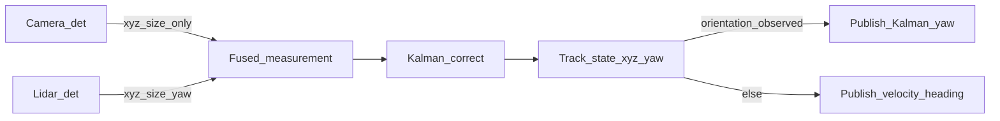

<!-- SPDX-FileCopyrightText: (C) 2026 Intel Corporation -->
<!-- SPDX-License-Identifier: Apache-2.0 -->

# ADR 17: Selective Yaw Observation for Multi-Sensor Track Fusion

- **Author(s)**: Sarat Poluri
- **Date**: 2026-09-06
- **Status**: `Proposed`
- **Related**: [ADR 7 — Tracker Service](./0007-tracker-service.md) (RobotVision MOT remains the association/filter core)

## TLDR

Treat track kinematics as **(x, y, z, yaw)** with **selective yaw observations**. Orienting sensors (e.g. LiDAR 3D boxes) update Kalman yaw; non-orienting sensors (e.g. monocular cameras) update position/size only and let yaw **predict**. Velocity-inferred heading remains a first-class **published** orientation when no measured yaw exists, but is never injected as a Kalman yaw measurement. Pitch/roll stay out of the filter until sensors measure them.

## Context

Scene Controller fusion (Intel Labs / RobotVision `MultipleObjectTracker`) associates detections from multiple sensors onto one track and corrects a UKF whose measurement vector already includes yaw. That design assumed **2D camera** detections:

- Association (Mahalanobis) always zeroed the yaw residual (“2D detectors cannot detect orientation”).
- Batched multi-camera fuse took the **last matched sensor’s full state**, including yaw.
- Publish logic keyed only off the **linked** detection’s `has_detection_rotation`, then often called `inferRotationFromVelocity()`.

LiDAR (and other 3D detectors) publish a real object quaternion. Under the old path:

1. A camera “last match” could write **yaw ≈ 0** into the Kalman correct and yank orientation.
2. Measured LiDAR yaw could be discarded on publish in favor of velocity heading for a camera-linked frame.
3. Cam@t then LiDAR@t+1 was not a smooth predict→correct on yaw.

We need camera↔LiDAR co-observation without orientation flicker, without expanding to full SO(3) attitude filtering that current detectors (PointPillars yaw-only, cameras with no attitude) cannot support.

## Decision

### Track state and observation model

- Keep the existing 7D measurement model **(x, y, z, length, width, height, yaw)**.
- Do **not** add pitch/roll Kalman states in this decision.
- Mark measurements with attribute `has_orientation=true` when the SceneScape detection carried detector `rotation` (`MovingObject.has_detection_rotation`).
- On Kalman **correct**:
  - If `has_orientation`: unwrap and correct yaw as today (`deltaTheta`).
  - Else: set measurement yaw to the **predicted** yaw (zero yaw innovation) so position/size still update.

### Multi-sensor fuse in one time chunk

- Keep last-match (or existing policy) for **position and size**.
- For **yaw**: if any matched detection in the chunk has `has_orientation`, prefer that yaw (highest classification confidence; later camera index breaks ties) and set fused `has_orientation`.
- Sticky track attribute `orientation_observed=true` after any orienting correct (and at track create when the seed detection is orienting).

### Association

- Euclidean association unchanged (demo default).
- Mahalanobis uses the yaw residual **only** when the measurement has `has_orientation` **and** the track has `orientation_observed` (or current `has_orientation`). Otherwise zero yaw innovation as before.

### Publish path

| Track condition | Published orientation |
| --- | --- |
| Linked detection has detector rotation and \|velocity heading − Kalman yaw\| ≤ ~90° | Kalman-filtered yaw → quaternion |
| Linked detection has detector rotation and velocity heading disagrees by more than ~90° while speed ≥ 1 m/s | **Publish velocity heading** (guards PointPillars flips / bad association on curves) |
| `orientation_observed` / `has_orientation`, linked detection **non-orienting**, and \|velocity heading − Kalman yaw\| ≤ ~0.6 rad (while moving) | Kalman-filtered yaw → quaternion |
| `orientation_observed` / `has_orientation`, linked detection **non-orienting**, and velocity heading disagrees beyond ~0.6 rad while speed ≥ 1 m/s | **Publish velocity heading** (does not write back into Kalman) |
| Otherwise | Velocity-inferred heading with existing speed hysteresis |

**Locked rule for velocity heading:** it is a legitimate published orientation for camera-only periods (hysteresis filters flicker), but it is **derived from the same filter’s velocity**. Feeding it back into `correct()` would double-count. CTRV integrates attitude yaw with yaw-rate in the **process** model; when yaw-rate was never observed (brief LiDAR then a camera-driven curve), the publish disagreement rule above covers the visual lag.

## Alternatives Considered

- **Full xyz + roll/pitch/yaw Kalman** — Rejected for now. PointPillars and camera pipelines do not provide independent pitch/roll; motion models are planar (CV/CA/CTRV). Unused attitude DOFs would absorb noise without observability.
- **Last-sensor-wins for all kinematics (status quo)** — Rejected. Breaks LiDAR orientation whenever a non-orienting sensor is last in the batch.
- **Always publish velocity heading; ignore detector yaw on output** — Rejected. Sensor-measured orientation is more trustworthy than derived heading when available.
- **Inject velocity heading as a soft yaw measurement (large R)** — Rejected. Circular with the velocity state; hysteresis does not make it an independent observation.
- **Separate tracks for camera vs LiDAR** — Rejected for this goal; fusion of identity and XY motion remains desirable.

## Consequences

### Positive

- Camera updates no longer pull fused-track yaw to identity.
- LiDAR (or any orienting sensor) provides smooth yaw corrects after camera-only predicts.
- Publish path prefers measured/Kalman yaw at track level, not only when the linked MQTT message happened to be LiDAR.
- Fits existing UKF measurement size (no model dimension change).

### Negative / limitations

- Position/size fusion policy remains last-match; only yaw is preferential among orienting sensors.
- Tracks that never see an orienting sensor still rely on velocity heading (and hysteresis thresholds).
- Pitch/roll remain display/default constants until a future ADR if 6-DOF measurements appear.
- Sticky `orientation_observed` does not currently expire; a long camera-only gap after LiDAR still prefers Kalman yaw unless velocity heading disagrees while moving (publish fallback).

## Implementation notes

- C++: `OrientationAttributes.hpp`, selective correct in `MultiModelKalmanEstimator`, `applyOrientingYaw` in `MultipleObjectTracker`, conditional Mahalanobis yaw in `ObjectMatching`.
- Python: `IntelLabsTracking.to_rv_object` / `from_tracked_object` in `controller/ilabs_tracking.py`.
- Tests: `OrientationFusionTests.cpp`, `tests/sscape_tests/scenescape/test_ilabs_tracking.py`.

## References

- RobotVision MOT: `controller/src/robot_vision/`
- LiDAR intersection demo publisher: `sample_data/lidar_intersection/lidar_publisher.py`
- Velocity heading hysteresis: `controller/src/controller/moving_object.py` (`inferRotationFromVelocity`)
