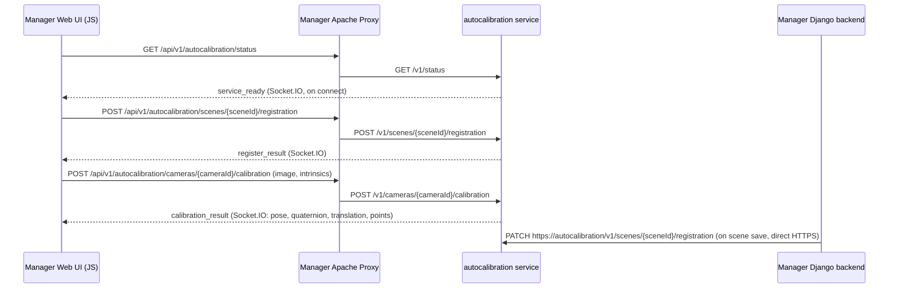

<!--
SPDX-FileCopyrightText: (C) 2026 Intel Corporation
SPDX-License-Identifier: Apache-2.0
-->

# Auto Camera Calibration API — Analysis Summary

This document summarizes the Auto Camera Calibration (`autocalibration`) service REST/WebSocket API,
the end-to-end calibration flow, and how other Scenescape services (primarily `manager`) consume it.

## 1. Service API Surface

Implemented in [autocalibration/src/auto_camera_calibration_api.py](../../autocalibration/src/auto_camera_calibration_api.py).

- Flask app + `flask_socketio.SocketIO`, mounted under prefix `/v1`.
- Served over **mandatory TLS** on port `8443` (`CameraCalibrationApi.start()` requires `ssl_cert`/`ssl_key`).
- All input (`sceneId`, `cameraId`, image payloads, intrinsics) is validated (`_validate_id`, `_validate_image_data`, `_validate_intrinsics`) with strict size/format limits (25 MB max request, 20 MB max image, base64 + magic-byte signature check).

### REST endpoints

| Method | Path | Purpose |
|---|---|---|
| GET | `/v1/status` | Service liveness/version (`running`/`error`, `API_VERSION`). |
| POST | `/v1/scenes/{sceneId}/registration` | Trigger scene registration (map processing) for calibration. Returns `registering`/`busy`/`success`/`error`. |
| GET | `/v1/scenes/{sceneId}/registration` | Poll scene registration status. |
| PATCH | `/v1/scenes/{sceneId}/registration` | Notify the service a scene map changed; triggers re-registration if needed. |
| POST | `/v1/cameras/{cameraId}/calibration` | Start calibration for a camera; body: base64 `image` + optional `intrinsics` (3x3). Runs async via `calibrate_camera_thread_wrapper`. |
| GET | `/v1/cameras/{cameraId}/calibration` | Poll calibration status/result (`not_started`/`calibrating`/`busy`/`success`/`error`), returns `pose`, `quaternion`, `translation`, `calibration_points_3d/2d` on success. |

Manual-calibration scenes (`scene.camera_calibration == "Manual"`) are rejected (400) for registration/status/calibration operations (`ManualCalibrationError`).

### WebSocket (Socket.IO) events

Path: `/v1/socket.io/`.

- Server → client: `service_ready` (on connect, includes status/version), `register_result` (emitted from `auto_camera_calibration_controller.py` after scene registration completes, keyed by `socket_scene_clients`), `calibration_result` (emitted from `auto_camera_calibration_context.py` after camera calibration completes, keyed by `socket_clients`).
- Client → server: `register_camera` (associates a `camera_id` with the socket session id), `register_scene` (associates a `scene_id` with the socket session id), `disconnect` (server cleans up `socket_clients` entry).

This lets the browser receive asynchronous calibration/registration results without polling, while the POST endpoints remain the trigger mechanism.

## 2. Entry Points & Request-Handling Internals

### a. `register_scene(sceneId)` — `POST /v1/scenes/{sceneId}/registration`

[auto_camera_calibration_api.py](../../autocalibration/src/auto_camera_calibration_api.py#L400):

1. `_get_scene(sceneId)` resolves the scene (see "Scene model acquisition" below) and `_validate_scene_for_operation` rejects `Manual` scenes.
2. Picks the strategy for `scene.camera_calibration` (`AprilTag` or `Markerless`) from `calibrationContext.scene_strategies`.
3. `strategy.is_map_updated(scene)` decides sync vs. async:
   - **True** (map changed since last processing) → if `register_thread_lock` is free, `calibrationContext.scene_update_thread_wrapper(scene, map_update=True)` spawns a background thread running `process_scene` → `strategy.process_scene_for_calibration(scene, map_update=True)`; API returns `registering` (202) immediately, or `busy` (200) if a registration is already in flight.
   - **False** → `strategy.process_scene_for_calibration(scene)` runs synchronously and the API returns `success`/`error` (200).
4. **AprilTag strategy** ([atag_camera_calibration_controller.py](../../autocalibration/src/atag_camera_calibration_controller.py)):
   - Loads the scene's mesh via `CameraCalibrationApriltag(sceneobj.map, sceneobj.scale, sceneobj.name, tag_size=sceneobj.apriltag_size)` and runs `identify_apriltags_in_scene()` to detect AprilTag marker positions embedded in the 3D map.
   - Persists detected marker 3D coordinates back to Manager via REST: `calibration_data_interface.update_or_create_calibration_marker(...)` → `createCalibrationMarker`/`updateCalibrationMarker` (Manager `calibrationmarkers` endpoint), and stamps completion via `update_map_processed(scene_id, ...)` → `updateScene(scene_id, {'map_processed': ...})`.
5. **Markerless strategy** ([markerless_camera_calibration_controller.py](../../autocalibration/src/markerless_camera_calibration_controller.py)):
   - Preprocesses the scene's `polycam_data` zip via `polycam_to_images.transform_dataset` into an image dataset.
   - Builds/refreshes a local visual-localization database with `CameraCalibrationMonocularPoseEstimate.register_dataset()` — global feature extraction (NetVLAD) + matching, run entirely inside the `reloc/` HLOC/pycolmap pipeline bundled in this service (no call to the separate `mapping/` microservice).
   - Also stamps `map_processed` back to Manager via REST.
6. Result is emitted to the browser over Socket.IO as `register_result` (to the socket registered for that `sceneId` via the `register_scene` event) — not returned to Manager.

### b. `calibrate_camera(cameraId)` — `POST /v1/cameras/{cameraId}/calibration`

[auto_camera_calibration_api.py](../../autocalibration/src/auto_camera_calibration_api.py#L494):

1. `_get_camera(cameraId)` resolves the camera's scene (see below); the calibration strategy is selected the same way as for registration.
2. Validates the JSON body: requires base64 `image` (checked for size + magic-byte signature); optional `intrinsics` (3x3 matrix, numeric); if `intrinsics` is omitted, it's fetched from Manager via `calibration_data_interface.get_camera_intrinsics(cameraId)`. Missing intrinsics → `IntrinsicsNotFoundError` (400).
3. `calibrationContext.calibrate_camera_thread_wrapper(scene, cameraId, intrinsics, cam_frame_data)` starts an async background task (`process_camera_calibration`) if `calibration_thread_lock` is free, else marks the camera `busy`; API returns `calibrating` (202) immediately.
4. `process_camera_calibration` calls `strategy.generate_calibration(scene, intrinsics, cam_frame_data)`:
   - **AprilTag**: decodes the posted frame, detects AprilTags in it, solves PnP against the 3D tag positions computed during registration, applies the scene's mesh pose transform → `quaternion`, `translation`, `calibration_points_3d/2d`, `camera_frustum`.
   - **Markerless**: runs `CameraCalibrationMonocularPoseEstimate.localize()` against the registered dataset/feature database to estimate the camera pose the same way.
5. The result is cached in-memory (`calibrationContext.calibration_results[cameraId]`) for the polling `GET` endpoint, and emitted over Socket.IO as `calibration_result` to the socket registered for that camera (`register_camera` event). **No REST write-back to Manager occurs here** — the computed pose is only persisted when the user reviews/saves the camera in the Manager UI through Manager's own camera-save flow, separate from the autocalibration service.

### Scene/camera model acquisition — fetched from Manager, not embedded in the request

Neither POST body carries scene/camera metadata — only `sceneId`/`cameraId` (URL path) and, for calibration, the base64 `image`/`intrinsics`. All metadata is pulled by autocalibration from **Manager's REST API** on every request:

- `calibrationContext.calibration_data_interface` is a `CameraCalibrationModel` ([auto_camera_calibration_model.py](../../autocalibration/src/auto_camera_calibration_model.py)) wrapping a `scene_common.rest_client.RESTClient` pointed at `--resturl` (default `https://web.scenescape.intel.com/api/v1`, i.e. the Manager service, alias `web`), configured from the [autocalibration](../../autocalibration/src/autocalibration) entry-point script's `--resturl`/`--restauth`/`--rootcert` args.
- `_get_scene` → `scene_with_id(scene_id)` → `rest.getScene(scene_id)` (GET Manager `/api/v1/scenes/{id}`) → deserialized into a local `CalibrationScene` object.
- `_get_camera` → `scene_camera_with_id(camera_id)` → `rest.getCamera(camera_id)` (GET Manager `/api/v1/cameras/{id}`), then resolves the camera's `scene` field and re-fetches the scene the same way.
- `get_camera_intrinsics(camera_id)` also reads from Manager's camera GET response, used only when the POST body omits `intrinsics`.

**Map/dataset files are not transferred over REST either.** `CalibrationScene.deserialize()` rewrites the `map`/`polycam_data` fields Manager returns (Django media URLs) to a local path under `_MEDIA_PATH = "/home/scenescape/Scenescape/media/"` — the mesh/image/zip bytes are read directly from that path, implying Manager and autocalibration mount the **same shared media volume** rather than exchanging file contents over HTTP.

### Formats supported

- Scene map for **AprilTag** calibration: a 3D mesh, typically **GLB** (rotation defaults are applied specifically for `.glb` in `generate_calibration`).
- Scene dataset for **Markerless** calibration: a **Polycam-style zip** of captured images (`polycam_data` field), unpacked via `polycam_to_images.transform_dataset`.
- Uploaded camera calibration frame: base64-encoded **JPEG, PNG, GIF, BMP, or WebP** image (validated by magic-byte signature, ≤ 20 MB decoded).
- Camera intrinsics: numeric 3×3 matrix (`fx`/`fy`/`cx`/`cy` layout).

## 3. Server-Side Client Library

[autocalibration/src/autocalibration_client.py](../../autocalibration/src/autocalibration_client.py) wraps the above REST endpoints (`getStatus`, `registerScene`, `getSceneRegistrationStatus`, `updateSceneRegistration`, `calibrateCamera`, `getCameraCalibrationStatus`) on top of `scene_common.rest_client.RESTClient`.

It is loaded dynamically by [scene_common/src/scene_common/client_factory.py](../../scene_common/src/scene_common/client_factory.py) (`create_scenescape_clients`), which composes a `core` client plus optional `autocalibration`/`mapping` clients pointed at `{base_url}/api/v1/autocalibration`. Currently this factory is only exercised by the test suite ([tests/api/conftest.py](../../tests/api/conftest.py)) — the Manager Django backend does **not** use this client class for its own calls (see below).

## 4. How `manager` Accesses the API

Manager talks to the autocalibration service in two distinct ways:

### a. Server-side (Django backend → autocalibration, direct HTTPS)

[manager/src/manager/models.py](../../manager/src/manager/models.py) `sendUpdateCommand()`:
- Reads `AUTOCALIBRATION` env var (host:port), builds `https://{autocalibration}/v1/scenes/{scene_id}/registration`.
- Issues a raw `requests.patch(...)` (TLS verified against the shared root cert), notifying the service that a scene was updated, in addition to publishing an MQTT `CMD_SCENE_UPDATE` message. This is called whenever a scene/camera is saved via the Django models layer.

### b. Client-side (browser → Apache reverse proxy → autocalibration)

The Manager web UI never calls the autocalibration service directly from JS; it goes through the Manager's Apache reverse proxy under `/api/v1/autocalibration/`.

- Proxy rules (`manager/config/default-ssl.conf`, and injected into `manager/config/webserver-init` for Kubernetes):
  - `ProxyPass /api/v1/autocalibration/ https://autocalibration.scenescape.intel.com:8443/v1/`
  - `ProxyPass "/api/v1/autocalibration/socket.io/" "wss://autocalibration.scenescape.intel.com:8443/v1/socket.io/"`
- Frontend JS ([manager/src/manager/static/js/calibration.js](../../manager/src/manager/static/js/calibration.js)):
  - `AUTOCALIB_PROXY_BASE = "/api/v1/autocalibration"`.
  - `getCalibrationServiceStatus()` → `GET {base}/status`.
  - `registerScene(sceneId)` → `POST {base}/scenes/{sceneId}/registration`.
  - `startCameraCalibration(cameraUID, image, intrinsics)` → `POST {base}/cameras/{cameraUID}/calibration`.
  - `initializeCalibration()` / `registerAutoCameraCalibration()` / `manageCalibrationState()` drive the UI state machine off the `service_ready` / `register_result` Socket.IO events.
  - `handleAutoCalibrationPose()` consumes the final pose/points once calibration succeeds and feeds them into `ConvergedCameraCalibration` (in [cameracalibrate.js](../../manager/src/manager/static/js/cameracalibrate.js)) to populate the calibration viewport.
- [manager/src/manager/static/js/thing/scenecamera.js](../../manager/src/manager/static/js/thing/scenecamera.js) opens the Socket.IO connection (`io({ path: "/api/v1/autocalibration/socket.io", transports: ["websocket"] })`), emits `register_camera`, listens for `calibration_result`, and calls `startCameraCalibration()` to kick off calibration for that camera.
- [manager/src/manager/static/js/scenescape3d.js](../../manager/src/manager/static/js/scenescape3d.js) uses `getCalibrationServiceStatus` / `registerScene` for the 3D scene view (markerless flow).

## 5. End-to-End Flow

1. **Scene setup**: User selects `AprilTag` or `Markerless` calibration for a scene in Manager.
2. **Scene registration**: Manager JS calls `POST /scenes/{id}/registration` (via proxy) to have the service process the scene map; result/progress delivered over Socket.IO (`register_result`).
3. **Scene updates**: Whenever the scene is saved in the Django app, `sendUpdateCommand()` directly `PATCH`es the autocalibration service (bypassing the proxy) so it re-registers if the map changed, plus publishes an MQTT scene-update event to the Scene Controller.
4. **Camera calibration**: For each camera, Manager JS captures/loads an image and posts it (+ optional intrinsics) to `POST /cameras/{id}/calibration`; the service runs calibration asynchronously and pushes the `calibration_result` event back over the camera's registered WebSocket session (`register_camera`).

   #### 4a. How Manager acquires the `image` and `intrinsics` sent to the calibration API

   Both values are always supplied by the browser in the POST body — the autocalibration service's own fallback of fetching intrinsics from Manager (`get_camera_intrinsics`) is not exercised by this UI flow.

   - **Image (`this.currentFrame`)** — reused from the live video stream already flowing over MQTT, not captured fresh at calibration time:
     1. Manager JS publishes `"getimage"` to the camera's command topic (`{appName}/cmd/camera/{id}`) — periodically while "project frame" is enabled/not paused ([scenescape3d.js](../../manager/src/manager/static/js/scenescape3d.js#L513)), and on refresh ([cameramanager.js](../../manager/src/manager/static/js/thing/managers/cameramanager.js#L19)).
     2. The DL Streamer Pipeline Server's gvapython adapter ([sscape_adapter.py](../../dlstreamer-pipeline-server/user_scripts/gvapython/sscape/sscape_adapter.py#L91)) handles `"getimage"` and publishes a base64-encoded snapshot to the image topic (`{appName}/image/camera/{id}`).
     3. `handleMQTTMessage()` in [scenescape3d.js](../../manager/src/manager/static/js/scenescape3d.js#L500-L514) matches `CONSTANTS.IMAGE_CAMERA` and caches `cameraManager.sceneCameras[id].currentFrame = msg.image` (raw base64, no `data:image/...` prefix).
     4. `SceneCamera.autoCalibrate()` in [scenecamera.js](../../manager/src/manager/static/js/thing/scenecamera.js#L761-L765) passes this cached `this.currentFrame` verbatim as the `image` field of the calibration POST body — no re-encoding.
   - **Intrinsics (`intrinsics_mtx`)** — tracked client-side in `this.cameraMatrix` (an OpenCV.js `Mat`), fed from whichever of these last updated it:
     1. Initial page load: seeded from the camera's stored DB values (`params.intrinsics`) or `DEFAULT_INTRINSICS` for a new camera ([scenecamera.js](../../manager/src/manager/static/js/thing/scenecamera.js#L120-L131)).
     2. Live updates from the Video Analytics pipeline: `handleMQTTMessage()` matches `CONSTANTS.DATA_CAMERA` (`{appName}/data/camera/{id}`) and calls `updateIntrinsics(msg.intrinsics)`/`updateDistortion(msg.distortion)` ([scenescape3d.js](../../manager/src/manager/static/js/scenescape3d.js#L518-L525), [scenecamera.js](../../manager/src/manager/static/js/thing/scenecamera.js#L197-L226)) — ignored if the user manually overrode FOV (`fovEnabled`).
     3. Manual recomputation via the points-based calibration UI (`calculateCalibrationIntrinsics()` using OpenCV.js `cv.calibrateCamera` in [cameracalibrate.js](../../manager/src/manager/static/js/cameracalibrate.js)).
     4. `autoCalibrate()` flattens the current `this.cameraMatrix` into a plain 3×3 array and sends it as `intrinsics` in the POST body.
5. **Polling fallback**: `GET` variants of both scene-registration and camera-calibration endpoints allow status polling if WebSocket delivery is unavailable.
6. **Manual mode**: If a scene's `camera_calibration` is `Manual`, all these endpoints reject the operation (400) — calibration is done entirely client-side via `ConvergedCameraCalibration` without calling the autocalibration service.

## 6. Other Consumers

- **Scene Controller**: Not observed calling the autocalibration REST/WebSocket API directly in this codebase; integration with the Scene Controller is via MQTT (`calibration/result/<camera_id>`, `CMD_SCENE_UPDATE`), not the REST API described here.
- **Tests**: [tests/api/scenarios/autocalibration_api.json](../../tests/api/scenarios/autocalibration_api.json) exercises `registerScene`, `getSceneRegistrationStatus`, `updateSceneRegistration`, `calibrateCamera` via the `AutoCalibrationClient` / `create_scenescape_clients` factory.
- **`manager`** is the only production service that both (a) proxies the API for browser use and (b) makes a direct server-to-server call (`PATCH .../registration`) into the autocalibration service.

## 7. Key Files Referenced

- [autocalibration/src/auto_camera_calibration_api.py](../../autocalibration/src/auto_camera_calibration_api.py) — REST + Socket.IO route definitions.
- [autocalibration/src/auto_camera_calibration_context.py](../../autocalibration/src/auto_camera_calibration_context.py) — thread wrappers (`scene_update_thread_wrapper`, `calibrate_camera_thread_wrapper`), emits `calibration_result`.
- [autocalibration/src/auto_camera_calibration_controller.py](../../autocalibration/src/auto_camera_calibration_controller.py) — base controller, emits `register_result`.
- [autocalibration/src/atag_camera_calibration_controller.py](../../autocalibration/src/atag_camera_calibration_controller.py) — AprilTag `process_scene_for_calibration`/`generate_calibration`, persists markers to Manager.
- [autocalibration/src/markerless_camera_calibration_controller.py](../../autocalibration/src/markerless_camera_calibration_controller.py) — Markerless `process_scene_for_calibration`/`generate_calibration` (local HLOC/pycolmap pipeline).
- [autocalibration/src/auto_camera_calibration_model.py](../../autocalibration/src/auto_camera_calibration_model.py) — `CameraCalibrationModel`/`CalibrationScene`, the REST bridge to Manager for scene/camera metadata.
- [autocalibration/src/autocalibration](../../autocalibration/src/autocalibration) — entry-point script wiring `--resturl` (Manager) into the context.
- [autocalibration/src/autocalibration_client.py](../../autocalibration/src/autocalibration_client.py) — Python REST client wrapper.
- [scene_common/src/scene_common/client_factory.py](../../scene_common/src/scene_common/client_factory.py) — dynamic client composition (used by tests).
- [manager/src/manager/models.py](../../manager/src/manager/models.py) — direct server-side `PATCH` call (`sendUpdateCommand`).
- [manager/config/default-ssl.conf](../../manager/config/default-ssl.conf) / [manager/config/webserver-init](../../manager/config/webserver-init) — Apache reverse-proxy rules exposing the service under `/api/v1/autocalibration/`.
- [manager/src/manager/static/js/calibration.js](../../manager/src/manager/static/js/calibration.js), [thing/scenecamera.js](../../manager/src/manager/static/js/thing/scenecamera.js), [scenescape3d.js](../../manager/src/manager/static/js/scenescape3d.js) — browser-side API/WebSocket consumers.
- [manager/src/manager/static/js/thing/managers/cameramanager.js](../../manager/src/manager/static/js/thing/managers/cameramanager.js), [manager/src/manager/static/js/cameracalibrate.js](../../manager/src/manager/static/js/cameracalibrate.js), [manager/src/manager/static/js/constants.js](../../manager/src/manager/static/js/constants.js) — image request (`getimage`)/intrinsics MQTT topics and manual intrinsics computation feeding the calibration POST body.
- [dlstreamer-pipeline-server/user_scripts/gvapython/sscape/sscape_adapter.py](../../dlstreamer-pipeline-server/user_scripts/gvapython/sscape/sscape_adapter.py) — publishes the base64 camera snapshot consumed as calibration's `image` field.
- [docs/user-guide/microservices/auto-calibration/api-reference.md](../user-guide/microservices/auto-calibration/api-reference.md) — existing user-facing OpenAPI-based reference (endpoint list matches code as of `v1.0.0`).
