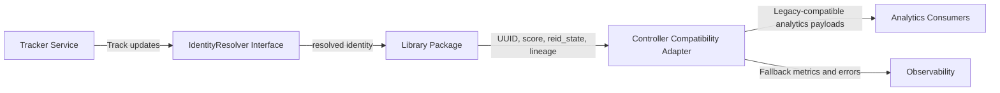

<!--
SPDX-FileCopyrightText: (C) 2026 Intel Corporation
SPDX-License-Identifier: Apache-2.0
-->

# Design Document: Controller Re-ID and UUID Extraction

- **Author(s)**: [Lukasz Talarczyk](https://github.com/ltalarcz)
- **Date**: 2026-07-03
- **Status**: `Proposed`
- **Related ADRs**:
  - [ADR 10](../adr/0010-reid-metadata-storage-architecture.md)
  - [ADR 11](../adr/0011-inner-product-reid-state-and-id-lineage.md)
  - [ADR 13](../adr/0013-controller-breakdown-microservices.md)

---

## 1. Overview

This document defines extraction of Re-ID and UUID lifecycle functionality from the Controller into a well-bounded in-process component. The primary objective is to validate that a real architectural boundary exists before introducing distributed-system complexity.

The staged approach in this document is not "microservice migration step 1". It is boundary validation: if a strict in-process API cannot be made clean, adding MQTT, gRPC, or Kafka later will not fix coupling.

## 2. Goals

- Introduce a strict Controller-facing abstraction for identity resolution and make Controller depend on that abstraction only.
- Move Re-ID and UUID lifecycle logic behind the abstraction with behavior parity.
- Extract the implementation into a standalone package or library in the same repository and process.
- Use extracted package outcomes to decide whether service extraction has enough value.
- Preserve payload and topic compatibility required by existing analytics consumers during migration.
- Define a safe rollout path with measurable parity, performance, and reliability gates.

## 3. Non-Goals

- Implementing Scene State Persistence extraction in this stage.
- Implementing Scene Graph delivery behavior for hierarchy migration in this effort.
- Redesigning parent-child retracking behavior.
- Extracting Positioning Service, Transform and Projection Service, or Analytics Service as part of this document.
- Changing downstream analytics contracts beyond additive, backward-compatible fields.
- Selecting a new vector database backend beyond the ADR 10 and ADR 11 scope.
- Pre-committing to microservice extraction before package-stage evaluation data is available.

## 4. Background / Context

Controller currently hosts state and Re-ID logic across several modules:

- `uuid_manager.py`: UUID assignment lifecycle, active identity state, and config updates.
- `vdms_adapter.py`: VDMS integration and similarity metric mapping behavior.
- `moving_object.py`: object-level Re-ID state and lineage payload fields.
- `tracking.py` and `scene.py`: runtime propagation of Re-ID configuration and state hydration.
- `scene_controller.py` and `detections_builder.py`: analytics-facing object payload output.

This creates coupling between tracking throughput and identity concerns, and makes UUID lineage behavior dependent on mixed service responsibilities. ADR 13 requires shared Re-ID integration while legacy analytics APIs remain available.

## 5. Proposed Design

### 5.0 Staged extraction strategy

This effort uses four stages:

- Stage 1: Interface-first boundary.
  - Introduce strict abstraction and keep existing implementation unchanged behind adapter wiring.
  - Controller dependencies move from concrete modules to interface contract.
- Stage 2: Functional consolidation behind interface.
  - Move all identity functionality behind the boundary (UUID, Re-ID, lineage, similarity, state transitions, VDMS integration).
- Stage 3: Package extraction.
  - Extract implementation into standalone package/library while keeping same process and repository.
  - Enable isolated tests, dual-run comparison, and low-risk rollback.
- Stage 4: Service decision gate.
  - Evaluate whether out-of-process service adds enough value.
  - Extract service only if boundary quality and measured outcomes justify operational overhead.

Scene State Persistence extraction is explicitly deferred to a later design effort.

### 5.1 Interface-first boundary

The Controller should depend on a strict abstraction, for example:

```python
class IdentityResolver:
  def update(self, observation) -> IdentityResult:
    ...
```

Design rule:

- Controller depends on `IdentityResolver` contract only.
- Controller does not directly depend on UUID manager, VDMS adapter, similarity internals, or lineage internals.
- Existing behavior remains unchanged initially; only dependency direction changes.

### 5.2 Concern split: identity lifecycle vs Re-ID matching

Current implementation mixes related but distinct concerns. This design separates them:

- Identity lifecycle concern:
  - temporary UUID to final UUID progression,
  - identity continuity,
  - lineage updates,
  - `previous_ids_chain` generation.
- Re-ID matching concern:
  - embedding handling,
  - vector backend query,
  - similarity evaluation,
  - match decision.

Recommended package shape:

```text
identity/
  lineage.py
  uuid_lifecycle.py

reid/
  matcher.py
  vdms_adapter.py
  similarity.py
```

This preserves backend portability. Replacing VDMS in the future should not require redesigning identity lifecycle.

### 5.3 Target boundary and ownership

The target architecture introduces a shared Re-ID and UUID service that owns:

- Re-ID match and store operations.
- UUID assignment lineage for globally stable identity continuity.
- Identity-enriched output fields required by analytics consumers.

During Stages 1-3, Controller calls the extracted boundary in-process. If Stage 4 approves service extraction, compatibility behavior remains mandatory during migration.

### 5.4 State ownership matrix

| State / Capability | Current Owner | Stage 2/3 Owner (Interface and Package) | Stage 4 Owner (If Service Chosen) | Notes |
| --- | --- | --- | --- | --- |
| UUID assignment lifecycle | Controller UUID manager | Extracted Re-ID library | Shared Re-ID and UUID service | Service path reuses the same library behavior |
| Re-ID vector query and store | Controller VDMS adapter | Extracted Re-ID library | Shared Re-ID and UUID service | Preserve ADR 10 two-tier query behavior |
| Re-ID runtime state on object | Controller moving object | Shared contract, produced by library path | Shared contract, produced by service path | Keep backward-compatible payload shape |
| Track stream production | Tracker Service | Tracker Service | Tracker Service | Input to persistence path remains unchanged |
| Analytics output topics | Controller publish path | Controller publish path | Controller compatibility path, then service-driven | Controlled cutover by flag |
| Scene state persistence | Controller/runtime paths | Unchanged in this stage | Unchanged in this stage | Explicitly deferred |

### 5.5 Interface design

#### Inbound

- Tracker stream ingest for per-scene object updates (asynchronous stream).
- Re-ID query/store requests with embedding plus metadata context.

#### Outbound

- Identity-enriched output updates for analytics consumers.
- Re-ID decision response including:
  - global UUID,
  - match score,
  - reid_state (`pending_collection`, `query_no_match`, `matched`, `reid_disabled`),
  - `previous_ids_chain` lineage updates.

In Stages 1-3, the contract is implemented as an in-process interface and package API. If Stage 4 approves service extraction, the same contract is exposed as service APIs.

### 5.6 Re-ID behavior contract

The service preserves ADR 10 and ADR 11 semantics:

- Two-tier matching:
  - Tier 1: metadata property filtering.
  - Tier 2: vector similarity match.
- Metric handling:
  - configured `COSINE` maps to internal VDMS IP execution path,
  - configured `L2` remains default.
- Threshold interpretation remains metric-dependent.
- Invalid metric configuration falls back safely to supported default.

### 5.7 Compatibility adapter strategy

During migration, Controller remains an adapter for consumers expecting legacy behavior:

- Controller continues publishing analytics-compatible payloads.
- Identity fields are sourced from the extracted component path (library through Stages 1-3, service only after Stage 4 approval).
- If service call times out, fallback behavior is explicit and observable:
  - temporary compatibility handling,
  - retry on next update,
  - metric and log signals for degraded mode.

Compatibility preservation is required in every stage. Stage progression is not controlled by runtime feature flags in this design.

### 5.8 Compatibility policy

- The external analytics-facing payload contract remains backward compatible in Stages 1-4.
- Migration uses implementation replacement behind stable contracts, not runtime toggles.
- Any compatibility regression blocks promotion to the next stage.

### 5.9 High-level flow



If Stage 4 approves service extraction, `L` is replaced by service deployment using the same contract.

## 6. Alternatives Considered

- Keep state and Re-ID in Controller.
  - Rejected: preserves coupling and weakens independent rollout.
- Service-first extraction without library stage.
  - Rejected: higher integration and rollback risk for first cut.
- Treat package extraction as mandatory pre-service migration.
  - Rejected: package extraction is boundary validation, not commitment to service extraction.
- Full hard cutover without dual-run.
  - Rejected: increases operational and rollback risk.

## 7. Risks and Mitigations

- Identity divergence between legacy and extracted component path during migration.
  - Mitigation: dual-run comparison, mismatch counters, and blocked promotion gate.
- Service decision made without enough boundary data.
  - Mitigation: Stage 4 decision gate requires measured dependency boundaries, coupling analysis, and failure tests.
- Added latency and operational burden if service is adopted.
  - Mitigation: service extraction only after package stage metrics and failure analysis justify it.
- Configuration drift between Controller and service.
  - Mitigation: single config source and config-version logging.

## 8. Rollout / Migration Plan

1. Stage 1: Interface boundary
- Introduce `IdentityResolver` interface and adapter wiring.
- Keep implementation behavior unchanged.
- Validate no direct Controller usage of identity internals.

2. Stage 2: Consolidation behind interface
- Move UUID lifecycle, Re-ID matching, VDMS adapter, similarity handling, lineage tracking, and Re-ID state transitions behind interface.
- Validate parity for UUID assignment, `reid_state`, and `previous_ids_chain`.

3. Stage 3: Package extraction
- Extract implementation into standalone package/library in same repo and process.
- Enable dual-run (`legacy` versus `package`) during validation.
- Capture realistic performance and failure metrics without network overhead.

4. Stage 4: Service decision gate
- Evaluate service value based on dependency boundaries, runtime coupling, ownership clarity, performance impact, and failure scenarios.
- If value is proven, define service rollout plan using the existing contract.
- If coupling remains high, continue in-process boundary refinement first.

## 9. Testing & Monitoring

### 9.1 Correctness and parity

- Contract tests for analytics payload compatibility.
- Identity lineage validation (`previous_ids_chain`) for reassignment scenarios.
- Re-ID state transition tests for all four states.

### 9.2 Performance and reliability

- End-to-end identity assignment latency (p50, p95, p99) in both library and service modes.
- Re-ID query success and timeout rates.
- Throughput under expected tracker load.

### 9.3 Observability

- Counters: match, no-match, fallback, timeout, error.
- Histograms: similarity scores by metric mode.
- Dual-run drift metric: legacy UUID vs service UUID mismatch rate.
- Dual-run drift metrics for both `legacy vs interface/package` and (if adopted) `package vs service`.

## 10. Open Questions

- What is the final timeout and retry policy for identity query path under load?
- What interface ownership model and package location are preferred (`scene_common` vs dedicated package)?
- Should lineage history retention be bounded or unbounded in durable storage for Re-ID history?
- Which teams own acceptance for parity gates: Controller, Tracker, and analytics consumers?
- What quantitative criteria should trigger service extraction approval?
- Which failure scenarios must be demonstrated in package-stage testing before any service decision?

Persistence-specific questions are intentionally deferred until the persistence extraction stage is planned.

## 11. References

- [ADR 10: Re-ID Metadata Storage Architecture](../adr/0010-reid-metadata-storage-architecture.md)
- [ADR 11: Re-ID Metric and ID Lineage](../adr/0011-inner-product-reid-state-and-id-lineage.md)
- [ADR 13: Controller Breakdown into Functionality-Aligned Microservices](../adr/0013-controller-breakdown-microservices.md)
- [Controller UUID manager](../../controller/src/controller/uuid_manager.py)
- [Controller VDMS adapter](../../controller/src/controller/vdms_adapter.py)
- [Controller moving object model](../../controller/src/controller/moving_object.py)
- [Controller tracking integration](../../controller/src/controller/tracking.py)
- [Controller scene hydration](../../controller/src/controller/scene.py)
- [Controller publish path](../../controller/src/controller/scene_controller.py)
- [Controller detection payload builder](../../controller/src/controller/detections_builder.py)
- [Shared MQTT helper](../../scene_common/src/scene_common/mqtt.py)
