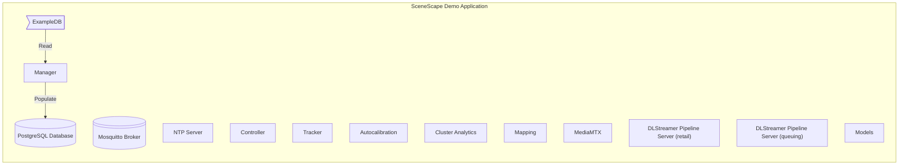
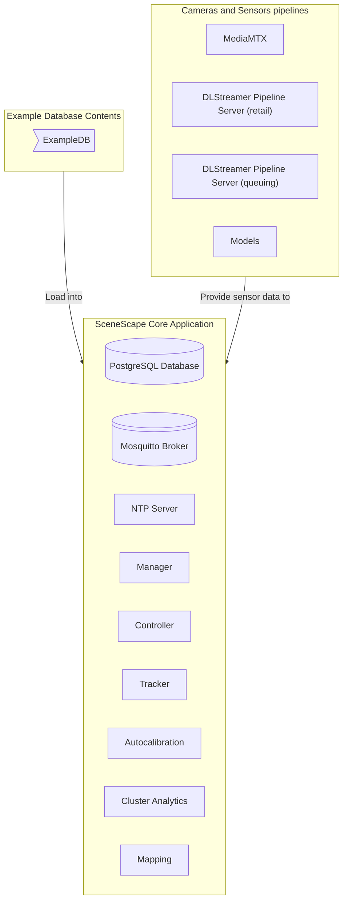

# Design Document: SceneScape Core Deployment Packages

- **Author(s)**: [Patryk Iracki](https://github.com/Irakus)
- **Date**: 2025-12-08
- **Status**: `Proposed`
- **Related ADRs**: N/A

---

## 1. Overview

Creating SceneScape Core deployment package to simplify installation for general use cases. All demos should be built on top of that package.

## 2. Goals

- Make SceneScape easier to install for general use cases in both Docker Compose and Kubernetes environments.
- Split all demos related components from the core deployment package.
- Core package should include clean SceneScape environment without any pre-populated data.
- Scenes and Cameras should be easy to add to existing Core deployment.
- Make SceneScape Helm Chart more generic to publish it externally.
- Keep the docker images as close to current state as possible to avoid breaking all existing apps.
- Remove example data loading from deployment to speed it up.
- Core deployment package should be configurable.

## 3. Non-Goals

- Making demo app deployment easier. It will still need the same commands.
- Using deployment packages for other sample applications (e.g. Smart Intersection) - those apps will need to be aligned separately.

## 4. Background / Context

All apps based on SceneScape define their own deployment structure, which adds more work to maintain these during SceneScape containers updates.
Also, all example data are parts of such deployments.
There's no easy-to-use deployment method for general use cases, e.g. if user wants to just define their own scenes and plug in their own cameras.
They need to define their own deployment based on existing examples and docs which makes SceneScape hard to adopt quickly.

## 5. Proposed Design

Currently all SceneScape-based apps looks similar to this (based on docker compose of demo application):

The goal is to separate services necessary for SceneScape Core functionality and deploy anything else (e.g. example database, extra analytics modules) on top of that.
The proposed design is as follows:

Aside from just splitting deployments, the following changes in implementations are needed:

- Add API endpoints to Manager to allow loading database after initial deployment, or move that functionality outside of Manager entirely (e.g. CLI tool).
- Create separate helm charts for demo applications that use core chart as a dependency.
- Either add API endpoint to model downloader service to download models and generate model configs after initial deployment or remove that feature from SceneScape
- Provide broker configuration through chart values
- Provide tracker config through chart values
- Provide a way to propagate sample data to existing deployment

If above changes are hard to implement in single iteration, they could be split into two phases:
### Phase 1
Create native core deployment, and implement all data loading as part of existing makefiles. This solution would be a good start to start separation and understand all issues it may cause. It also should be relatively easy to re-create current demo deployments. This phase doesn't include any specific changes in components code.
### Phase 2
Implement all needed API endpoints to allow loading data and models after initial deployment. This phase would make core deployment package more flexible and easier to use for use cases other than current demos.

## 6. Alternatives Considered

Currently the only alternative is to keep current deployments as is, which makes SceneScape harder to adopt for new users.

## 7. Risks and Mitigations

- Many tests have their own docker compose files for specific test cases -> One approach is for these tests to use generic deployment, another would be to keep existing test deployments as is and add some tests that would run directly against core deployment package.
- Increased deployment complexity for users who just want the full demo.

## 8. Rollout / Migration Plan

Assuming that users currently need to define their deployment on their own, this change should not break any existing setups.
It gives option to switch to core deployment package but it's not mandatory.

## 9. Testing & Monitoring

SceneScape functionality will not change so current tests will cover most of the needed testing.
The only new functionality that needs to be tested is data loading after initial deployment.

## 10. Open Questions

What configuration options should the core deployment expose?

## 11. References

N/A
