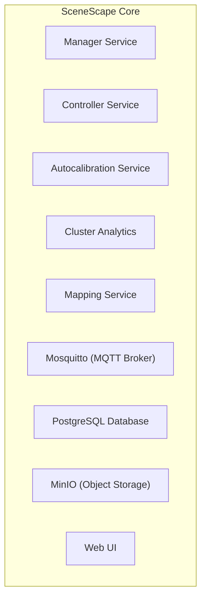

# Design Document: Feature X

- **Author(s)**: [Patryk Iracki](https://github.com/Irakus)
- **Date**: 2025-08-12
- **Status**: `Proposed`
- **Related ADRs**: N/A

---

## 1. Overview

Creating SceneScape Core deployment package to simplify installation for general use cases. All demos should be built on top of that package.

## 2. Goals

- Make SceneScape easier to install for general use cases in both Docker Compose and Kubernetes environments.
- Split all demos related components from the core deployment package.
- Core package should include clean SceneScape environment without any pre-populated data.
- Scenes and Cameras should be easy to add to existing Core deployment.
- Make SceneScape Helm Chart more generic to publish it externally.
- Keep the docker images as close to current state as possible to avoid breaking all existing apps.

## 3. Non-Goals

- Making demo app deployment easier. It will still need the same commands.
- Using deployment packages for other sample applications (e.g. Smart Intersection) - those apps will need to be alligned separately.

## 4. Background / Context

All apps based on SceneScape define their own deployment structure, which adds more work to maintain these during SceneScape containers updates.
Also, all example data are parts of such deployments.
There's no easy-to-use deployment method for general use cases, e.g. if user wants to just define their own scenes and plug in their own cameras.
They need to define their own deployment based on existing examples and docs which makes SceneScape hard to adopt quickly.

## 5. Proposed Design

Currently all SceneScape-based apps looks similar to this (based on docker compose of sample app):

Detailed design, diagrams, APIs, workflows.

## 6. Alternatives Considered

Brief comparison of other approaches.

## 7. Risks and Mitigations

- Risk → mitigation
- Risk → mitigation

## 8. Rollout / Migration Plan

Steps to deploy/change incrementally.

## 9. Testing & Monitoring

How will we verify correctness, performance, reliability?

## 10. Open Questions

What is still unclear or undecided?

## 11. References

Links to ADRs, issues, PRs, discussions.
