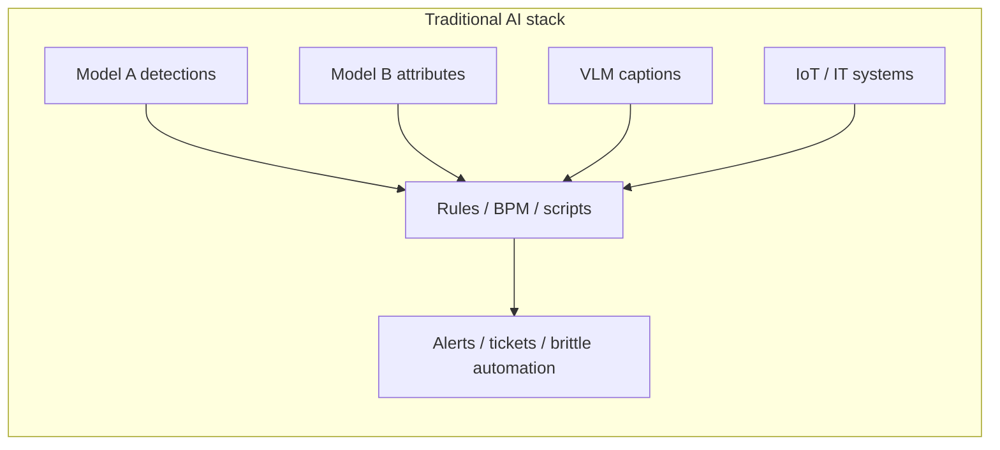
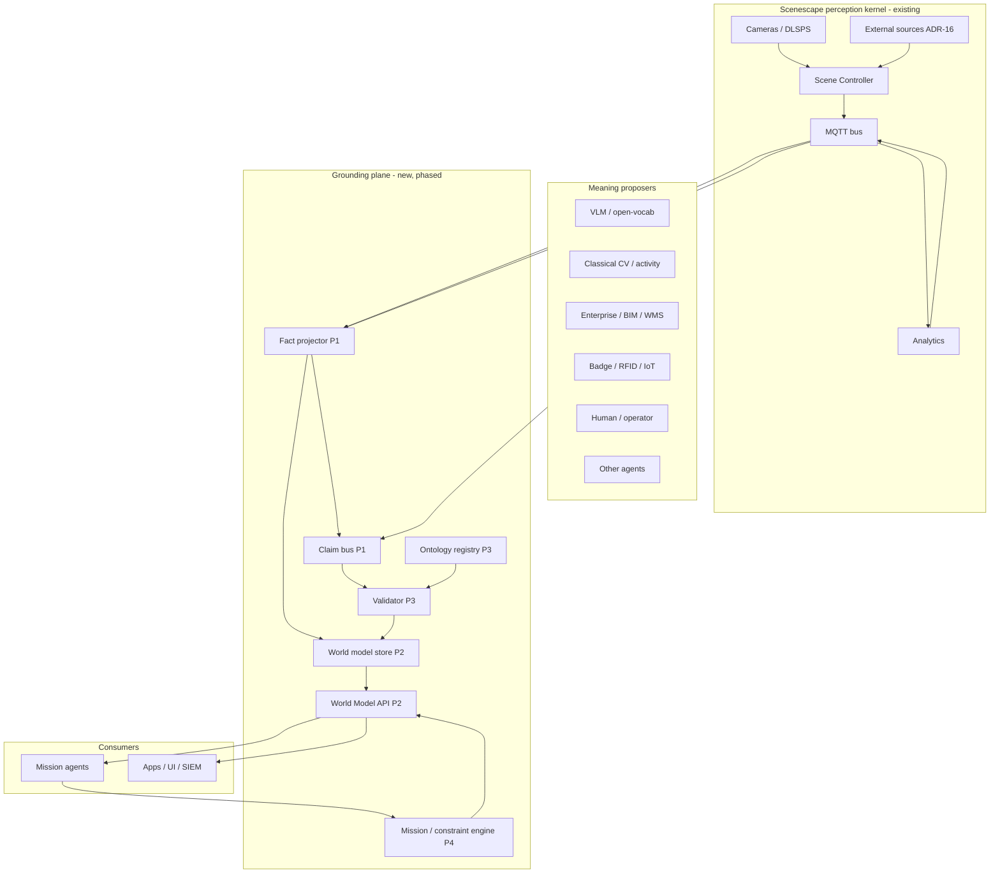
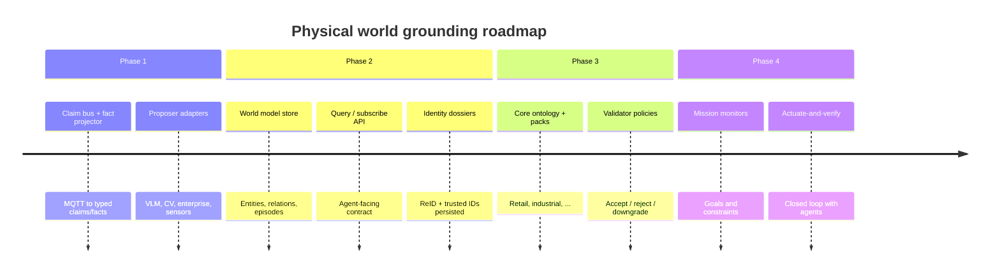
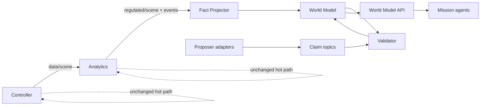

<!--
SPDX-FileCopyrightText: (C) 2026 Intel Corporation
SPDX-License-Identifier: Apache-2.0
-->

# Design Document: Physical World Grounding for Mission Agents — Overview and Roadmap

- **Author(s)**: [Sarat Poluri](https://github.com/spoluri)
- **Date**: 2026-08-23
- **Status**: `Proposed`
- **Related ADRs**: [ADR-10](../../adr/0010-reid-metadata-storage-architecture.md), [ADR-16](../../adr/0016-unified-external-source-ingestion.md)
- **Document set**: [01](01-propose-ground-validate.md) · [02](02-fact-projection-and-claim-bus.md) · [03](03-world-model-and-identity.md) · [04](04-ontology-packs-and-validator.md) · [05](05-mission-constraints-and-agent-loop.md) · [06](06-demo-companions.md)

---

## 1. Overview

Scenescape today maintains a **dynamic spatial scene graph**: calibrated places, fused tracks, sensors, regions/tripwires, and extensible attribute bags published over MQTT. That graph answers *what / where / when* with physical grounding. It does **not** yet provide a typed, temporal, queryable world model that mission agents can use as ontological ground truth across verticals (retail, industrial, construction, defense, aerospace).

**The elevation this program targets is larger than “better than a VLM.”** Traditional AI deployments typically stop at **model inferencing** (detectors, classifiers, VLMs, forecasting) and then hand disconnected outputs to **thin rules engines or bespoke business logic**. Each model and system speaks its own schema; identity, place, time, and enterprise context rarely meet; confidence is a model score, not a decision-grade trust signal. Operators and brittle scripts glue the gaps. Semi-autonomous and autonomous agents cannot safely act on that pile of partial truths.

This document set defines an architecture that elevates Scenescape into the **physical grounding and meaning layer** that connects those disconnected outputs:

- **Proposers** emit semantic *claims* from many sources (classical CV, VLMs, IoT, badges, WMS/MES, BIM, humans, other agents)—not a single model monopoly.
- **Scenescape** supplies shared *grounding evidence* (pose, identity, place membership, sensor tags, coverage, provenance) that binds claims to the same physical world.
- **Validators** reconcile cross-source claims against evidence to produce *trusted facts* with calibrated confidence for analytics and mission agents.

The outcome is **connected meaning**: one situational picture agents can use for **semi-autonomous and autonomous decisions**, with explicit accept / low-trust / defer / reject—not another dashboard of model outputs.

The work is deliberately **phased**. Each phase ships useful capability without requiring the full stack.

## 2. Goals

- Keep Controller + Analytics as the real-time perception/fusion kernel (no OWL in the tracking hot path).
- Define a reusable **Propose → Ground → Validate** pattern that is extensible to many meaning sources.
- Layer capability so teams can adopt Phase 1 without committing to Phases 3–4.
- Prefer **reusable third-party** stores, buses, and reasoners over bespoke infrastructure.
- Support multiple businesses via **core ontology + vertical packs**, not forked scene engines.
- Preserve Scenescape’s existing MQTT contracts; add projection and agent APIs beside them.
- Elevate past **inference + disconnected rules** so agents get **connected meaning** and **decision-grade confidence** (including do-not-act).

## 3. Non-Goals (program-wide)

- Replacing VLMs or building a general AGI planner inside Scenescape.
- Storing raw video as the system of record for world state.
- A single mega-ontology covering every industry in v1.
- Putting formal description-logic reasoning on the frame-rate path.
- Mandating one graph database or one LLM vendor.

## 4. Background / Context

### 4.1 What Scenescape already provides

| Capability | Where |
|------------|--------|
| Multi-camera track fusion, metric poses | Scene Controller |
| Regions, tripwires, sensor tagging, regulated output | Analytics |
| Extensible semantic `metadata` | `metadata.schema.json`, camera/external pipelines |
| ReID + schema-less properties | ADR-10 (VDMS/Qdrant) |
| Dynamic agents / RTLS / child scenes | ADR-16 external source contract |
| Static scene/camera/region config | Manager + PostgreSQL |

### 4.2 Gap versus mission agents — and versus traditional AI stacks

Mission agents need typed entities, durable identity, temporal episodes, place policies, uncertainty/coverage, constraint monitors, and a query API — not only an MQTT firehose of tracks.

Equally important: most “AI for X” systems never leave the **inference + rules** pattern:

Outputs stay **disconnected** (different IDs, clocks, frames, and vocabularies). Rules see fields, not a shared world. There is no place to ask “is this claim about the *same* entity in the *same* place with *enough* evidence to act?” That is the gap this program closes.

### 4.3 Document map

| Doc | Phase | Focus |
|-----|-------|--------|
| [01 — Propose / Ground / Validate](01-propose-ground-validate.md) | Pattern | Shared vocabulary, claim model, trust roles |
| [02 — Fact projection & claim bus](02-fact-projection-and-claim-bus.md) | **P1** | Project MQTT → claims/facts; ingest proposers |
| [03 — World model & identity](03-world-model-and-identity.md) | **P2** | Durable entities, episodes, agent query API |
| [04 — Ontology packs & validator](04-ontology-packs-and-validator.md) | **P3** | Types, vertical packs, validation policies |
| [05 — Mission constraints & agent loop](05-mission-constraints-and-agent-loop.md) | **P4** | Goals, monitors, actuate-and-verify |
| [06 — Demo and app companions](06-demo-companions.md) | All | Per-phase contrast demos vs existing methods |

### 4.4 Demo companions (required per phase)

Every phase has a **demo/app companion** that proves elevation above traditional inference+rules stacks and disconnected data—not only versus VLM-only demos. See [06 — Demo and app companions](06-demo-companions.md), including [§12 OEP reuse](06-demo-companions.md#12-open-edge-platform-reuse-extend-dont-rebuild) (extend Smart Intersection, Alert Agent, etc.—don’t rebuild). Executive arc: Trust Triangle → Claim Radar → Time Machine → Policy Arena → Mission Cockpit.

### 4.5 Trust model (program thesis)

**Many proposers suggest meaning; Scenescape connects them to one physical world; validators mint decision-grade facts; mission agents act with calibrated confidence—including knowing when not to act.**

## 5. Proposed Design

### 5.1 Layered architecture

### 5.2 Capability phases

### 5.3 Trust model (one sentence)

**Many proposers suggest meaning; Scenescape connects them to one physical world; validators mint decision-grade facts; mission agents act with calibrated confidence—including knowing when not to act.**

### 5.4 Recommended third-party building blocks (program view)

| Concern | Suggested options | Notes |
|---------|-------------------|--------|
| Claim / event bus | Apache Kafka, Redpanda, or NATS JetStream | MQTT remains Scenescape-internal; claims may fan out on a durable log |
| Fact / graph store | Neo4j, Amazon Neptune, or Apache AGE on Postgres | Property graph fits entities + relations + time edges |
| RDF / ontology (if needed) | Apache Jena, GraphDB, RDFLib + Oxigraph | Use when OWL/SHACL packs are primary |
| Validation rules | Open Policy Agent (OPA/Rego), SHACL, Drools | Start with OPA or SHACL; avoid custom rule DSL early |
| Vector / ReID (existing) | Qdrant, VDMS | Keep ADR-10 path |
| Workflow / agents | Temporal, LangGraph, Autogen, or custom | Orchestration outside Scenescape core |
| Observability | OpenTelemetry (already in tree) | Trace claim → fact → decision |
| Schema | JSON Schema + optional JSON-LD context | Align with existing `metadata.schema.json` |

Phase docs name **defaults** and **alternatives**; selection is an ADR per phase when implementation starts.

### 5.5 Relationship to existing Scenescape services

**Invariant:** Controller and Analytics remain authoritative for live tracks and spatial events. The grounding plane is a **consumer** (and later a policy publisher), not a replacement tracker.

## 6. Alternatives Considered

| Approach | Why not (as the program default) |
|----------|----------------------------------|
| Embed ontology reasoning in Controller | Breaks latency/isolation; hard to version packs |
| VLM-only scene graphs as world model | Weak metric grounding, weak multi-cam identity |
| Only enrich `metadata` bags | No temporal KB, no agent query contract, no trust policy |
| Single green-field “digital twin” rewrite | Throws away calibrated fusion and ADR-16 ingest |

## 7. Risks and Mitigations

| Risk | Mitigation |
|------|------------|
| Scope explosion across verticals | Strict phase gates; core ontology first; packs optional |
| Duplicate truth (MQTT vs world model) | Single writer for trusted facts; MQTT = observations |
| Validator false confidence | Explicit `unknown` / coverage holes; provenance on every fact |
| Storage/cost of history | TTL + tiered retention (hot graph / cold object store) |
| Security in defense/aerospace | Phase 4+ tenancy, audit, signed claims — called out early |

## 8. Rollout / Migration Plan

1. Land this document set as `Proposed`; socialize with Controller/Analytics owners.
2. Implement Phase 1 as an optional Compose profile (e.g. `--profile world-model`) with no Manager UI dependency.
3. Gate each later phase on: schema stability, load test vs regulated MQTT rate, and one vertical pilot pack.
4. Record irreversible tech choices (bus, store) as ADRs linked from phase docs.

## 9. Testing & Monitoring

- Contract tests: claim schema, fact projection from golden MQTT fixtures.
- Golden scenarios: “VLM says X, region/evidence says Y → expect accept/reject.”
- Grounding quality metrics: ID persistence, ontology mapping coverage, validator precision/recall.
- SLOs: projection lag vs `regulated_rate`; API p99 for snapshot queries.

## 10. Open Questions

- Should trusted facts ever be published back onto MQTT (`scenescape/fact/...`), or only via the World Model API?
- Is PostgreSQL + Apache AGE enough for P2, or is a dedicated graph DB required for the first pilot?
- Who owns vertical ontology packs (Scenescape core vs industry solutions teams)?
- How do classified / need-to-know deployments partition the world model?

## 11. References

- [Scene Controller data formats](../../user-guide/microservices/controller/data_formats.md)
- [Analytics data formats](../../user-guide/microservices/analytics/data_formats.md)
- [ADR-10 ReID metadata storage](../../adr/0010-reid-metadata-storage-architecture.md)
- [ADR-16 Unified external-source ingestion](../../adr/0016-unified-external-source-ingestion.md)
- [Design template](../template.md)
- [06 — Demo and app companions](06-demo-companions.md)
