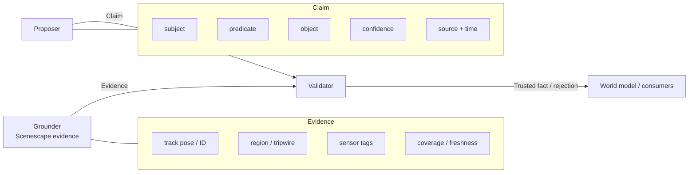
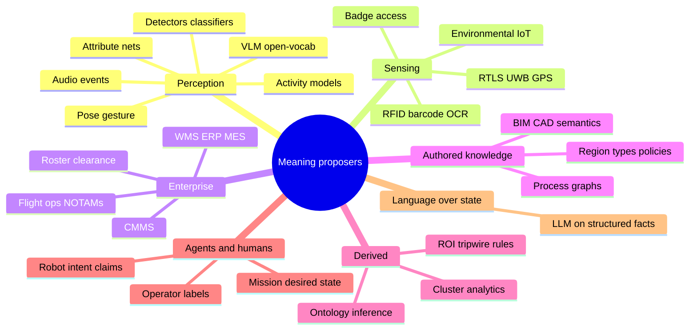
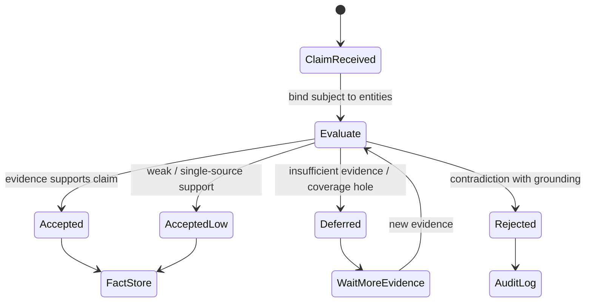

<!--
SPDX-FileCopyrightText: (C) 2026 Intel Corporation
SPDX-License-Identifier: Apache-2.0
-->

# Design Document: Propose → Ground → Validate Pattern

- **Author(s)**: [Sarat Poluri](https://github.com/spoluri)
- **Date**: 2026-08-23
- **Status**: `Proposed`
- **Related ADRs**: [ADR-10](../../adr/0010-reid-metadata-storage-architecture.md), [ADR-16](../../adr/0016-unified-external-source-ingestion.md)
- **Parent**: [00 — Overview and roadmap](00-overview-and-roadmap.md)
- **Next**: [02 — Fact projection and claim bus](02-fact-projection-and-claim-bus.md)

---

## 1. Overview

This document defines the **shared pattern** for elevating Scenescape from a spatial scene graph into physical ontological grounding—and for elevating industry AI past the dead-end of **model inference + disconnected rules**.

Traditional stacks produce many outputs (boxes, attributes, captions, badge swipes, WMS events) that never share identity, place, or time. Business logic then fires on whatever field arrived last. That cannot support trustworthy semi-autonomous or autonomous action.

All later phases reuse the same three roles:

1. **Proposer** — emits a *claim* (asserted meaning) with source and confidence—from any model or system, not only VLMs.
2. **Grounder** — Scenescape (and projected facts) supply *evidence* (space, time, identity, sensors, coverage) that **connects** those claims to one physical world.
3. **Validator** — policy that accepts, rejects, defers, or downgrades claims into *trusted facts* with **decision-grade confidence**.

Scenescape `metadata` is **one channel** for carrying proposer output. It is **not** the grounding layer. Grounding is geometry, track identity, place membership, sensor correlation, and provenance—the join key across otherwise disconnected AI and IT outputs.

## 2. Goals

- Establish vocabulary usable across phases and verticals.
- Enumerate proposer classes beyond VLMs (classical CV, sensors, enterprise, authored knowledge, agents).
- Define a minimal claim / evidence / fact information model that **cross-links** disconnected sources.
- Clarify trust and failure modes (`unknown`, conflict, stale) suitable for autonomous gatekeeping.

## 3. Non-Goals

- Implementing the claim bus or validator (see Phases 1 and 3).
- Choosing a specific VLM, LLM, or graph database.
- Encoding industry-specific classes (see Phase 3 ontology packs).
- Replacing all business process systems—adapters propose meaning; the world model holds grounded truth.

## 4. Background / Context

### 4.0 Elevation from traditional AI approaches

| Traditional approach | Where it stops | What this pattern adds |
|----------------------|----------------|------------------------|
| Model inference (CV, VLM, ASR, …) | Per-frame / per-event scores | Claims bound to shared entities and places |
| Rules / BPM on raw fields | Brittle if/then on disconnected schemas | Policies over evidence-backed facts |
| Alert / ticket automation | Operator glue between systems | Calibrated trust for machine action |
| “AI dashboard” mosaics | Juxtaposition without join | Connected meaning + provenance |
| Single-model pipelines | One vocabulary, one failure mode | Multi-proposer fusion with conflict handling |

VLMs are one proposer class among many—and often the most fluent at being wrong. The pattern’s primary contrast is with **inference-and-rules architectures**, not with “using language models at all.”

### 4.1 Why open-vocab / VLM-only graphs are still insufficient

VLM scene graphs propose linguistic relations from pixels. They typically lack reliable metric multi-camera fusion, durable cross-camera identity, calibrated place predicates, and non-visual enterprise/sensor truth. They remain valuable as **open-vocabulary proposers**.

### 4.2 Why Scenescape alone is insufficient for missions

Live tracks and ROI events answer physical questions but lack typed relations, durable dossiers, mission constraints, and an agent query contract. Meaning arrives as free strings and flat metadata—still one hop away from connected, decision-grade facts.

## 5. Proposed Design

### 5.1 Role diagram

### 5.2 Proposer taxonomy

Any proposer may publish claims. None are authoritative for physics.

### 5.3 Information model

#### Claim (proposed meaning)

| Field | Description |
|-------|-------------|
| `claim_id` | Unique id |
| `subject` | Entity ref (track UUID, asset IRI, place UUID, or blank node) |
| `predicate` | Typed relation or property (string now; IRI in Phase 3) |
| `object` | Value, entity ref, or structured literal |
| `confidence` | `[0,1]` from proposer |
| `valid_at` / `observed_at` | Time of assertion |
| `source` | `{kind, id, model_name?, version?}` |
| `evidence_hints` | Optional links (camera id, frame ts, ticket id) |
| `scope` | `scene_id` / site |

#### Evidence (grounding)

Produced by projecting Scenescape outputs (Phase 1+):

| Kind | Examples |
|------|----------|
| Kinematic | `translation`, `velocity`, `size` |
| Identity | track UUID, ReID state, `previous_ids_chain`, badge tag |
| Place | `locatedIn` region, tripwire crossing + direction, dwell |
| Sensing | singleton values attached to object/area |
| Observation quality | visibility, camera_bounds, last_seen, calibration health |
| Coverage | unobserved regions, sensor offline |

#### Trusted fact (validator output)

| Field | Description |
|-------|-------------|
| `fact_id` | Unique id |
| `claim_id` | Originating claim (if any) |
| `subject` / `predicate` / `object` | Normalized triple |
| `trust` | `accepted` \| `accepted_low` \| `rejected` \| `deferred` |
| `confidence` | Post-validation score |
| `evidence_refs` | Pointers to grounding records |
| `policy_id` | Which validator policy fired |
| `valid_from` / `valid_to` | Interval semantics |

### 5.4 Validation outcomes

### 5.5 Worked example (shared across phases)

**Claim (VLM):** “Person track T is not wearing a hard hat in Zone Z.”

**Evidence (Scenescape):**

- T `locatedIn` Z for 45s; Z typed `construction.exclusion` (Phase 3).
- PPE attribute from CV proposer: `hard_hat=false` conf 0.81.
- Camera C3 has visibility on T; C7 offline (coverage note).

**Validator (policy sketch):**

- Require place membership + PPE claim + min dwell.
- If only VLM and no CV attribute → `accepted_low` or `deferred`.
- If badge says “safety officer exempt” → `rejected` as violation (still may log advisory).

**Mission use (Phase 4):** constraint `PPE_required(Z)` opens an incident only on `accepted` / thresholded `accepted_low`.

### 5.6 Mapping to today’s Scenescape fields

| Today | Role in pattern |
|-------|-----------------|
| `category`, `metadata.*` | Often **proposer output** already fused onto tracks |
| `translation`, `velocity`, regions, sensors | **Evidence** |
| ReID properties (ADR-10) | **Identity evidence** / dossier seed |
| External source poses (ADR-16) | **Evidence** (and sometimes identity claims) |
| Region/tripwire events | **Evidence** and sometimes **derived claims** |

Phase 1 separates these cleanly on a claim/fact bus even when they still share MQTT topics upstream.

## 6. Alternatives Considered

| Approach | Drawback |
|----------|----------|
| Treat VLM captions as facts | No contradiction handling; unsafe for missions |
| Only classical CV labels | Misses open vocab and enterprise meaning |
| Implicit trust via metadata passthrough | Current behavior; no policy or audit |

## 7. Risks and Mitigations

| Risk | Mitigation |
|------|------------|
| Subject binding fails (claim names “the person in red”) | Require entity ids or run binder using spatial+attribute evidence |
| Proposer spam | Rate limits, per-source quotas, confidence floors |
| Humans assume metadata = truth | Docs + API distinguish claim vs fact |

## 8. Rollout / Migration Plan

- Adopt vocabulary in design reviews immediately.
- No runtime change until Phase 1 claim schema lands.
- Optionally annotate new DLSPS/VLM adapters with `source.kind=vlm` in metadata for forward compatibility.

## 9. Testing & Monitoring

- Unit tests for claim schema validation.
- Scenario matrices: support / contradict / insufficient evidence.
- Metric: `% claims with resolvable subject` (binding success).

## 10. Demo companion

**[D0 — Trust Triangle](06-demo-companions.md#6-d0--trust-triangle-pattern--overview)** — traditional models→rules→auto-alert vs connected evidence vs act/assist/do-not-act. Hero moment: refuse autonomy when sources never joined or coverage is dark.

## 11. Open Questions

- Hard requirement for JSON-LD `@context` in P1, or plain JSON Schema first?
- Should derived Analytics events be auto-promoted to claims, facts, or both?

## 12. References

- [00 — Overview](00-overview-and-roadmap.md)
- [06 — Demo companions](06-demo-companions.md)
- [Controller data formats — semantic metadata](../../user-guide/microservices/controller/data_formats.md#semantic-metadata-fields-objectscategorymetadataattr)
- [Analytics — region/tripwire events](../../user-guide/microservices/analytics/data_formats.md)
