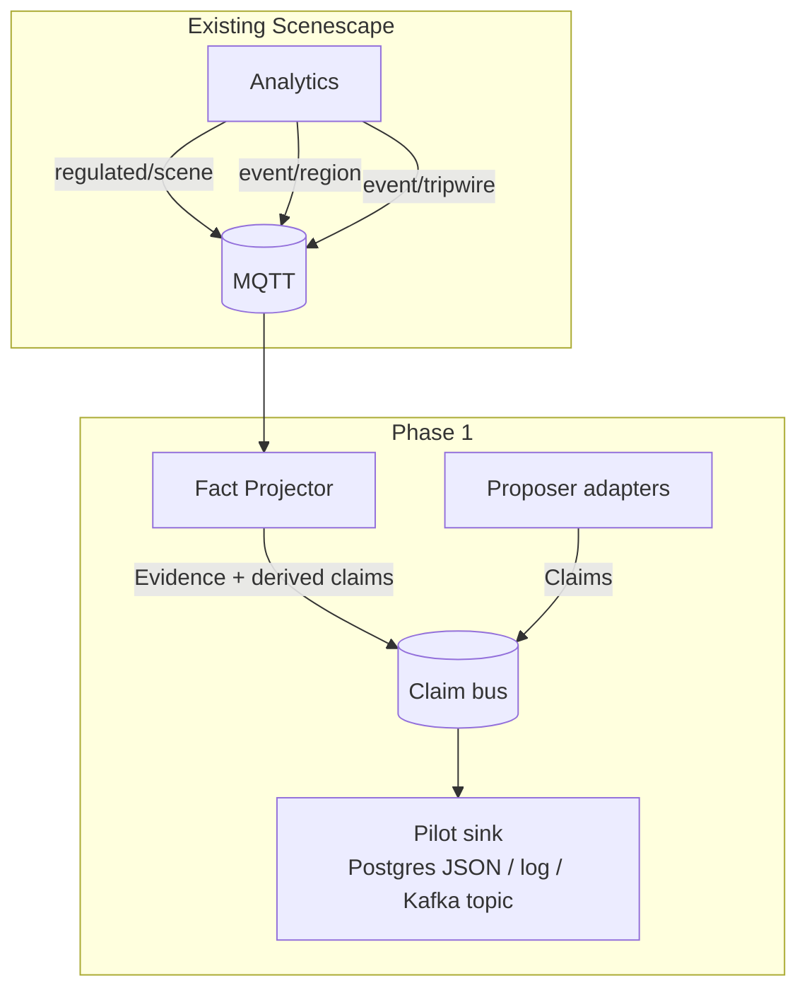
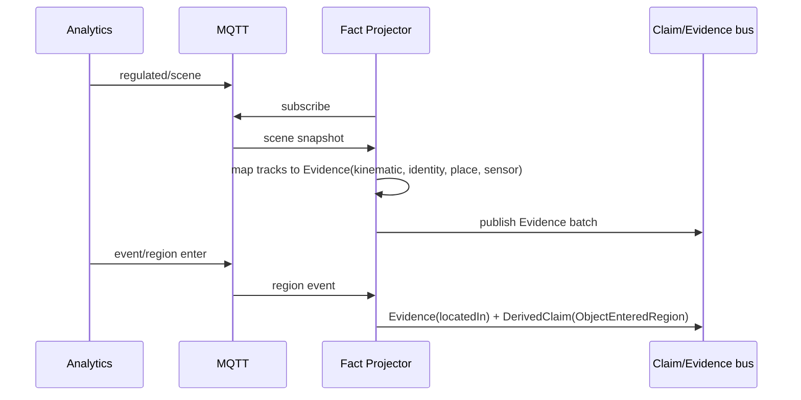
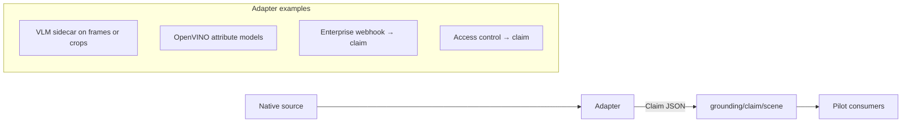

<!--
SPDX-FileCopyrightText: (C) 2026 Intel Corporation
SPDX-License-Identifier: Apache-2.0
-->

# Design Document: Phase 1 — Fact Projection and Claim Bus

- **Author(s)**: [Sarat Poluri](https://github.com/spoluri)
- **Date**: 2026-08-23
- **Status**: `Proposed`
- **Related ADRs**: [ADR-16](../../adr/0016-unified-external-source-ingestion.md)
- **Parent**: [00 — Overview](00-overview-and-roadmap.md) · Pattern: [01](01-propose-ground-validate.md)
- **Next**: [03 — World model and identity](03-world-model-and-identity.md)

---

## 1. Overview

Phase 1 delivers the smallest useful slice of the grounding plane:

1. A **Fact Projector** that consumes Scenescape MQTT (`regulated/scene`, region/tripwire events, optionally unregulated tracks) and emits normalized **evidence records** and **derived claims**.
2. A **Claim Bus** where external **proposers** publish claims without writing into the Controller hot path.
3. Schema + adapters so VLMs, CV, enterprise connectors, and sensors share one envelope.

No durable world-model graph API yet (Phase 2). No ontology IRIs required (Phase 3). Validators may be a thin filter or even “store all claims + evidence side-by-side” for pilot analytics.

## 2. Goals

- Zero changes required to Controller tracking algorithms for the pilot.
- Stable JSON Schema for `Claim` and `Evidence` messages.
- At least three proposer adapters: (a) metadata-from-pipeline, (b) VLM side-car, (c) webhook/enterprise stub.
- Optional Compose profile to run projector + bus beside existing stack.
- End-to-end demo: claim + region evidence visible in a log/UI consumer.

## 3. Non-Goals

- Agent query API, episode store, ontology packs, mission monitors.
- Replacing MQTT as Scenescape’s internal sensor/track bus.
- Guaranteed exactly-once cross-data-center replication.

## 4. Background / Context

Today consumers must each re-parse MQTT track and event shapes. Semantic attributes ride on `metadata` without a first-class claim lifecycle. External meaning sources have no standard topic besides overloading detection metadata or custom topics.

## 5. Proposed Design

### 5.1 Phase 1 data flow

### 5.2 Topic / stream layout (logical)

Keep Scenescape MQTT unchanged. Introduce parallel claim streams (MQTT ACL-separated **or** Kafka/NATS):

| Stream | Content |
|--------|---------|
| `grounding/evidence/{scene_id}` | Projected evidence from tracks/events |
| `grounding/claim/{scene_id}` | Proposer claims |
| `grounding/derived/{scene_id}` | Claims auto-minted from ROI/tripwire/rules |

**Default recommendation:** **Redpanda** or **NATS JetStream** for claim/evidence durability; bridge from MQTT via the Fact Projector. For the smallest pilot, reuse Mosquitto with `grounding/#` prefixes and short retention.

### 5.3 Fact Projector responsibilities

**Mapping rules (initial):**

| MQTT source | Projection |
|-------------|------------|
| Track pose / velocity / size | `EvidenceKind=kinematic` |
| Track id + reid fields | `EvidenceKind=identity` |
| `regions`, region events | `EvidenceKind=place` (+ derived claim on enter/exit) |
| `sensors` on objects | `EvidenceKind=sensing` |
| Missing cameras / stale tracks | `EvidenceKind=coverage` (best-effort) |
| Object `metadata` attributes | Optional: emit as **claims** with `source.kind=pipeline_metadata` (not auto-trusted facts) |

### 5.4 Proposer adapter pattern

Adapters own translation (same principle as ADR-16 external sources): Scenescape does not learn each vendor’s schema.

**Subject binding in P1:** prefer Scenescape track UUID when known; else spatial hint `{scene_id, translation, radius}` for a later binder (Phase 2/3).

### 5.5 Minimal schemas (normative intent)

Claim and Evidence share envelope fields: `id`, `scene_id`, `timestamp`, `source`, `schema_version`.

Implement as JSON Schema under e.g. `controller/src/schema/grounding/` or a new `grounding/` service tree — exact path deferred to implementation PR.

### 5.6 Suggested third-party software

| Component | Default for P1 pilot | Alternatives |
|-----------|----------------------|--------------|
| Claim log | **NATS JetStream** (light) or **Redpanda** | Kafka, MQTT-only |
| Schema registry | JSON Schema in-repo + CI | Apicurium, Confluent Schema Registry |
| Projector runtime | Python service (match Analytics style) | Go/Rust if latency demands |
| Pilot sink | **PostgreSQL JSONB** | DuckDB file, OpenSearch |
| VLM proposer | OpenVINO GenAI / local VLM, or cloud VLM via adapter | — |
| CV proposers | Existing DLSPS + OMZ attribute models | Geti-custom models (per MLOps design) |
| Connector framework | **Apache Camel** or small FastAPI webhooks | n8n / Node-RED for enterprise pilots |
| Observability | OpenTelemetry → existing OTLP path | — |

## 6. Alternatives Considered

| Option | Decision |
|--------|----------|
| Write claims into track `metadata` only | Rejected as sole path — no claim lifecycle, pollutes perception |
| Projector inside Analytics process | Deferred — faster but couples release cadence; prefer sidecar first |
| Full Kafka always | Optional — heavy for edge retail; NATS/Redpanda fine for many sites |

## 7. Risks and Mitigations

| Risk | Mitigation |
|------|------------|
| Double interpretation of metadata (evidence vs claim) | Explicit projector mode flags; docs in 01 |
| Bus overload at regulated rates | Batch evidence; drop/coalesce kinematic updates; keep events lossless |
| Adapter subject ambiguity | Require UUID or structured spatial hint |

## 8. Rollout / Migration Plan

1. Schema + projector consuming recorded MQTT fixtures.
2. Compose profile `world-grounding` with projector + JetStream/Redpanda + Postgres sink.
3. One VLM adapter on a single camera crop stream.
4. One enterprise webhook (e.g. badge id → claim).
5. Demo notebook/dashboard reading claim+evidence joins by `track_id` / time window.

## 9. Testing & Monitoring

- Fixture replay from `tests/` MQTT samples → golden evidence JSON.
- Contract tests for claim schema (`make` target TBD).
- Metrics: `projector_lag_ms`, `claims_in`, `evidence_out`, `bindable_claim_ratio`.

## 10. Demo companion

**[D1 — Claim Radar](06-demo-companions.md#7-d1--claim-radar-phase-1)** — join CV/VLM/badge/enterprise claims that normally stay siloed; unbound-claim alarm. Elevates past per-model APIs and dumb per-stream rules.

## 11. Open Questions

- MQTT vs NATS as the *external* proposer publish path for edge devices already on Mosquitto.
- Whether derived ROI claims inherit Analytics timestamps or projector receive time.
- Packaging: new repo service `grounding/` vs `analytics/` sibling module.

## 12. References

- [01 — Pattern](01-propose-ground-validate.md)
- [06 — Demo companions](06-demo-companions.md)
- [Analytics data formats](../../user-guide/microservices/analytics/data_formats.md)
- [Publish external source adapter](../../user-guide/how-to-guides/publish-external-source-adapter.md)
