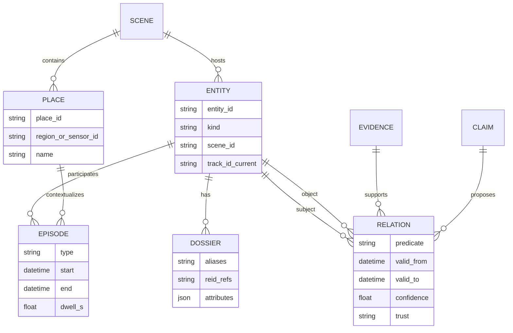
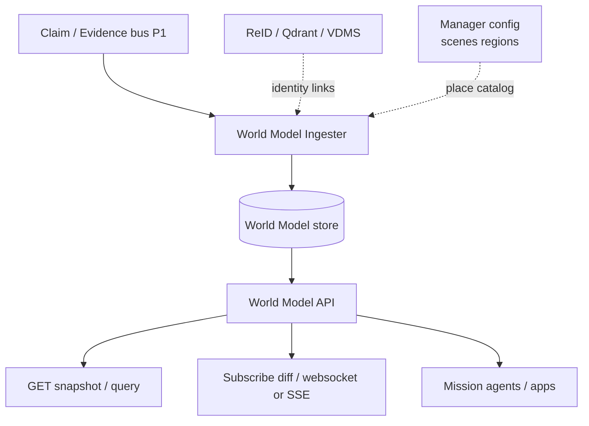
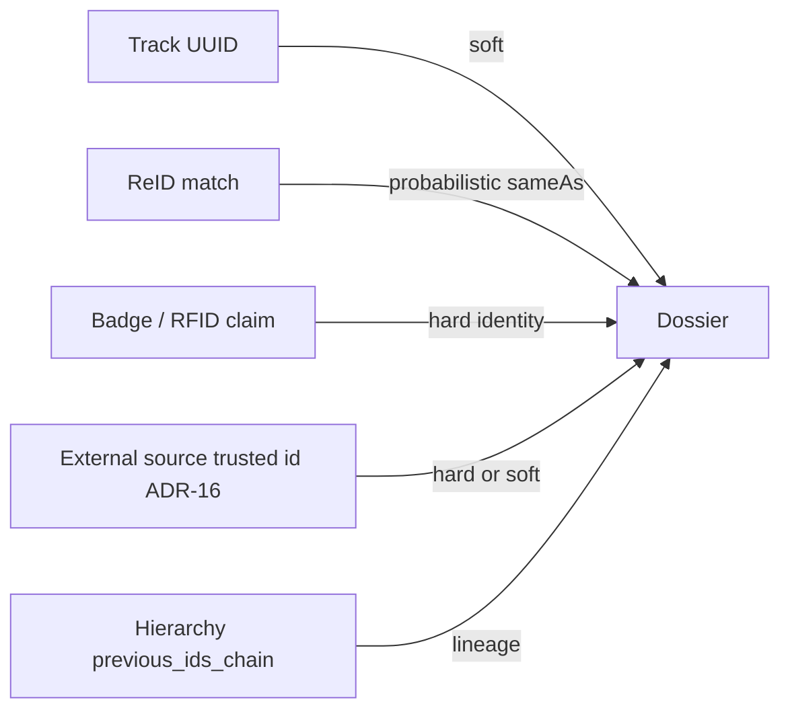

<!--
SPDX-FileCopyrightText: (C) 2026 Intel Corporation
SPDX-License-Identifier: Apache-2.0
-->

# Design Document: Phase 2 — World Model and Identity

- **Author(s)**: [Sarat Poluri](https://github.com/spoluri)
- **Date**: 2026-08-23
- **Status**: `Proposed`
- **Related ADRs**: [ADR-10](../../adr/0010-reid-metadata-storage-architecture.md), [ADR-11](../../adr/0011-inner-product-reid-state-and-id-lineage.md), [ADR-15](../../adr/0015-hierarchy-reid-provenance.md), [ADR-16](../../adr/0016-unified-external-source-ingestion.md)
- **Parent**: [00 — Overview](00-overview-and-roadmap.md)
- **Depends on**: [02 — Fact projection and claim bus](02-fact-projection-and-claim-bus.md)
- **Next**: [04 — Ontology packs and validator](04-ontology-packs-and-validator.md)

---

## 1. Overview

Phase 2 turns the claim/evidence firehose into a **durable, queryable World Model**: entities, relations, episodes, and identity dossiers with an **agent-facing API**. Scenescape remains the live perception kernel; the World Model is the situational memory and query surface mission agents need.

## 2. Goals

- Persist entities (tracks → long-lived agents/assets when identity allows) and places (regions/sensors as first-class nodes).
- Store time-bounded relations (`locatedIn`, `observedBy`, `taggedWith`, `sameAs`).
- Materialize **episodes** (enter/exit, dwell, crossings) from evidence streams.
- Expose snapshot + subscribe APIs suitable for mission agents.
- Integrate ReID / trusted external IDs into **dossiers** without blocking the Controller.

## 3. Non-Goals

- Full OWL reasoning or vertical ontology packs (Phase 3).
- Mission constraint engine and actuate-and-verify (Phase 4).
- Replacing Manager PostgreSQL config DB.
- Unlimited raw trajectory retention without TTL policy.

## 4. Background / Context

PostgreSQL in Scenescape stores **static configuration**; live object locations are intentionally not the DB system of record. ReID vector DBs hold embeddings and properties (ADR-10) but are not a general world graph. Evaluation tools already reconstruct trajectories from MQTT — productizing that persistence is the gap.

## 5. Proposed Design

### 5.1 Logical world model

### 5.2 Runtime architecture

### 5.3 Identity dossier strategy

**Rules of thumb:**

- Hard identifiers (badge, trusted RTLS asset id) create or merge dossiers with high trust.
- ReID merges are probabilistic; retain competing hypotheses until threshold + time stability (align with ADR-11 semantics).
- Never destroy track-level evidence when merging — keep `sameAs` / alias history.

### 5.4 API sketch (illustrative)

| Operation | Purpose |
|-----------|---------|
| `GET /scenes/{id}/snapshot` | Entities + places + active relations |
| `GET /entities/{id}` | Dossier + current pose/place |
| `GET /entities/{id}/episodes?from&to` | History |
| `QUERY` spatial | near / inside / path candidates |
| `SUBSCRIBE /scenes/{id}` | Incremental updates |
| `GET /places/{id}/occupancy` | Current members + dwell |

Protocol choice: **gRPC + REST gateway** (fits Controller culture) or **GraphQL** for flexible agent queries. Recommendation: **Connect/gRPC** for core + thin REST for apps.

### 5.5 Suggested third-party software

| Component | Default recommendation | Alternatives |
|-----------|------------------------|--------------|
| Graph / relational store | **PostgreSQL + Apache AGE** or pure **PostgreSQL** (entities/edges tables) for edge simplicity | **Neo4j**, Memgraph, Amazon Neptune |
| Time-series trajectories | **TimescaleDB** hypertable or object storage of compressed polylines | InfluxDB |
| Identity vectors | Existing **Qdrant** / **VDMS** (ADR-10) | — |
| API layer | **FastAPI** or **Connect-RPC** | Hasura on Postgres for rapid GraphQL |
| Cache | Redis | — |
| Search (optional) | OpenSearch on dossiers | — |
| Change feed | STORE outbox → NATS/Kafka | LISTEN/NOTIFY |

**Edge-first default:** PostgreSQL (config already present) + JSONB/edge tables or AGE, Timescale extension optional — minimizes new operational surface.

## 6. Alternatives Considered

| Option | Notes |
|--------|-------|
| Keep everything in MQTT retained messages | Cannot query history or dossiers well |
| Neo4j-only from day one | Strong graph UX; heavier ops on constrained edge |
| Use ReID DB as world model | Wrong abstraction; embeddings ≠ episodes |

## 7. Risks and Mitigations

| Risk | Mitigation |
|------|------------|
| Split-brain vs live MQTT | API documents freshness; `as_of` timestamps; live pose may be “last evidence” |
| Costly trajectory storage | Sample / compress; TTL by scene tier |
| False ReID merges | Probabilistic edges; manual/ops undo; audit |
| PII in dossiers | Encryption, retention, access roles — especially retail/defense |

## 8. Rollout / Migration Plan

1. Ingest-only writer from P1 bus into Postgres schema; no API yet.
2. Read API snapshot for one pilot scene.
3. Enable episode materialization from region events.
4. Wire dossier hooks to ReID property fetch (read path).
5. Subscribe API; dogfood with one internal agent.

## 9. Testing & Monitoring

- Replay fixtures → deterministic entity/episode graphs.
- Identity tests: merge/split cases from ReID functional suite.
- SLO: snapshot p99; ingester lag; episode completeness vs MQTT events.

## 10. Demo companion

**[D2 — World Time Machine](06-demo-companions.md#8-d2--world-time-machine-phase-2)** — one connected who/where/when across vision+IT vs NVR/SIEM/BI silos; unknown when dark. Memory for decisions, not log tourism.

## 11. Open Questions

- Entity id namespace: new ULID vs promoting track UUID until hard id exists?
- Multi-site federation in P2 or slip to P4?
- How much Manager UI exposure in P2 vs API-only?

## 12. References

- [ADR-10](../../adr/0010-reid-metadata-storage-architecture.md), [ADR-11](../../adr/0011-inner-product-reid-state-and-id-lineage.md), [ADR-15](../../adr/0015-hierarchy-reid-provenance.md)
- [02 — Claim bus](02-fact-projection-and-claim-bus.md)
- [06 — Demo companions](06-demo-companions.md)
