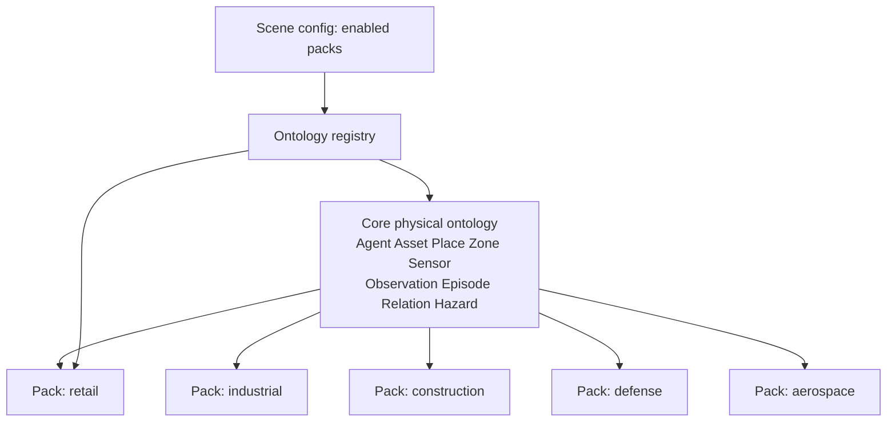
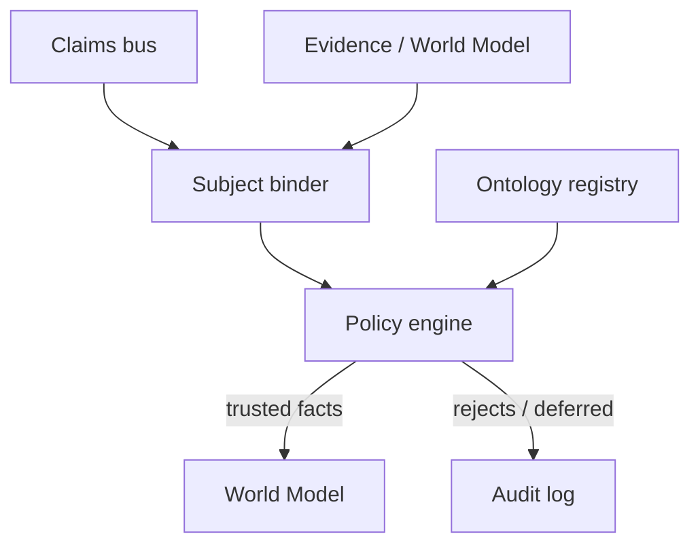
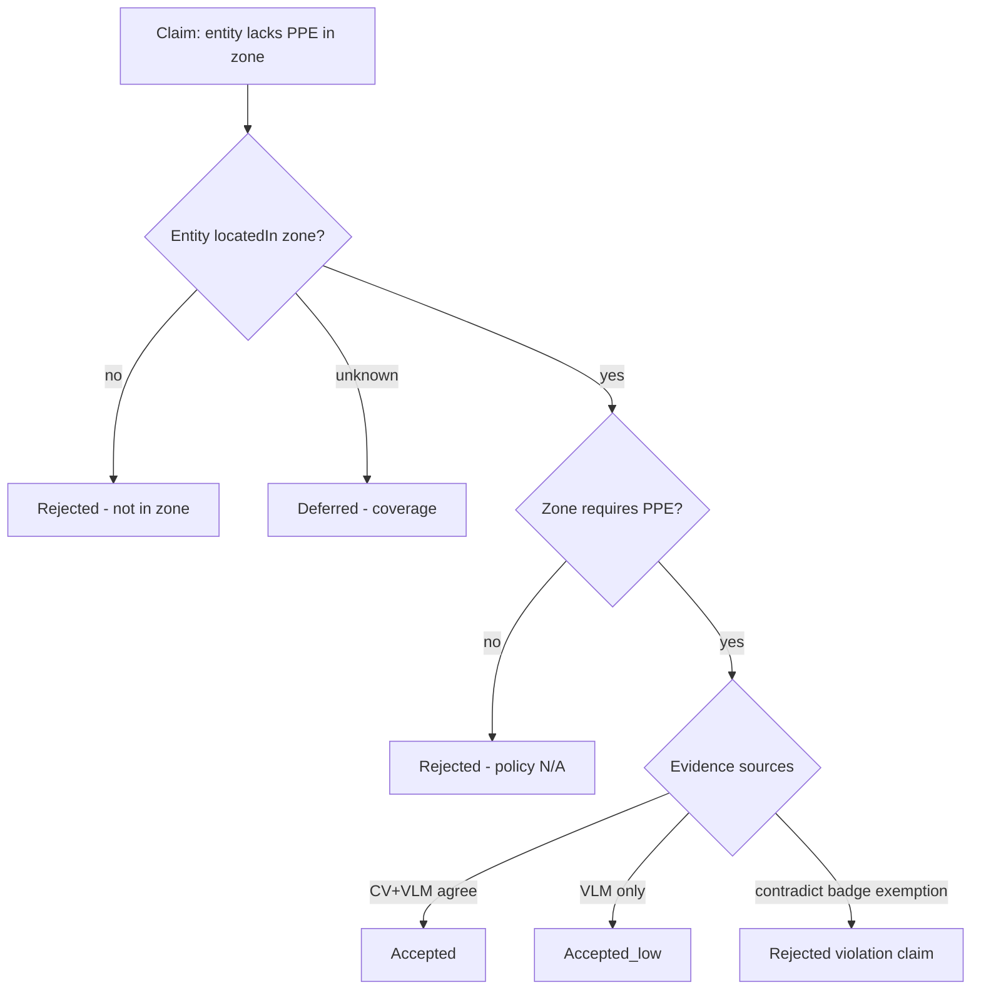

<!--
SPDX-FileCopyrightText: (C) 2026 Intel Corporation
SPDX-License-Identifier: Apache-2.0
-->

# Design Document: Phase 3 — Ontology Packs and Validator

- **Author(s)**: [Sarat Poluri](https://github.com/spoluri)
- **Date**: 2026-08-23
- **Status**: `Proposed`
- **Related ADRs**: _(future ADR: ontology pack format)_
- **Parent**: [00 — Overview](00-overview-and-roadmap.md)
- **Depends on**: [01](01-propose-ground-validate.md), [02](02-fact-projection-and-claim-bus.md), [03](03-world-model-and-identity.md)
- **Next**: [05 — Mission constraints and agent loop](05-mission-constraints-and-agent-loop.md)

---

## 1. Overview

Phase 3 adds **typed meaning** and **policy-based trust**:

1. A **core physical ontology** shared by all deployments.
2. **Vertical packs** (retail, industrial, construction, defense, aerospace, …) that extend classes, predicates, and place roles without forking Scenescape.
3. A **Validator** that binds claims to entities, evaluates evidence against pack policies, and writes **trusted facts** into the World Model.

## 2. Goals

- Replace free-string categories/metadata keys with mapped IRIs (or stable CURIEs) where packs are loaded.
- Ship one **core** pack + at least one vertical pilot pack.
- Validator outcomes: `accepted`, `accepted_low`, `rejected`, `deferred` with auditability.
- Hot-reload or versioned pack activation per scene/site.
- Keep formal reasoning **off** the Controller hot path.

## 3. Non-Goals

- Complete industry standards compliance (ISO, NIEM, etc.) in v1 — map/subset only.
- Automatic ontology learning from VLMs.
- Mission goal compiler (Phase 4 consumes trusted facts).

## 4. Background / Context

`Asset3D` and region names today are operational labels, not a taxonomy. `metadata` is extensible but weakly typed. Without packs and validation, Phase 2 stores richer history but not higher *trust* or cross-vertical reuse.

## 5. Proposed Design

### 5.1 Ontology layering



**Core predicates (examples):** `locatedIn`, `observedBy`, `sameAs`, `hasAttribute`, `adjacentTo`, `coveredBy`, `identifiedBy`.

**Pack examples:**

| Pack | Types / predicates |
|------|-------------------|
| Retail | `Customer`, `Associate`, `Shelf`, `Queue`, `skuOnShelf` |
| Industrial | `WorkCell`, `AGV`, `Lockout`, `WIP` |
| Construction | `PPE`, `ExclusionZone`, `Excavation` |
| Defense | `TrackQuality`, `ROEZone`, force side labels |
| Aerospace | `FOD`, `AircraftStand`, `ToolControl` |

### 5.2 Validator architecture



**Subject binder:** resolve claim subject to `entity_id` using explicit id, hard identity, or spatial+attribute candidates.

**Policy engine inputs:** claim triple, entity types, active place roles, evidence set, coverage/freshness, source trust tier.

### 5.3 Example policy (conceptual)



Policies should be data, not hard-coded Python sprawl.

### 5.4 Pack format (proposal)

Versioned bundle (directory or OCI artifact):

```text
pack.yaml          # id, version, depends: [core>=1.0]
classes.jsonld     # or Turtle/OWL subset
predicates.jsonld
mappings.yaml      # scenescape category/metadata/region → IRI
policies/          # Rego or SHACL shapes
```

Scene/site config references `packs: [core, construction@1.2]`.

### 5.5 Mapping from Scenescape artifacts

| Scenescape | Ontology mapping |
|------------|------------------|
| `category` | → class IRI |
| `metadata.<key>` | → data/object property |
| Region name/type fields | → `Place` individual + roles |
| Sensor `subtype` | → observable type |
| Asset3D defaults | visualization only; class comes from pack mapping |

### 5.6 Suggested third-party software

| Component | Default recommendation | Alternatives |
|-----------|------------------------|--------------|
| Ontology editing | **Protégé** (authoring), export JSON-LD/OWL | TopBraid |
| RDF runtime (optional) | **Oxigraph** or **Apache Jena Fuseki** | GraphDB |
| SHACL validation | **pySHACL**, Jena SHACL | TopBraid SHACL |
| Policy-as-code | **Open Policy Agent (OPA)** / Rego | Cedar, Drools |
| Pack distribution | OCI artifacts / Helm configmaps | Git submodules |
| IRI strategy | `https://scenescape.intel.com/ont/core#` + pack NS | Use existing standards where mapped (e.g. subsets of SOSA/SSN for sensors) |

**Pragmatic default:** JSON-LD contexts + OPA Rego for policies in P3; introduce SHACL/OWL only if packs need richer classification inference.

## 6. Alternatives Considered

| Option | Notes |
|--------|-------|
| Only SHACL on RDF world model | Clean semantically; steeper ops and query learning curve |
| Only ad-hoc Python validators | Fast start; poor pack portability across verticals |
| Upper ontology only (BFO/SUMO) | Too abstract for field engineers; use thin core instead |

## 7. Risks and Mitigations

| Risk | Mitigation |
|------|------------|
| Ontology bikeshedding | Freeze core early; packs iterate behind versioning |
| False trust from OPA misconfig | Policy unit tests + scenario suites mandatory |
| Pack conflicts (two PPE definitions) | Depend-on core; namespace isolation; scene enables one “safety” pack profile |
| VLM open vocab unbound | Map through allowlist or “extension claim” class with low trust |

## 8. Rollout / Migration Plan

1. Publish `core@0.1` with mappings for `person`, `vehicle`, regions, sensors.
2. Validator in shadow mode (log decisions, do not affect apps).
3. Enable write of trusted facts for one predicate (`locatedIn` already evidence-backed).
4. Pilot vertical pack (recommend **construction PPE** or **retail queue** — clear ROI).
5. Flip consumers to prefer `trust=accepted` facts.

## 9. Testing & Monitoring

- Pack CI: mapping coverage, Rego unit tests, golden claim→decision fixtures.
- Metrics: accept/reject/defer rates by `source.kind`; binding failure rate.
- Red-team: contradictory proposers, spoofed claims without evidence.

## 10. Demo companion

**[D3 — Policy Arena](06-demo-companions.md#9-d3--policy-arena-phase-3)** — smart policy on connected facts vs dumb rules on raw inference fields; autonomy gate stays off when baseline still alerts.

## 11. Open Questions

- Who publishes and certifies packs (community vs Intel solutions)?
- Required alignment with SOSA/SSN, Brick, or industry twins (AAS, NGSI-LD)?
- Should rejected claims remain queryable for training/feedback loops?

## 12. References

- [01 — Pattern](01-propose-ground-validate.md)
- [03 — World model](03-world-model-and-identity.md)
- [06 — Demo companions](06-demo-companions.md)
- W3C JSON-LD, SHACL; Open Policy Agent documentation
