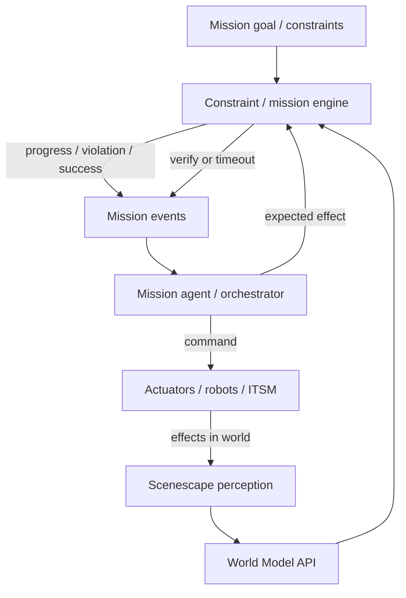
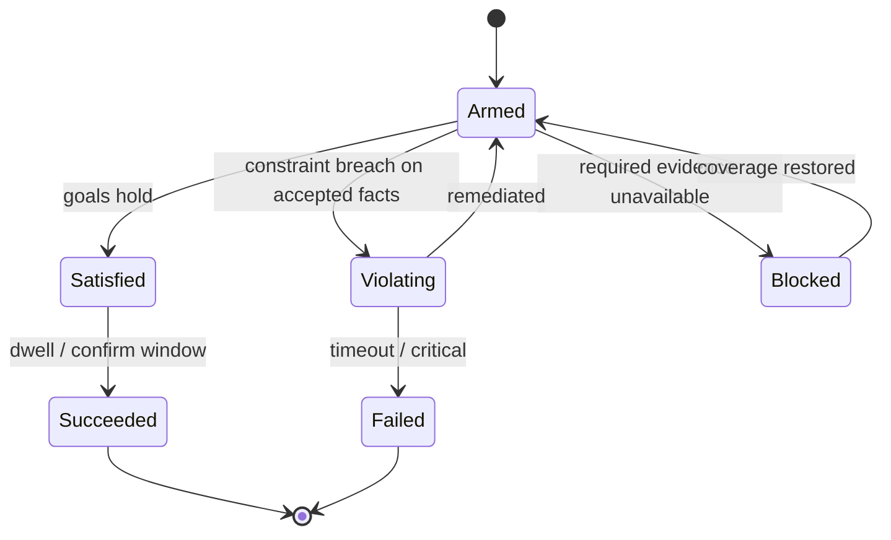
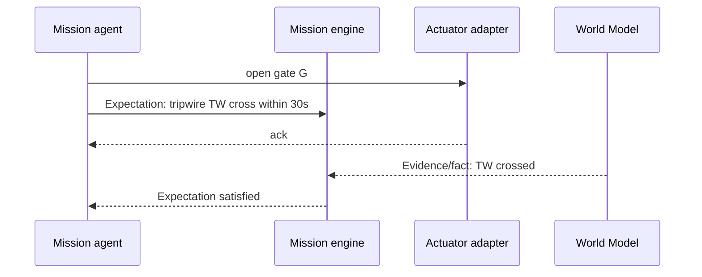

<!--
SPDX-FileCopyrightText: (C) 2026 Intel Corporation
SPDX-License-Identifier: Apache-2.0
-->

# Design Document: Phase 4 — Mission Constraints and Agent Loop

- **Author(s)**: [Sarat Poluri](https://github.com/spoluri)
- **Date**: 2026-08-23
- **Status**: `Proposed`
- **Related ADRs**: [ADR-16](../../adr/0016-unified-external-source-ingestion.md)
- **Parent**: [00 — Overview](00-overview-and-roadmap.md)
- **Depends on**: [03](03-world-model-and-identity.md), [04](04-ontology-packs-and-validator.md)

---

## 1. Overview

Phase 4 closes the loop for **mission agents**: goals and constraints expressed against the World Model, continuous monitoring for success/violation, and optional **actuate-and-verify** against physical effects. Scenescape does **not** become the planner; it becomes the **ground truth monitor** planners and agents share.

## 2. Goals

- Represent missions as desired world states + constraints over trusted facts.
- Emit mission events: progress, success, violation, blocked (coverage/unknown).
- Support multi-vertical constraint packs aligned with Phase 3 ontologies.
- Define actuate-and-verify hooks for robots, gates, alerts (ADR-16 agents as peers).
- Provide audit trails suitable for industrial and defense review.

## 3. Non-Goals

- General-purpose robot motion planning, SLAM, or fleet managers inside Scenescape.
- Guaranteeing real-time hard ROE enforcement for weapons systems (integration pattern only).
- Replacing enterprise workflow tools (ServiceNow, MOC systems) — integrate via adapters.

## 4. Background / Context

With Phases 1–3, agents can query trusted facts but must each reimplement “alert me if PPE violation persists.” Missions need shared monitors, explicit unknown handling, and verification after actions. ADR-16 already lets physical agents publish into scenes; Phase 4 adds expectation tracking after commands leave the system.

## 5. Proposed Design

### 5.1 Mission control loop

### 5.2 Mission information model

| Concept | Description |
|---------|-------------|
| `Mission` | id, scene/site scope, owner, priority, schedule |
| `Goal` | desired facts (e.g. `occupancy(ZoneZ)=0`, `delivered(AssetA, Bay4)`) |
| `Constraint` | continuous conditions (`PPE_required`, `max_speed`, `no_entry`) |
| `Progress` | metrics derived from facts/episodes |
| `Expectation` | after command C, fact F should hold by time T |
| `Outcome` | `succeeded` \| `failed` \| `violated` \| `blocked_unknown` \| `cancelled` |

### 5.3 Constraint evaluation

**Critical rule:** never treat `deferred` / coverage holes as “safe.” Prefer `blocked_unknown` over false success — especially defense, aerospace, safety zones.

### 5.4 Actuate-and-verify

If timeout: `Expectation failed` — agent retries, escalates, or aborts. Scenescape verifies **world effects**, not actuator internals.

### 5.5 Vertical mission examples

| Vertical | Goal | Constraints |
|----------|------|-------------|
| Retail | Reduce queue length at checkout | Staffing SLA, blocked egress |
| Industrial | Clear cell before maintenance | Lockout, AGV lane empty |
| Construction | No personnel in exclusion during lift | PPE, geofence |
| Defense | Maintain perimeter knowledge | Track quality floors, ROE zones |
| Aerospace | FOD walk completion | Stand sterile, tool control |

### 5.6 Suggested third-party software

| Component | Default recommendation | Alternatives |
|-----------|------------------------|--------------|
| Orchestration | **Temporal** workflows for missions | Cadence, Netflix Conductor |
| Agent frameworks | **LangGraph** / custom planners calling World Model API | AutoGen, semantic kernels |
| Alerting | Alertmanager / PagerDuty / ITSM webhooks | — |
| Complex event processing | Flink / **bytewax** on claim/fact streams | Esper |
| Audit log | Append-only store (Postgres + hash chain or **Immutable** object lock) | Kafka compacted audit topic |
| Policy reuse | Same **OPA** as Phase 3 for constraint packs | — |
| Robot interfaces | Adapter to ROS 2 / MOMA / vendor APIs; scenes via ADR-16 | — |

Scenescape owns monitors + world verification; Temporal/LangGraph own multi-step agent logic.

## 6. Alternatives Considered

| Option | Notes |
|--------|-------|
| Encode missions only in external orchestrators | Possible, but shared monitors/audit across agents are weaker |
| Full digital-twin simulation mandatory | Valuable later; not required to ship monitors |
| Push commands through Controller | Avoid — keep perception kernel free of actuation authority |

## 7. Risks and Mitigations

| Risk | Mitigation |
|------|------------|
| Agents over-trust low-confidence facts | Mission policies set min trust tier |
| Actuation without verify | Expectation API required for “closed loop” badge |
| Classification / tenancy | Mission and world-model ACLs; pack-level redaction |
| Alert fatigue | Hysteresis, dwell windows, severity from pack |

## 8. Rollout / Migration Plan

1. Constraint engine read-only on trusted facts (PPE / geofence pilot).
2. Mission events to webhook / MQTT `grounding/mission/{id}`.
3. Expectation API without actuators (simulate verify from recorded events).
4. One live actuator adapter (e.g. warning light / door) in lab.
5. Hardening: audit export, RBAC, multi-site missions.

## 9. Testing & Monitoring

- Scenario tests: success, violation, unknown coverage, expectation timeout.
- Chaos: drop cameras during mission → expect `blocked_unknown`.
- Metrics: mission completion rate, false violation rate, verify latency.

## 10. Demo companion

**[D4 — Mission Cockpit](06-demo-companions.md#10-d4--mission-cockpit-phase-4)** — semi-autonomous mission closure with verify vs rules→alert floods and open-loop automation; refuses success when sources are disconnected or dark.

## 11. Open Questions

- Standard mission IDL (protobuf) vs JSON Schema only?
- Does Scenescape Manager UI author missions, or only external tools?
- Human-in-the-loop approval gates as first-class mission steps?

## 12. References

- [00 — Overview](00-overview-and-roadmap.md)
- [04 — Ontology and validator](04-ontology-packs-and-validator.md)
- [06 — Demo companions](06-demo-companions.md)
- [ADR-16 external sources](../../adr/0016-unified-external-source-ingestion.md)
