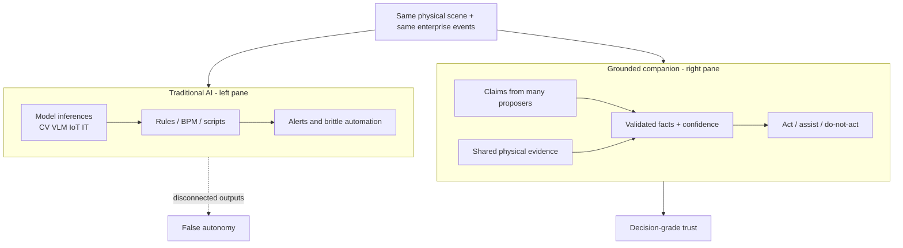
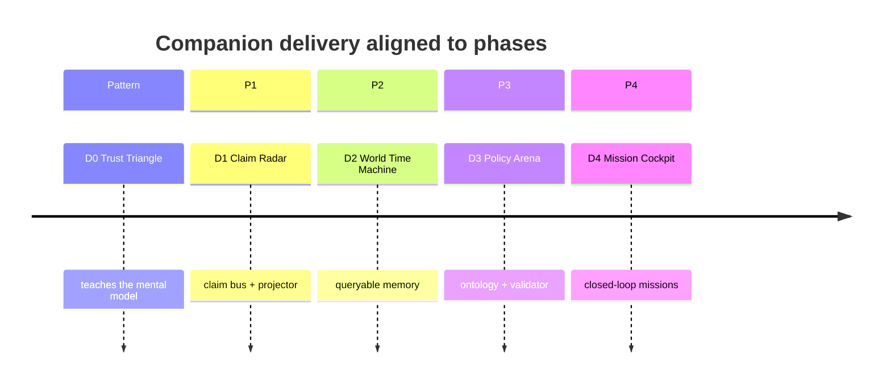
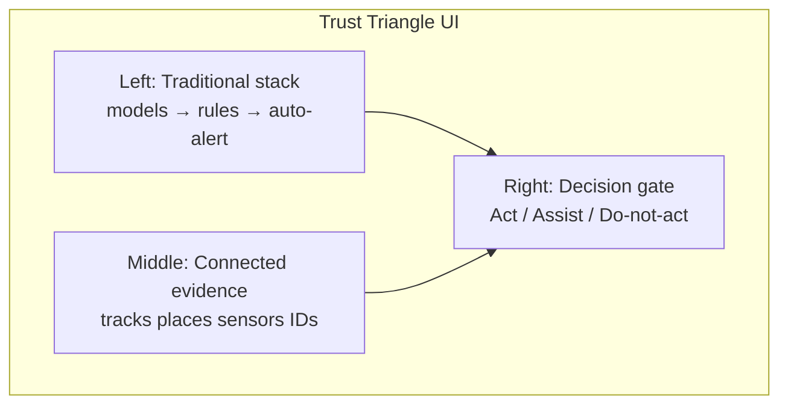
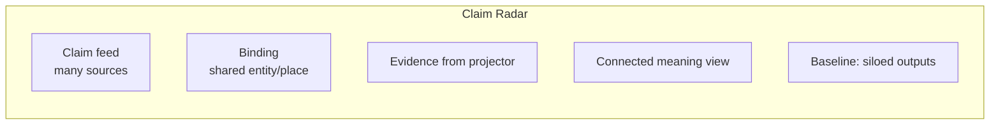
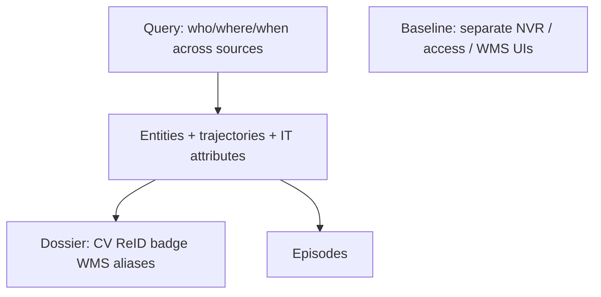
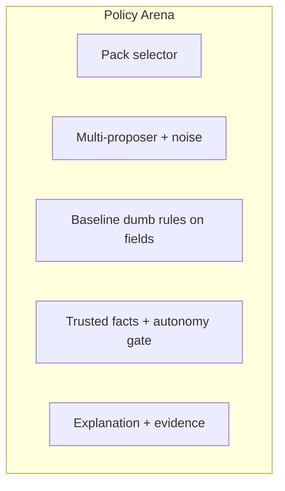
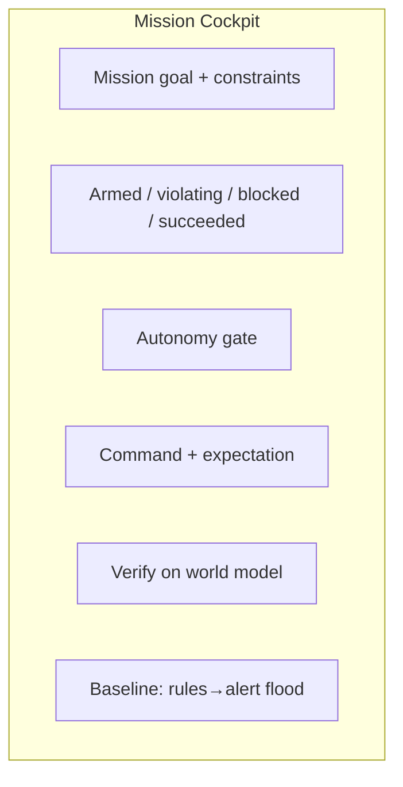
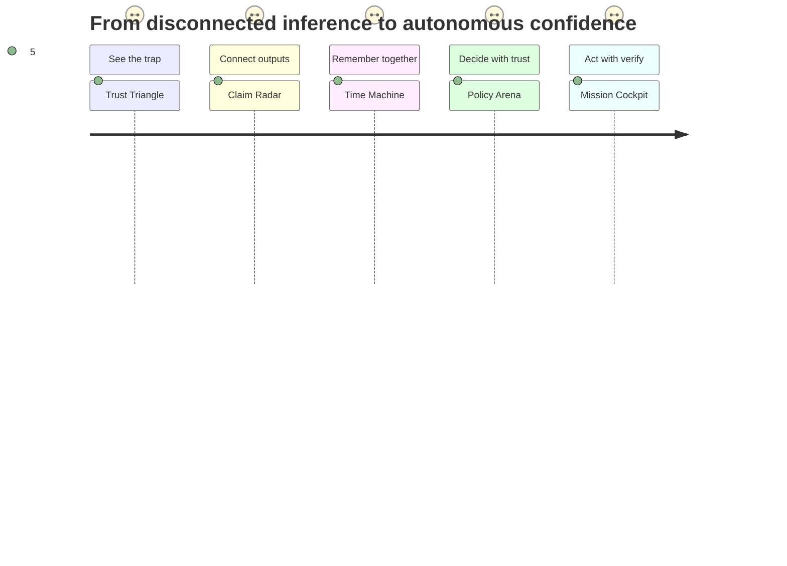
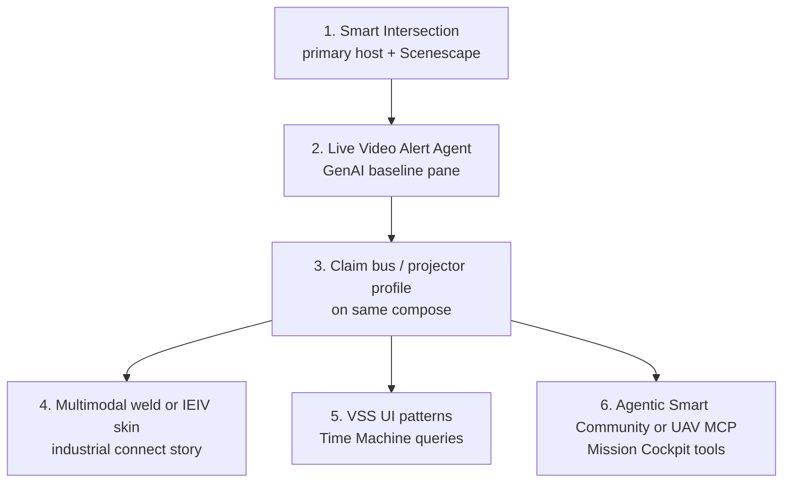
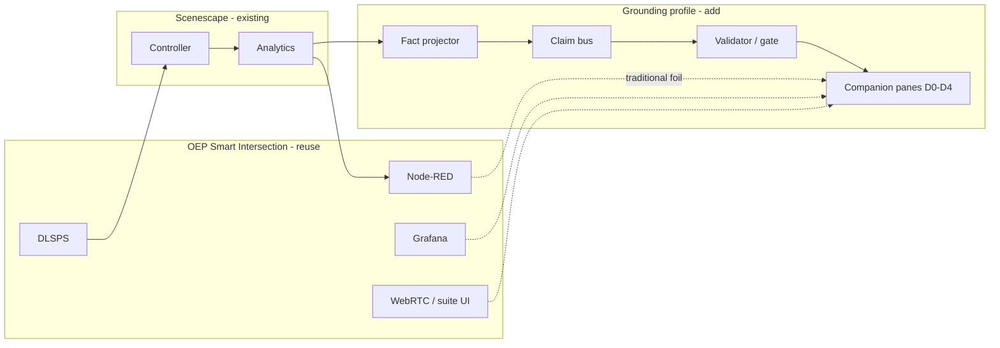

<!--
SPDX-FileCopyrightText: (C) 2026 Intel Corporation
SPDX-License-Identifier: Apache-2.0
-->

# Design Document: Demo and App Companions for Physical World Grounding

- **Author(s)**: [Sarat Poluri](https://github.com/spoluri)
- **Date**: 2026-08-23
- **Status**: `Proposed`
- **Parent**: [00 — Overview and roadmap](00-overview-and-roadmap.md)
- **Covers**: [01](01-propose-ground-validate.md) · [02](02-fact-projection-and-claim-bus.md) · [03](03-world-model-and-identity.md) · [04](04-ontology-packs-and-validator.md) · [05](05-mission-constraints-and-agent-loop.md)

---

## 1. Overview

Each design phase ships with a **demo/app companion**: a focused application that makes the phase’s value obvious in minutes.

Companions are not “VLM vs us” novelty apps. They must demonstrate **elevation past traditional AI approaches** that stop at **model inferencing** and **dumb rules / business logic** on disconnected outputs. The story every companion tells:

1. **Connect** — join CV, VLM, IoT, badge, and enterprise signals that normally never share IDs or frames.
2. **Mean** — turn that join into situational meaning (who/what/where/when/why-it-matters), not another score tile.
3. **Trust** — show calibrated confidence for **semi-autonomous / autonomous** decisions, including **defer / do not act** when evidence is weak or coverage is dark.

Companions are **persuasion and dogfood surfaces**: sales/engineering can run them; developers can extend them. Each must answer: *“Why isn’t model output + a rules engine enough to act?”*

### Design principles for every companion

1. **One killer contrast** — same scene: traditional stack (models → rules → alerts) vs grounded connected meaning.
2. **Disconnection is visible** — baseline pane shows siloed outputs that disagree or never meet; grounded pane shows the join.
3. **Failure is the feature** — baseline confidently automates on incomplete joins; grounded path refuses or downgrades.
4. **Explain the decision** — every accept/reject/defer lists cross-source evidence used.
5. **Autonomy gate** — each demo ends with “would an agent be allowed to act?” (yes / low-trust assist / no).
6. **Vertical skin** — one default story (construction PPE or retail queue); packs swap labels without rewriting the app.
7. **Live or replay** — fixtures first; optional live mode.
8. **Thin on purpose** — companions consume phase APIs/buses; they do not reimplement Controller/Analytics.

---

## 2. Goals

- One named companion per document/phase with a fixed demo script (≤10 minutes).
- Explicit **elevation table** vs traditional inference+rules and vs adjacent tools (NVR, BI, SIEM, VLM demos).
- Shared **fixture pack** that *intentionally includes disconnected sources* (mismatched IDs, partial coverage, conflicting proposers).
- Suggested stack so companions can be built without blocking core services.

## 3. Non-Goals

- Replacing Manager UI or becoming the long-term operator console.
- Production HA, multi-tenant SaaS polish, or full mobile apps in v1.
- Training VLMs inside the companion.
- Claiming that rules engines disappear—**smart policy over connected facts** replaces **dumb rules over raw fields**.

## 4. Shared demo substrate

All companions should reuse one **Grounding Demo Kit**:

| Asset | Purpose |
|-------|---------|
| Scene fixture | Retail *or* construction map + 2–3 cameras (sample_data style) |
| MQTT recording | Regulated scene + region/tripwire events (~5–10 min loop) |
| Video loops | Synchronized or loosely aligned clips for VLM/CV proposers |
| Disconnected injectors | CV attrs, VLM captions, badge swipes, WMS events with *different* native IDs |
| Conflict scripts | Contradictory proposers; camera dropouts; stale enterprise state |
| “Baseline pane” SDK | Models→rules→alerts path with **no shared world join** |

**Suggested companion stack:** Prefer extending OEP suite recipes (see [§12 Open Edge Platform reuse](#12-open-edge-platform-reuse-extend-dont-rebuild)). For thin glue panes: React or Vue + FastAPI BFF; map via existing Scenescape Three.js patterns where useful; Playwright for “press record” demo capture.

**Suggested third-party / OEP:** Metro Vision compose (DLSPS, Mosquitto, Node-RED, Grafana, WebRTC); Live Video Alert Agent as GenAI foil; VSS for query UX; Gradio/Streamlit only if a suite host is unavailable for a spike.

---

## 5. Companion catalog

| ID | Phase doc | App name | One-line pitch |
|----|-----------|----------|----------------|
| D0 | [00](00-overview-and-roadmap.md) / [01](01-propose-ground-validate.md) | **Trust Triangle** | Inference+rules false autonomy vs connected evidence vs act/no-act |
| D1 | [02](02-fact-projection-and-claim-bus.md) | **Claim Radar** | Disconnected model/IT outputs become joinable claims on one bus |
| D2 | [03](03-world-model-and-identity.md) | **World Time Machine** | Situational memory across sources — not siloed logs or video scrub |
| D3 | [04](04-ontology-packs-and-validator.md) | **Policy Arena** | Smart policy on connected facts beats dumb rules on raw fields |
| D4 | [05](05-mission-constraints-and-agent-loop.md) | **Mission Cockpit** | Semi-autonomous closure with verify — not alert piles |

---

## 6. D0 — Trust Triangle (pattern / overview)

### 6.1 What it showcases

The Propose → Ground → Validate mental model—and why **model scores + rules** are not decision-grade. Audiences leave understanding that **disconnected inferences are not meaning**, and **fluent captions are not authority to act**.

### 6.2 App UX

- Scrubber or “incident moments” bookmarks (false automation, true violation, coverage hole).
- Left pane intentionally shows **separate tiles** (CV PPE score, VLM sentence, badge event, zone rule) that never join.
- Right pane shows one decision with evidence list and autonomy gate.
- Toggle “force traditional auto-act” to dramatize false autonomy.

### 6.3 Elevation (not just vs VLM)

| Traditional / adjacent approach | What fails | What Trust Triangle shows |
|---------------------------------|------------|---------------------------|
| Model inference + threshold rules | Acts on one field; ignores cross-source conflict | Join + conflict → defer/reject |
| VLM / caption-only “understanding” | Fluent, ungrounded | Same claim blocked without place/ID evidence |
| Multi-model dashboard mosaics | Juxtaposition ≠ connection | Explicit binding to one track/place |
| BPM “if metadata.x then alert” | No shared world; no coverage notion | Do-not-act when unobserved |
| Chat-with-video | Unreproducible | Provenance-backed gate |

### 6.4 Demo script (8 min)

1. Traditional pane auto-alerts “PPE violation” from VLM+rule while person is **outside** the zone (CV never joined to place).
2. Middle map: track not in exclusion → **Do-not-act / Rejected**.
3. True violation: CV + place + VLM agree → **Act / Accepted** (or assist).
4. Camera occluded + stale rule still green → traditional “clear”; grounded → **Do-not-act (unknown)**.

### 6.5 Success metric

Viewer can explain: *we connect disconnected outputs into meaning, then gate autonomy on trust—not on the loudest model.*

---

## 7. D1 — Claim Radar (Phase 1)

### 7.1 What it showcases

**Connecting** heterogeneous proposers (CV, VLM, badge, ERP) that normally die in separate topics/DBs—without requiring each vendor to invent a world model. Differentiation vs metadata stuffing and N independent rules pipelines.

### 7.2 App UX

- Source filters; **unbound claims** alarm (meaning with no physical subject).
- Baseline strip: same events as unrelated JSON blobs / rule hits.
- Inject contradictory or enterprise claims live.

### 7.3 Elevation

| Traditional / adjacent approach | Limitation | Claim Radar |
|---------------------------------|------------|-------------|
| Per-model inference APIs | No shared subject | One claim envelope + bind |
| Rules on each stream | N logics, no join | Downstream validator-ready bus |
| Metadata-only pipelines | Buried; no lifecycle | First-class claims + time + source |
| ESB / point integrations | Move bytes, not meaning | Semantic roles: claim vs evidence |
| VLM demo apps | Captions without world join | Forced join to physical evidence |

### 7.4 Demo script (10 min)

1. Replay MQTT → evidence stream (physical spine).
2. Fire CV, VLM, badge, WMS claims with **different native IDs** — baseline shows four silos; radar binds three, flags one unbound.
3. Show a rules engine false-positive that never checked place membership.
4. Open raw track JSON and hunt for the same joined meaning (pain).

### 7.5 Build notes

Depends only on P1 projector + bus + sink. Ideal first public demo of **connection**.

---

## 8. D2 — World Time Machine (Phase 2)

### 8.1 What it showcases

**Connected situational memory** for decisions—not log aggregation. Differentiation vs NVR scrub, SIEM field search, BI tiles, and per-system histories that never align on entity/place/time.

### 8.2 App UX

- Naive unique-count vs dossier-merged identity.
- Coverage holes as first-class “cannot answer.”
- Autonomy hint: “enough history to authorize X?”

### 8.3 Elevation

| Traditional / adjacent approach | Limitation | Time Machine |
|---------------------------------|------------|--------------|
| NVR / video search | Pixels; weak cross-cam ID | Entity-centric connected history |
| SIEM / log lakes | Fields without physical join | Place + identity + episode graph |
| BI occupancy KPIs | Aggregates lose who | Named entities and paths |
| Per-app history UIs | Disconnected timelines | One query across proposers + evidence |
| ReID gallery alone | Vectors ≠ world | Dossier + places + enterprise aliases |
| VLM “what happened?” | Story without proof | Evidence-backed timeline |

### 8.4 Demo script (10 min)

1. Ask occupancy/identity questions; show BI tile vs dossier answer.
2. Trace one person across cameras + badge + work order—baseline needs three apps.
3. Drop a camera; query returns **unknown**, not false zero.
4. End with: would you let an agent clear the zone on this memory? (gate).

### 8.5 Killer screenshot

Left: three vendor UIs. Right: one query result with provenance.

---

## 9. D3 — Policy Arena (Phase 3)

### 9.1 What it showcases

**Meaning with confidence**: ontology packs + validators turn connected claims into decision-grade facts. Differentiation vs dumb if/then on raw inference fields and vs treating any model output as truth.

### 9.2 App UX

- Chaos: drop CV, boost VLM, spoof badge, stale WMS.
- Left: rules fire on single fields; right: policy over joined evidence.
- Trusted-fact graph **omits** edges the baseline still asserts.

### 9.3 Elevation

| Traditional / adjacent approach | Limitation | Policy Arena |
|---------------------------------|------------|--------------|
| Threshold rules on model scores | No cross-source semantics | Evidence-aware policies |
| Hard-coded app if/else | Not portable across businesses | Versioned ontology packs |
| VLM graph as world truth | Fluent falsehoods | Reject / low / defer |
| Rules engines without ontology | Fields ≠ types/roles | Typed places and predicates |
| Manual SOC correlation | Doesn’t scale to autonomy | Machine-checkable trust tiers |

### 9.4 Demo script (10 min)

1. Dumb rule alerts on VLM confidence alone → false act.
2. Same inputs through pack policy → Deferred/Rejected with why.
3. Multi-source agreement → Accepted → **Assist/Act** enabled.
4. Hot-swap retail vs construction pack — same physics, different meaning/policy.
5. Show audit: reproducible decision trail for autonomy governance.

### 9.5 Killer moment

Baseline still shows a red alert; grounded autonomy gate stays **Do-not-act**.

---

## 10. D4 — Mission Cockpit (Phase 4)

### 10.1 What it showcases

**Semi-autonomous / autonomous decision confidence** with mission closure and verify—elevation past alert-driven ops and open-loop automation that never checks the connected world.

### 10.2 App UX

- Baseline: inference+rules spam; no success criteria.
- Cockpit: one mission; **blocked_unknown** when disconnected/dark.
- Actuate-and-verify closes the loop.

### 10.3 Elevation

| Traditional / adjacent approach | Limitation | Mission Cockpit |
|---------------------------------|------------|-----------------|
| Alerts from rules engines | No goal; no closure | Mission outcomes |
| RPA / BPM on IT fields | No physical verify | Expectations on grounded facts |
| LLM agents on captions | Act on stories | Act on trusted facts + gate |
| Robot demos open-loop | Command ≠ world effect | Verify / timeout |
| SOP PDFs + human glue | Not executable jointly | Continuous constraints |
| KPI dashboards | Observation ≠ decision | Progress vs desired world state |

### 10.4 Demo script (12 min)

1. Arm “clear zone + PPE hold for lift.”
2. Traditional pane floods alerts; cockpit shows single Violating state.
3. Zone looks empty from stale count while camera dark → baseline would proceed; cockpit **Blocked / Do-not-act**.
4. Restore evidence; constraints hold → Succeeded → autonomy allowed.
5. Agent command + expectation; verify tripwire or fail closed.

### 10.5 Killer moment

Automation that **refuses** to declare success when sources are disconnected or dark—traditional stack “goes green” on the last rule that fired.

---

## 11. Cross-phase story arc (executive demo)

For keynotes, chain companions as chapters of one narrative:

Total ~25 minutes with fixture automation; or 8 minutes using only D0 + D4 highlights.

---

## 12. Open Edge Platform reuse (extend, don’t rebuild)

Companions should **fork or profile-extend** existing Open Edge Platform (OEP) blueprints and sample apps wherever possible. Most Metro Vision recipes already ship the traditional stack this program elevates past: **DLSPS → MQTT → Node-RED/rules → Grafana/alerts**, with optional Scenescape. GenAI alert agents and MCP agent UIs already exist—ground them; do not recreate WebRTC viewers, compose shells, or agent dashboards from scratch.

Primary sources:

- [`open-edge-platform/edge-ai-suites`](https://github.com/open-edge-platform/edge-ai-suites) — industry suites and blueprints
- [`open-edge-platform/edge-ai-libraries`](https://github.com/open-edge-platform/edge-ai-libraries) — sample applications and microservices (VSS, Chat Q&A, …)

### 12.1 Recommended fork order

| Priority | Extend this | Invest here | Do not rebuild |
|----------|-------------|-------------|----------------|
| **1** | [Smart Intersection](https://github.com/open-edge-platform/edge-ai-suites/tree/main/metro-ai-suite/metro-vision-ai-app-recipe/smart-intersection) | Grounding Compose profile beside Node-RED/Grafana; claim/evidence panes | DLSPS, Mosquitto, WebRTC, scene UI |
| **2** | [Live Video Alert Agent](https://github.com/open-edge-platform/edge-ai-suites/tree/main/metro-ai-suite/live-video-analysis/live-video-alert-agent) | Dual-run as traditional GenAI left pane; autonomy gate on right | VLM serving, alert dashboard chrome |
| **3** | [IEIV vision template](https://github.com/open-edge-platform/edge-ai-suites/tree/main/manufacturing-ai-suite/industrial-edge-insights-vision) / [Multimodal weld](https://github.com/open-edge-platform/edge-ai-suites/tree/main/manufacturing-ai-suite/industrial-edge-insights-multimodal) | Multi-proposer injectors (vision + sensors + IT) | Pipeline/Helm boilerplate |
| **4** | [Video Search and Summarization](https://github.com/open-edge-platform/edge-ai-libraries/tree/main/sample-applications/video-search-and-summarization) | Query UX backed by world-model facts (not embeddings alone) | Search UI shell, MCP wiring patterns |
| **5** | [Agentic Smart Community](https://github.com/open-edge-platform/edge-ai-suites/tree/main/metro-ai-suite/agentic-smart-community) or [UAV Mission Compute SDK](https://github.com/open-edge-platform/edge-ai-suites/tree/main/federal-and-aerospace-ai-suite/uav-mission-compute-sdk) | Tools → World Model API; expectations / verify | Agent Vue/MCP dashboard, PX4/Gazebo stack |

### 12.2 Candidate map by companion

| Companion | Primary OEP host to extend | Traditional foil (left pane / baseline) |
|-----------|----------------------------|-----------------------------------------|
| **D0 Trust Triangle** | Smart Intersection (optional Scenescape already) | Live Video Alert Agent + Node-RED on raw metadata |
| **D1 Claim Radar** | Smart Intersection or IEIV compose + multimodal weld proposers | Per-stream MQTT + Node-RED only (no shared subject) |
| **D2 World Time Machine** | Intersection Influx/history path + **VSS** query/UI patterns | [Smart NVR](https://github.com/open-edge-platform/edge-ai-suites/tree/main/metro-ai-suite/smart-nvr) / embedding-only VSS search |
| **D3 Policy Arena** | Intersection + Alert Agent chaos toggles | Node-RED thresholds / VLM prompt→alert |
| **D4 Mission Cockpit** | [Smart Traffic Intersection Agent](https://github.com/open-edge-platform/edge-ai-suites/tree/main/metro-ai-suite/smart-traffic-intersection-agent), [Smart Route Planning Agent](https://github.com/open-edge-platform/edge-ai-suites/tree/main/metro-ai-suite/smart-route-planning-agent), Agentic Smart Community, or UAV MCP | Alert dashboards / open-loop mission scripts |

Sibling Metro Vision recipes share the same architecture and can be used as **vertical skins** without new hosts:

- [Smart Parking](https://github.com/open-edge-platform/edge-ai-suites/tree/main/metro-ai-suite/metro-vision-ai-app-recipe/smart-parking)
- [Loitering Detection](https://github.com/open-edge-platform/edge-ai-suites/tree/main/metro-ai-suite/metro-vision-ai-app-recipe/loitering-detection)
- Recipe overview: [metro-vision-ai-app-recipe](https://github.com/open-edge-platform/edge-ai-suites/tree/main/metro-ai-suite/metro-vision-ai-app-recipe)

### 12.3 Strong supporting pieces (extend lightly)

| OEP component | Role in grounding demos |
|---------------|-------------------------|
| [Sensor Fusion for Traffic Management](https://github.com/open-edge-platform/edge-ai-suites/tree/main/metro-ai-suite/sensor-fusion-for-traffic-management) | Non-VLM proposers/evidence (camera+radar/lidar); feed claim bus, don’t own companion UI |
| [HMI Augmented Worker](https://github.com/open-edge-platform/edge-ai-suites/tree/main/manufacturing-ai-suite/hmi-augmented-worker) | RAG-on-docs **assist** baseline; point retrieval at trusted facts |
| [Chat Question-and-Answer](https://github.com/open-edge-platform/edge-ai-libraries/tree/main/sample-applications/chat-question-and-answer) | LLM proposer/assistant microservice pattern—not ground truth |
| [Live video captioning / captioning-RAG](https://github.com/open-edge-platform/edge-ai-suites/tree/main/metro-ai-suite/live-video-analysis) | Extra VLM/RAG claim injectors for D1/D3 |
| [Retail AI Suite](https://github.com/open-edge-platform/edge-ai-suites/tree/main/retail-ai-suite) (self-checkout, loss prevention, voice) | Vertical skin + proposers after metro host works |
| [Robotics AI Suite](https://github.com/open-edge-platform/edge-ai-suites/tree/main/robotics-ai-suite) | Later affordance/actuation; UAV MCP is lighter for first D4 |

### 12.4 What stays Scenescape-owned

Even when hosting demos inside suite recipes, keep these in the Scenescape / grounding plane (this design set):

- Fact projector and claim/evidence schemas ([02](02-fact-projection-and-claim-bus.md))
- World Model store/API and dossiers ([03](03-world-model-and-identity.md))
- Ontology packs and validator ([04](04-ontology-packs-and-validator.md))
- Mission monitors, expectations, autonomy gate ([05](05-mission-constraints-and-agent-loop.md))
- ADR-16 external-source binding for agents/UAVs

Suite apps provide **compose, UI chrome, proposers, and the traditional foil**—not a second world model.

### 12.5 Integration sketch (Smart Intersection + grounding profile)

Prefer a Compose **profile** (e.g. `grounding-demo`) on the suite recipe over a full repo fork when upstream churn is high; pin suite commit/hash in demo docs.

---

## 13. Implementation plan for companions

| Milestone | Deliverable |
|-----------|-------------|
| M0 | Demo Kit + **Smart Intersection** profile wiring; baseline pane = Node-RED and/or Live Video Alert Agent |
| M1 | D0 Trust Triangle on intersection fixtures (can precede full P1 service) |
| M2 | D1 Claim Radar on real P1 bus; optional multimodal-weld proposers |
| M3 | D2 Time Machine on World Model API; reuse VSS query UX patterns |
| M4 | D3 Policy Arena with one vertical pack + chaos toggles |
| M5 | D4 Mission Cockpit via traffic/UAV MCP agent tools + verify |

**Repo placement (proposal):** prefer extending suite recipes with a Scenescape grounding profile; thin glue may live under `demos/physical-world-grounding/` (shared `demo_kit/`, panes, injectors) rather than duplicating OEP compose trees.

**Licensing:** Apache-2.0, SPDX headers; no customer video in-tree — use synthetic/sample_data or suite-provided samples per their licenses.

## 14. Risks and mitigations

| Risk | Mitigation |
|------|------------|
| Demo depends on flaky live VLM | Precomputed claim tracks in fixtures; live VLM optional |
| Companions become product scope creep | Charter: contrast apps; Manager remains ops UI |
| Vertical story too narrow | Pack skins; Metro recipe siblings + retail/industrial skins |
| Audience thinks Scenescape “is” the agent | Cockpit labels agent as external; Scenescape = ground + verify |
| Suite upstream drift / breaking compose | Pin commit; profile overlay; document known-good suite release |
| Dual maintenance of forked recipe | Prefer profile/overlay PRs upstream when stable |

## 15. Open questions

- Host companions as Compose profiles (`--profile grounding-demo`) on suite recipes vs standalone Scenescape compose?
- Contribute grounding panes upstream to `edge-ai-suites` vs keep demo glue in Scenescape?
- Public web recording vs laptop-only for defense-sensitive packs?
- Need a scored “bake-off” harness (precision of trust decisions) for marketing claims?

## 16. References

- Phase docs 00–05 in this directory
- [Scenescape sample data / scene paradigm](../../user-guide/index.md)
- Existing UI map patterns in Manager (reuse, don’t fork rendering long-term)
- [edge-ai-suites](https://github.com/open-edge-platform/edge-ai-suites) — Metro / Manufacturing / Retail / Robotics / Federal-Aerospace suites
- [edge-ai-libraries sample applications](https://github.com/open-edge-platform/edge-ai-libraries/tree/main/sample-applications)
- [Metro Vision AI App Recipe](https://github.com/open-edge-platform/edge-ai-suites/tree/main/metro-ai-suite/metro-vision-ai-app-recipe)
- [ADR-16 external-source ingestion](../../adr/0016-unified-external-source-ingestion.md)
