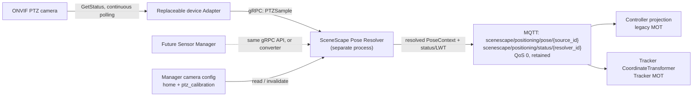

# Design Document: PTZ Camera Pose Service

- **Author(s)**: [Lukasz Talarczyk](https://github.com/ltalarcz), [Dmytro Yermolenko](https://github.com/dmytroye)
- **Date**: 2026-10-02
- **Status**: `Proposed`
- **Related ADRs**: [ADR 13 — Controller Breakdown into Microservices](../adr/0013-controller-breakdown-microservices.md)

---

## 1. Overview

A new microservice resolves the live orientation of ONVIF PTZ cameras and makes it
available to the projection path as a time-stamped, versioned pose context, so that
detections from a moving camera head can still be placed correctly in the scene.

This design is informed by a standalone proof-of-concept
(`ptz_pose_service/` in this repository) built to answer three questions: what data a
real ONVIF PTZ camera actually reports, how accurately pan/tilt can be converted into a
rotation, and what mechanical effects (backlash, axis misalignment) matter in practice.
The PoC's findings are valuable and are carried forward (see
[Background / Context](#4-background--context)). **Its architecture is not**: the PoC
polls the camera and overwrites the camera's stored calibration in the Manager database
directly via REST. That couples a runtime telemetry stream to persistent configuration
state, is specific to Scenescape's REST camera model, and is the write-shared-mutable-state
pattern this design deliberately avoids. The production service instead publishes an
ephemeral pose context that projection consumes per-frame; the camera's stored calibration
remains the static "home" reference and is never overwritten by this service.

## 2. Goals

- Resolve a PTZ camera's current orientation from ONVIF `GetStatus` pan/tilt readings and
  the camera's calibrated home pose, accurate enough for ground-plane projection.
- Publish that orientation as a versioned, timestamped `PoseContext` that downstream
  projection can consume without knowing anything about PTZ, ONVIF, or backlash.
- Make the service's internal camera model (scale/curve, backlash, pan-axis tilt)
  swappable per camera from calibration data, without code changes.
- Keep a stable adapter-to-resolver API and a source-keyed, PTZ-independent resolved-pose
  contract that a future ADR 13 Positioning Service can implement. v1 deliberately uses
  a pose side-channel that each consumer joins to detections; moving that join into an
  inline Positioning → Spatial Transform path will require changing consumer integration
  or adding compatibility adapters. This design does not claim that future migration is
  a move without consumer changes.

## 3. Non-Goals

- Zoom tracking and zoom-dependent intrinsics (first iteration is pan/tilt only).
- Modeling the lever arm between the rotation axes and the optical center (PoC measured
  this as a 0.13 px reprojection improvement on the development camera — negligible
  next to other error sources).
- Non-ONVIF PTZ protocols (proprietary vendor SDKs, serial PTZ).
- Ingesting ONVIF Timed Metadata from the RTP stream (frame-embedded telemetry). May
  become relevant later for fast-slew synchronization; out of scope here.
- Writing camera pose back into the Manager database. This was the PoC's integration
  point and is explicitly replaced, not reused.
- Full ADR 13 Positioning Service extraction (shared pose source for LiDAR, SLAM robots,
  drones). This design covers the PTZ-camera case only. Its v1 side-channel topology is
  intentionally different from ADR 13's inline pose-enriched observation path; a future
  extraction requires a consumer integration migration.

## 4. Background / Context

### Current state

SceneScape today calibrates a camera once and stores a static `rotation`/`translation`
pose (`scene_common.transform.CameraPose`), consumed at detection time in
[`Scene.processCameraData()`](../../controller/src/controller/scene.py). There is no
runtime path that changes a camera's effective pose between detections.

### What the PoC confirmed about the camera and ONVIF

These are measured findings from real hardware, not assumptions, and should seed the new
service's calibration model rather than be re-derived:

| Finding                                             | Detail                                                                                                                                                                                                                                                                                                                                                    |
| --------------------------------------------------- | --------------------------------------------------------------------------------------------------------------------------------------------------------------------------------------------------------------------------------------------------------------------------------------------------------------------------------------------------------- |
| ONVIF position units are not degrees                | `GetStatus` commonly reports a normalized, vendor-defined range. A degrees-per-unit scale (or better, a per-axis polynomial curve) must be derived from the camera's own advertised `AbsolutePanTiltPositionSpace` range, or configured from a datasheet FOV as a fallback. A `"Generic"`-URI or narrow-range space cannot be trusted as literal degrees. |
| Axis travel is non-linear                           | Measured tilt scale varied 53.8–60.6°/unit across the travel on the development camera; a single constant scale under/overshoots at the ends. A low-order polynomial per axis fit this well.                                                                                                                                                              |
| Mechanical backlash is real and asymmetric per axis | 2.83° of slack measured on tilt, ~0 on pan, varying across the travel. The _reported_ position lags the _physical_ one by up to half the slack depending on direction of last travel.                                                                                                                                                                     |
| The pan axis is not perfectly vertical              | Measured ~7° lean on the development camera. No scale or curve correction fixes this — the resulting error grows with the pan angle. Modeling pan as a rotation about the camera's actual (measured) pan axis, not world `Z`, removes it.                                                                                                                 |
| Euler-angle addition is wrong                       | Scenescape stores `rotation` as intrinsic Euler-XYZ. A pure pan move changes all three Euler components (PoC measured roll −14°, pitch +34°, yaw +20° for one move). Adding the pan delta to yaw alone produced ~18° of error; composing full rotation matrices (`R_new = R_pan(axis, Δpan) · R_home · Rx(Δtilt)`) reduced that to ~1.8°.                 |
| Lever arm is negligible                             | Modeling the offset between the rotation axes and the optical center improved reprojection accuracy by only 0.13 px on the development camera and produced a physically implausible fitted value. Treating the camera as rotating about its own center is an acceptable simplification.                                                                   |

### Why the PoC's write path is rejected

The PoC overwrites the camera's `rotation` (and, for point-correspondence-calibrated
cameras, the stored calibration points) via the Manager REST API on every significant
pose change. This was a reasonable shortcut to validate the math end-to-end visually in
the existing calibration UI, but is the wrong integration point for a production service:

- It mutates calibration state that other consumers (Manager UI, autocalibration,
  REST clients) treat as the operator-set ground truth, from a background polling loop.
- It collapses "the camera's calibrated home pose" and "the camera's current live pose"
  into a single stored value, destroying the home reference the computation itself
  depends on — recoverable only via the PoC's own rebaseline heuristic.
- It couples pose freshness to REST write latency and Manager availability on a
  latency-sensitive path. v1 instead uses a bounded, explicit bracketing wait; its delay
  is measured and included in the camera-to-tracker latency budget.
- There is no record of _when_ a given pose was valid relative to a given detection
  frame — exactly the timestamp/sequence gap identified earlier for PTZ support
  in general.

### Relationship to ADR 13

[ADR 13](../adr/0013-controller-breakdown-microservices.md) separates **Positioning**
(pose context for a source) from **Spatial Transform & Projection** (2D → 3D using that
context), both upstream of the Tracker. The Pose Resolver is a separate SceneScape-owned
process and a narrow instance of the Positioning role for ONVIF PTZ cameras — not the
full Positioning Service (which would also serve LiDAR, SLAM robots, and other sources).
ADR 13 places Positioning inline: it joins pose to observations and sends pose-enriched
context to Spatial Transform & Projection. v1 intentionally differs: detections continue
to Controller/Tracker, while the Resolver publishes pose on a separate MQTT topic and
the consumer ingress joins pose to detections by timestamp. This avoids another hop on
the detection path and lets consumers fail closed independently, but it is not ADR 13's
topology. A future inline Positioning deployment must replace or adapt this consumer-side
join; the stable gRPC and PoseContext contracts alone do not make that migration
consumer-transparent. The timestamp-selection algorithm is implemented once in a shared
library with Python and C++ bindings so the two v1 consumers do not independently define
the join. Neither consumer hosts the Resolver or talks to ONVIF. A future Sensor Manager
can call the same gRPC API or use a converter at the device boundary.

### Relationship to external-source pose handling

`controller/src/controller/external_source.py` already resolves and caches
source-to-scene transforms for world-space external observations. Its input contract is
not reused for camera detections, which still require pixel-space projection. The PTZ
PoseContext and external-source ingestion share canonical positioning failure reasons:
`no_pose_available`, `pose_expired`, and `invalid_pose`. PTZ-specific causes remain
available as a bounded `reason_detail` for diagnostics and metrics. This keeps one
consumer-facing vocabulary without conflating the two observation contracts.

### Relationship to the Auto Calibration service

[Auto Calibration](../../autocalibration/Agents.md) owns one-shot/periodic calibration
(`calibration/request|result/<camera_id>`) and the Manager UI establish a camera's
intrinsics and home extrinsics. The Resolver is a read-only consumer of that calibration:
it neither calibrates nor writes live extrinsics back. The Manager camera record is the
source of truth for home pose and the PTZ calibration block. A camera save invalidates
the Resolver's cached configuration through a camera-scoped notification; the Resolver
then re-reads the camera record. A periodic read is a recovery fallback, not the primary
invalidation mechanism.

## 5. Proposed Design

### 5.1 Component overview



Adapter and Resolver are separate deployable processes with separate ownership. An
Adapter may poll one or more cameras; the Resolver owns per-camera calibration, motion
history, and pose resolution. Each camera has exactly one active Resolver owner in v1.
The Controller and Tracker remain independent pose consumers and do not call the
Resolver synchronously on the detection hot path.

### 5.2 Contracts

#### Adapter → Resolver gRPC API (raw PTZ sample)

The API is the stable device-ingestion boundary. It carries raw device-reported values,
not calibration math or resolved scene pose. The unary method is sufficient for the
initial 5 Hz-per-camera load, keeps each sample independently acknowledged, and avoids
an unbounded stream backlog. A persistent gRPC channel is reused; retry behavior must
not replay samples as new data.

The `.proto` is a shared, published contract, stored in a shared API location (for
example `scene_common/proto/` or a small top-level `api/` package), not privately in
either service. Generate and version the Python Adapter and Resolver bindings from this
single source. Publish the versioned `.proto` for Sensor Manager integrations. The
protobuf package namespace (`scenescape.ptz.v1`) is the compatibility boundary: additive
optional fields may be added within v1, but field numbers and existing field semantics
must not be changed or reused; incompatible changes require a new package/API version.

Proposed protobuf API:

```protobuf
syntax = "proto3";

package scenescape.ptz.v1;

import "google/protobuf/timestamp.proto";

service PTZPoseIngest {
  rpc SubmitPTZSample(PTZSample) returns (PTZSampleAck);
}

message PTZSample {
  string camera_id = 1;
  string adapter_instance_id = 2;
  uint64 sequence = 3;
  google.protobuf.Timestamp measured_at = 4;
  uint64 timestamp_uncertainty_ns = 5;
  PTZPosition position = 6;
  ReportedMoveStatus reported_move_status = 7;
}

message PTZPosition {
  double pan = 1;
  double tilt = 2;
  optional double zoom = 3;
  string position_space_uri = 4;
  double pan_min = 5;
  double pan_max = 6;
  double tilt_min = 7;
  double tilt_max = 8;
}

enum ReportedMoveStatus {
  REPORTED_MOVE_STATUS_UNSPECIFIED = 0;
  REPORTED_MOVE_STATUS_IDLE = 1;
  REPORTED_MOVE_STATUS_MOVING = 2;
}

message PTZSampleAck {
  PTZSampleResult result = 1;
  string detail = 2;
  uint64 accepted_sequence = 3;
}

enum PTZSampleResult {
  PTZ_SAMPLE_RESULT_UNSPECIFIED = 0;
  PTZ_SAMPLE_RESULT_ACCEPTED = 1;
  PTZ_SAMPLE_RESULT_DUPLICATE = 2;
  PTZ_SAMPLE_RESULT_OUT_OF_ORDER = 3;
  PTZ_SAMPLE_RESULT_UNKNOWN_CAMERA = 4;
  PTZ_SAMPLE_RESULT_INVALID = 5;
}
```

`measured_at` is the midpoint of the ONVIF request/response interval; uncertainty is at
least half that interval. `sequence` is monotonic within `adapter_instance_id`; a new
instance id marks an Adapter restart. The Resolver validates finite values, advertised
range, timestamp bounds, camera identity, and ordering. It acknowledges duplicates and
out-of-order data without applying it. ONVIF credentials never appear in protobuf,
calibration records, or logs.

`reported_move_status` is advisory only. Resolver-derived `motion_state` remains
authoritative and must use observed position history and the settle interval; a device
reported `IDLE` must not bypass settling or backlash handling, and `MOVING` alone does
not replace the Resolver's state estimation.

The RPC uses mTLS. The client certificate identity is authorized for an explicit set of
camera IDs; the Resolver rejects a sample whose `camera_id` is outside that set. A future
Sensor Manager can implement this client contract directly. This contract replaces the
earlier proposal to transport raw PTZ samples over MQTT.

#### Resolver → MOT consumers: `PoseContext`

The Resolver publishes the resolved, projection-facing contract on
`scenescape/positioning/pose/{source_id}`. For v1, `source_id` is the Manager camera
UID; the topic is source-keyed so a future Positioning Service can publish poses for
other source types without changing the topic namespace. It is registered in
`scene_common.mqtt.PubSub`; its JSON schema is added to
`controller/src/schema/metadata.schema.json` and shared by both consumers. There is no
raw-PTZ MQTT topic in v1.

Example valid message:

```json
{
  "schema_version": 1,
  "source_id": "atag-ptzcam3",
  "timestamp": "2026-10-01T10:15:30.123Z",
  "valid_until": "2026-10-01T10:15:30.623Z",
  "sequence": 10432,
  "valid": true,
  "pose": {
    "frame_id": "scene:<scene_uid>",
    "transform_direction": "scene_from_camera",
    "matrix_layout": "row_major",
    "matrix_4x4": [
      [1, 0, 0, 0],
      [0, 1, 0, 0],
      [0, 0, 1, 4],
      [0, 0, 0, 1]
    ],
    "translation_unit": "m"
  },
  "motion_state": "stationary",
  "sample_age_s": 0.004,
  "timestamp_uncertainty_s": 0.012,
  "calibration_version": "atag-ptzcam3-v3",
  "quality": {
    "score": 0.94,
    "temporal_score": 0.98,
    "calibration_score": 0.96,
    "reprojection_rms_px": 1.2
  }
}
```

`matrix_4x4` is row-major, maps camera optical-frame coordinates into the named scene
frame, uses metres, and contains a rigid transform with unit scale. `frame_id` is
provisional in v1: it identifies the exact scene-local frame and is not a global literal
such as `scene:main`. ADR 13's Shared Scene Graph owns canonical frame/node names; an
adapter must map this provisional identifier to that contract without changing transform
semantics. For a camera in a child scene, the child-to-target-scene transform must be
composed explicitly. Until that transform is resolvable, the consumer fails closed rather
than interpreting the child frame as the parent frame. Translation is
unchanged in v1: the model assumes rotation about the optical center. Intrinsics and
distortion remain the static values from home calibration. The matrix is an immutable
snapshot for one timestamp; consumers must not mutate shared camera configuration.

`invalid_reason` uses the canonical positioning vocabulary already present in
`controller/src/controller/external_source.py`: `no_pose_available`, `pose_expired`, or
`invalid_pose`. PTZ-specific causes are carried in bounded `reason_detail` values:
`no_sample` maps to `no_pose_available`; `sample_stale` maps to `pose_expired`; and
`moving`, `settling`, `calibration_missing`, `calibration_changed`, `invalid_sample`, and
`backlash_unknown` map to `invalid_pose`. The PTZ details remain available for metrics
without creating a competing consumer-facing reason vocabulary. Invalid states use
`valid: false`, timestamp, `valid_until`, sequence, and calibration version; `pose` is
omitted. Consumers enforce both `valid_until` and their local maximum-age bound, so a
crashed Resolver or missed invalid message cannot make a retained pose usable
indefinitely.

Pose messages use MQTT QoS 0 and retain the latest state per source. Resolver service
liveness has a separate retained status/LWT topic
`scenescape/positioning/status/{resolver_id}`; its payload contains only `resolver_id`,
`status`, and `timestamp`. Consumers can distinguish a live Resolver reporting an
invalid pose from an unavailable Resolver, while still enforcing pose freshness
independently. Device-offline state is reported by the Resolver after its per-camera
sample timeout, not encoded as a fabricated raw sample. Pose, status, and
configuration-invalidation topics are registered in `scene_common.mqtt.PubSub`.

#### Pose selection for an observation

`timestamp` is the source sample's `measured_at` time. `valid_until` is the exclusive
expiry `timestamp + max_pose_age_s`, using the same configured `max_pose_age_s` at the
Resolver and both consumers. A pose may be matched only to observations whose acquisition
timestamp is earlier than `valid_until`; consumers additionally enforce freshness against
their synchronized local clock. Startup validation requires
`max_pose_age_s >= poll_interval_s + max_bracket_wait_s + max_timestamp_uncertainty_s`;
`max_bracket_wait_s` already includes the configured transport-jitter allowance. The
example assumes a 5 Hz poll interval, 20 ms maximum transport jitter, 12 ms timestamp
uncertainty, and `max_pose_age_s = 0.5 s`.

The shared selector receives the observation acquisition timestamp and a bounded
PoseContext history for its `source_id`. v1 uses bounded hold (policy A): if the later
stationary sample has not arrived, the observation is held in a bounded pending queue,
without blocking the MQTT callback, until it arrives or the bracket deadline expires.
The deadline is `observation.timestamp + max_bracket_wait_s`, where
`max_bracket_wait_s = poll_interval_s + max_pose_transport_jitter_s`; at the 5 Hz default
this is at most one 200 ms poll period plus configured jitter. If the later sample has
not arrived by then, drop the observation and count a `pose_bracket_timeout`.

Once available, the selector requires valid stationary samples on both sides of the
observation timestamp, with the same source, frame, and `calibration_version`; both must
meet `valid_until`, uncertainty, and consumer-local freshness gates, and the sampled
interval must contain no motion/settling boundary. Use the preceding transform; do not
interpolate or extrapolate. If the later sample is invalid/non-stationary or a motion
boundary is observed, drop the observation immediately rather than waiting for a later
stationary sample. Queue overflow also fails closed and is counted. The shared library
implements selection and deadline decisions once and exposes them to Python and C++.

### 5.3 Adapter (ONVIF polling)

Responsibilities, deliberately narrow:

- Continue polling at a configurable rate (5 Hz default), including while stationary.
  Poll-after-settle is not sufficient: SceneScape may not own PTZ commands, backlash
  needs travel history, and detections continue during movement.
- Timestamp each reading at the midpoint of the request/response round trip and send
  half-round-trip uncertainty.
- Attach a monotonically increasing sequence and Adapter instance ID per camera; send
  raw ONVIF position values plus the advertised position-space URI/ranges.
- Call `SubmitPTZSample` over a persistent mTLS gRPC channel. Retry transient transport
  failures with bounded backoff; do not enqueue an unbounded backlog or replay older
  samples after newer samples have been accepted.
- Keep ONVIF device credentials in deployment secrets/environment, preferably scoped per
  camera. Never write to Manager and never apply calibration math.

The PoC's ONVIF discovery and `GetNodes`/`AbsolutePanTiltPositionSpace` querying logic is
reusable at the calibration-tooling layer (see [5.5](#55-calibration-data-and-tooling)),
not inside the Adapter's polling hot path.

### 5.4 Pose Resolver

The Resolver is a separate process. It loads camera configuration from Manager and
maintains one state machine per configured PTZ camera, holding:

- Home pose (`pose_mat` derived from the camera's calibrated `rotation`/`translation`),
  recorded `home_pan`/`home_tilt`, and the approach direction used at calibration time.
- Per-axis scale or curve, pan axis (defaults to world `Z`, overridable per the PoC's
  measured-lean finding), backlash model, inversion flags.
- A small ring buffer of recent raw readings per camera, used to:
  - classify `stationary` only after readings remain within the configured angular
    threshold for the configured settle interval; classify `slewing` while changing and
    `settling` until the interval passes; transition to `unknown` on timeout/offline;
  - apply the measured scale/curve, direction, backlash history, and pan-axis model;
  - reject non-finite, out-of-range, duplicate/out-of-order, too-old, or mismatched
    calibration-version input;
  - publish a valid PoseContext after accepted samples, and an invalid status when pose
    validity is lost.

All observations, including those received while the camera is stationary, use the shared
timestamp selector and bounded bracket wait defined in
[Pose selection for an observation](#pose-selection-for-an-observation); consumers do
not independently use the latest pose. For `slewing` or `settling`, both consumers fail
closed: they do not project detections or start/update tracks from that camera; prediction
of existing tracks continues according to the tracker's normal lifecycle. `unknown`,
offline, invalid calibration, missing pose, bracket timeout, queue overflow, or age above
the configured maximum are also fail-closed. v1 does not project with a nearest moving
sample or silently extrapolate.

The Resolver publishes one PoseContext contract to MQTT. The Controller and Tracker
subscribe independently and maintain bounded per-source pose state. Both also subscribe
to Resolver status/LWT for availability diagnostics; status does not override pose
timestamp, `valid_until`, or age gates. The timestamp selection/bracketing rule is
implemented once in the shared selector library; Controller uses its Python binding and
Tracker its C++ API. `sample_age_s` is age at Resolver publication; each consumer also
validates `valid_until` and computes effective age from the source timestamp against its
synchronized clock. The Resolver marks samples invalid when input uncertainty or age
exceeds configured bounds.

Quality is diagnostic and does not replace validity gates or detector confidence. At
publication, define
`temporal_score = clamp(1 - (sample_age_s + timestamp_uncertainty_s) / max_pose_age_s, 0, 1)` and
`calibration_score = exp(-0.5 * (reprojection_rms_px / target_reprojection_rms_px)^2)`;
`score = temporal_score * calibration_score`. Missing calibration metrics or exceeding
hard age/uncertainty/reprojection bounds makes the pose invalid rather than assigning a
default score. Consumers recompute temporal score using their locally measured effective
age, rather than trusting a retained publication-time score. Thresholds are deployment
configuration and must be fixed before a profile is enabled.

### 5.5 Calibration data and tooling

The PoC's measurement tools (`measure_ptz_backlash.py`, `fit_ptz_curves.py`,
`measure_ptz_scale.py`, `measure_reprojection_accuracy.py`,
`tune_ptz_camera.sh`) remain valuable as **offline calibration tooling**: they produce
the scale/curve/backlash/pan-axis values the Resolver needs per camera. Manager is the
source of truth. Add a `ptz_calibration` block to the Manager camera schema containing
the measured parameters, home raw pan/tilt, approach directions, and
`calibration_version`; do not store credentials there. The tools write this block via
the authenticated Manager REST API. Local config files may be used by offline tools and
tests only, not as production service configuration.

### 5.6 What changes for projection

v1 deliberately uses a side-channel: detections continue through the existing paths and
each ingress joins them to a timestamp-selected PoseContext. This differs from ADR 13's
inline Positioning output of pose-enriched observations. Neither MOT consumer hosts the
Resolver:

| Profile               | Projection point                                       | v1 integration                                                                                                                                                                                                                               |
| --------------------- | ------------------------------------------------------ | -------------------------------------------------------------------------------------------------------------------------------------------------------------------------------------------------------------------------------------------- |
| Legacy Controller MOT | `Scene.processCameraData()` before in-process tracking | Subscribe to resolved pose topic, maintain bounded per-source pose state, and use the shared selector's Python binding to build a short-lived projection context plus static home intrinsics/distortion. Do not mutate stored `camera.pose`. |
| Tracker MOT           | `CoordinateTransformer` before C++ MOT                 | Subscribe to the same resolved pose topic and pass the selected transform into each batch using the shared selector's C++ API. Preserve timestamp, validity, age, and motion-state gates.                                                    |

The topic payload and selection algorithm are shared contracts; the shared library
provides Python and C++ bindings so selection is not implemented twice. Both paths have
independent feature flags and first run in shadow mode. Shadow
mode logs candidate projections and quality without feeding them to MOT. Standard
deployment profiles are validated separately; do not run two active MOT publishers for
the same scene/lease merely to compare results.

Each consumer maintains a bounded, acquisition-time-ordered pending detection queue per
source. Enqueueing must not block MQTT callbacks; release detections in order after a
valid bracket arrives, and drop/count them on deadline, observed motion boundary, or queue
overflow. The added wait is bounded by `max_bracket_wait_s` and counts toward the
camera-to-tracker latency budget.

In both paths `CameraPose`/`CoordinateTransformer` remain projection implementation
details. The static home transform and intrinsics are immutable configuration snapshots;
the per-frame transform comes from the time-appropriate PoseContext. `rewrite_all_time`
and `rewrite_bad_time` are forbidden for any scene with a PTZ camera because replacing
acquisition timestamps with receive time invalidates pose matching. Startup/config
validation must fail visibly if this invariant is violated.

### 5.7 Configuration invalidation and runtime ownership

Manager owns the camera's home pose and `ptz_calibration`. When a camera is saved, it
publishes a camera-scoped configuration-change notification on
`scenescape/cmd/camera/config/{camera_id}` carrying the new `calibration_version`. The
Resolver invalidates that camera's cached home/calibration and reloads it from Manager
before accepting more samples. If reload fails, the camera pose becomes invalid and
projection fails closed. A periodic read-only refresh is a recovery fallback. Never
adopt the live pose as a new home pose automatically.

Auto Calibration and the UI establish or update the home pose; the Resolver only reads
it. For each camera, only one active Resolver instance may publish the resolved topic in
v1. The initial deployment uses one Resolver replica; horizontal scaling requires
explicit camera ownership/partitioning and is not achieved by increasing replicas alone.

### 5.8 Deployment and security sketch

- **ONVIF Adapter**: one deployable service, configurable for one or more cameras;
  camera credentials mounted as secrets, never embedded in `cameras.json` or logs.
- **Pose Resolver**: separate deployable service with Manager read-only credentials,
  MQTT publish credentials, gRPC server certificate, and per-camera assignment.
- **gRPC**: mTLS on the internal service network; client certificate identity is mapped
  to allowed camera IDs. Validate all device-derived numbers, time ranges, sequence,
  camera ID, and position-space metadata as untrusted input.
- **MQTT**: Resolver may publish only
  `positioning/pose/{assigned_source_id}` and
  `positioning/status/{resolver_id}`. Manager may publish camera-configuration
  invalidations only for cameras it owns. Controller/Tracker may subscribe only to
  cameras in their scene assignment. Retained pose does not bypass timestamp/age
  validation.
- **Consumers**: separate PTZ enable/shadow flags for Controller and Tracker profiles;
  default disabled until each profile passes its own exit criteria.

## 6. Alternatives Considered

- **Reuse the PoC's REST-overwrite design as-is.** Rejected for the reasons in
  [4](#why-the-pocs-write-path-is-rejected): mutates shared calibration state, destroys
  the home reference, couples freshness to REST latency, no per-frame provenance.
- **MQTT raw telemetry from adapter to resolver.** Rejected for v1. The adapter has one
  logical consumer, and gRPC gives an explicit typed request/ack boundary, mTLS identity,
  and per-sample validation without putting raw device data onto the shared broker. The
  raw-input boundary is the versioned protobuf API in [5.2](#52-contracts); a future
  Sensor Manager can implement it directly. If interoperability requires MQTT, a
  separately deployed converter can translate its raw topic into this API.
- **gRPC push from adapter to resolver.** Accepted for v1 as the raw telemetry hop.
  `SubmitPTZSample` is a unary RPC over a persistent mTLS channel. It is distinct from
  ADR 13's future synchronous `getPose(id, when)` query: neither Controller nor Tracker
  makes a per-detection RPC to the Resolver. Resolved poses use MQTT for asynchronous
  fan-out to both MOT consumers.
- **ONVIF Timed Metadata embedded in the RTP stream.** Deferred. Would remove the
  separate-channel synchronization problem entirely, but requires GStreamer-side
  metadata extraction (e.g. `gvapython`) not currently present anywhere in the pipeline,
  and the PoC did not need it to hit acceptable accuracy at the tested slew rates. Worth
  revisiting if fast-slew accuracy proves insufficient (see
  [Open Questions](#10-open-questions)).
- **Resolve pose once and persist a "live pose" alongside the static "home pose" in the
  Manager schema.** Attractive for UI visibility, but reintroduces a persistence write on
  a hot path and a two-writer problem (this service vs. an operator editing calibration).
  Possible future addition purely for UI display, decoupled from the projection-facing
  contract; not required for v1.

## 7. Risks and Mitigations

| Risk                                                                  | Mitigation                                                                                                                                                                                            |
| --------------------------------------------------------------------- | ----------------------------------------------------------------------------------------------------------------------------------------------------------------------------------------------------- |
| ONVIF position space misidentified as degrees (wrong vendor/firmware) | Resolver validates the reported position-space URI/ranges and calibration version; do not infer degrees from a generic or narrow normalized range. Missing measured calibration fails closed.         |
| Backlash/curve/pan-axis miscalibrated for a physical camera           | Require the PoC measurement procedure for each supported camera; record reprojection residual and calibration version; reject uncalibrated settings rather than silently use scale defaults.          |
| Clock/timestamp drift between Adapter and consumers                   | Shared NTP synchronization; midpoint timestamp plus measured half-round-trip uncertainty; all consumers check pose age; `rewrite_all_time` is prohibited for PTZ scenes.                              |
| Out-of-order, repeated, malformed, or unauthorized gRPC samples       | mTLS camera authorization, per-adapter sequence validation, timestamp/range checks, finite-number validation, explicit acknowledgements, and rejection metrics.                                       |
| Stale retained pose after Adapter, Resolver, or camera outage         | Resolver publishes invalid state on sample timeout; consumers independently enforce max pose age; Resolver has separate MQTT status/LWT. No consumer treats retained delivery as proof of freshness.  |
| Controller and Tracker apply different pose semantics                 | One shared timestamp selector with Python and C++ bindings; both bindings run the same conformance vectors; profile-specific shadow and release gates.                                                |
| v1 side-channel differs from ADR 13 inline Positioning topology       | Document the consumer-side join as an interim topology; preserve the source-keyed PoseContext contract and shared selector, and plan an explicit integration migration when Positioning is extracted. |
| Manager calibration changes while Resolver holds cached configuration | Camera-scoped invalidation notification followed by read-only reload; failed reload invalidates pose; periodic refresh is recovery only.                                                              |
| Translation changes due to real PTZ mechanism                         | v1 explicitly holds translation fixed (rotation about optical center); this assumption is documented and validated per supported hardware.                                                            |
| Zoom later changes intrinsics or distortion                           | Zoom remains a non-goal; protobuf optional field and `schema_version` allow evolution, but consumers ignore zoom until a separate calibration design exists.                                          |

## 8. Rollout / Migration Plan

1. **Contracts and math** — add the versioned `.proto` to a shared API package (for
   example top-level `api/ptz/v1/`), generate bindings for Adapter and Resolver, and
   publish the `.proto` plus v1 compatibility policy for Sensor Manager consumers.
   Define the source-keyed `positioning/pose/{source_id}` contract, status/LWT topic,
   `valid_until`, canonical positioning failure reasons with PTZ `reason_detail`, and
   provisional `frame_id` compatibility with the ADR 13 Shared Scene Graph. Implement
   timestamp selection/bracketing once in a shared library with Python and C++ bindings.
   Add shared contract vectors and port the validated PoC math as library-level tests.
2. **Adapter** — implement ONVIF polling → raw gRPC `SubmitPTZSample` only. Verify
   timestamp uncertainty, units/position-space metadata, sequence/restart behavior,
   mTLS identity, bounded retry, and secret handling.
3. **Resolver** — deploy as a separate process; read home pose and `ptz_calibration`
   from Manager; maintain per-camera motion/backlash state; publish valid/invalid
   PoseContext messages. Validate configuration invalidation and single-writer ownership.
4. **Shadow mode, Controller profile** — Controller subscribes and computes candidate
   dynamic projection without feeding legacy MOT. Record per-frame pose sequence,
   calibration version, age, quality, and projection residual.
5. **Shadow mode, Tracker profile** — independently verify its C++ `CoordinateTransformer`
   applies the same resolved transform and gates. Do not run duplicate active MOT
   publishers for one scene/lease to compare profiles.
6. **Feature-flagged projection** — enable dynamic projection separately for each MOT
   profile after that profile passes its shadow exit criteria. Keep static-pose fallback
   and immediate disable/rollback.
7. **Validation and default-on** — use the PoC reprojection methodology, stationary
   targets, both movement directions, measured backlash/axis calibration, sample loss,
   jitter, stale pose, and adapter/resolver restart. Enable by deployment only after the
   spatial-error budget and latency gates below are met.
8. **Future evolution** — a Sensor Manager may replace the ONVIF Adapter by implementing
   the same gRPC input API. The source-keyed PoseContext contract can remain stable, but
   moving the observation/pose join from each consumer into ADR 13 Positioning requires
   changing consumer integration or adding compatibility adapters; this is not a
   move-only extraction. The shared selector avoids reimplementing the v1 join. gRPC
   `getPose(id, when)` is a separate future interface, not part of v1.

## 9. Testing & Monitoring

- **Unit tests**: port the PoC's `pose_math.py` test coverage (axis composition,
  backlash deadband, scale-from-FOV derivation, non-commutativity of pan/tilt) as the
  resolver's core math tests; include unchanged translation and row-major matrix fixtures.
  Run the same timestamp-selection vectors against the shared selector's Python and C++
  bindings; verify `valid_until` and canonical failure-reason mappings.
- **gRPC contract tests**: valid sample, unknown camera, unauthorized certificate,
  duplicate/out-of-order sequence, restart with new adapter instance ID, invalid ranges,
  NaN/Inf, timestamp bounds, and retry/ack behavior.
- **Calibration tooling validation**: the PoC's measurement scripts remain the
  acceptance method for a newly onboarded physical camera (backlash, curve, pan-axis,
  reprojection accuracy) before it is trusted in production.
- **Integration/replay tests**: recorded ONVIF reading sequences (including out-of-order
  and gap scenarios) replayed through gRPC and Resolver; verify state transitions,
  retained valid/invalid output, stale behavior, configuration invalidation, and both
  consumer implementations deterministically. Exercise pending-to-selected, deadline
  timeout, immediate drop on a motion boundary, queue overflow, and in-order release in
  both consumers.
- **Metrics**: `pose_age` distribution, bracket wait duration, pending queue depth,
  bracket timeout and overflow counts, `motion_state` time-in-state histogram per
  camera, gRPC acceptance/rejection counts and latency, timestamp uncertainty, calibration
  version, rejected-pose counts by reason, and resolved-vs-expected drift using the
  linear-regression residual-offset method from the PoC validation.

### Shadow-mode exit criteria

- Every replayed sample has deterministic acceptance/rejection and the same validity
  decision in Controller and Tracker conformance tests using the same shared selector.
- For each supported camera, reprojection RMS and the 95th-percentile ground-plane
  position error meet the configured deployment spatial-error budget in stationary
  scenarios and in both directions of approach. A deployment must configure this budget;
  without it, the PTZ feature cannot be enabled.
- At-home pose output is equivalent to the static calibration within the configured
  reprojection tolerance; pan/tilt sweeps remain within the spatial-error budget.
- During slewing/settling, neither consumer feeds detections from that camera into MOT;
  on stale/offline/invalid pose, both fail closed within the configured max-pose-age.
- Under the target polling rate and configured network impairment, p95 processing latency
  including bracket wait stays within the deployment's camera-to-tracker latency budget;
  no unbounded retry, sample queue, or pending-detection queue forms.
- No increase in false track initiation or duplicate tracks versus the static baseline in
  the agreed replay/field dataset. Each MOT profile passes independently before its flag
  can default on.

## 10. Open Questions

- **Per-deployment spatial-error and latency budgets.** The gates are defined in
  [Testing & Monitoring](#9-testing--monitoring), but each deployment owner must supply
  numerical ground-plane error and camera-to-tracker latency limits before enabling a
  camera. Missing limits mean the feature remains disabled.
- **UI live-pose visualization.** The PoC's Manager redraw depended on writing live
  rotation to the camera record. v1 does not do that. The recommended follow-up is for
  the UI to subscribe to the resolved pose/status topics for display only; this UI
  consumer is not on the projection critical path.
- **Fast-slew synchronization.** v1 fails closed while slewing and settling. If product
  requirements later require tracking during motion, evaluate ONVIF Timed Metadata/RTP
  association or a higher-rate timestamped pose source; do not weaken the v1 gate without
  new accuracy evidence.
- **Future protocols and zoom.** Non-ONVIF adapters and zoom-dependent intrinsics require
  new calibration profiles but must preserve the gRPC raw-ingest and resolved-pose
  boundaries unless a versioned successor is approved.
- **Controller consumer scope versus ADR 13.** PTZ v1 includes a full, independently
  feature-flagged Controller consumer, as well as the Tracker consumer. This deliberately
  invests in the legacy projection path even though ADR 13 schedules it for controlled
  retirement. The v1 consumer-side join must be migrated or adapted when inline
  Positioning → Spatial Transform integration is introduced; that future migration is
  not transparent and must be planned rather than treated as a move-only extraction.
- **Shared Scene Graph frame naming.** `frame_id` is provisional until ADR 13 phase 2
  defines canonical node/frame names. Resolve the adapter mapping and child-scene transform
  composition before enabling PTZ for cameras whose scene frame is nested.

## 11. References

- [ADR 13 — Controller Breakdown into Functionality-Aligned Microservices](../adr/0013-controller-breakdown-microservices.md)
- [ADR 16 — Unified External-Source Ingestion Contract](../adr/0016-unified-external-source-ingestion.md) (publisher-centric contract precedent; `external_source` is not reused for pixel-space camera detections)
- PoC: `ptz_pose_service/` (`src/pose_math.py`, `src/ptz_pose_context.py`, `src/ptz_pose_service.py`, `README.md`, `tools/`)
- [`scene_common/src/scene_common/transform.py`](../../scene_common/src/scene_common/transform.py) (`CameraPose`, reused as-is)
- [`scene_common/src/scene_common/mqtt.py`](../../scene_common/src/scene_common/mqtt.py) (topic template conventions)
- [`controller/src/controller/scene.py`](../../controller/src/controller/scene.py) (legacy Controller projection path)
- [`controller/src/controller/external_source.py`](../../controller/src/controller/external_source.py) (external-source pose cache and canonical failure reasons)
- [`tracker/src/coordinate_transformer.cpp`](../../tracker/src/coordinate_transformer.cpp) (Tracker projection implementation)
- [`tracker/src/message_handler.cpp`](../../tracker/src/message_handler.cpp) (Tracker camera MQTT subscription)
