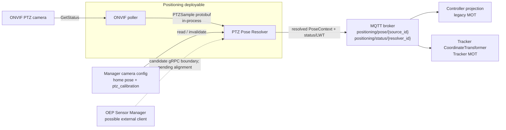

# Design Document: PTZ Pose, v1 Capability of the Positioning Service

- **Author(s)**: [Lukasz Talarczyk](https://github.com/ltalarcz), [Dmytro Yermolenko](https://github.com/dmytroye)
- **Date**: 2026-10-02
- **Status**: `Proposed`
- **Related ADRs**: [ADR 13 — Controller Breakdown into Microservices](../adr/0013-controller-breakdown-microservices.md)

---

## 1. Overview

The Positioning Service resolves the live orientation of ONVIF PTZ cameras and publishes
it as a time-stamped, versioned pose context for projection. This lets detections from a
moving camera head be placed in the scene using a pose valid for the frame's acquisition
time. In v1, ONVIF polling and PTZ pose resolution run as separate modules in one
deployable. They exchange versioned protobuf message types in-process; no internal gRPC
hop is used. The Manager retains the static home pose and versioned PTZ calibration; live
pose is not written back to camera configuration.

The production design carries forward measurements from the PoC described in
[Background / Context](#4-background--context). It replaces the PoC's direct REST writes
with a timestamped pose contract and read-only calibration access. The PoC is evidence
for the PTZ model, not the production service architecture.

## 2. Goals

- Resolve a PTZ camera's current orientation from ONVIF `GetStatus` pan/tilt readings and
  the camera's calibrated home pose, accurate enough for ground-plane projection.
- Publish that orientation as a versioned, timestamped `PoseContext` that downstream
  projection can consume without knowing anything about PTZ, ONVIF, or backlash.
- Make the per-camera motion model (scale/curve, backlash, and calibrated pan- and
  tilt-axis orientation) configurable from calibration data, without code changes.
- Define stable raw-sample and source-keyed resolved-pose contracts. v1 deliberately uses
  a pose side-channel that each consumer joins to detections; moving that join into the
  ADR 13 inline Positioning → Spatial Transform path will require changing consumer
  integration or adding compatibility adapters.

## 3. Non-Goals

- Zoom tracking and zoom-dependent intrinsics (first iteration is pan/tilt only).
- Modeling the lever arm between the rotation axes and the optical center (the PoC
  measured a 0.13 px reprojection improvement on its TP-Link VIGI C540V — negligible
  next to other error sources on that tested setup).
- Non-ONVIF PTZ protocols (proprietary vendor SDKs, serial PTZ).
- Ingesting ONVIF Timed Metadata from the RTP stream (frame-embedded telemetry). May
  become relevant later for fast-slew synchronization; out of scope here.
- Writing camera pose back into the Manager database. This was the PoC's integration
  point and is explicitly replaced, not reused.
- Supporting non-PTZ sources such as LiDAR, SLAM robots, and drones in this initial
  capability. Positioning is the owning service, but v1 covers PTZ cameras only and its
  side-channel topology differs from ADR 13's inline pose-enriched observation path.

## 4. Background / Context

### Current state

SceneScape today calibrates a camera once and stores a static `rotation`/`translation`
pose (`scene_common.transform.CameraPose`), consumed at detection time in
[`Scene.processCameraData()`](../../controller/src/controller/scene.py). There is no
runtime path that changes a camera's effective pose between detections.

### What the PoC confirmed about the camera and ONVIF

These PoC findings were measured on a TP-Link VIGI C540V. The numeric results are specific
to that camera, firmware, and measurement setup; they are not defaults for other camera
models. Each supported camera requires its own measured calibration and accuracy
validation. The findings inform the Positioning Service's PTZ model:

| Finding                                             | Detail                                                                                                                                                                                                                                                                                                                                                    |
| --------------------------------------------------- | --------------------------------------------------------------------------------------------------------------------------------------------------------------------------------------------------------------------------------------------------------------------------------------------------------------------------------------------------------- |
| ONVIF position units are not degrees                | `GetStatus` commonly reports a normalized, vendor-defined range. A degrees-per-unit scale (or better, a per-axis polynomial curve) must be derived from the camera's own advertised `AbsolutePanTiltPositionSpace` range, or configured from a datasheet FOV as a fallback. A `"Generic"`-URI or narrow-range space cannot be trusted as literal degrees. |
| Axis travel is non-linear                           | Measured tilt scale varied 53.8–60.6°/unit across the travel on the TP-Link VIGI C540V; a single constant scale under/overshoots at the ends. A low-order polynomial per axis fit this well.                                                                                                                                                              |
| Mechanical backlash is real and asymmetric per axis | 2.83° of slack was measured on tilt and approximately 0° on pan, varying across the travel. The _reported_ position lags the _physical_ one by up to half the slack depending on direction of last travel.                                                                                                                                                |
| The pan axis is not perfectly vertical              | A roughly 7° lean from world `Z` was measured on the TP-Link VIGI C540V. No scale or curve correction fixes this; the resulting error grows with pan angle. Modeling pan as a rotation about that camera's measured pan axis, rather than assuming alignment with world `Z`, removed the error on the tested setup. Other camera designs and mounting orientations require their own measurements. |
| Euler-angle addition is wrong                       | Scenescape stores `rotation` as intrinsic Euler-XYZ. A pure pan move changed all three Euler components in the PoC (roll −14°, pitch +34°, yaw +20° for one move). Adding pan delta to yaw alone produced about 18° of error; full matrix composition reduced it to about 1.8° on the tested setup.                                                       |
| Lever arm is negligible                             | Modeling the offset between the rotation axes and the optical center improved reprojection accuracy by only 0.13 px on the TP-Link VIGI C540V and produced a physically implausible fitted value. Treating the camera as rotating about its own center is an acceptable simplification for that tested setup.                                             |

The PoC did not calibrate tilt-axis orientation independently. Production calibration
must account for tilt-axis mounting inaccuracy as well as pan-axis misalignment. The
per-camera tilt-axis model and its measurement procedure must be validated on supported
hardware before implementation acceptance; the PoC numbers above do not establish that
model.
The production model must therefore treat the tilt axis as a per-camera calibrated axis,
not assume an ideal `Rx(Δtilt)`. Record its orientation and coordinate frame in
`ptz_calibration`, then compose pan and tilt as rotations about the calibrated axes. The
exact frame convention, composition order, and parameterization remain subject to
hardware measurement. Do not assume either camera axis aligns with a world axis, and do
not infer tilt-axis parameters from the PoC.

### Why the PoC's write path is rejected

The PoC overwrites the camera's `rotation` (and, for point-correspondence-calibrated
cameras, the stored calibration points) via the Manager REST API on every significant
pose change. This was a reasonable shortcut to validate the math end-to-end visually in
the existing calibration UI, but is the wrong integration point for a production service:

- It mutates calibration state that other consumers (Manager UI, autocalibration,
  REST clients) treat as the operator-set ground truth, from a background polling loop.
- It collapses "the camera's calibrated home pose" and "the camera's current live pose"
  into a single stored value, destroying the home reference the computation itself
  depends on — recoverable only via the PoC's own rebaseline heuristic.
- It couples pose freshness to REST write latency and Manager availability on a
  latency-sensitive path. v1 instead accepts detections only after a configured
  stationary dwell that covers the hard maximum detection-pipeline latency; it adds no
  per-detection wait or queue.
- There is no record of _when_ a given pose was valid relative to a given detection
  frame — exactly the timestamp/sequence gap identified earlier for PTZ support
  in general.

### Relationship to ADR 13

[ADR 13](../adr/0013-controller-breakdown-microservices.md) separates **Positioning**
(pose context for a source) from **Spatial Transform & Projection** (2D → 3D using that
context), both upstream of the Tracker. The PTZ Pose Resolver is a capability within the
Positioning Service, whose broader target also covers LiDAR, SLAM robots, and other
sources. ADR 13 places Positioning inline: it joins pose to observations and sends
pose-enriched context to Spatial Transform & Projection. PTZ v1 intentionally differs:
detections continue to Controller/Tracker, while Positioning publishes pose on a
separate MQTT topic and each consumer ingress joins pose to detections by timestamp.
This avoids another hop on the detection path and lets consumers fail closed
independently, but it is an interim deviation from ADR 13's topology. Moving the join
inline requires changing consumer integration or adding compatibility adapters; the
stable contracts alone do not make that migration transparent. Both v1 consumers apply
the same dwell-selection rules and run shared conformance vectors. Neither consumer hosts
Positioning or talks to ONVIF.

### Relationship to OEP Sensor Manager

The versioned `PTZSample` protobuf contract is the in-process boundary between the ONVIF
poller and Resolver in v1. It may be reusable by a future authenticated external
producer, but whether OEP Sensor Manager is that producer and whether gRPC is the
appropriate integration boundary must be confirmed against its architecture. Sensor
Manager is not a required v1 deployable or runtime dependency. If such an integration is
approved, it may expose the versioned `SubmitPTZSample` gRPC API at the Positioning
deployable boundary; it does not require restoring an internal poller-to-Resolver RPC.
Any approved integration must define
source-to-camera mapping, client identity and authorization, timestamp/sequence behavior,
and contract-version compatibility.

This is distinct from OEP Stream Manager in [ADR 12](../adr/0012-mlops-integration-reuse.md),
which handles camera discovery, video capture, livestreaming, and replay. This design
does not assume Stream Manager supplies PTZ telemetry.

### Relationship to external-source pose handling

`controller/src/controller/external_source.py` already resolves and caches
source-to-scene transforms for world-space external observations. Its input contract is
not reused for camera detections, which still require pixel-space projection. The PTZ
PoseContext and external-source ingestion share canonical positioning failure reasons:
`no_pose_available`, `pose_expired`, and `invalid_pose`. PTZ-specific causes remain
available as a bounded `reason_detail` for diagnostics and metrics. This keeps one
consumer-facing vocabulary without conflating the two observation contracts.

### Relationship to the Auto Calibration service

[Auto Calibration](../../autocalibration/Agents.md) owns one-shot/periodic calibration
(`calibration/request|result/<camera_id>`) and the Manager UI establish a camera's
intrinsics and home extrinsics. The Resolver is a read-only consumer of that calibration:
it neither calibrates nor writes live extrinsics back. The Manager camera record is the
source of truth for home pose and the PTZ calibration block. A camera save invalidates
the Resolver's cached configuration through a camera-scoped notification; the Resolver
then re-reads the camera record. A periodic read is a recovery fallback, not the primary
invalidation mechanism.

## 5. Proposed Design

### 5.1 Component overview



The Positioning deployable owns ONVIF polling, the Resolver, per-camera calibration,
motion history, and pose resolution. The poller and Resolver are independently testable
modules joined by the versioned protobuf types in-process. In v1, Resolver state is
created only for supported PTZ cameras explicitly configured for the service and with
valid compatible calibration; ONVIF discovery alone does not enroll a camera or enable
projection. Each enrolled camera has exactly one active Resolver owner. Manager configuration and MQTT are external
interfaces. Any future Sensor Manager integration is optional and subject to
confirmation against that system's architecture; it is not a second v1 ingest service.
Controller and Tracker remain independent pose consumers and do not call Positioning
synchronously on the detection hot path. The consumer-side join is a v1 integration
choice, not the ADR 13 target path.

### 5.2 Contracts

#### Raw PTZ sample contract and optional external API

`PTZSample` is the stable raw-ingest boundary. It carries device-reported values, not
calibration math or resolved scene pose. The ONVIF poller passes this message directly
to the Resolver in-process in v1. The protobuf service definition is a proposal for a
possible future external producer; its use by Sensor Manager and the choice of gRPC
remain subject to architecture confirmation. It is not an internal network hop.
The in-process entry point mirrors the RPC contract as
`submit_ptz_sample(PTZSample) -> PTZSampleAck`, preserving the same validation and
acknowledgement semantics without serialization, a channel, or a network boundary.

The `.proto` is a shared, published contract stored at `api/positioning/v1/`, not
privately in a module. Generate the Python message types from this single source and use
those types at the in-process poller-to-Resolver boundary. Keep the versioned `.proto`
available for review of possible future external integrations. The protobuf package namespace
(`scenescape.ptz.v1`) is the wire compatibility boundary: additive optional fields may
be added within v1, but field numbers and existing field semantics must not be changed
or reused; incompatible changes require a new package/API version.

If an external Sensor Manager integration is confirmed and implemented, it must
authenticate as an authorized producer, provide the sample timestamp and ordering metadata required by `PTZSample`,
and use a source identifier that Positioning maps to a Manager-owned camera calibration.
The API contract and mapping are part of that future integration; v1 implementation does
not depend on Sensor Manager availability.

Proposed protobuf API:

```protobuf
syntax = "proto3";

package scenescape.ptz.v1;

import "google/protobuf/timestamp.proto";

service PTZPoseIngest {
  rpc SubmitPTZSample(PTZSample) returns (PTZSampleAck);
}

message PTZSample {
  string camera_id = 1;
  string adapter_instance_id = 2;
  uint64 sequence = 3;
  google.protobuf.Timestamp measured_at = 4;
  uint64 timestamp_uncertainty_ns = 5;
  PTZPosition position = 6;
  ReportedMoveStatus reported_move_status = 7;
}

message PTZPosition {
  double pan = 1;
  double tilt = 2;
  optional double zoom = 3;
  string position_space_uri = 4;
  double pan_min = 5;
  double pan_max = 6;
  double tilt_min = 7;
  double tilt_max = 8;
}

enum ReportedMoveStatus {
  REPORTED_MOVE_STATUS_UNSPECIFIED = 0;
  REPORTED_MOVE_STATUS_IDLE = 1;
  REPORTED_MOVE_STATUS_MOVING = 2;
}

message PTZSampleAck {
  PTZSampleResult result = 1;
  string detail = 2;
  uint64 accepted_sequence = 3;
}

enum PTZSampleResult {
  PTZ_SAMPLE_RESULT_UNSPECIFIED = 0;
  PTZ_SAMPLE_RESULT_ACCEPTED = 1;
  PTZ_SAMPLE_RESULT_DUPLICATE = 2;
  PTZ_SAMPLE_RESULT_OUT_OF_ORDER = 3;
  PTZ_SAMPLE_RESULT_UNKNOWN_CAMERA = 4;
  PTZ_SAMPLE_RESULT_INVALID = 5;
}
```

`measured_at` is the midpoint of the ONVIF request/response interval; uncertainty is at
least half that interval. `sequence` is monotonic within `adapter_instance_id`; a new
instance id marks an Adapter restart. The Resolver validates finite values, advertised
range, timestamp bounds, camera identity, and ordering. It acknowledges duplicates and
out-of-order data without applying it. ONVIF credentials never appear in protobuf,
calibration records, or logs.

`reported_move_status` is advisory only. Resolver-derived `motion_state` remains
authoritative and must use observed position history and the settle interval; a device
reported `IDLE` must not bypass settling or backlash handling, and `MOVING` alone does
not replace the Resolver's state estimation.

If the optional external gRPC API is enabled for Sensor Manager, it uses mTLS and maps
client certificate identities to explicit camera permissions. The in-process v1 call
does not use a service certificate or network authorization boundary; the Resolver still
validates camera identity and all sample data. Raw PTZ samples are not sent over MQTT.

#### Resolver → MOT consumers: `PoseContext`

The Resolver publishes the resolved, projection-facing contract on
`scenescape/positioning/pose/{source_id}`. For v1, `source_id` is the Manager camera
UID; the topic is source-keyed so a future Positioning Service can publish poses for
other source types without changing the topic namespace. It is registered in
`scene_common.mqtt.PubSub`; its JSON schema is added to
`controller/src/schema/metadata.schema.json` and shared by both consumers. There is no
raw-PTZ MQTT topic in v1.

Example valid message:

```json
{
  "schema_version": 1,
  "source_id": "atag-ptzcam3",
  "timestamp": "2026-10-01T10:15:30.123Z",
  "valid_until": "2026-10-01T10:15:30.623Z",
  "sequence": 10432,
  "valid": true,
  "pose": {
    "frame_id": "scene:<scene_uid>",
    "transform_direction": "scene_from_camera",
    "matrix_layout": "row_major",
    "matrix_4x4": [
      [1, 0, 0, 0],
      [0, 1, 0, 0],
      [0, 0, 1, 4],
      [0, 0, 0, 1]
    ],
    "translation_unit": "m"
  },
  "motion_state": "stationary",
  "sample_age_s": 0.004,
  "timestamp_uncertainty_s": 0.012,
  "calibration_version": "atag-ptzcam3-v3",
  "quality": {
    "score": 0.94,
    "temporal_score": 0.98,
    "calibration_score": 0.96,
    "reprojection_rms_px": 1.2
  }
}
```

`matrix_4x4` is row-major, maps camera optical-frame coordinates into the named scene
frame, uses metres, and contains a rigid transform with unit scale. `frame_id` is
provisional in v1: it identifies the exact scene-local frame and is not a global literal
such as `scene:main`. ADR 13's Shared Scene Graph owns canonical frame/node names; an
adapter must map this provisional identifier to that contract without changing transform
semantics. For a camera in a child scene, the child-to-target-scene transform must be
composed explicitly. Until that transform is resolvable, the consumer fails closed rather
than interpreting the child frame as the parent frame. Translation is
unchanged in v1: the model assumes rotation about the optical center. Intrinsics and
distortion remain the static values from home calibration. The matrix is an immutable
snapshot for one timestamp; consumers must not mutate shared camera configuration.

`motion_state` is one of: `stationary` (position within settled threshold for settle
interval), `slewing` (position changing), `settling` (changed but not yet settled), or
`unknown` (unknown due to timeout/offline/initial state). `invalid_reason` uses the
canonical positioning vocabulary already present in
`controller/src/controller/external_source.py`: `no_pose_available`, `pose_expired`, or
`invalid_pose`. PTZ-specific causes are carried in bounded `reason_detail` values:
`no_sample` maps to `no_pose_available`; `sample_stale` maps to `pose_expired`; and
`moving`, `settling`, `calibration_missing`, `calibration_changed`, `invalid_sample`, and
`backlash_unknown` map to `invalid_pose`. The PTZ details remain available for metrics
without creating a competing consumer-facing reason vocabulary. Invalid states use
`valid: false`, timestamp, `valid_until`, sequence, and calibration version; `pose` is
omitted. Consumers enforce both `valid_until` and their local maximum-age bound, so a
crashed Resolver or missed invalid message cannot make a retained pose usable
indefinitely.

Example invalid message:

```json
{
  "schema_version": 1,
  "source_id": "atag-ptzcam3",
  "timestamp": "2026-10-01T10:15:30.450Z",
  "valid_until": "2026-10-01T10:15:30.950Z",
  "sequence": 10433,
  "valid": false,
  "motion_state": "settling",
  "sample_age_s": 0.005,
  "timestamp_uncertainty_s": 0.012,
  "calibration_version": "atag-ptzcam3-v3",
  "invalid_reason": "invalid_pose",
  "reason_detail": "settling"
}
```

Pose messages use MQTT QoS 0 and retain the latest state per source. Resolver service
liveness has a separate retained status/LWT topic
`scenescape/positioning/status/{resolver_id}`; its payload contains only `resolver_id`,
`status`, and `timestamp`. The LWT is published by the broker from the payload registered
at CONNECT, so `timestamp` records the session start time, not the failure instant;
consumers must rely on message arrival time and/or pose `valid_until` to detect Resolver
downtime, not the timestamp field. Consumers can distinguish a live Resolver reporting an
invalid pose from an unavailable Resolver, while still enforcing pose freshness
independently. Device-offline state is reported by the Resolver after its per-camera
sample timeout, not encoded as a fabricated raw sample. Pose, status, and
configuration-invalidation topics are registered in `scene_common.mqtt.PubSub`.

#### Pose selection for an observation

`timestamp` is the source sample's `measured_at` time. `valid_until` is the exclusive
expiry `timestamp + max_pose_age_s`, using the same configured `max_pose_age_s` at the
Resolver and both consumers. Consumers enforce `valid_until` and freshness against their
synchronized local clock. For v1, startup requires
`max_pose_age_s >= poll_interval_s + max_timestamp_uncertainty_s`.

v1 uses a dwell policy and has no pending-detection queue or per-detection wait. Each
consumer tracks `stationary_since` and its timestamp uncertainty in source event time
per source, using the timestamp of the first valid stationary PoseContext after an
invalid/non-stationary state, calibration change, resolver-session change, or sequence
discontinuity. Dwell duration is measured only in this source event-time domain:
`dwell_elapsed_s = latest_stationary.timestamp - stationary_since`. To account for
timestamp uncertainty conservatively, admission requires
`dwell_elapsed_s - latest_stationary.timestamp_uncertainty_s - stationary_since_uncertainty_s`
to be at least the configured dwell. Subsequent valid stationary samples must be
sequence-contiguous to maintain the dwell proof. Since MQTT pose delivery is QoS 0, a
sequence gap invalidates that proof; the consumer restarts dwell at the newly received
sample's source timestamp rather than assuming the missing interval was stationary.
Dwell state also resets on source/frame mismatch. A resolver status/LWT session change
resets dwell even if the per-source sequence continues across the restart.

The required dwell is at least `max_detection_pipeline_latency_s`, a deployment value
that must be backed by a measured hard upper bound from frame acquisition through
consumer admission. `max_lag` is not assumed to provide that bound. At admission, the
consumer requires a valid, fresh, stationary pose; an uninterrupted stationary dwell at
least that long; matching source, frame, and `calibration_version`; and an acquisition
timestamp whose conservative lower bound is not before `stationary_since`. The lower
bound is `observation.timestamp - max_detection_timestamp_uncertainty_s`; deployments
must configure and validate this timestamp uncertainty bound because the detection
payload does not carry a separate uncertainty field. Independently, at admission the
consumer calculates detection age against its synchronized local clock and drops a late
detection when its age exceeds `max_detection_pipeline_latency_s`, even if dwell is
already complete. During motion, settling, and the full dwell interval, the camera
contributes no detections. Consumers use the latest valid pose after these checks; they
do not interpolate or extrapolate. If the deployment cannot provide a hard
detection-latency bound, bounded timestamp uncertainty, or trustworthy acquisition
timestamps, PTZ projection remains disabled for that source.

### 5.3 Adapter (ONVIF polling)

Responsibilities, deliberately narrow:

- Continue polling at a configurable rate (5 Hz default), including while stationary.
  Poll-after-settle is not sufficient: SceneScape may not own PTZ commands, backlash
  needs travel history, and detections continue during movement.
- Timestamp each reading at the midpoint of the request/response round trip and send
  half-round-trip uncertainty.
- Attach a monotonically increasing sequence and Adapter instance ID per camera; send
  raw ONVIF position values plus the advertised position-space URI/ranges.
- Convert each response to the generated `PTZSample` protobuf type and call the Resolver
  in-process. Do not add an internal gRPC channel or a retry queue. If an external
  Sensor Manager gRPC endpoint is enabled in the future, its transport retry policy is
  specified at that external boundary.
- Keep ONVIF device credentials in deployment secrets/environment, preferably scoped per
  camera. Never write to Manager and never apply calibration math.

The PoC's ONVIF discovery and `GetNodes`/`AbsolutePanTiltPositionSpace` querying logic is
reusable at the calibration-tooling layer (see [5.5](#55-calibration-data-and-tooling)),
not inside the Adapter's polling hot path.

### 5.4 Pose Resolver

The PTZ Pose Resolver is a module in the same process and deployable as the ONVIF poller.
It loads camera configuration from Manager and maintains one state machine per
configured PTZ camera, holding:

- Home pose (`pose_mat` derived from the camera's calibrated `rotation`/`translation`),
  recorded `home_pan`/`home_tilt`, and the approach direction used at calibration time.
- Per-axis scale or curve, calibrated pan- and tilt-axis orientations in explicitly
  identified coordinate frames, backlash models, and inversion flags. The PoC's measured
  pan-axis correction may seed the pan model for that camera; it does not supply a
  calibrated tilt-axis model.
- A small ring buffer of recent raw readings per camera, used to:
  - classify `stationary` only after readings remain within the configured angular
    threshold for the configured settle interval; classify `slewing` while changing and
    `settling` until the interval passes; transition to `unknown` on timeout/offline;
  - apply per-axis scale/curve and backlash history, then compose rotations about the
    calibrated pan and tilt axes using the calibration-defined frames and order;
  - reject non-finite, out-of-range, duplicate/out-of-order, too-old, or mismatched
    calibration-version input;
  - publish a valid PoseContext after accepted samples, and an invalid status when pose
    validity is lost. The Resolver publishes exactly one PoseContext per accepted sample,
    including while stationary; it does not suppress unchanged poses. This gives
    consumers sequence continuity evidence for the v1 dwell policy.

Backlash state is volatile and must be treated as unknown after a Resolver restart, an
Adapter restart (a new `adapter_instance_id`), or a `calibration_version` change. For
each axis, the Resolver may initialize the known home backlash band only when the
reported position is within the configured tolerance of that axis's stored home value
(e.g. `home_pan` for the pan axis) and calibration records that axis's home approach
direction. Per-axis backlash state is internal; the published PoseContext contract
reports whole-pose validity only. This initializes
the same backlash band implied by the calibrated home approach; it does not bypass the
motion/settle or freshness gates. Otherwise, the affected axis remains invalid with
`reason_detail: backlash_unknown` until observed movement establishes the deadband state.
The Resolver must not publish a valid pose while any contributing axis has unknown
backlash state.

In v1, each consumer applies the dwell admission rule defined in
[Pose selection for an observation](#pose-selection-for-an-observation); it does not
queue detections or use a pose from before the stationary dwell. For `slewing` or
`settling`, both consumers fail closed: they do not project detections or start/update
tracks from that camera; prediction of existing tracks continues according to the
tracker's normal lifecycle. `unknown`, offline, invalid calibration, missing/stale pose,
sequence gaps before dwell completion, and detections outside the configured age bound
also fail closed.

The Resolver publishes one PoseContext contract to MQTT. The Controller and Tracker
subscribe independently and maintain bounded per-source pose state. Both also subscribe
to Resolver status/LWT for availability diagnostics; status does not override pose
timestamp, `valid_until`, or age gates. Both implement the same dwell-selection contract
and run the same conformance vectors.
`sample_age_s` is age at Resolver publication; each consumer also validates
`valid_until` and computes effective age from the source timestamp against its
synchronized clock. The Resolver marks samples invalid when input uncertainty or age
exceeds configured bounds.

Quality is diagnostic and does not replace validity gates or detector confidence.
`reprojection_rms_px` is the calibration-time residual stored in `ptz_calibration` and
is not recomputed from live detections. At publication, define
`temporal_score = clamp(1 - (sample_age_s + timestamp_uncertainty_s) / max_pose_age_s, 0, 1)` and
`calibration_score = exp(-0.5 * (reprojection_rms_px / target_reprojection_rms_px)^2)`;
`score = temporal_score * calibration_score`. Missing calibration metrics or exceeding
hard age/uncertainty/reprojection bounds makes the pose invalid rather than assigning a
default score. Consumers recompute temporal score using their locally measured effective
age, rather than trusting a retained publication-time score. Thresholds are deployment
configuration and must be fixed before a profile is enabled.

### 5.5 Calibration data and tooling

`ptz_calibration` is the versioned, per-camera model that converts raw ONVIF readings
into an orientation relative to the camera's static home pose. Home extrinsics alone
describe orientation at one calibrated position; they do not map normalized ONVIF units
to angular movement, compensate for non-linear travel or backlash, or describe tilted
pan/tilt axes caused by mounting inaccuracy.

Manager owns the validated block, which contains the measured parameters needed by the
Resolver:

- Home raw pan/tilt values and the approach direction used to establish each axis home.
- Calibrated ONVIF position-space URI and ranges, plus per-axis scale or curve
  coefficients.
- Per-axis backlash parameters and calibrated pan- and tilt-axis orientations, including
  their coordinate frames and corrections for mounting misalignment.
- `calibration_version` and calibration quality/provenance, including reprojection
  residuals needed for validity checks.

PTZ calibration data is required for every supported camera; the Resolver must fail
closed when it is missing, incomplete, or incompatible with the reported ONVIF position
space. The PoC measurement tools and service remain an **isolated lab deployment** used
to produce and validate these values. Export measured results and submit them through
the product's validated import path to Manager; no lab instrument writes production
calibration directly. Building production calibration tooling is out of scope for this
service, but the hardware measurement, validated import, and per-camera acceptance
procedure are prerequisites to enabling a camera. The tilt-axis correction model must
be selected and validated on supported hardware before implementation acceptance.
The proposed acceptance measurement sweeps the supported tilt range in both directions
at multiple pan positions, fits the tilt-axis model on part of the samples, and checks
reprojection residuals on held-out samples. Compare against the nominal-axis model to
show whether the mounting correction improves the measured projection. Store the axis
convention and measured model with the calibration version; this procedure and its
results are not supplied by the PoC.
`ptz_calibration` never contains device credentials. Local config files are limited to
the isolated lab, offline tools, and tests, not production service configuration.

### 5.6 What changes for projection

v1 deliberately uses a side-channel: detections continue through the existing paths and
each ingress joins them to a timestamp-selected PoseContext. This differs from ADR 13's
inline Positioning output of pose-enriched observations. Neither MOT consumer hosts the
Resolver:

| Profile               | Projection point                                       | v1 integration                                                                                                                                                                                                                |
| --------------------- | ------------------------------------------------------ | ----------------------------------------------------------------------------------------------------------------------------------------------------------------------------------------------------------------------------- |
| Legacy Controller MOT | `Scene.processCameraData()` before in-process tracking | Subscribe to resolved pose topic, maintain bounded per-source pose state, apply the v1 dwell contract, and build a short-lived projection context plus static home intrinsics/distortion. Do not mutate stored `camera.pose`. |
| Tracker MOT           | `CoordinateTransformer` before C++ MOT                 | Subscribe to the same resolved pose topic, apply the same v1 dwell contract, and pass the selected transform into each batch. Preserve timestamp, validity, age, and motion-state gates.                                      |

The topic payload and selection rules are shared contracts; the Controller and Tracker
implement the v1 dwell gate in their native integration languages and run identical
conformance vectors. Both paths have independent feature flags and, in the first phase
of development, run in **shadow mode**: the consumer computes and
logs the candidate dynamic projection, pose metadata, and quality/error measurements,
but does not pass the candidate detection to MOT or change track state. Shadow mode
allows timing, pose validity, and projection accuracy to be checked against the static
projection baseline and measured ground-truth data without changing live tracking. Each
profile records the pose sequence, calibration version, sample age, quality, and
projection residual needed for that comparison. Standard deployment profiles are
validated separately; do not run two active MOT publishers for the same scene/lease
merely to compare results.

In v1, consumers do not queue detections. Motion, settling, an incomplete dwell, a
sequence gap, stale pose, or an over-age detection causes an immediate fail-closed drop;
the MQTT callback is never blocked waiting for a future pose. The configured dwell
reduces availability after motion but adds no per-detection bracket wait. The
camera-to-tracker latency budget must include the measured detection-pipeline bound.

In both paths `CameraPose`/`CoordinateTransformer` remain projection implementation
details. The static home transform and intrinsics are immutable configuration snapshots;
the per-frame transform comes from the time-appropriate PoseContext. `rewrite_all_time`
and `rewrite_bad_time` are forbidden for any scene with a PTZ camera because replacing
acquisition timestamps with receive time invalidates pose matching. Startup/config
validation must fail visibly if this invariant is violated.

### 5.7 Configuration invalidation and runtime ownership

Manager owns the camera's home pose and `ptz_calibration`. When a camera is saved, it
publishes a camera-scoped configuration-change notification on
`scenescape/cmd/camera/config/{camera_id}` carrying the new `calibration_version`. The
Resolver invalidates that camera's cached home/calibration and reloads it from Manager
before accepting more samples. If reload fails, the camera pose becomes invalid and
projection fails closed. A periodic read-only refresh is a recovery fallback. Never
adopt the live pose as a new home pose automatically.

Auto Calibration and the UI establish or update the home pose; the Resolver only reads
it. For each camera, only one active Resolver instance may publish the resolved topic in
v1. The initial deployment uses one Resolver replica; horizontal scaling requires
explicit camera ownership/partitioning and is not achieved by increasing replicas alone.

### 5.8 Deployment and security sketch

- **Positioning deployable**: contains the ONVIF poller and PTZ Pose Resolver in one
  process/image. Camera credentials are mounted as secrets, never embedded in
  `cameras.json` or logs. The deployable has one health check and one service identity;
  module health is exposed through that service health check.
- **In-process boundary**: poller-to-Resolver calls use generated `PTZSample` protobuf
  messages and no internal network transport. Validate all device-derived numbers, time
  ranges, sequence, camera ID, and position-space metadata as untrusted input.
- **Possible future gRPC**: only if aligned with OEP architecture and Sensor Manager is
  confirmed as an external producer, expose the versioned API at the Positioning
  boundary with mTLS and map client identities to allowed camera IDs. This does not
  change the in-process ONVIF path.
- **MQTT**: Resolver may publish only
  `positioning/pose/{assigned_source_id}` and
  `positioning/status/{resolver_id}`. Manager may publish camera-configuration
  invalidations only for cameras it owns. Controller/Tracker may subscribe only to
  cameras in their scene assignment. Retained pose does not bypass timestamp/age
  validation.
- **Consumers**: separate PTZ enable/shadow flags for Controller and Tracker profiles;
  default disabled until each profile passes its own exit criteria.

## 6. Alternatives Considered

- **Deploy the ONVIF poller and PTZ Resolver separately.** Rejected for v1: they are
  separate modules in one Positioning deployable, with protobuf types preserving their
  boundary. Split them into processes only when independent scaling, ownership, or an
  external ingestion topology requires it. PTZ pose resolution remains a capability of
  the ADR 13 Positioning Service, not a permanent standalone service.
- **Reuse the PoC's REST-overwrite design as-is.** Rejected for the reasons in
  [4](#why-the-pocs-write-path-is-rejected): mutates shared calibration state, destroys
  the home reference, couples freshness to REST latency, no per-frame provenance.
- **MQTT raw telemetry from poller to resolver.** Rejected for v1. The poller passes the
  versioned protobuf `PTZSample` directly to the Resolver in-process, avoiding both a
  broker hop and an internal RPC. A future producer limited to MQTT would require an
  explicit authenticated converter at the Positioning boundary.
- **gRPC push into Positioning.** Not used between the v1 ONVIF poller and Resolver;
  they exchange `PTZSample` in-process. The proto describes a candidate versioned unary
  `SubmitPTZSample` API for a future authenticated external producer. Its adoption by
  Sensor Manager, and gRPC as the transport, require confirmation against OEP
  architecture. This is distinct from ADR 13's future synchronous `getPose(id, when)`
  query: neither Controller nor Tracker makes a per-detection RPC to Positioning.
  Resolved poses use MQTT for asynchronous fan-out to both MOT consumers.
- **ONVIF Timed Metadata embedded in the RTP stream.** Deferred. Would remove the
  separate-channel synchronization problem entirely, but requires GStreamer-side
  metadata extraction (e.g. `gvapython`) not currently present anywhere in the pipeline,
  and the PoC did not need it to hit acceptable accuracy at the tested slew rates. Worth
  revisiting if fast-slew accuracy proves insufficient (see
  [Open Questions](#10-open-questions)).
- **Resolve pose once and persist a "live pose" alongside the static "home pose" in the
  Manager schema.** Attractive for UI visibility, but reintroduces a persistence write on
  a hot path and a two-writer problem (this service vs. an operator editing calibration).
  Possible future addition purely for UI display, decoupled from the projection-facing
  contract; not required for v1.

## 7. Risks and Mitigations

| Risk                                                                    | Mitigation                                                                                                                                                                                                                               |
| ----------------------------------------------------------------------- | ---------------------------------------------------------------------------------------------------------------------------------------------------------------------------------------------------------------------------------------- |
| ONVIF position space misidentified as degrees (wrong vendor/firmware)   | Resolver validates the reported position-space URI/ranges and calibration version; do not infer degrees from a generic or narrow normalized range. Missing measured calibration fails closed.                                            |
| Backlash/curve/pan/tilt-axis calibration is wrong for a physical camera | Measure both axis models per supported camera, including tilt-axis mounting correction; validate against held-out reprojection data and record calibration version; reject uncalibrated settings rather than silently use defaults.      |
| Clock/timestamp drift between poller and consumers                      | Shared NTP synchronization; midpoint timestamp plus measured half-round-trip uncertainty; all consumers check pose age; `rewrite_all_time` and `rewrite_bad_time` are prohibited for PTZ scenes.                                         |
| Backlash history is lost on restart or calibration change               | Reset backlash state to unknown; initialize from calibrated home position and approach direction only within configured home tolerance; otherwise fail closed per axis until observed motion establishes the deadband.                   |
| Out-of-order, repeated, or malformed PTZ samples                        | Per-poller sequence validation, timestamp/range checks, finite-number validation, and rejection metrics. If an external Sensor Manager API is enabled, additionally enforce mTLS camera authorization and explicit RPC acknowledgements. |
| Stale retained pose after Adapter, Resolver, or camera outage           | Resolver publishes invalid state on sample timeout; consumers independently enforce max pose age; Resolver has separate MQTT status/LWT. No consumer treats retained delivery as proof of freshness.                                     |
| MQTT QoS 0 drops a transition or pose sample                            | Consumers detect per-source sequence gaps and reset the dwell proof; they do not infer stationarity across missing PoseContexts.                                                                                                         |
| Controller and Tracker apply different pose semantics                   | Define one dwell contract and run the same conformance vectors in both consumers; retain profile-specific shadow and release gates.                                                                                                      |
| v1 side-channel differs from ADR 13 inline Positioning topology         | Document the consumer-side join as an interim topology; preserve the source-keyed PoseContext contract and selection semantics, and plan an explicit integration migration when Positioning is extracted.                                |
| Manager calibration changes while Resolver holds cached configuration   | Camera-scoped invalidation notification followed by read-only reload; failed reload invalidates pose; periodic refresh is recovery only.                                                                                                 |
| Translation changes due to real PTZ mechanism                           | v1 explicitly holds translation fixed (rotation about optical center); this assumption is documented and validated per supported hardware.                                                                                               |
| Zoom later changes intrinsics or distortion                             | Zoom remains a non-goal; protobuf optional field and `schema_version` allow evolution, but consumers ignore zoom until a separate calibration design exists.                                                                             |

## 8. Rollout / Migration Plan

1. **Contracts and math** — add the versioned `.proto` to `api/positioning/v1/`, generate
    message types for the in-process poller-to-Resolver boundary, and publish the raw
    sample contract. Define any external API compatibility policy only if an external
    producer integration is approved. Define the source-keyed
   `positioning/pose/{source_id}` contract, status/LWT topic, `valid_until`, canonical
   positioning failure reasons with PTZ `reason_detail`, and provisional `frame_id`
   compatibility with the ADR 13 Shared Scene Graph. Add shared contract vectors and
   port the validated PoC math as library-level tests.
2. **Positioning deployable** — implement ONVIF polling and the Resolver as separate
   modules in one process/image. The poller calls the Resolver with generated
   `PTZSample` messages in-process. Verify timestamp uncertainty, units/position-space
   metadata, sequence/restart behavior, secret handling, configuration invalidation, and
   single-writer ownership. Do not add an internal gRPC channel or retry queue.
3. **Dwell admission** — implement `max_detection_pipeline_latency_s`, dwell-state
   tracking and reset conditions, sequence-gap handling, acquisition-time/uncertainty
   checks, freshness gates, and immediate fail-closed drops. Require a measured hard
   detection-latency bound before enabling a camera. Run the same dwell conformance
   vectors in both consumer profiles.
4. **Shadow mode, Controller profile** — Controller subscribes and computes candidate
   dynamic projection without feeding legacy MOT or changing tracks. Compare it with the
   static projection baseline and measured ground-truth data; record per-frame pose
   sequence, calibration version, age, quality, and projection residual.
5. **Shadow mode, Tracker profile** — independently verify its C++ `CoordinateTransformer`
   computes the same candidate transform and gates without changing MOT input or track
   state. Do not run duplicate active MOT publishers for one scene/lease to compare
   profiles.
6. **Feature-flagged projection** — enable dynamic projection separately for each MOT
   profile after that profile passes its shadow exit criteria. Keep static-pose fallback
   and immediate disable/rollback.
7. **Validation and default-on** — use the PoC reprojection methodology, stationary
   targets, both movement directions, measured backlash/axis calibration, sample loss,
   jitter, stale pose, and adapter/resolver restart. Enable by deployment only after the
   spatial-error budget and latency gates below are met.
8. **Positioning evolution** — add non-PTZ source types behind the Positioning Service's
   shared contracts. Moving the observation/pose join from each consumer into ADR 13's
   inline Positioning → Spatial Transform path requires changing consumer integration or
   adding compatibility adapters; it is not a move-only extraction. Shared dwell
   conformance vectors preserve the v1 selection semantics. gRPC `getPose(id, when)` is
   a separate future interface, not part of v1.

## 9. Testing & Monitoring

- **Unit tests**: validate pose math against the committed hardware measurement dataset
  captured during the prerequisite measurement session, using the PoC's measured
  per-camera values as golden vectors. Include unchanged translation, row-major matrix,
  scale/curve, backlash, tilt-only and pan-only rotations, combined pan/tilt composition,
  and calibrated-axis golden vectors. Run the same dwell-selection conformance vectors
  in Controller and Tracker; verify dwell boundaries, sequence-gap reset, acquisition
  timestamp uncertainty, `valid_until`, cold-start backlash, and canonical
  failure-reason mappings.
- **Protobuf/API contract tests**: valid sample, unknown camera, duplicate/out-of-order
  sequence, restart with new poller instance ID, invalid ranges, NaN/Inf, and timestamp
  bounds. Add unauthorized-certificate and retry/ack tests if the external Sensor Manager
  gRPC API is implemented.
- **Calibration tooling validation**: the PoC's measurement scripts remain the
  acceptance method for its measured backlash, curves, and pan-axis model. A newly
  onboarded camera must additionally pass the proposed tilt-axis measurement and held-out
  reprojection checks in [Calibration data and tooling](#55-calibration-data-and-tooling)
  before it is trusted in production.
- **Integration/replay tests**: recorded ONVIF reading sequences (including out-of-order
  and gap scenarios) replayed through the in-process protobuf boundary and Resolver;
  verify state transitions, retained valid/invalid output, stale behavior, configuration
  invalidation, and both consumer implementations deterministically. For v1, exercise
  dwell start/reset, sequence gaps, movement and settling rejection, over-age detection
  rejection, and recovery only after the full dwell.
- **Metrics**: `pose_age` distribution, stationary/dwell time-in-state, dwell-rejected
  detection count and reason, PoseContext sequence gaps, `motion_state` time-in-state
  histogram per camera, optional external gRPC acceptance/rejection counts and latency,
  timestamp uncertainty, calibration version, rejected-pose counts by reason, and
  resolved-vs-expected drift using the linear-regression residual-offset method from the
  PoC validation.

### Shadow-mode exit criteria

- Every replayed sample has deterministic acceptance/rejection and the same validity
  decision in Controller and Tracker dwell conformance tests.
- For each supported camera, reprojection RMS and the 95th-percentile ground-plane
  position error meet the configured deployment spatial-error budget in stationary
  scenarios and in both directions of approach. A deployment must configure this budget;
  without it, the PTZ feature cannot be enabled.
- At-home pose output is equivalent to the static calibration within the configured
  reprojection tolerance; pan/tilt sweeps remain within the spatial-error budget.
- During slewing/settling, neither consumer feeds detections from that camera into MOT;
  on stale/offline/invalid pose, both fail closed within the configured max-pose-age.
- Under the target polling rate and configured network impairment, processing latency
  stays within the deployment's camera-to-tracker budget and no unbounded retry or sample
  queue forms. A deployment must configure a measured hard
  `max_detection_pipeline_latency_s`; without it, PTZ remains disabled. Startup rejects
  `max_pose_age_s < poll_interval_s + max_timestamp_uncertainty_s`. The Resolver publishes
  one PoseContext per accepted sample and does not suppress unchanged poses; consumers
  treat sequence gaps as a reset of the dwell proof.
- Shadow mode must measure detection eligibility and recovery time after motion against
  deployment-defined minimum availability targets. Without those targets, the dwell
  policy's added post-motion detection loss is not approved for default-on.
- No increase in false track initiation or duplicate tracks versus the static baseline in
  the agreed replay/field dataset. Each MOT profile passes independently before its flag
  can default on.

## 10. Open Questions

- **Per-deployment spatial-error and latency budgets.** The gates are defined in
  [Testing & Monitoring](#9-testing--monitoring), but each deployment owner must supply
  numerical ground-plane error and camera-to-tracker latency limits before enabling a
  camera. Missing limits mean the feature remains disabled.
- **UI live-pose visualization.** The PoC's Manager redraw depended on writing live
  rotation to the camera record. v1 does not do that. The recommended follow-up is for
  the UI to subscribe to the resolved pose/status topics for display only; this UI
  consumer is not on the projection critical path.
- **Fast-slew synchronization.** v1 fails closed while slewing and settling. If product
  requirements later require tracking during motion, evaluate ONVIF Timed Metadata/RTP
  association or a higher-rate timestamped pose source; do not weaken the v1 gate without
  new accuracy evidence.
- **Hard detection-pipeline latency bound.** Dwell v1 is safe only if each deployment can
  establish the maximum time from frame acquisition to consumer admission and preserve a
  trustworthy acquisition timestamp with bounded uncertainty. Without both, keep PTZ
  disabled until a different synchronization policy is designed and validated.
- **Dwell availability target.** Each deployment must define the acceptable fraction of
  detections rejected during post-motion dwell and maximum recovery time before the PTZ
  feature can default on.
- **Tilt-axis model details.** Tilt-axis calibration is required to account for mounting
  inaccuracy, but the measured model and parameterization must be established against
  supported hardware before implementation acceptance.
- **Sensor Manager contract validation.** Confirm whether Sensor Manager is an intended
  external producer and whether the proposed gRPC sample API aligns with its architecture.
  If approved, validate source mapping, authentication identity, timestamp, and sequence
  guarantees against the concrete integration.
- **Future protocols and zoom.** Non-ONVIF adapters and zoom-dependent intrinsics require
  new calibration profiles but should preserve the versioned raw-sample and resolved-pose
  contracts unless a versioned successor is approved.
- **Controller consumer scope versus ADR 13.** PTZ v1 includes a full, independently
  feature-flagged Controller consumer, as well as the Tracker consumer. This deliberately
  invests in the legacy projection path even though ADR 13 schedules it for controlled
  retirement. The v1 consumer-side join must be migrated or adapted when inline
  Positioning → Spatial Transform integration is introduced; that future migration is
  not transparent and must be planned rather than treated as a move-only extraction.
- **Shared Scene Graph frame naming.** `frame_id` is provisional until ADR 13 phase 2
  defines canonical node/frame names. Resolve the adapter mapping and child-scene transform
  composition before enabling PTZ for cameras whose scene frame is nested.
- **Future selection policy.** This design and its rollout cover dwell-only admission.
  A later design may evaluate replacing dwell with a bounded per-source detection queue
  and timestamp bracketing against valid stationary poses. That work would need its own
  decision on deadlines, FIFO release, overflow behavior, motion-boundary rejection,
  Tracker batch dispatch, latency budget, metrics, and rollout. It would not by itself
  enable projection during slewing or settling.

## 11. References

- [ADR 13 — Controller Breakdown into Functionality-Aligned Microservices](../adr/0013-controller-breakdown-microservices.md)
- [ADR 16 — Unified External-Source Ingestion Contract](../adr/0016-unified-external-source-ingestion.md) (publisher-centric contract precedent; `external_source` is not reused for pixel-space camera detections)
- PoC: `ptz_pose_service/` (`src/pose_math.py`, `src/ptz_pose_context.py`, `src/ptz_pose_service.py`, `README.md`, `tools/`)
- [`scene_common/src/scene_common/transform.py`](../../scene_common/src/scene_common/transform.py) (`CameraPose`, reused as-is)
- [`scene_common/src/scene_common/mqtt.py`](../../scene_common/src/scene_common/mqtt.py) (topic template conventions)
- [`controller/src/controller/scene.py`](../../controller/src/controller/scene.py) (legacy Controller projection path)
- [`controller/src/controller/external_source.py`](../../controller/src/controller/external_source.py) (external-source pose cache and canonical failure reasons)
- [`tracker/src/coordinate_transformer.cpp`](../../tracker/src/coordinate_transformer.cpp) (Tracker projection implementation)
- [`tracker/src/message_handler.cpp`](../../tracker/src/message_handler.cpp) (Tracker camera MQTT subscription)
