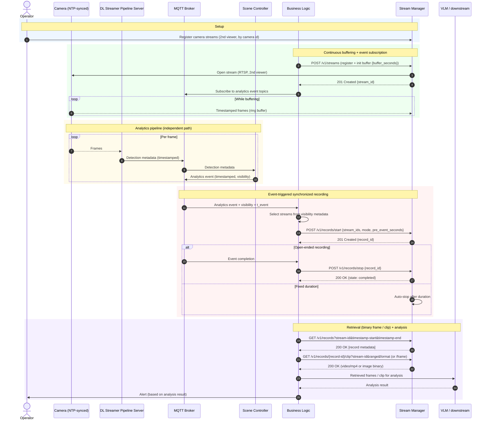

# Stream Manager — Event-Based Video Storage and Retrieval (without Sensor Manager)

## Sequence diagram

## API summary

| Method | Endpoint | What it does | Parameters | Returns |
| --- | --- | --- | --- | --- |
| GET | `/v1/streams` | List registered streams | query: `state`, `limit`, `cursor` | `200` `StreamList` `{ items[Stream], next_cursor }` |
| POST | `/v1/streams` | Register a stream manually; optionally initialize buffering | body: `source_uri`\*, `name`, `camera_id`, `buffer{ enabled, buffer_seconds }` | `201` `Stream` + `Location`; `409` if duplicate |
| GET | `/v1/streams/{stream-id}` | Get metadata of a stream | path: `stream-id`\* | `200` `Stream`; `404` |
| DELETE | `/v1/streams/{stream-id}` | Delete a stream and stop its buffering | path: `stream-id`\* | `204`; `409` if being recorded |
| PUT | `/v1/streams/{stream-id}/buffer` | Configure the in-memory pre-event buffer (time window) | path: `stream-id`\*; body: `enabled`\*, `buffer_seconds` | `200` `BufferStatus` `{ ..., buffered_seconds, oldest_buffered_at }` |
| GET | `/v1/records` | List recordings and metadata | query: `stream-id`, `timestamp-start`, `timestamp-end`, `state`, `limit`, `cursor` | `200` `RecordList` `{ items[Record], next_cursor }` |
| POST | `/v1/records` | Import (upload) an external recording | body (multipart): `file`\*, `camera_id`, `label` | `201` `Record` + `Location`; `413` too large |
| POST | `/v1/records/start` | Start one synchronized recording spanning multiple streams | header: `Idempotency-Key`; body: `stream_ids`\*, `mode` (`open`\|`fixed`), `duration_seconds` (req if `fixed`), `pre_event_seconds`, `event_id`, `label` | `201` `Record` + `Location`; `404` unknown stream; `409` key reuse |
| POST | `/v1/records/stop` | Stop an in-progress recording | body: `record_id`\* | `200` `Record`; `404`; `409` not stoppable |
| GET | `/v1/records/{record-id}` | Get recording metadata incl. per-stream tracks | path: `record-id`\* | `200` `Record` `{ ..., tracks[RecordTrack] }`; `404` |
| DELETE | `/v1/records/{record-id}` | Delete a recording | path: `record-id`\* | `204`; `409` if in progress |
| GET | `/v1/records/{record-id}/frame` | Retrieve a single frame from one stream (nearest to timestamp) | path: `record-id`\*; query: `stream-id`\*, `timestamp`\*, `format` (`jpeg`\|`png`) | `200` binary `image/jpeg`\|`image/png` + `X-Frame-Timestamp`; `404` |
| GET | `/v1/records/{record-id}/clip` | Retrieve a video clip from one stream over a range | path: `record-id`\*; query: `stream-id`\*, `timestamp-start`\*, `timestamp-end` \| `duration-seconds`, `format` (`mp4`\|`mkv`\|`webm`) | `200` binary `video/mp4`\|`video/x-matroska`\|`video/webm`; `404` |

\* = required. All timestamps are RFC 3339 UTC. Errors use `application/problem+json` (RFC 9457). Auth: bearer token.
