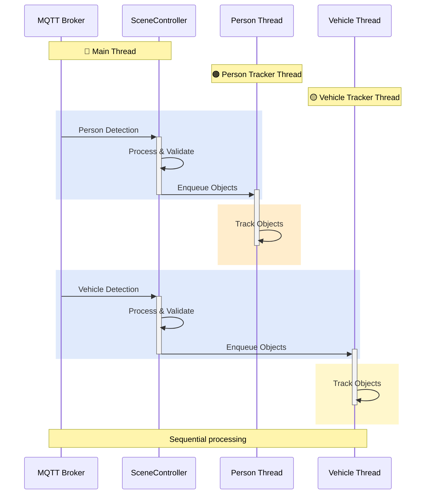
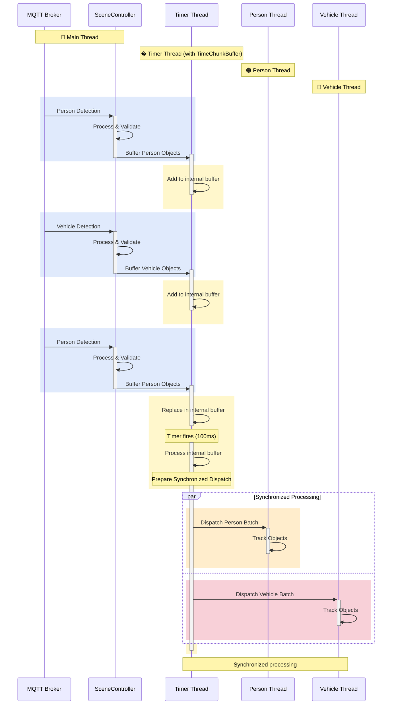
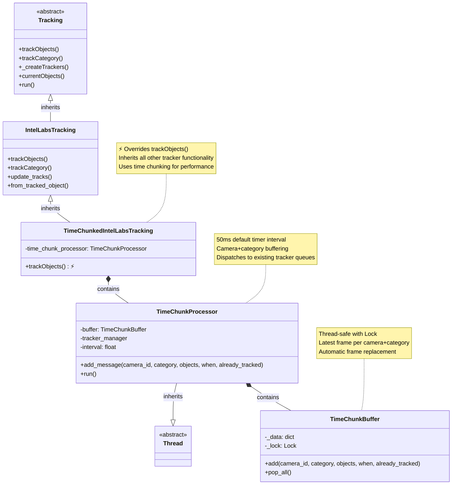

# Time-Chunking Architecture for SceneScape Controller

## Current Architecture: Per-Category Tracker Threads (SceneScape v1.4)



### Implementation Details

#### Message Processing Flow

1. **MQTT Message Reception**: [`SceneController.handleMovingObjectMessage()`](../controller/src/controller/scene_controller.py#L320)
   - Validates schema and processes timestamps
   - Calls [`processCameraData(jdata, when)`](../controller/src/controller/scene.py#L137) for camera detections

2. **Object Processing**: [`Scene._finishProcessing(detectionType, when, objects)`](../controller/src/controller/scene.py#L204)
   - Updates object visibility
   - Calls tracker for object tracking

3. **Tracker Orchestration**: [`Tracking.trackObjects()`](../controller/src/controller/tracking.py#L44)
   - Creates per-category threads via [`_createTrackers()`](../controller/src/controller/tracking.py#L83)
   - Enqueues objects: `self.trackers[category].queue.put((new_objects, when, already_tracked_objects))`

4. **Per-Category Threading**: Each category (person, vehicle, etc.) has:
   - **Own Queue**: `Queue()` instance for thread communication
   - **Own Thread**: Runs [`run()`](../controller/src/controller/tracking.py#L135) method continuously
   - **Independent Processing**: [`trackCategory(objects, when, already_tracked_objects)`](../controller/src/controller/ilabs_tracking.py#L166)

## Proposed Architecture: Time-Chunked Per-Category Processing (SceneScape v1.5)



### v1.5 Time-Chunking Flow Details

#### Modified Message Processing Flow

1. **MQTT Message Reception**: Same as v1.4 - [`handleMovingObjectMessage()`](../controller/src/controller/scene_controller.py#L320)
   - Same processing pipeline through [`processCameraData()`](../controller/src/controller/scene.py#L137)
   - Same object creation and validation

2. **Time-Chunk Buffering** (NEW): Instead of immediate tracker dispatch:

   ```python
   # Current v1.4: Direct dispatch
   self.trackers[category].queue.put((new_objects, when, already_tracked_objects))

   # Proposed v1.5: Buffered dispatch to timer thread
   self.time_chunk_processor.buffer_message(category, new_objects, when, already_tracked_objects)
   ```

3. **Timer Thread with Internal Buffer** (NEW): [`TimeChunkProcessor.run()`] - To be implemented
   - Contains internal `TimeChunkBuffer` (similar to how tracker threads contain `Queue`)
   - Receives messages via `buffer_message()` method (thread-safe)
   - Timer fires every configurable interval (50-500ms) to process internal buffer
   - Dispatches to existing tracker queues simultaneously

4. **Synchronized Dispatch**: Maintains existing interface:
   - Same [`queue.put()`](../controller/src/controller/tracking.py#L62) calls to tracker threads
   - Same [`run()`](../controller/src/controller/tracking.py#L135) and [`trackCategory()`](../controller/src/controller/ilabs_tracking.py#L166) processing
   - **Key difference**: All categories receive data from the same time window

#### Implementation Components (To Be Added)

- **TimeChunkProcessor**: Timer thread class (similar to `Tracking` thread)
  - Contains internal `TimeChunkBuffer` (similar to how `Tracking` contains `Queue`)
  - Provides `buffer_message(category, objects, when, already_tracked)` method
  - Runs periodic timer to process buffered messages
- **TimeChunkBuffer**: Internal buffer class using `threading.RLock()` (encapsulated within processor)
- **Configuration**: Adjustable time window settings

#### Class Design



### Design Principles

#### **Inheritance-Based Architecture**

- TimeChunkedIntelLabsTracking inherits from IntelLabsTracking
- Overrides only trackObjects() method for time chunking behavior
- Preserves all existing tracking functionality through inheritance

#### **Camera+Category Buffering**

- Keeps only the most recent frame per camera+category combination
- Key format: `f"{camera_id}_{category}"` for unique identification
- Automatic replacement of older frames for memory efficiency

#### **Timer-Based Processing**

- 50ms default interval (configurable via constructor)
- Daemon thread automatically cleans up on process exit
- Dispatches to existing tracker queues preserving backpressure logic
