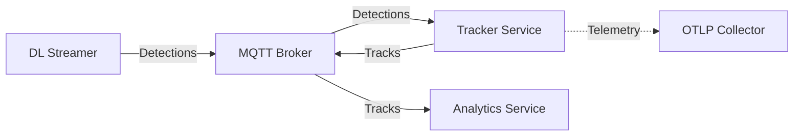
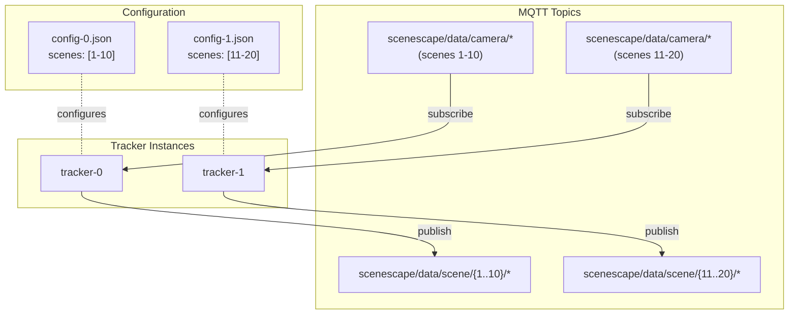
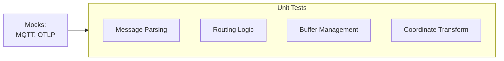
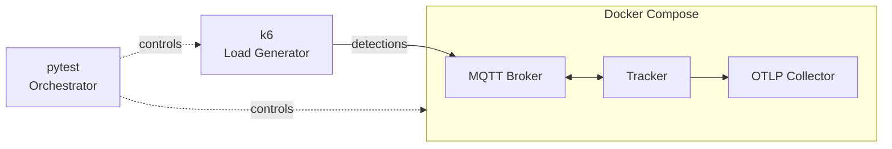

# Design Document: Tracker Service

- **Author(s)**: [Józef Daniecki](https://github.com/jdanieck)
- **Date**: 2026-01-16
- **Version**: 0.1
- **Status**: `Proposed`
- **Related ADRs**: [ADR-0007: Tracker Service](../adr/0007-tracker-service.md), [ADR-0008: Tracker Service Horizontal Scaling](https://github.com/open-edge-platform/scenescape/pull/841)

---

## Overview

Tracker Service transforms camera detections to world coordinates and applies Kalman filtering for persistent multi-object tracking. It addresses performance limitations in the existing Python-based tracking by using C++ with data-oriented design for true parallelism and SIMD optimization.

See [ADR-0007: Tracker Service](../adr/0007-tracker-service.md) for full rationale, alternatives considered, and architectural decisions.

**Key Benefits:**

- Centralized coordinate transformation and persistent object identity
- Horizontal scalability via scene partitioning
- Cloud-native ([12-factor](https://12factor.net/)), secure by default (mTLS, distroless)

## Goals

- Real-time tracking without frame drops meeting SLIs
- Horizontal scalability via static scene partitioning
- Observable and debuggable via standard telemetry

### SLIs

| SLI               | Target     | Metric                                     | Description                                |
| ----------------- | ---------- | ------------------------------------------ | ------------------------------------------ |
| **Latency (p50)** | < 30ms     | `scenescape_tracker_total_latency_seconds` | Median processing time (50% headroom)      |
| **Latency (p99)** | < 50ms     | `scenescape_tracker_total_latency_seconds` | 99th percentile (25% headroom for jitter)  |
| **Throughput**    | 60 msg/sec | `scenescape_tracker_messages_total`        | 4 cameras × 15 FPS (up to 300 objects/msg) |

## Non-Goals (MVP)

Explicitly out of scope for MVP:

- **Kubernetes deployment** — Docker Compose only
- **Dynamic configuration** — Service restart required for config changes
- **Object re-identification** — Track IDs reset on camera handoff (when non-overlapping) or long-term occlusion or object re-entry
- **Historical persistence** — Tracking state lost on service restart
- **NTP time correction** — No camera clock drift compensation
- **Lease-based scaling** — Static scene partitioning only
- **Multi-scene fusion** — No cross-scene track handoff
- **Scene hierarchy** — Flat scene structure only; no parent-child scene relationships or nested regions
- **Sensor tagging of a track** — No visibility array or per-sensor metadata on tracks

## Architecture



**DL Streamer** publishes detections (bounding boxes in camera coordinates) to MQTT. **Tracker Service** consumes detections, transforms to world coordinates, applies Kalman filtering, and publishes tracks. **Analytics Service** consumes tracks for business logic (counting, dwell time, etc.). Telemetry flows to the OTLP Collector.

**Dependencies:** MQTT Broker (required), OTLP Collector (best-effort), Scene Configuration (fail-fast on invalid).

## Communication

**Consumes:**

- `scenescape/data/camera/{camera_id}` — Detection messages from AI pipeline with camera coordinates, bounding boxes, confidence scores, and detection IDs
- `scenescape/cmd/scene/update/{scene_id}` — Config change notifications from Manager API (dynamic mode only, triggers service restart)

**Publishes:**

- `scenescape/data/scene/{scene_id}/{thing_type}` — Track messages with world coordinates, velocity, tracking confidence, and persistent track IDs

**Message Example (Detection Input):**

See full schema: [detection.schema.json](../../tracker/schemas/detection.schema.json)

```json
{
  "id": "camera-01",
  "timestamp": "2025-12-30T10:15:30.123Z",
  "rate": 15.0,
  "objects": {
    "person": [
      {
        "id": 1,
        "category": "person",
        "confidence": 0.95,
        "bounding_box_px": { "x": 100, "y": 200, "width": 50, "height": 120 }
      }
    ]
  }
}
```

**Message Example (Track Output):**

See full schema: [track.schema.json](../../tracker/schemas/track.schema.json)

```json
{
  "id": "scene-001",
  "name": "Main Hall",
  "timestamp": "2025-12-30T10:15:30.145Z",
  "objects": [
    {
      "id": 67890,
      "category": "person",
      "translation": [2.5, 3.1, 0.0],
      "velocity": [0.3, -0.1, 0.0],
      "size": [0.5, 0.5, 1.7],
      "rotation": [0, 0, 0, 1]
    }
  ]
}
```

## Data

**Stores:**
In-memory only (no persistent storage):

- Tracking state per scene+category (Kalman filter state: position, velocity, covariance)
- Detection buffers for time chunking (bounded queues with drop-oldest policy)
- MQTT publish queue (bounded with backpressure handling)
- Scene configuration

**Retention:**

- Tracking state: Maintained while service runs; lost on restart (tracks re-establish within seconds)
- Detection buffers: Flushed every chunk interval (default 66ms for 15 FPS)
- Publish queue: Drained on graceful shutdown (2s timeout)
- No historical data stored—stateless design for horizontal scalability

## Operations

### Health Checks

HTTP server on configurable port (default 8080):

- `/healthz` — Liveness probe (process alive?)
- `/readyz` — Readiness probe (MQTT connected and subscribed?)

Built-in `healthcheck` subcommand for distroless containers (no shell/curl):

```yaml
healthcheck:
  test: ["CMD", "/scenescape/tracker", "healthcheck"]
  interval: 1s
  timeout: 1s
  retries: 3
  start_period: 2s
```

### Configuration

Service and scene configuration loaded at startup. See [config.schema.json](../../tracker/schemas/config.schema.json) for complete schema.

Configuration changes require service restart. This simplifies implementation (no partial state migration) and tracking state re-establishes within seconds.

#### Static Mode

Scenes defined in local config file:

- Set `scenes.source: "file"` and `scenes.file_path` in config
- Self-contained deployment with no external dependencies
- Enables horizontal scaling via static scene partitioning (see [Horizontal Scaling](#horizontal-scaling))
- Suitable for development and production deployments with pre-defined scene assignments

#### Dynamic Mode

Scenes fetched from Manager API at startup:

- Set `scenes.source: "api"` and `scenes.api_endpoint` in config
- Subscribes to `scenescape/cmd/scene/update/{scene_id}` for change notifications
- On notification: logs change, exits gracefully (Docker restarts the service which loads new config at startup)
- Suitable for multi-node deployments with centralized scene management

### Observability

All telemetry exported via OTLP/HTTP to OpenTelemetry Collector. Metrics, traces, and logs are correlated:

- **trace_id** — Links logs and spans across DL Streamer → Tracker → Analytics for a single detection flow
- **span_id** — Links logs to the specific span within that trace
- **Exemplars** — Metrics include trace_id exemplars, linking latency spikes to specific traces

This enables jumping from a latency spike in metrics → trace → logs in observability backends (e.g., Grafana).

#### Metrics

| Metric                                      | Type      | Labels          | Description                      |
| ------------------------------------------- | --------- | --------------- | -------------------------------- |
| `scenescape_tracker_latency_seconds`        | histogram | scene, camera   | Processing latency (p50/p95/p99) |
| `scenescape_tracker_messages_total`         | counter   | scene, camera   | Messages processed               |
| `scenescape_tracker_messages_dropped_total` | counter   | reason          | Messages dropped                 |
| `scenescape_tracker_tracks_active`          | gauge     | scene, category | Currently active tracks          |

#### Distributed Tracing

| Span                   | Parent            | Attributes          | Description                       |
| ---------------------- | ----------------- | ------------------- | --------------------------------- |
| `tracker.process`      | DL Streamer span  | scene_id, camera_id | End-to-end detection processing   |
| `tracker.mqtt_handler` | `tracker.process` | topic, message_id   | MQTT message receive and parse    |
| `tracker.tracking`     | `tracker.process` | object_count        | Kalman filter tracking processing |
| `tracker.publish`      | `tracker.process` | topic, track_count  | MQTT track publish                |

```mermaid
gantt
    title Trace Span Timeline
    dateFormat ss
    axisFormat %S

    section DL Streamer
    dlstreamer.detect       :a1, 00, 3s

    section MQTT Broker
    broker transfer         :a2, after a1, 1s

    section Tracker
    tracker.process         :a3, after a2, 6s
    tracker.mqtt_handler    :a4, after a2, 1s
    tracker.tracking        :a5, after a4, 4s
    tracker.publish         :a6, after a5, 1s
```



Trace context follows W3C Trace Context: extract `traceparent` from inbound MQTT, propagate to outbound messages.

#### Structured Logging

JSON format defined by [log.schema.json](../../tracker/schemas/log.schema.json):

```json
{
  "timestamp": "2025-07-15T14:32:01.847Z",
  "level": "info",
  "msg": "tracks published",
  "trace_id": "0af7651916cd43dd8448eb211c80319c",
  "span_id": "b7ad6b7169203331"
}
```

`trace_id` and `span_id` enable log correlation across DL Streamer → Tracker → Analytics in observability backends.

## Security

### Input Validation

All inputs validated against JSON schemas with unknown fields explicitly allowed (`additionalProperties: true`):

| Input              | Schema                  | On Failure                |
| ------------------ | ----------------------- | ------------------------- |
| Service config     | `config.schema.json`    | Fail-fast at startup      |
| Scene topology     | `scenes.schema.json`    | Fail-fast at startup      |
| Detection messages | `detection.schema.json` | Log warning, drop message |

Unknown fields allowed for forward compatibility—older services ignore new fields from newer producers.

### Transport Security

All MQTT connections require mTLS (mutual TLS):

- **Server verification** — Validates broker certificate against CA
- **Client authentication** — Presents client certificate to broker
- **No plaintext** — TLS required; unencrypted connections rejected

OTLP telemetry supports optional TLS (configurable per deployment).

### Secrets Management

Secrets never stored in config files:

| Secret               | Source                            |
| -------------------- | --------------------------------- |
| CA certificate       | Docker secret / K8s secret mount  |
| Client certificate   | Docker secret / K8s secret mount  |
| Client private key   | Docker secret / K8s secret mount  |
| Manager API password | Environment variable / K8s secret |

Config references paths only (e.g., `/run/secrets/client-cert`).

### Container Hardening

Defense in depth via minimal attack surface:

- **Non-root user** — Runs as unprivileged user (UID 1000)
- **Distroless base image** — No shell, package manager, or unnecessary binaries
- **Read-only filesystem** — Writable only for `/tmp` (if needed)
- **No capabilities** — All Linux capabilities dropped
- **No privilege escalation** — `no-new-privileges` security option enabled

## Deployment

### Docker Compose

Primary deployment method for development and production. Per-instance configs via Docker Compose configs.

**Resources:**

- CPU requirements scale with object count and number of scenes
- Memory dominated by detection buffers and tracking state
- Storage: Ephemeral only (no persistent volumes)

### Kubernetes

Planned for future release. Will use StatefulSet with ConfigMap per instance.

### Horizontal Scaling

#### Static Scene Partitioning

Each instance handles a fixed set of scenes configured at startup via config file. No coordination between instances—each subscribes only to its assigned scene topics.



Add/remove instances by deploying with new config files specifying scene assignments.

#### Dynamic Scaling

Post-MVP will support lease-based dynamic scaling for automatic scene distribution and failover. See [ADR-0008: Tracker Service Horizontal Scaling](https://github.com/open-edge-platform/scenescape/pull/841).

## Testing

### Unit Tests

GoogleTest-based, fast and deterministic with mocked dependencies.



- Test message parsing, routing, buffering, coordinate transformation
- Run in CI on every commit

### Service Tests

pytest + Docker Compose + k6 for full-stack validation. Isolated at the process level—real binaries, real MQTT broker, no mocks.



- Validate normal operation, broker outage recovery, backpressure handling, graceful shutdown
- Multi-instance testing for scene partitioning validation
- Doubles as load testing when configured with realistic message rates and object counts
- Run in CI on every commit

### End-to-End Tests

Validated manually for this release. Automation planned for next release—will validate full pipeline from DL Streamer through Tracker to Analytics with real video streams.

## References

### Schemas

- [detection.schema.json](../../tracker/schemas/detection.schema.json) — Detection input message schema
- [track.schema.json](../../tracker/schemas/track.schema.json) — Track output message schema
- [config.schema.json](../../tracker/schemas/config.schema.json) — Service configuration schema
- [scenes.schema.json](../../tracker/schemas/scenes.schema.json) — Scene topology schema
- [log.schema.json](../../tracker/schemas/log.schema.json) — Structured logging schema

### Internal Documentation

- [ADR-0007: Tracker Service](../adr/0007-tracker-service.md) — Architectural decision record and rationale
- [Tracker Architecture](../../tracker/docs/architecture.md) — Components, threading, lifecycle, stack
- [Scene Controller API](../../controller/docs/user-guide/api-docs/scene-controller-api.yaml) — MQTT message format reference
- [RobotVision Library](../../controller/src/robot_vision/) — Kalman filter tracking implementation

### External Resources

- [Paho MQTT C++](https://github.com/eclipse/paho.mqtt.cpp) — MQTT client library
- [OpenTelemetry C++](https://opentelemetry.io/docs/languages/cpp/) — Observability instrumentation
- [Kalman Filter Tutorial](https://www.kalmanfilter.net/) — Understanding Kalman filtering for object tracking
- [The Twelve-Factor App](https://12factor.net/) — Methodology for building software-as-a-service apps
