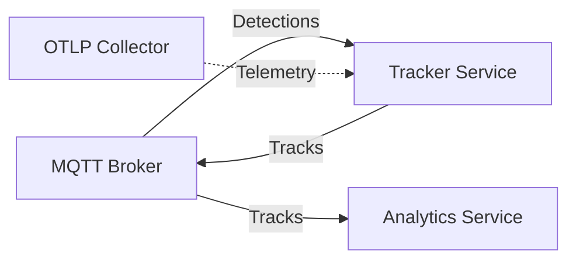
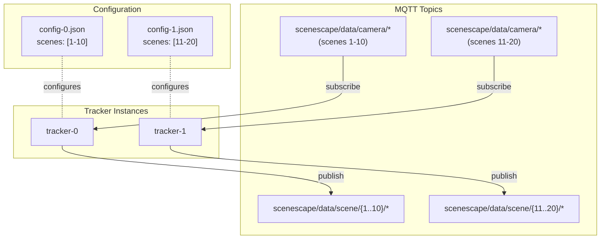

# Design Document: Tracker Service

- **Author(s)**: [Józef Daniecki](https://github.com/jdanieck)
- **Date**: 2025-12-30
- **Version**: 0.1 (MVP)
- **Status**: `Proposed`
- **Scope**: MVP — Out of Box Scenes (300 objects × 4 cameras × 15 FPS)
- **Related ADRs**: [ADR-0007: Tracker Service](../adr/0007-tracker-service.md), [ADR-0008: Tracker Service Horizontal Scaling](../adr/0008-tracker-service-vertical-scalling.md)

---

## Overview

Tracker Service transforms camera detections to world coordinates and applies Kalman filtering for persistent multi-object tracking. It addresses performance limitations in the existing Python-based tracking by using C++ with data-oriented design for true parallelism and SIMD optimization.

See [ADR-0007: Tracker Service](../adr/0007-tracker-service.md) for full rationale, alternatives considered, and architectural decisions.

**Key Benefits:**

- Centralized coordinate transformation and persistent object identity
- Horizontal scalability via scene partitioning
- Cloud-native ([12-factor](https://12factor.net/)), secure by default (mTLS, distroless)

## Goals & Service Level Indicators

**Success Criteria:**

- Real-time tracking without frame drops at 15 FPS
- Horizontal scalability via scene partitioning
- Observable and debuggable via standard telemetry

**Service Level Indicators (SLIs):**

| SLI                 | Target     | Metric                                     | Description                                |
| ------------------- | ---------- | ------------------------------------------ | ------------------------------------------ |
| **Latency (p50)**   | < 30ms     | `scenescape_tracker_total_latency_seconds` | Median processing time (50% headroom)      |
| **Latency (p99)**   | < 50ms     | `scenescape_tracker_total_latency_seconds` | 99th percentile (25% headroom for jitter)  |
| **Latency (p99.9)** | < 66ms     | `scenescape_tracker_total_latency_seconds` | Hard frame budget—exceeding drops frames   |
| **Throughput**      | 60 msg/sec | `scenescape_tracker_messages_total`        | 4 cameras × 15 FPS (up to 300 objects/msg) |

## Non-Goals (MVP)

Explicitly out of scope for MVP:

- **Kubernetes deployment** — Docker Compose only
- **Dynamic configuration** — Restart required for config changes
- **Object re-identification** — Track IDs reset on camera handoff or occlusion
- **Historical persistence** — Tracking state lost on restart
- **NTP time correction** — No camera clock drift compensation
- **Lease-based scaling** — Static scene partitioning only
- **Multi-scene fusion** — No cross-scene track handoff

## Architecture



**Tracker Service** receives detections via MQTT, transforms to world coordinates, applies Kalman filtering, and publishes tracks. Stateless (in-memory tracking state only).

**Dependencies:** MQTT Broker (required), OTLP Collector (best-effort), Scene Configuration (fail-fast on invalid).

## Communication

**Consumes:**

- `scenescape/data/camera/{camera_id}` — Detection messages from AI pipeline with camera coordinates, bounding boxes, confidence scores, and detection IDs
- `scenescape/cmd/scene/update/{scene_id}` — Config change notifications from Manager API (dynamic mode only, triggers service restart)

**Publishes:**

- `scenescape/data/scene/{scene_id}/{thing_type}` — Track messages with world coordinates, velocity, tracking confidence, and persistent track IDs

**Message Example (Detection Input):**

See full schema: [detection.schema.json](../../tracker/schemas/detection.schema.json)

```json
{
  "id": "camera-01",
  "timestamp": "2025-12-30T10:15:30.123Z",
  "rate": 15.0,
  "objects": {
    "person": [
      {
        "id": 1,
        "category": "person",
        "confidence": 0.95,
        "bounding_box_px": { "x": 100, "y": 200, "width": 50, "height": 120 }
      }
    ]
  }
}
```

**Message Example (Track Output):**

See full schema: [track.schema.json](../../tracker/schemas/track.schema.json)

```json
{
  "id": "scene-001",
  "name": "Main Hall",
  "timestamp": "2025-12-30T10:15:30.145Z",
  "objects": [
    {
      "id": 67890,
      "category": "person",
      "translation": [2.5, 3.1, 0.0],
      "velocity": [0.3, -0.1, 0.0],
      "size": [0.5, 0.5, 1.7],
      "rotation": [0, 0, 0, 1],
      "visibility": ["camera-01"]
    }
  ]
}
```

## Data

**Stores:**
In-memory only (no persistent storage):

- Tracking state per scene+category (Kalman filter state: position, velocity, covariance)
- Detection buffers for time chunking (bounded queues with drop-oldest policy)
- MQTT publish queue (bounded with backpressure handling)
- Scene configuration (camera-to-scene mappings, calibration parameters)

**Retention:**

- Tracking state: Maintained while service runs; lost on restart (tracks re-establish within seconds)
- Detection buffers: Flushed every chunk interval (default 66ms for 15 FPS)
- Publish queue: Drained on graceful shutdown (2s timeout)
- No historical data stored—stateless design for horizontal scalability

## Operations

### Health Checks

- `/healthz` — Liveness probe (process alive?)
- `/readyz` — Readiness probe (MQTT connected and subscribed?)

### Configuration

Service configuration is static via file only. See [config.schema.json](../../tracker/schemas/config.schema.json) for complete schema.

Scene configuration has two modes:

- **Static** — Scenes defined in config file at startup
- **Dynamic** — Scenes fetched from Manager API at startup (set `MANAGER_API_URL`); restarts on `scenescape/cmd/scene/update/{scene_id}` MQTT notification

Configuration changes require service restart. This simplifies implementation (no partial state migration) and tracking state re-establishes within seconds.

### Observability

All telemetry exported via OTLP/HTTP to OpenTelemetry Collector.

#### Metrics

Key metrics exported via OTLP:

- **Latency**: `scenescape_tracker_latency_seconds` (histogram, p50/p99/p99.9)
- **Throughput**: `scenescape_tracker_messages_total` (counter by camera)
- **Drops**: `scenescape_tracker_messages_dropped_total` (counter by reason)
- **Tracks**: `scenescape_tracker_tracks_active` (gauge by scene/category)

#### Distributed Tracing

Trace context follows W3C Trace Context standard for cross-service correlation:

1. **Inbound**: Extract `traceparent` from MQTT v5 user properties (set by DL Streamer pipeline)
2. **Span**: Create child span `tracker.process` under extracted context
3. **Outbound**: Propagate `traceparent` in published track messages for downstream services (Analytics)

If no trace context in incoming message, start new trace (root span).

#### Structured Logging

JSON format with trace correlation:

```json
{
  "ts": "2025-12-30T10:15:30.123Z",
  "level": "info",
  "msg": "tracks published",
  "scene": "scene-001",
  "camera": "camera-01",
  "objects": 5,
  "trace_id": "abc123",
  "span_id": "def456"
}
```

`trace_id` and `span_id` enable log correlation across DL Streamer → Tracker → Analytics in observability backends.

## Deployment

**Orchestration:** Service supports deployment parity across Docker Compose (local development) and Kubernetes (production) with identical configuration schemas, health endpoints, and telemetry integration.

**Resources:**

- CPU requirements scale with object count and number of scenes
- Memory dominated by detection buffers and tracking state
- Storage: Ephemeral only (no persistent volumes)

### Horizontal Scaling

MVP uses **static scene partitioning**: each instance handles a fixed set of scenes configured at startup. No coordination between instances - each subscribes only to its assigned scene topics.



**Deployment:**

- **Docker Compose**: Per-instance configs via Docker Compose configs
- **Kubernetes**: StatefulSet with ConfigMap per instance

**Scaling**: Add/remove instances by deploying with new config files or ConfigMaps specifying scene assignments.

**Future**: Post-MVP will support lease-based dynamic scaling for automatic scene distribution and failover. See [ADR-0008: Tracker Service Horizontal Scaling](../adr/0008-tracker-service-vertical-scalling.md).

## Testing

**Unit Tests (GoogleTest):**

- Fast, deterministic with mocked dependencies
- Test message parsing, routing, buffering, coordinate transformation
- Run in CI on every commit

**Service Tests (pytest + Docker Compose + k6):**

- Full stack with real MQTT broker and OTLP collector
- Orchestrated via pytest which uses k6 for message generation and Docker Compose for infrastructure
- Validate normal operation, broker outage recovery, backpressure handling, graceful shutdown
- Multi-instance testing for scene partitioning validation
- Doubles as load testing when configured with realistic message rates and object counts

## Risks

| Risk                               | What We'll Do                                                                                  |
| ---------------------------------- | ---------------------------------------------------------------------------------------------- |
| MQTT broker outage                 | Exponential backoff reconnect (1s→30s); preserve tracking state; readiness=false during outage |
| OTLP collector outage              | Buffer telemetry with capped retry; drop on overflow; never block message processing           |
| Memory leak from unbounded buffers | Drop-oldest backpressure with metrics; bounded queues everywhere; alert on high drop rate      |
| Scene config errors                | JSON schema validation at startup; fail-fast on invalid config                                 |
| Certificate expiry                 | Monitor cert expiration via metrics; alert 7 days before expiry; graceful restart on rotation  |
| Tracking state loss on restart     | Accepted trade-off for stateless design; tracks re-establish within seconds                    |
| Horizontal scaling conflicts       | Static scene partitioning ensures no overlap; config validation prevents duplicate assignments |

## References

### Schemas

- [detection.schema.json](../../tracker/schemas/detection.schema.json) — Detection input message schema
- [track.schema.json](../../tracker/schemas/track.schema.json) — Track output message schema
- [config.schema.json](../../tracker/schemas/config.schema.json) — Service configuration schema
- [scenes.schema.json](../../tracker/schemas/scenes.schema.json) — Scene topology schema

### Internal Documentation

- [ADR-0007: Tracker Service](../adr/0007-tracker-service.md) — Architectural decision record and rationale
- [Tracker Architecture](../../tracker/docs/architecture.md) — Components, threading, lifecycle, stack
- [Scene Controller API](../../controller/docs/user-guide/api-docs/scene-controller-api.yaml) — MQTT message format reference
- [RobotVision Library](../../controller/src/robot_vision/) — Kalman filter tracking implementation

### External Resources

- [Paho MQTT C++](https://github.com/eclipse/paho.mqtt.cpp) — MQTT client library
- [OpenTelemetry C++](https://opentelemetry.io/docs/languages/cpp/) — Observability instrumentation
- [Kalman Filter Tutorial](https://www.kalmanfilter.net/) — Understanding Kalman filtering for object tracking
- [The Twelve-Factor App](https://12factor.net/) — Methodology for building software-as-a-service apps
