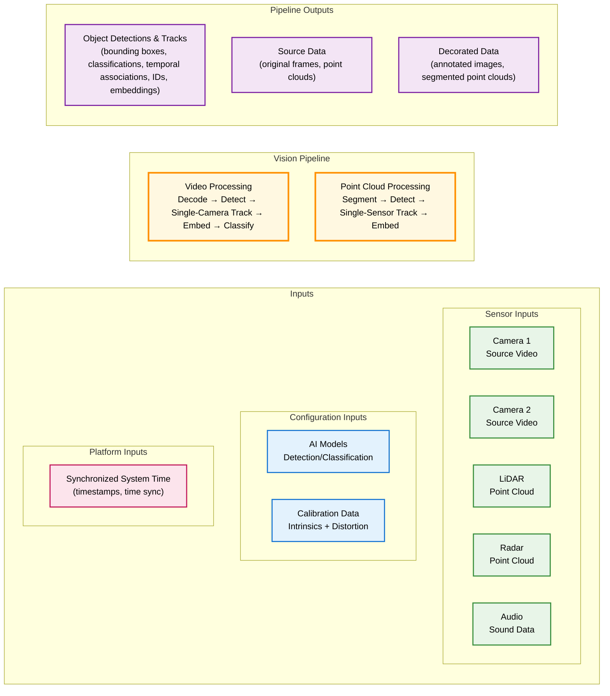
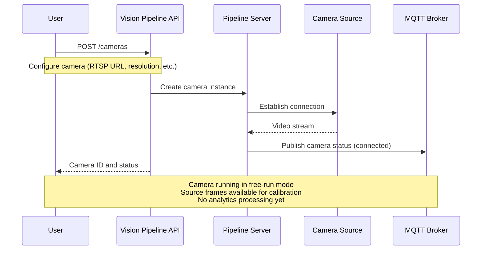
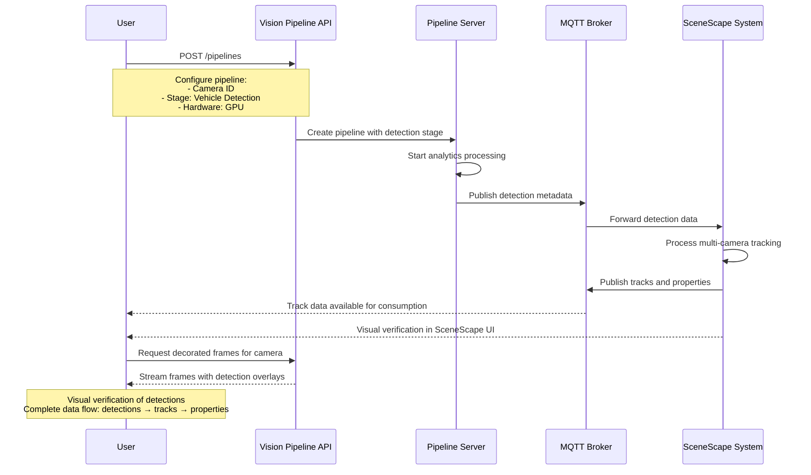
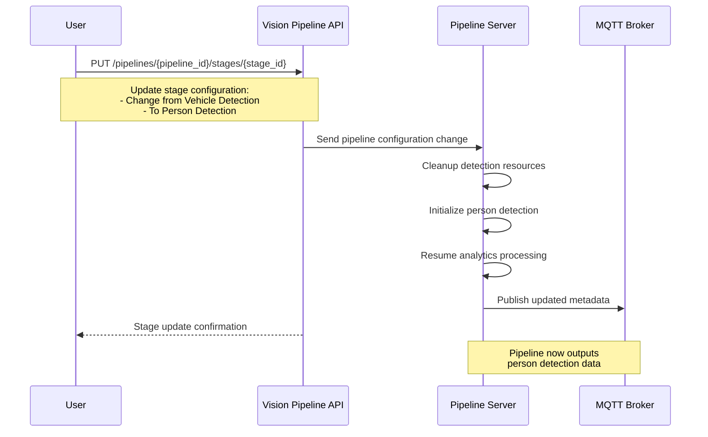
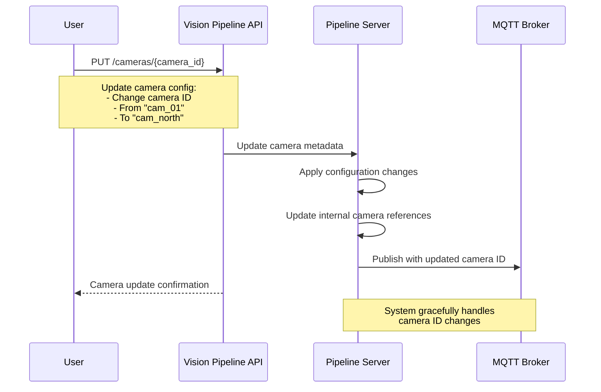
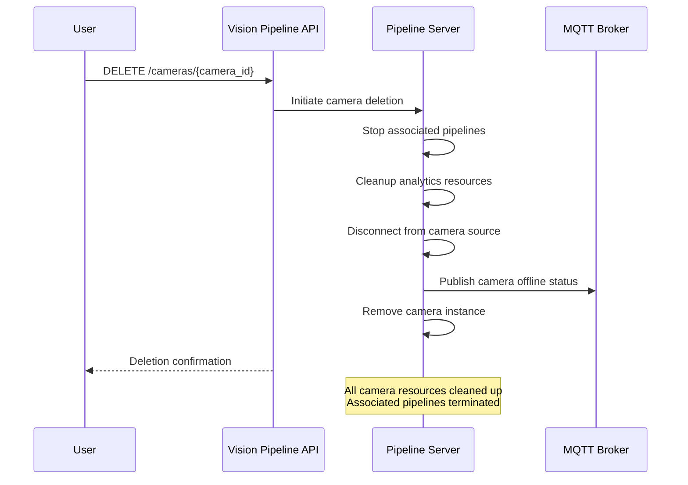
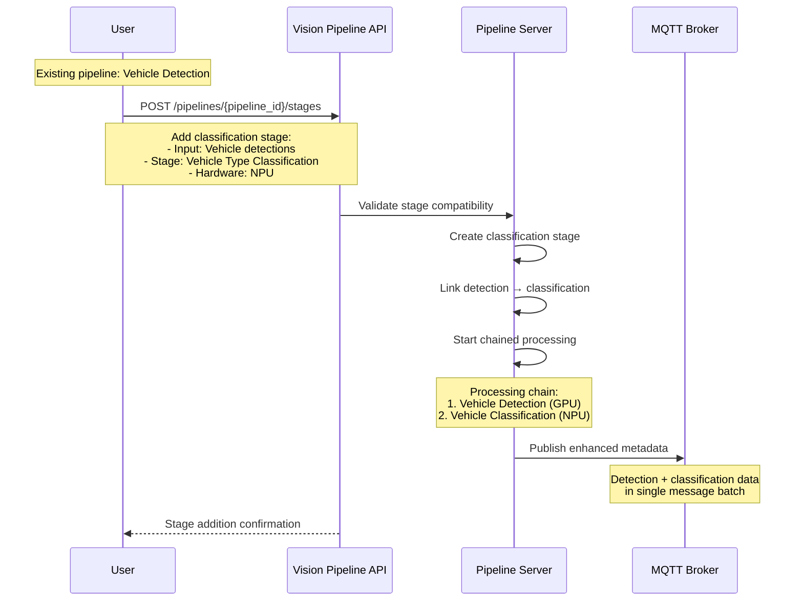
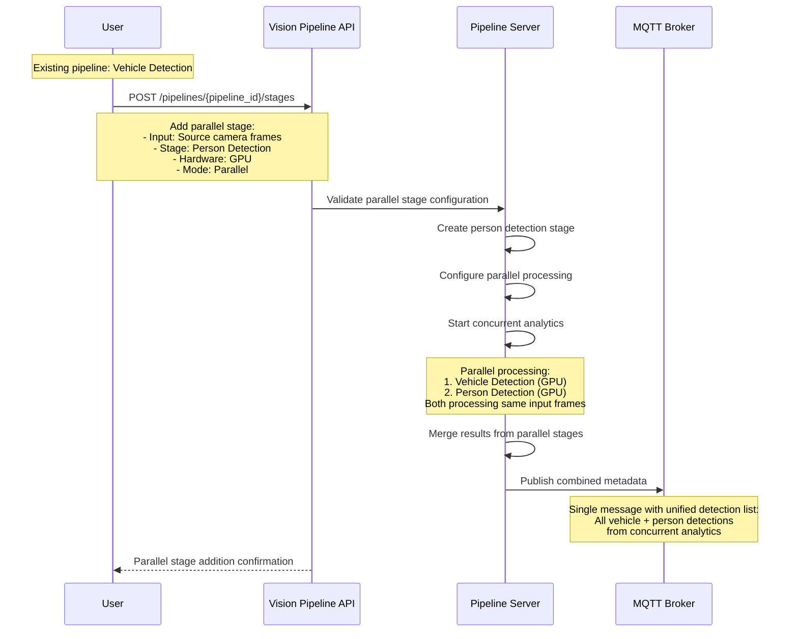
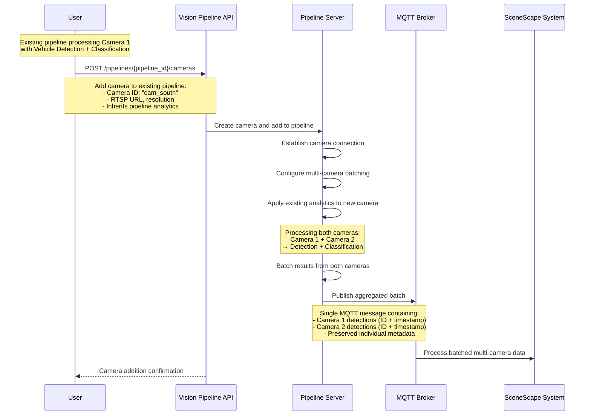
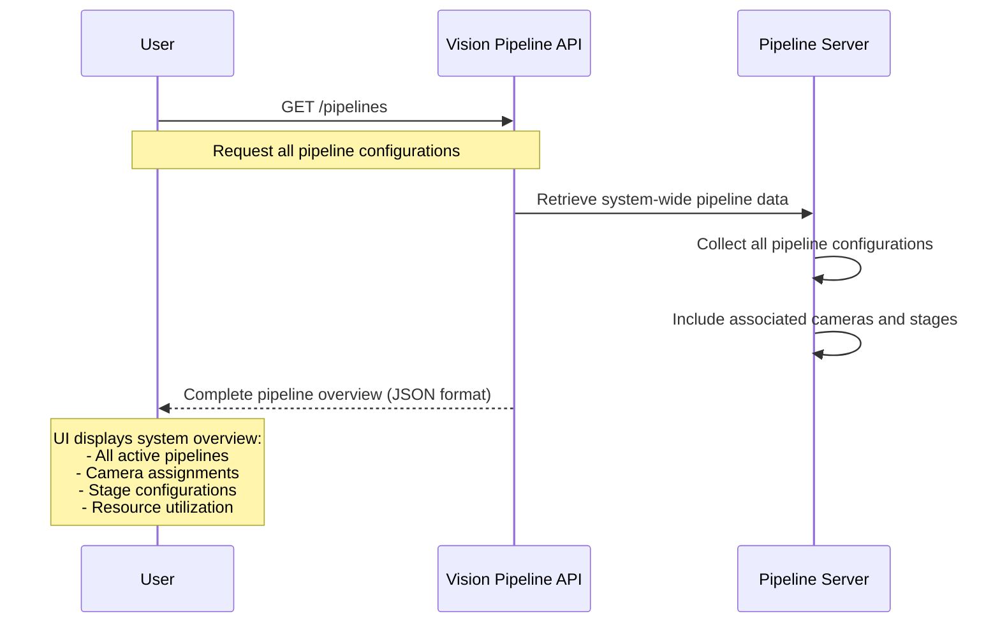

# Design Document: Vision Pipeline API for Domain Experts

- **Author(s)**: Rob Watts <robert.a.watts@intel.com>
- **Date**: 2025-10-20
- **Status**: `Proposed`
- **Related ADRs**: TBD

---

## Overview

This document defines a simple API for connecting cameras, configuring vision analytics pipelines, and accessing object detection metadata. The API enables domain experts to deploy computer vision capabilities without requiring deep technical knowledge of AI models, pipeline configurations, or video processing implementations.

The vision pipeline API abstracts away technical complexity while providing reliable object detection metadata that feeds into downstream systems like Intel SceneScape for multi-camera tracking and scene analytics.

## Goals

- **Simple Camera Management**: Easy API to connect and manage one or many camera inputs dynamically
- **Composable Analytics Pipelines**: Modular pipeline stages that can be chained together (e.g., vehicle detection → license plate detection → OCR) where each stage can be pre-configured but combined flexibly
- **Source Frame Access**: On-demand access to original camera frames regardless of input type or source
- **Performance Optimization**: Easy configuration of hardware acceleration targets (CPU, iGPU, GPU, NPU) for optimal utilization
- **Abstracted Complexity**: Hide AI model management, pipeline optimization details, and video processing complexity from domain experts
- **API-First Design**: Enable development of reference UIs for managing pipelines and sensor sources, supporting integration with SceneScape UI, VIPPET, or customer-implemented interfaces

## Non-Goals

- Advanced computer vision research or custom model training
- Multi-camera tracking and scene analytics (handled by downstream systems like SceneScape)
- Complex video processing workflows or custom pipeline development

## Design Context

### Primary Persona: **Traffic Operations Expert**

- **Background**: Transportation engineer, systems integrator, or traffic management specialist who wants to leverage computer vision to improve traffic flow, safety, and urban mobility
- **Goal**: Deploy smart intersection systems that provide actionable traffic insights and automated responses without requiring deep computer vision expertise
- **Technical Level**: Understands traffic engineering, urban planning, and sensor networks but has limited computer vision knowledge; wants to focus on traffic optimization, not algorithm configuration
- **Pain Points**:

  - Complex vision systems obscure traffic engineering value
  - Difficulty translating traffic requirements into vision configurations
  - Unclear what vision capabilities are available for traffic applications
  - Technical complexity prevents rapid deployment and testing of traffic solutions

### Use Case: "Vision Pipeline API for Traffic Monitoring"

A traffic operations expert wants to deploy vision analytics at a busy intersection to feed object detection metadata into their Intel SceneScape system for multi-camera tracking and scene analytics.

**API Requirements:**

1. **Camera Management**: Connect 4-8 cameras dynamically via RTSP streams, USB connections, or video files - add/remove cameras without system restart

2. **Pipeline Composition**: Compose analytics pipelines by chaining stages together:

   - Vehicle detection → license plate detection → OCR
   - Person detection → re-identification embedding generation
   - General object detection → vehicle classification
   - Custom combinations based on specific needs

3. **Metadata Output**: Send detection results to MQTT broker for SceneScape processing:

   - JSON format with validated schema structure
   - Batched messages to minimize network chatter
   - Preserved frame timestamps and camera source IDs
   - Procedurally generated MQTT topics with optional namespace configuration

4. **Source Frame Access**: Provide on-demand access to original camera frames for debugging, validation, and manual review - regardless of camera type or connection method

They want to say: Connect these cameras, run vehicle and person detection, send metadata to SceneScape via MQTT and have a simple API that handles all the technical complexity - without needing to understand AI model formats, video decoding, or pipeline optimization.

The vision pipeline interface enables this by providing:

- **Intuitive Input/Output Selection**: Ability to independently select and configure sensor inputs and desired outputs
- **Modular Component Configuration**: Modular approach to configuring video analytics components (detection, tracking, classification)
- **Standardized Abstraction**: Clean separation between data streams, algorithmic configuration, and output products
- **Technology Independence**: Interface that works with any underlying pipeline implementation

## Vision Pipeline Interface

### Interface Definition

The vision pipeline interface defines a clear contract between data inputs, processing components, and outputs. This interface can be implemented by any computer vision technology stack.

### Multimodal Input Support

While this document primarily focuses on camera-based vision systems, the interface is designed to establish a unified approach that accommodates multiple sensor modalities including 3D point-cloud sources and audio data. This multimodal architecture ensures the API can support sensor fusion applications where different sensors contribute complementary information:

- **Cameras**: Provide high-resolution visual data for object detection, classification, and visual analytics
- **LiDAR/Radar**: Contribute precise spatial positioning, distance measurements, and velocity data through 3D point-cloud processing
- **Audio**: Enable acoustic event detection, sound classification, and audio-visual correlation for comprehensive scene understanding

The interface design anticipates the growing prevalence of multimodal sensing in computer vision deployments, such as demonstrated in the Sensor Fusion for Traffic Management sample application (formerly TFCC) in the Metro AI Suite. All general requirements, API patterns, and architectural principles described in this document apply to multimodal data sources, even while cameras remain the primary sensor type in current implementations.

## Vision Pipeline API Components

### Camera Management API

**Dynamic camera connection and configuration:**

- **Add Camera**: Connect new cameras via RTSP, USB, or file input without system restart
- **Remove Camera**: Disconnect cameras and clean up resources gracefully
- **Camera Status**: Monitor connection health, frame rate, and video quality
- **Camera Configuration**: Set resolution, frame rate, and encoding parameters
- **Multi-Source Support**: Handle mixed camera types (IP cameras, USB webcams, video files) in single deployment
- **Robust Error Handling**: Comprehensive error handling for network issues, authentication failures, and protocol incompatibilities with detailed logging
- **Connection Resilience**: Automatic retry mechanisms with configurable backoff strategies for network interruptions and camera disconnections
- **Persistent Reconnection**: Optional continuous reconnection attempts that persist indefinitely until cameras return online, maintaining system resilience during extended outages
- **Connection Monitoring**: Real-time monitoring endpoints for camera connection status, error rates, and reconnection attempts to enable proactive troubleshooting

### Pipeline Configuration API

**Pipeline Stage Types:**

The following stage types represent common analytics capabilities that can be configured and chained together. These are examples of the types of stages available - the system is designed to support additional stage types and custom analytics as needed.

- **Detection Stages**: Vehicle detection, person detection, general object detection, license plate detection, oriented bounding box detection, segmentation, keypoint detection, 3D bounding box detection
- **Classification Stages**: Generate text labels for vehicle types, person attributes, object categories, age/gender, personal protective equipment, mask wearing, and image-to-text descriptions
- **Analysis Stages**: OCR text extraction, barcode detection/decoding, QR code detection/decoding, AprilTag detection/decoding, re-identification embedding generation, pose estimation

**Pipeline Stage Requirements:**

- **Pipeline Composition**: Chain compatible stages together where outputs of one stage match inputs of the next (e.g., vehicle detection → vehicle classification, license plate detection → OCR)
- **Compatibility Validation**: System prevents invalid stage chaining when output formats are incompatible (e.g., classification stage cannot feed into detection stage)
- **Parallel Processing**: Support both sequential stage chaining and parallel stage execution for independent analytics on the same input
- **Pre-configured Stages**: Each stage comes with optimized default settings but allows customization
- **Per-Stage Hardware Optimization**: Target each individual stage to specific hardware (CPU, iGPU, GPU, NPU) for optimal performance
- **Pipeline Templates**: Save and reuse common stage combinations across deployments
- **Configuration Schema Availability**: JSON schemas for pipeline and stage configurations provided via API endpoints for validation and tooling integration

**Pipeline Stage Architecture:**

- **Self-Contained Processing**: Each stage includes its own pre-processing (data preparation, format conversion) and post-processing (result formatting, filtering, validation)
- **Technology Agnostic**: Stages can run any type of analytics including computer vision (CV), deep learning (DL), traditional image processing, or related technologies
- **Modular Interface**: Standardized input/output interfaces allow stages to be combined regardless of underlying technology
- **Flexible Optimization**: Each stage can be optimized for different performance characteristics and hardware targets, including inter-stage optimizations like buffer sharing on the same device

### Metadata Output

**MQTT-focused metadata publishing for SceneScape integration:**

- **MQTT Publishing**: All detection metadata published to MQTT brokers in JSON format
- **Batch Processing**: Minimized chatter with one message per batch to reduce network overhead and improve performance
- **Individual Frame Timestamps**: Each frame maintains its individual timestamp within batched messages for accurate temporal correlation
- **Camera Source Identification**: Each frame preserves its camera source ID within batch metadata
- **Cross-Camera Batching**: Frames are captured and batched across cameras within small time windows for efficiency
- **Original Timing Preservation**: Each frame's metadata preserves its original capture timestamp and camera identifier
- **Metadata Schema Availability**: JSON schemas for detection metadata provided via dedicated API endpoints for programmatic validation and integration
- **Clean Configuration**: Schema artifacts must not be included in configuration JSON to maintain separation of concerns
- **Topic Generation**: MQTT topics procedurally generated based on camera IDs and pipeline configuration with optional namespace configuration

### Frame Access API

**On-demand access to camera frame data:**

- **Near Real-Time Source Frames**: Access undecorated source frames from any camera for calibration workflows and data flow confirmation
- **Near Real-Time Decorated Frames**: Access frames with detection bounding boxes, throughput, labels, and confidence scores overlaid for monitoring video analytics state
- **Web-Streamable Output**: Frame access designed for low-latency streaming into web application UIs (target <100ms latency)
- **Implementation Flexibility**: Frame access may be provided through various methods including REST endpoints, WebRTC streams, WebSocket connections, or dedicated streaming protocols

**Note**: This API specification focuses on near real-time frame access only. Historical frame access (by camera ID and timestamp or timestamp range) is not required for this interface and may be considered as a separate system capability in future versions.

**Performance Note**: Frame access operations must be designed to avoid impacting system throughput or latency whenever possible. Frame retrieval should use separate data paths or buffering mechanisms that do not interfere with real-time analytics processing.

### System Monitoring API

**Observability endpoints for system health and performance:**

- **Health Check Endpoints**: System-wide health status including API availability, pipeline server status, and MQTT broker connectivity
- **Camera Monitoring**: Per-camera connection status, frame rate statistics, error counts, and reconnection attempt history
- **Pipeline Performance**: Per-pipeline throughput metrics, processing latency measurements, and resource utilization statistics
- **Resource Monitoring**: Hardware utilization metrics for CPU, GPU, NPU, and memory across all pipeline stages
- **Error Rate Tracking**: Aggregated error rates and failure patterns across cameras, pipelines, and individual processing stages
- **System Metrics Export**: Prometheus-compatible metrics export for integration with existing monitoring infrastructure
- **Alert Integration**: Configurable thresholds and alert generation for proactive issue detection and notification

## API Workflows

This section demonstrates common workflows using sequence diagrams to show the API interactions for typical deployment scenarios.

### Add Cameras for Connectivity and Calibration

**Purpose**: Verify camera connectivity and enable downstream calibration without analytics processing.

### Add Single Pipeline Stage and Verify Results

**Purpose**: Add analytics processing to connected cameras and verify output in SceneScape.

### Modify Pipeline Stage Model

**Purpose**: Change the analytics model for an existing pipeline stage.

### Modify Camera Configuration

**Purpose**: Update camera properties like camera ID with graceful system handling.

### Delete Camera

**Purpose**: Remove camera and clean up all associated resources.

### Add Sequential Pipeline Stages

**Purpose**: Chain multiple analytics stages for complex processing workflows.

### Add Parallel Pipeline Stages

**Purpose**: Add concurrent analytics processing for independent object types on the same camera input.

### Add Additional Camera to Existing Pipeline

**Purpose**: Scale pipeline to process multiple cameras with batched MQTT output while preserving individual camera metadata.

### Retrieve Pipeline Overview

**Purpose**: Request and view all pipelines with their associated cameras and sensors for system-wide inspection.

**Note**: The JSON response format is designed to be compatible with web-based graph visualization tools, enabling interactive pipeline diagrams where cameras appear as input nodes, stages as processing nodes, and data flows as connecting edges.

## Implementation Considerations

### Coordinate System Management

- **Local Coordinates**: Pipeline outputs positions in camera/sensor coordinate space without knowledge of world coordinates or global scene context
- **Camera Coordinates**: Coordinate output depends on detection model and sensor modality:
  - **Monocular 3D Detectors**: Require intrinsic calibration parameters to estimate depth and convert to 3D camera space
  - **LiDAR/Radar Sensors**: Provide native 3D point cloud data in sensor coordinate space
  - **2D-Only Models**: Most 2D detectors operate natively in image pixel coordinates (x, y within frame dimensions) and it is acceptable to publish detection results in these units
- **World Coordinate Transformation**: External responsibility using extrinsic calibration data (handled by downstream systems like SceneScape)
- **Multi-Sensor Fusion**: Requires external coordinate system reconciliation and cross-sensor tracking - accomplished outside of the pipeline scope
- **Single-Sensor Scope**: Vision pipeline operates independently within individual sensor coordinate systems, maintaining clear boundaries

### Time Coordination

- **System Requirements**: Time synchronization must be better than the dynamic observability of the system; e.g., monitoring scenes with faster moving objects requires better time precision
- **Precision Timestamping**: Spatiotemporal fusion requires precision timestamping, ideally at the moment of sensor data acquisition (before encoding, transmission, and other operations)
- **Platform Responsibility**: Implementation of time synchronization is the responsibility of the hardware+OS platform and is outside the scope of the pipeline server (system timestamps are assumed to be synchronized)
  - Various technologies may be applied, including NTP, IEEE 1588 PTP, time sensitive networking (TSN), GPS PPS, and related capabilities
- **Fallback Options**: Time synchronization may not always be possible at frame acquisition, and late timestamping may be the only viable option; in this case, a configurable latency offset may need to be applied (backdating the timestamp by some configurable amount on a per-camera and/or per camera batch basis) when the frame arrives at the pipeline
- **Distributed System Architecture**: In many deployments, the system operates in a distributed manner across edge clusters with various processing stages running on different compute nodes. This distributed architecture requires robust time synchronization across network boundaries and careful consideration of network latency when correlating timestamped data between processing stages.

### Performance Considerations

- **Resource Management**: Interface should specify computational and memory requirements per pipeline stage for capacity planning
- **Hardware Targeting**: Enable per-stage optimization across CPU, iGPU, GPU, and NPU resources for balanced performance
- **Throughput Scaling**: Additional concurrent sensor streams should be optimized using techniques such as cross-sensor/camera batching and other methods that minimize latency and maximize throughput as much as possible
- **System Headroom**: Enable configuration of available computational headroom reserved for other workloads to prevent pipeline overload
- **Dynamic Load Balancing**: Support runtime adjustment of processing priorities based on system load and application criticality

### Latency Requirements

Latency is critical for real-time operation and must be configurable based on application needs (e.g., <15ms for traffic safety applications).

- **Real-Time Priority**: Low latency is essential for safety-critical applications where delayed responses can impact traffic flow and safety
- **Critical Use Cases**: Ultra-low latency enables mission-critical applications such as CV2X signaling for jaywalking detection, adaptive traffic light controls using pedestrian monitoring, and collision avoidance systems where milliseconds can prevent accidents
- **Latency vs Throughput Trade-offs**: Strict latency requirements may necessitate dropping frames to maintain real-time guarantees, but parallel operations like cross-camera batching can optimize both
- **End-to-End Optimization**: Minimize total pipeline latency from camera data acquisition through analytics output using multiple techniques:
  - Avoid unnecessary streaming/restreaming stages that add buffering delays
  - Implement cross-camera batching to process multiple camera feeds simultaneously for improved GPU utilization
  - Use direct memory access (DMA) and zero-copy operations between pipeline stages
  - Optimize network configurations with dedicated VLANs, jumbo frames, and quality of service (QoS) settings
  - Minimize intermediate data serialization and format conversions
  - Configure hardware-specific optimizations like GPU memory pooling and CPU affinity
  - Implement frame skipping strategies under high load to maintain real-time guarantees
- **IP Camera Protocol Selection**: Both RTSP and MJPEG streaming protocols must be supported (robust MJPEG support was lacking in DLS-PS). MJPEG can provide significant latency improvements compared to RTSP (typical: MJPEG ~50-100ms vs RTSP ~500-2000ms+, with some configurations experiencing even higher delays) at the cost of 3-5x higher bandwidth usage, making MJPEG preferable for edge deployments with local network connectivity

### Server Architecture

- **Single Server Instance**: One persistent server instance per compute node manages all vision pipelines, eliminating configuration complexity from multiple service instances
- **Always Running**: Server instance maintains continuous availability, managing pipeline lifecycle internally without requiring external service management
- **Pipeline Management**: Server handles creation, configuration, monitoring, and cleanup of individual pipelines through a unified API interface
- **Port Consolidation**: All pipeline operations accessible through single API endpoint, avoiding the configuration challenges of multiple services on different ports
- **Resource Coordination**: Centralized server enables optimal resource allocation and conflict resolution across concurrent pipelines
- **Simplified Deployment**: Single service deployment model reduces operational complexity compared to per-pipeline service instances

### Pipeline Stage Management

A pipeline stage represents a single operation such as a detection or classification step that includes its pre- and post-processing operations. It can represent any number of types of analytics, including deep learning, computer vision, transformer, or other related operations.

- **Initial Configuration**: Pipeline stages can be initially managed through manual configuration files or system administration tools
- **Stage Discovery**: System should provide mechanisms to discover available analytics stages and their capabilities (input/output formats, hardware requirements)
- **Stage Validation**: Automated validation of stage compatibility when composing pipelines to prevent invalid configurations
- **Stage Versioning**: Support for multiple versions of analytics stages to enable gradual upgrades and rollback capabilities
- **Customer Extensibility**: Future capability for customers to register custom analytics stages through standardized interfaces
- **Configuration Templates**: Pre-built stage combinations and templates for common use cases to simplify deployment
- **Runtime Management**: Eventually support dynamic loading and unloading of analytics stages without service restart
- **Stage Management Service**: Future consideration for a dedicated stage management service, particularly when integrated with a model server for centralized analytics lifecycle management

### Security Considerations

Security requirements including authentication, authorization, data encryption, and access control are not covered in this document but must be considered in the implementation. Security architecture, threat models, and hardening procedures will be documented in a separate security and hardening guide.

---

## Conclusion

This vision pipeline interface definition provides a clean separation between sensor inputs, configuration inputs, and standardized outputs. By focusing on the interface rather than implementation details, it enables technology-agnostic pipeline development while supporting debugging, validation, and gradual enhancement of existing robust pipeline technologies.

The interface is motivated by SceneScape's architectural needs but designed as a reusable specification for any computer vision application requiring clear, maintainable pipeline boundaries built on proven technologies.
