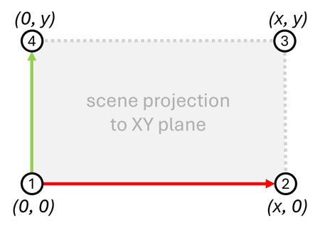

# How to Configure Geospatial Coordinates for a Scene

With this guide, you will learn how to configure Intel® SceneScape to output geospatial coordinates of detected objects. It involves:

- Setting up reference points of the scene, using local and geospatial coordinate systems.
- Configuring Intel® SceneScape to properly calculate and publish geospatial coordinates (latitude, longitude, altitude).
- Verifying if the coordinates of detected objects are published in MQTT messages.

## Assumptions

The conversion of object's local coordinates to geospatial coordinates system is reliable (stays within ~1 meter of accuracy) if the following are true:

- the scene surface is horizontal and relatively flat
- the scene dimensions are below 400m
- the detected objects are located up to 2 meters above the scene surface
- the measurement error of geospatial coordinates of the reference points (map corners) is negligible

Meeting the assumptions listed above is not required to use the feature. However, it is highly recommended to ensure they are met because any deviation from the listed assumptions can lead to increased inaccuracy of the detected object's latitude, longitude and altitude. Especially in such cases the accuracy of the conversion should be validated experimentally.

## Prerequisites

- **Dependencies Installed**: Intel® SceneScape deployed, MQTT client installed, and MQTT access credentials configured.
- **Access and Permissions**: Appropriate access to edit the scene with the UI and receive MQTT messages on the scene regulated topic.
- **Scene Preparation**: A scene is created as outlined in the [new scene guide](./How-to-create-new-scene.md):
  - Scene surface map should be rectangular with edges aligned to the X and Y axes (true by design for flat maps loaded from images, but must be aligned by the user for scenes using 3D models). See the next sections for how to verify this condition in practice.
  - Scene scale (pixels per meter) is set up properly.
  - The geospatial coordinates of the four map corners have been measured at the scene surface level. Refer to the [Conventions](#conventions) section for how to determine the scene corners.

### Conventions

- **Determining the Reference Points**: The reference points needed for the conversion are four map corners, which are determined relative to the map using the following convention:
  - For scene maps loaded as an image, Intel® SceneScape internally determines the map corners as the corners of the image with the X axis along the first image dimension.
  - For scene maps loaded as a 3D model, Intel® SceneScape internally determines the map corners by projecting the scene to the XY plane and calculating an axis-aligned bounding box of the scene projection.

- **Specifying the Geospatial Coordinates of the Reference Points**: The geospatial coordinates of the reference points, which are the four map corners, should be specified using the following convention:
  - Input format should be a JSON array, for example:
    ```json
    [
      [33.842058, -112.136117, 539],
      [33.842175, -112.134245, 539],
      [33.843923, -112.134407, 539],
      [33.843811, -112.136257, 539]
    ]
    ```
  - Let `x` and `y` be the size of the scene in meters along the X and Y axes. The expected order of the four map corners is `(0, 0, 0) (x, 0, 0) (x, y, 0) (0, y, 0)` as depicted in the figure below:

    

## Steps to Configure Geospatial Coordinates of the Scene

1. Launch the Intel® SceneScape UI and **Log In**.
1. Navigate to the scene setup page.
1. Click the **3D** button.
1. Make sure the scene is properly positioned relative to X and Y axis. The X axis is red. The Y axis is green.
1. Go back to the scene setup page and click the **Edit** button (pencil icon).
1. Set `Output lla` to `Yes`.
1. Input the geospatial coordinates of the four map corners in the JSON format. See the [Conventions](#conventions) section for details on how to specify the input value.
1. Click the **Save Scene Updates** button. Check for any errors reported and fix them if they appear.
1. Open the MQTT client and connect to the SceneScape server on the port 1883 with valid credentials.
1. Open the scene topic at `scenescape/regulated/scene` in the MQTT client and monitor the notifications about detected objects.

**Expected Result**: The `.object[].lat_long_alt` field in the messages contains correct geospatial coordinates of detected objects.
