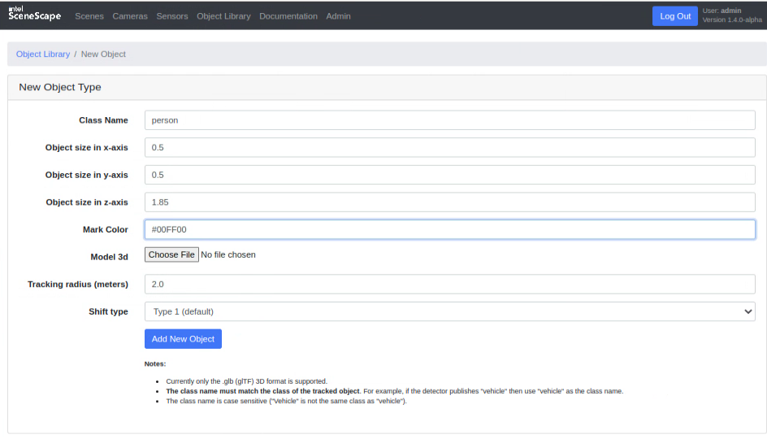
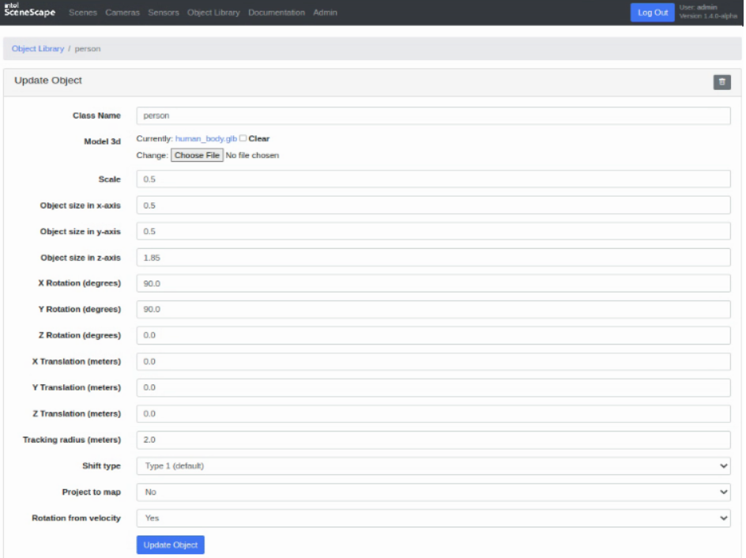
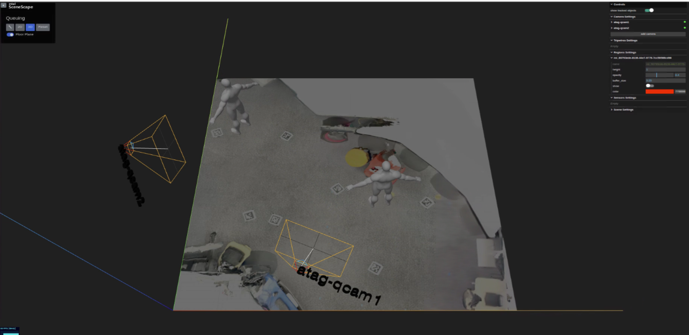

# How to Define Object Properties

Object Library allows you to configure various properties for object categories in SceneScape. This guide walks through the process of defining and customizing object properties.

## Working with the Object Library

1. Navigate to the SceneScape homepage.
2. Click on the Object tab from the topbar.

### Add a New Object
1. Click on "New Object".
2. Input the object properties.
3. Click on "Add New Object".

### Update Existing Object
1. Click on the "Spanner" icon in the Update column next to the object to be edited.
2. Edit the object properties.
3. Click on "Update Object".

## Basic Object Properties

### Size Configuration
- **Object size in x-axis**: Define the width of the object in meters
- **Object size in y-axis**: Define the length of the object in meters
- **Object size in z-axis**: Define the height of the object in meters

### Tracking Behavior Settings
- **Matching Threshold Radius**: Set the maximum distance for matching object tracks
- **Object Shift Type**: Shift type is used to compute the bottom center of the object to estimate its position in world coordinates.
    - For most objects the default setting of "Type 1" will work well.
    - For wide and short objects, "Type 2" performs better.

## Additional Settings

- **Infer Rotation from Velocity**: When enabled, orientation of the object is inferred from the computed velocity.
- **Project to Map**: When enabled, objects will be projected onto the map surface.

## 3D Model Configuration

By default, the shape of the object is a cuboid. Instead, the user can provide a 3D asset file (glb) for 3D visualization.

1. Click on "New Object" or Click on the "Spanner" icon in the Update column next to the object to be edited.
2. Choose a glb file with the file picker input.
3. Edit any of the asset property fields.
3. Click on "Add New Object" or "Update Object"

### Asset Properties

1. **Scale Adjustment**:
     - Use the scale value to resize the model uniformly along X, Y, and Z axes.

2. **Orientation Adjustment**:
     - Rotate the 3D asset along X, Y, and Z axes to set the default orientation.

3. **Position Adjustment**:
     - Adjust the default position of the 3D asset wrt origin.

### Verify Results
1. Navigate to the 3D UI of a Scene.
2. Instead of the default cuboid, the uploaded GLB will represent the tracked object.

