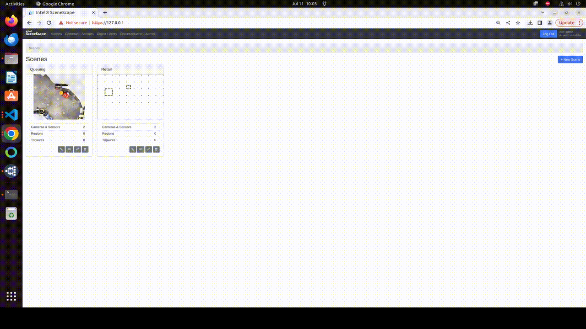
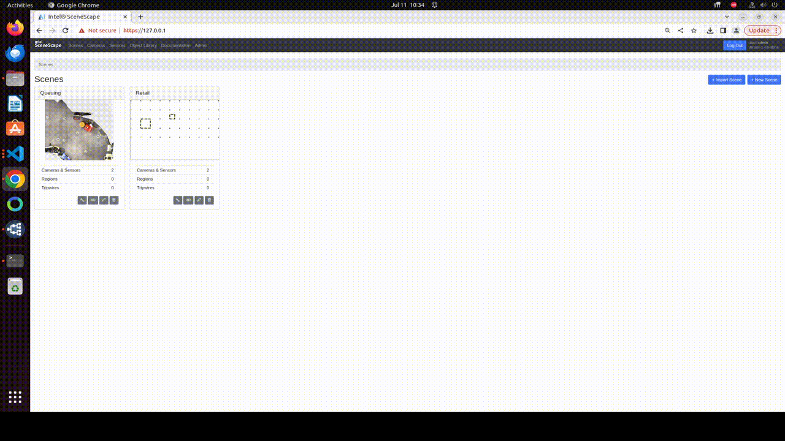

# Configure Spatial Analytics in Scenescape

This guide provides step-by-step instructions to set up Regions of Interest (ROIs) and Tripwires in Scenescape through the web UI. By completing this guide, you will:

- Understand the differences between Regions of Interest and Tripwires
- Learn how to configure ROIs and Tripwires through the UI
- Verify that events are properly triggered when objects interact with your defined analytics

For MQTT topics, event schemas, REST discovery, and application code samples, see [Work with Spatial Analytics Data](../work-with-spatial-analytics-data.md).

---

## Prerequisites

Follow the steps in the [Installation Guide](../../get-started/installation.md) to bring up an instance of Scenescape with out-of-box demo scenes.

## Steps to Configure Regions of Interest

### 1. Understand Analytic Types

**Regions of Interest (ROIs)** are defined areas within a scene where you want to monitor object presence, count, and dwell time.
**Tripwires** are virtual lines that trigger events when objects cross them in either direction.

---

### 2. Configure and Use a Region of Interest

#### Create a Region of Interest

1. Log in to Scenescape.
2. Click on a scene.
3. Click on the `Regions` tab below the scene map view.
4. Click `New Region` button to create a region.
5. Draw the region on the scene by clicking points on the scene map to form a polygon. Be sure to click on the starting point to close the polygon.
6. **Optional**: Add a user-defined name for the ROI in the text box.
7. Click `Save Regions and Tripwires` to save the newly created region.

#### Modify a Region of Interest

1. Click on `Regions` at the bottom of the page.
2. Find your region in the Scene and double click on the polygon to edit its shape. Drag the vertices to refine their positions.
3. Click `Save Regions and Tripwires` to persist your changes.

#### Set 3D Visibility

In the 3D scene view, expand `Regions Settings` or `Tripwires Settings`, then
toggle `show` for the item. The visibility setting is saved immediately and is
restored after refreshing the page. This setting is shared across users and
devices that view the scene.

#### Verify the Results

1. Use a tool like [MQTT Explorer](https://mqtt-explorer.com/) to observe all topics on the broker, or use a Paho MQTT client to observe the topic shown under the region name text box. For example: `/scenescape/event/region/${scene_uuid}/${region_uuid}/count`.
2. When the center of the object enters or exits a Region of Interest, a message is received on the region event topic.

Expected fields include `counts`, `objects`, `entered`, `exited` (with `dwell` on exit), and `metadata`. For full payload examples and field descriptions, see [Event Data Structures](../work-with-spatial-analytics-data.md#event-data-structures) in the developer guide.


Figure 1: Region of Interest creation flow

> **Need help working with spatial analytics data?** See the [Working with Spatial Analytics Data](../work-with-spatial-analytics-data.md) guide for details on consuming ROI and tripwire events via MQTT, including Python and JavaScript examples and data format specifications.

#### Enable Volumetric Intersection for Region of Interest

By default, Regions of Interest trigger events when the center point of each object enters or leaves the bounds of the polygon. However, for detecting an event like a collision, computing a volumetric intersection is necessary.

1. Follow the instructions in [How to Define Object Properties](../../other-topics/how-to-define-object-properties.md) to create an entry for the object category of interest.
1. Click on the `Regions` tab below the scene map view.
1. Find the specific region in the list and click on "volumetric" checkbox to enable intersection detection.
1. **Optional**: you can add a uniform buffer around the region and vary the height of the region.
1. Click `Save Regions and Tripwires` to persist your changes.

#### Verify Volumetric Intersection

1. Subscribe to the same region event topic as above (for example `/scenescape/event/region/${scene_uuid}/${region_uuid}/count`).
2. Navigate to the 3D UI view of the Scene.
3. When an object first intersects or last intersects with the region of interest, observe a message on the event topic for that region. The payload shape matches center-point ROI events; see [Event Data Structures](../work-with-spatial-analytics-data.md#event-data-structures).

> **Note:**
> To access the broker port `1883` from outside the Docker network, you must expose the port by **uncommenting** the following lines in your `docker-compose.yaml` file:
>
> ```yaml
> broker:
>   image: eclipse-mosquitto
>   # ports:
>   #   - "1883:1883"
> ```
>
> For production MQTT auth, Kubernetes NodePort options, and direct-MQTT client setup, see [Direct MQTT Access](../work-with-spatial-analytics-data.md#direct-mqtt-access-alternative-to-websockets) in the developer guide.

### 3. Configure and Use a Tripwire

#### Create a Tripwire

1. Log in to Scenescape.
2. Click on a scene.
3. Click on the `Tripwires` tab below the scene map view.
4. Click `New Tripwire` to create a tripwire.
5. Click on the Scene and a green line with two moveable endpoints will appear.
6. Click and drag each endpoint to get the right orientation and position for the tripwire (the flag line indicates the direction of positive flow).
7. **Optional**: Add a user-defined name for the tripwire in the textbox
8. Click `Save Regions and Tripwires` to create the tripwire.

#### Modify a Tripwire

1. Click on the `Tripwires` tab below the scene map view.
2. Double click on the tripwire to edit on the scene.
3. Click and drag to change position and orientation.
4. Click `Save Regions and Tripwires` to persist your changes.

#### Verify the Results

1. Use a tool like [MQTT Explorer](https://mqtt-explorer.com/) or [Eclipse Paho](https://eclipse.dev/paho/) to observe data published to MQTT. The tripwire event topic is shown under the name of the tripwire in the user interface. For example: `/scenescape/event/tripwire/${scene_uuid}/${tripwire_uuid}/objects`
2. When an object walks through a tripwire, a message is received on that topic.

When an object crosses over to the side with the center line, the value of `direction` is `1` and when it crosses in the opposite direction it is `-1`. For a full tripwire payload example, see [Tripwire Event Structure](../work-with-spatial-analytics-data.md#tripwire-event-structure).


Figure 2: Tripwire creation flow

---

## Supporting Resources

- [How to Visualize ROI and Sensor Areas](./visualize-regions.md)
- [Working with Spatial Analytics Data](../work-with-spatial-analytics-data.md) - Learn how to consume and process the spatial analytics data generated by ROIs and Tripwires
- [Scenescape README](https://github.com/open-edge-platform/scenescape/blob/main/README.md)
