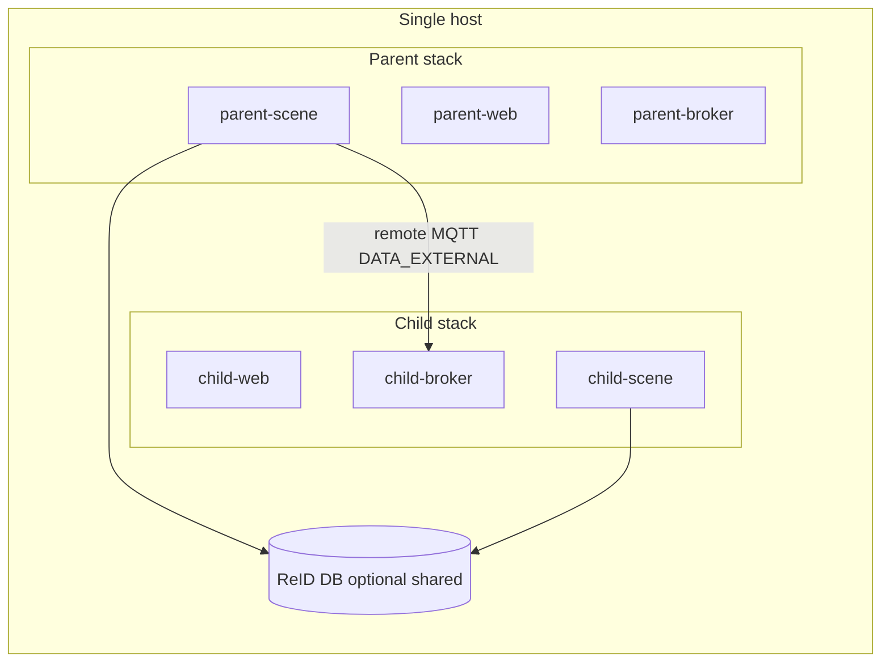

# Deploy Multiple Scene Controllers on One Host

A [scene hierarchy](./configure-hierarchy-of-scenes.md) can use **local** children
(same Scene Controller) or **remote** children (separate Scene Controllers linked
over MQTT). This guide covers the remote case when every controller runs on the
**same machine**.

By completing this guide, you will:

- Understand when you need more than one Scene Controller on one host.
- Co-locate parent and child stacks without port or certificate collisions.
- Optionally share one ReID vector database across controllers, or keep split
  backends when identities must not merge.

---

## When You Need Multiple Controllers

| Goal | Use |
|------|-----|
| Nested floor plans / ROIs under one tracker and one ReID process | **Local** child scenes on one controller |
| Independent Manager databases, MQTT brokers, or ReID backends per site/floor | **Remote** children (separate controllers) |
| Reproduce “parent has ReID / child does not” (or split DBs) literally | **Remote** children — ReID is per Scene Controller process, not per scene |

On one host, remote children still use the same remote-child link UI and MQTT
`DATA_EXTERNAL` path as controllers on different machines. The only difference
is networking: publish unique host ports and give each service a stable DNS
name on a shared Docker network.



---

## Prerequisites

- Docker Compose and Scenescape images built or pulled (`make build-core` or
  prebuilt containers).
- Ability to edit Compose files (or use prefixed service fragments).
- Familiarity with [remote child linking](./configure-hierarchy-of-scenes.md#steps-to-add-a-remote-child-scene)
  and, if using identity matching,
  [enabling ReID](../../other-topics/how-to-enable-reidentification.md).

---

## Recommended Layout: One Compose Project, Prefixed Services

Prefer **one Compose project** with role-prefixed services
(`parent-web`, `child1-broker`, …) on one Docker network. That avoids two
stacks both claiming host ports `443` / `1883` / `55555`.

A working reference used by functional tests lives under
[`tests/compose/hierarchy/`](https://github.com/open-edge-platform/scenescape/tree/main/tests/compose/hierarchy).
Those fragments are test-oriented but illustrate the same deployment rules.

### 1. Give Each Role Unique Host Ports

Publish different host ports for every web UI and MQTT broker you will reach
from the host (browsers, pytest, `mosquitto_pub`):

```bash
export PARENT_WEB_PORT=8443
export PARENT_BROKER_PORT=18883
export CHILD1_WEB_PORT=8444
export CHILD1_BROKER_PORT=18884
# If you expose ReID to the host:
export REID_SHARED_PORT=55555
```

Inside the Docker network, services still talk on container ports (`443`,
`1883`, `55555`). Only the **host** mappings must be unique.

### 2. Use Stable DNS Aliases on a Shared Network

Attach every service to one network (for example `scenescape`) and set aliases
such as:

- `parent-web.scenescape.intel.com` / `parent-broker.scenescape.intel.com`
- `child1-web.scenescape.intel.com` / `child1-broker.scenescape.intel.com`
- `reid.scenescape.intel.com` (or `reid-shared.scenescape.intel.com`) when sharing ReID

Add matching lines to the host `/etc/hosts` (or your test harness host-alias
list) so tools on the host can resolve those names to `127.0.0.1` and use the
published ports.

### 3. Share Secrets (Simplest on One Host)

On a single machine, the simplest trust model is **one secrets directory** for
all controllers:

- One CA (`scenescape-ca.pem`)
- One web TLS cert/key (with SANs for every `*-web` hostname)
- One broker TLS material (with SANs for every `*-broker` hostname)
- One `controller.auth` / `browser.auth` for MQTT and REST automation
- Shared ReID client/server certs when any controller uses ReID

Generate certificates with extra hostnames via `EXTRA_HOSTS` in
`tools/certificates/Makefile` (broker/web/reid-s targets already support
parent/child/reid aliases used by the hierarchy tests):

```bash
make -C tools/certificates deploy-certificates CERTPASS=<passphrase>
```

Regenerate after changing SAN lists so TLS hostname checks succeed for every
alias.

> **Note:** Separate CA/auth per controller is possible but heavier: you must
> still arrange mutual MQTT TLS trust for the parent’s remote-child connection.
> Shared secrets are the usual choice for a lab or single-host demo.

### 4. One NTP Source

Time skew drops or delays hierarchy MQTT frames. Run **one** NTP service (on
the parent stack) and point every scene controller (and video pipeline, if any)
at that hostname. Do not run independent NTP servers per child on the same host
unless you know they stay synchronized.

### 5. Separate Persistence Per Controller

Each controller role needs its own:

- PostgreSQL volume (Manager metadata / scenes / cameras)
- Media / migrations volumes as required by Manager
- MQTT broker instance

Do **not** share one Manager database across two Scene Controllers. Scene and
camera UUIDs must remain unique for remote links: if two stacks both load the
same Demo fixture UUID, create a dedicated scene (and camera) on each child
before linking, or clear duplicate scenes.

### 6. Link Children as Remote

From the **parent** UI (or REST API):

1. Open the parent scene → **Children** → **+ Link Child Scene**.
2. Set **Child Type** to `Remote`.
3. Set **Hostname** to the child’s broker alias (for example
   `child1-broker.scenescape.intel.com`), not the host’s LAN IP, when both
   stacks share the Docker network.
4. Enter MQTT username/password from the shared (or child) `controller.auth`.
5. Set transform / **Retrack** as for any remote child.
6. Confirm the child status topic reports connected
   (`scenescape/sys/child/status/<remote_child_id>`).

Full UI steps: [Add a remote child scene](./configure-hierarchy-of-scenes.md#steps-to-add-a-remote-child-scene).

---

## Sharing a ReID Backend Across Controllers

ReID runs **inside each Scene Controller** that was started with ReID enabled
(`REID_DATABASE`, client certs, and a reachable vector DB). Controllers do not
inherit ReID from their parent scene link.

### Shared database (recommended for cross-child identity)

Run **one** VDMS or Qdrant instance and point every participating controller at
it:

```yaml
environment:
  REID_DATABASE: VDMS          # or QDRANT
  REID_HOSTNAME: reid.scenescape.intel.com
  REID_PORT: "55555"
  REID_USE_TLS: "true"
```

Mount the same ReID client certificates on each scene service. The DB service
needs a network alias matching `REID_HOSTNAME` and the shared server cert SANs.

Behavior with a shared DB and hierarchy provenance:

- The scene that owns the camera **enrolls** qualifying crops.
- A parent with **Retrack** enabled may **query** using forwarded embeddings
  (with provenance) but must not enroll the same crop again.
- Controllers without ReID still forward objects; they simply do not enroll or
  query.

See [Embeddings in a Scene Hierarchy](../../microservices/controller/Extended-ReID.md#embeddings-in-a-scene-hierarchy)
and [Re-identification in hierarchy](./configure-hierarchy-of-scenes.md#re-identification-support-in-hierarchy).

### Partial sharing

Examples:

- Children enroll into a shared DB; parent has no ReID → parent shows tracks but
  cannot rematch via the vector DB.
- Parent + some children share a DB; another child has no ReID → that child
  does not contribute enrollments and will not merge via ReID at the parent.

Wire this by enabling ReID only on the controllers that should participate and
pointing those at the same `REID_HOSTNAME`.

### Split databases (no cross-merge)

Give each group its own vector DB service and hostname (for example
`reid-a.scenescape.intel.com` and `reid-b.scenescape.intel.com`), each with a
unique host port if exposed. Controllers in different groups will not see each
other’s enrollments, so parent-level ReID cannot merge identities across those
groups even when embeddings match.

Use split DBs when you intentionally want isolated identity spaces.

### Backend choice

VDMS and Qdrant remain mutually exclusive **per controller**. For a shared DB,
every controller that connects should use the same `REID_DATABASE` value and
the same logical service. Switching backends:
[Selecting the ReID vector database backend](../../other-topics/how-to-enable-reidentification.md#selecting-the-reid-vector-database-backend).

---

## Alternative: Multiple Compose Projects

You can run `COMPOSE_PROJECT_NAME=parent` and `COMPOSE_PROJECT_NAME=child1` as
separate projects if you:

- Remap **all** conflicting published ports.
- Attach both projects to an **external** Docker network and use aliases or
  reachable hostnames.
- Share or trust certificates as above.
- Point child NTP at the parent NTP container or host.

Prefixed services in one project are usually easier to operate on a single
machine.

---

## Validation Checklist

- [ ] Each web UI opens on its own host port with a valid TLS name.
- [ ] Each broker accepts MQTT with the expected auth and CA.
- [ ] Parent remote-child status is connected for every child.
- [ ] Parent regulated MQTT shows child objects after transform.
- [ ] If ReID is shared: one vector DB; camera-owning scenes enroll once;
      retracking parents query without double-enrolling.
- [ ] Clocks stay aligned (single NTP or equivalent).

---

## Related Documentation

- [Configure a hierarchy of scenes](./configure-hierarchy-of-scenes.md) — local vs remote linking, retrack, rates
- [How to enable re-identification](../../other-topics/how-to-enable-reidentification.md) — single-stack ReID enablement
- [Extended ReID](../../microservices/controller/Extended-ReID.md) — provenance and enrollment policy
- [ADR 0015: Hierarchy ReID provenance](../../../adr/0015-hierarchy-reid-provenance.md) — design rationale
- Test compose reference: `tests/compose/hierarchy/`
- Functional coverage: `tests/functional/test_hierarchy_reid_db_scope.py`
- Agent fixture notes: [multi-controller hierarchy fixtures](../../../../.github/skills/testing/references/functional-tests.md#multi-controller-hierarchy-fixtures)
