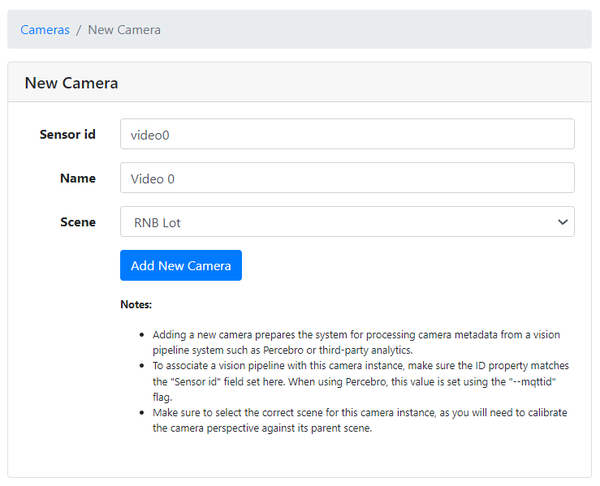

# Generate a Scene Map Using the Mapping Service

This guide provides step-by-step instructions to automatically generate a 3D scene map from camera feeds using Scenescape's mapping service. By completing this guide, you will:

- Build and launch all Scenescape services including the mapping service
- Create a new scene choosing **Reconstruct from cameras** (no placeholder map required)
- Add cameras and verify video frames are being processed
- Generate a 3D mesh reconstruction from the scene map helper
- Visualize the generated mesh in both 2D and 3D views
- Enable multi-camera tracking using the generated mesh

---

## Prerequisites

- A system meeting the hardware requirements for Scenescape
- Docker and Docker Compose installed
- Multiple cameras covering the scene from different angles
- Basic familiarity with the Scenescape user interface

---

## Overview

The mapping service uses advanced computer vision techniques to reconstruct a 3D mesh of your scene from multiple camera views. This automated approach eliminates the need to manually create floor plans or CAD drawings, significantly reducing setup time and improving calibration accuracy.

---

## Step 1: Build All Services

Before launching the demo, build all Scenescape services including the mapping and clustering services:

```bash
SUPASS=your_password make build-all
```

This command will:

- Build all core services (controller, manager, autocalibration, model_installer)
- Build experimental services (mapping and cluster_analytics)
- Generate security certificates and secrets
- Install required AI models

> **Note**: The build process may take 15-30 minutes depending on your system. This is a one-time operation unless you need to rebuild services.

---

## Step 2: Launch Services with Mapping

To start all services including both mapping and cluster analytics:

```bash
SUPASS=your_password make demo-all
```

For successive runs, you can use Docker Compose directly (see [Docker Compose Profiles](../../get-started/installation.md#docker-compose-profiles) for details on available profiles):

### Launch all cores services and experimental services

```bash
docker compose --profile experimental up -d
```

### Launch all cores services and mapping service

```bash
docker compose --profile mapping up -d
```

> **Note**: The `--profile` flag allows you to selectively enable experimental services. Use `experimental` for both clustering and mapping, or `mapping` to start just the mapping service along with all core services.

### Verify Services are Running

Check that all services are healthy:

```bash
docker compose ps
```

You should see services including `mapping` with a status of `healthy`.

> **Important**: During the first deployment, the mapping service downloads required model weights (approximately 1-2GB). This can take several minutes and the service will show as unhealthy during this time. Subsequent runs will use the cached weights available in the Docker volume and start much faster.

---

## Step 3: Create a New Scene for Reconstruction

1. Open your web browser and navigate to the Scenescape URL.
2. Log in using the credentials you configured (username: `admin`, password: your `SUPASS` value)
3. Click on **Scenes** in the navigation menu
4. Click **+ New Scene**
5. Fill in the scene details:
   - **Scene Name**: Enter a descriptive name for your scene
   - **Map source**: Choose **Reconstruct from cameras** (default when the mapping service is healthy)
   - You do **not** need to upload a placeholder map for this path

6. Click **Create scene**

The scene opens with a setup helper on the map stage. Tracking cannot run until a map exists and cameras are calibrated—either by generating a mesh (map + auto-calibration) or by uploading / positioning a geospatial map and calibrating manually.

> **Note**: If mapping is not running, **Reconstruct from cameras** is disabled. Upload a floor plan / GLB, use **Geospatial map** in the create drawer, or start mapping (`docker compose --profile mapping up -d` / `make demo-all`) and try again.

> **Alternatives**: **Upload map** attaches an image or GLB at create time. **Geospatial map** lets you position a basemap in the create drawer before the scene is saved.

---

## Step 4: Add Cameras and Verify Video Frames

1. On the scene details page, follow the map setup helper (or click **+ New Camera**) and fill in the camera details as required.

> **Note**: The camera ID _must_ match the `cameraid` set in the config file for DL Streamer Pipeline Server (e.g: dlstreamer-pipeline-server/config.json), or the scene controller will not be able to associate the camera with its instance in Scenescape.

Using the above example, the form should look like this for the `video0` camera:



2. Click **Save Camera**
3. Repeat for all cameras in your scene

### Verify Video Frames

After adding cameras, verify that video frames are being received:

1. Navigate to the scene details page
2. You should see live video thumbnails from each camera
3. Verify that the video streams are active and showing the correct views

> **Note**: Ensure cameras have overlapping fields of view for the mapping service to successfully reconstruct the scene.

> **Important**: If cameras are added but the scene still has no map and mapping is unavailable, the map stage shows a **tracking blocked** helper. Upload or geospatial-map the scene (then calibrate manually), or start the mapping service and generate a mesh. Without a map and calibration, tracking will not work.

---

## Step 5: Generate the Scene Mesh

Once cameras are configured and streaming:

1. On the scene details page, use **Generate Mesh** on the map setup helper (also available under **Edit Scene** when mapping is healthy).

> **Note**: The "Generate Mesh" button is only available when the mapping service is healthy. If you do not see this button:
>
> - Verify the mapping service is running: `docker compose ps mapping`
> - Check the mapping service logs: `docker compose logs mapping`
> - Ensure the service shows as `healthy` in the status
> - Use **Check again** on the map setup helper after starting the service

The mesh generation process will:

- Capture frames from all cameras
- Perform monocular depth estimation
- Reconstruct a 3D point cloud and mesh of the scene
- Align the mesh to the first quadrant and rotate the floor to align with the XY plane
- Automatically calibrate camera poses relative to the reconstructed scene
- Apply the generated mesh and camera updates when the job completes (no separate Save step is required for the mesh)

> **Note**: Mesh generation typically takes 2-5 minutes depending on scene complexity and the number of cameras.

---

## Step 6: Confirm the Map Was Applied

After mesh generation completes, the page reloads with:

- A top-down render of the 3D mesh as the scene map
- Updated camera parameters from the reconstruction
- Multi-camera tracking enabled for the scene

Use **Edit Scene** only if you need to adjust other scene settings.

## Step 7: View the Top-Down Mesh Render

Return to the scene details page:

1. Click on **Scenes** in the navigation menu
2. Select your scene
3. Observe the scene map, which now displays the top-down render of the generated mesh

## Step 8: Verify 3D Mesh Alignment

To inspect the 3D mesh and camera poses:

1. Click on the "3D" button for the scene.
2. In the 3D view, you should see:
   - The reconstructed 3D mesh properly aligned in the first quadrant
   - The mesh floor rotated to align with the XY plane
   - Camera poses correctly positioned in the 3D space
   - Camera frustums showing each camera's field of view

The 3D visualization allows you to:

- Verify camera placement and orientation
- Check mesh quality and coverage
- Confirm proper scene alignment

> **Note**: Camera poses are automatically calculated during mesh generation and should already be correctly aligned. Manual calibration is not needed.

---

## Step 9: Verify Multi-Camera Tracking

If objects (people, vehicles, etc.) are visible in your camera feeds:

1. Observe the scene in either 2D or 3D view
2. Multi-camera tracking should automatically begin, showing:
   - Detected objects from all cameras
   - Unified tracks across multiple camera views
   - Object positions correctly mapped to the 3D mesh

The mapping service provides:

- Accurate object localization in 3D space
- Consistent tracking across camera boundaries
- Proper ground plane alignment for object positioning

---

## Important Notes

### Reconstruction Scale

> **Warning**: The scale of the reconstructed mesh may not match real-world measurements exactly. This is a known limitation of monocular depth estimation, which cannot determine absolute scale without additional reference information.

To address scale inaccuracies:

- Use the generated mesh for spatial relationships and topology rather than precise measurements
- For applications requiring accurate dimensions, manual scale calibration may be necessary

### Best Practices

For optimal mesh generation results:

- **Camera Coverage**: Ensure cameras have good overlapping coverage of the scene
- **Lighting**: Maintain consistent, well-lit conditions during mesh generation
- **Static Scene**: Keep the scene as static as possible during mesh capture (avoid moving objects)
- **Camera Placement**: Position cameras at different heights and angles for better 3D reconstruction
- **Texture**: Scenes with visual texture and features reconstruct better than blank surfaces

---

## Stopping Services

To stop all Scenescape services:

```bash
docker compose --profile controller --profile experimental down
```

To stop services and remove volumes (this will delete all data):

```bash
docker compose --profile controller --profile experimental down -v
```

> **Note:** The `--profile` flags must match those used when starting the services. If you only started with `--profile controller`, omit `--profile experimental`. See [Docker Compose Profiles](../../get-started/installation.md#docker-compose-profiles) for details.

---

## Troubleshooting

### Mapping Service Not Healthy

If the mapping service remains unhealthy:

1. Check service logs: `docker compose logs mapping`
2. Verify model weights are downloading: Look for download progress in logs
3. Ensure sufficient disk space for model weights (~2GB)
4. Check network connectivity if behind a proxy

### Generate Mesh Button Not Visible

If you do not see the "Generate Mesh" button on the map setup helper or under Edit Scene:

1. Verify mapping service is running: `docker compose ps | grep mapping`
2. Ensure you're using the correct profile: `--profile mapping` or `--profile experimental`
3. Check that the mapping service shows as healthy
4. Refresh the browser page or click **Check again** on the map helper after the service becomes healthy
5. Confirm the scene has at least one camera (Generate Mesh appears when cameras exist and mapping is healthy)

### Tracking Blocked / No Map Helper

If the scene has cameras but no map and mapping is down, the map stage explains that tracking cannot run until a map and calibration exist. Either:

1. Start mapping and use **Generate Mesh**, or
2. **Upload a map** / **Use geospatial map**, then calibrate cameras manually

### Poor Mesh Quality

If the generated mesh has issues:

1. Verify cameras have sufficient overlapping coverage (>20% overlap)
2. Check lighting conditions in the scene
3. Ensure cameras are properly focused
4. Consider adding more cameras for better coverage
5. Remove or minimize moving objects during mesh generation

---

## Supporting Resources

- [Create and Configure a New Scene](./create-new-scene.md)
- [How to Configure DL Streamer Video Pipeline](../../other-topics/how-to-configure-dlstreamer-video-pipeline.md)
- [Scenescape README](https://github.com/open-edge-platform/scenescape/blob/main/README.md)
