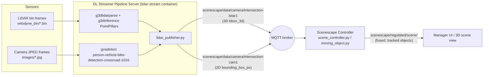

<!--
SPDX-FileCopyrightText: (C) 2026 Intel Corporation
SPDX-License-Identifier: Apache-2.0
-->

# Tutorial: LiDAR + Camera Fusion in the `LidarIntersection` Scene

This tutorial walks through the `LidarIntersection` sample scene end to end: how the scene
and its sensors are configured, how the DL Streamer Pipeline Server produces detections from
LiDAR point clouds and camera frames, how those detections travel over MQTT, and how the
Scenescape Controller fuses/tracks them into a single regulated 3D scene view.

- [1. What is the `LidarIntersection` scene](#1-what-is-the-lidarintersection-scene)
- [2. Scene configuration file](#2-scene-configuration-file)
- [3. Running the demo](#3-running-the-demo)
- [4. DL Streamer pipeline configuration](#4-dl-streamer-pipeline-configuration)
- [5. MQTT message formats](#5-mqtt-message-formats)
- [6. How LiDAR and camera data get fused](#6-how-lidar-and-camera-data-get-fused)
- [7. Coordinate transforms cheat sheet](#7-coordinate-transforms-cheat-sheet)
- [8. Inspecting the pipeline live](#8-inspecting-the-pipeline-live)
- [9. Tuning and troubleshooting](#9-tuning-and-troubleshooting)
- [10. Further reading](#10-further-reading)

## 1. What is the `LidarIntersection` scene

`LidarIntersection` is a sample Scenescape scene that demonstrates **multimodal sensor
fusion**: a simulated road intersection observed simultaneously by

- one **LiDAR** sensor (`intersection-lidar1`) replaying recorded Velodyne point-cloud frames
  and running the **PointPillars** 3D object detector, and
- one **RGB camera** (`intersection-cam1`) replaying recorded JPEG frames through the
  **person-vehicle-bike-detection-crossroad-1016** 2D object detector.

Both sensors observe the same physical intersection from different vantage points. The
Scenescape Controller merges their detections into one set of tracked objects (vehicles,
cyclists) positioned on a common ground-plane map (`LidarIntersection.png`).



## 2. Scene configuration file

The scene is defined in [`sample_data/LidarIntersection.json`](../../../../sample_data/LidarIntersection.json)
and seeded into the database on first run via `sample_data/exampledb.tar.bz2`. Key fields:

```jsonc
{
  "uid": "a1b2c3d4-e5f6-4890-abcd-ef1234567890",
  "name": "Lidar Intersection",
  "map": "/media/LidarIntersection.png",
  "scale": 6.6667,          // pixels-per-meter for the background map image (~150x150 m scene)
  "cameras": [
    {
      "uid": "intersection-cam1",
      "transform_type": "3d-2d point correspondence",
      "transforms": [ /* 2D pixel + 3D world point pairs, solved via PnP */ ],
      "intrinsics": { "fx": 2175.55, "fy": 2320.13, "cx": 960.0, "cy": 540.0 },
      "distortion": { "k1": -0.4267, "k2": 0.18, "p1": 0.0012, "p2": -0.00015, "k3": 0.0 },
      "translation": [66.37, 128.48, 9.61],
      "rotation": [105.68, -0.79, 178.01],   // degrees, XYZ euler
      "resolution": [1920, 1080]
    },
    {
      "uid": "intersection-lidar1",
      "transform_type": "euler",
      "translation": [70.0, 127.0, 0],
      "rotation": [-180, 0.0, -180],          // degrees, XYZ euler
      "resolution": [1000, 1000]
    }
  ]
}
```

Both entries live under the same `"scene"` (the scene UID), so the Controller treats them as
two sensors of a single scene:

- `intersection-cam1` uses `transform_type: "3d-2d point correspondence"`: pose is derived by
  solving PnP from a list of `(pixel_x, pixel_y) <-> (world_x, world_y, world_z)` point
  correspondences, plus separately-stored `translation`/`rotation` (the resulting camera pose)
  and pinhole `intrinsics`/`distortion`. See
  [`scene_common/src/scene_common/transform.py`](../../../../scene_common/src/scene_common/transform.py)
  (`PointCorrespondenceTransform`) for how this is solved/stored.
- `intersection-lidar1` uses the simpler `transform_type: "euler"`: a plain
  translation + XYZ Euler rotation placing the LiDAR sensor's local frame directly into the
  scene/world frame — no PnP needed since the "camera" here is really the recorded point
  cloud's own coordinate frame.

Both entries can be edited from the Manager UI (Sensors tab) or directly in this JSON/DB
row; recalibrating the camera means re-solving `transforms` (see
[Autocalibrate cameras using AprilTags](../calibrate-cameras/autocalibrate-cameras-using-apriltags.md)
or [Autocalibrate cameras using visual features](../calibrate-cameras/autocalibrate-cameras-using-visual-features.md)
for the standard tooling), while the LiDAR pose is normally set once and left fixed.

## 3. Running the demo

The LiDAR services (`lidar-data-init`, `lidar-model-init`, `lidar-stream`) have no Compose
profile restriction, so they start with the default core services:

```sh
# First run (builds images, installs models, seeds the example DB, starts the demo):
SUPASS=<password> make build-core demo

# Subsequent runs, after the images already exist:
SUPASS=<password> make demo
```

`make demo` internally runs `docker compose --profile controller up`, which starts (among
others):

| Service | Role |
|---|---|
| `lidar-data-init` | One-shot init container: unpacks `sample_data/velodyne_bin_part*.tar.gz` and `image_part*.tar.gz` into a shared volume (`vol-sample-data`) as `velodyne_bin/*.bin` and `images/*.jpg`. |
| `lidar-model-init` | One-shot init container: runs `model_installer/src/install-pointpillars` to download/convert the PointPillars OpenVINO model into `vol-models`. |
| `lidar-stream` | Long-running: launches `lidar_publisher.py`, which drives one `gst-launch-1.0` process with two independent branches (LiDAR + camera) and publishes detections to MQTT. |
| `scene` (Controller) | Subscribes to both sensors' MQTT topics, fuses/tracks objects, publishes the regulated scene. |
| `broker` | Mosquitto MQTT broker (TLS on 1883/1884, not published to the host). |

To tear the demo down: `docker compose --profile controller down` (add `-v` / use
`make demo-close` to also wipe the database volume and reseed from `exampledb.tar.bz2` next
time).

## 4. DL Streamer pipeline configuration

The `lidar-stream` container's entrypoint is
[`dlstreamer-pipeline-server/user_scripts/lidar_publisher.py`](../../../../dlstreamer-pipeline-server/user_scripts/lidar_publisher.py),
which builds and runs a **single `gst-launch-1.0` invocation containing two independent
branches** (no `gvastreammux`/`gvastreamdemux` — that combination proved fragile with this
heterogeneous LiDAR+video caps pairing: PREROLL deadlocks and "LidarMeta is missing from
input buffer" errors). The two branches stay frame-synchronized because they share the same
`start-index`/`FRAME_RATE` and are correlated in Python by FIFO arrival order.

### Camera branch

```text
multifilesrc (images/%06d.jpg)
  ! jpegdec ! videoconvert ! video/x-raw,format=BGR
  ! gvafpsthrottle target-fps=<LIDAR_FRAME_RATE>
  ! gvapython class=PostDecodeTimestampCapture module=sscape_adapter.py   # timestamp sync
  ! gvadetect model=person-vehicle-bike-detection-crossroad-1016.xml
             model-proc=person-vehicle-bike-detection-crossroad-1016.json
             device=<CAM_DEVICE> threshold=<CAM_SCORE_THRESHOLD>
  ! gvametaconvert add-tensor-data=true
  ! gvametapublish method=file file-format=json-lines file-path=<CAM_FIFO>
  ! gvapython class=PostInferenceDataPublish module=sscape_adapter.py     # -> MQTT
  ! fakesink sync=false
```

### LiDAR branch

```text
multifilesrc (velodyne_bin/%06d.bin)
  ! g3dlidarparse stride=1 frame-rate=<LIDAR_FRAME_RATE>
  ! g3dinference config=pointpillars_ov_config.json device=<LIDAR_DEVICE>
               score-threshold=<LIDAR_SCORE_THRESHOLD>
  ! gvametaconvert add-tensor-data=<LIDAR_ADD_TENSOR_DATA> format=json
  ! gvametapublish method=file file-format=json-lines file-path=<FIFO>
  ! fakesink sync=false
```

`gvametapublish` writes each branch's JSON-lines detections to a named FIFO
(`/tmp/lidar_detections.fifo`, `/tmp/camera_detections.fifo`); `lidar_publisher.py`'s Python
`main()` loop reads both FIFOs, converts each frame into Scenescape's detection schema, and
publishes to MQTT (see [section 5](#5-mqtt-message-formats)).

### Key environment variables (set in `docker-compose.yml`, service `lidar-stream`)

| Variable | Default | Meaning |
|---|---|---|
| `LIDAR_SENSOR_ID` | `intersection-lidar1` | Must match a camera `uid` in the scene JSON/DB. |
| `LIDAR_DATA_PATH` | `.../velodyne_bin/%06d.bin` | `multifilesrc` location pattern for point-cloud frames. |
| `LIDAR_START_INDEX` / `LIDAR_STOP_INDEX` | `010699` / unset (loop) | Frame index range to replay. |
| `LIDAR_LOOP` | `true` | Loop the recording indefinitely. |
| `LIDAR_FRAME_RATE` | `10` | FPS for both branches (paces `gvafpsthrottle` on the camera side too). |
| `LIDAR_DEVICE` | `CPU` (compose sets `GPU`) | OpenVINO device for PointPillars inference. |
| `LIDAR_SCORE_THRESHOLD` | `0.7` | Minimum PointPillars detection confidence. |
| `LIDAR_MODEL_CONFIG` | `.../pointpillars/FP16/pointpillars_ov_config.json` | `g3dinference` model config. |
| `LIDAR_PUBLISH_RAW` | `false` (compose sets `true`) | Also mirror raw `gvametaconvert` LiDAR output to `<topic>-raw` for debugging. |
| `CAM_SENSOR_ID` | `intersection-cam1` | Must match a camera `uid` in the scene JSON/DB. |
| `CAM_DATA_PATH` | `.../images/%06d.jpg` | `multifilesrc` location pattern for camera frames. |
| `CAM_DEVICE` | `CPU` | OpenVINO device for the 2D detector. |
| `CAM_SCORE_THRESHOLD` | `0.3` (compose sets `0.8`) | Minimum 2D detector confidence. |
| `CAM_DETECTION_LABELS` | `vehicle,cyclist` | Classes forwarded from the 2D detector. |
| `MQTT_HOST` / `MQTT_PORT` | `broker.scenescape.intel.com` / `1883` | Broker connection (TLS via the mounted `scenescape-ca.pem`). |

Uncomment/override any of these in `docker-compose.yml` (service `lidar-stream`) or via a
`.env` file to point at a different recording, sensor id, device, or thresholds. See
[dlstreamer-pipeline-server/README.md](../../../../dlstreamer-pipeline-server/README.md) for
the general (non-LiDAR) DL Streamer pipeline configuration guide — enabling GPU/NPU, Re-ID,
pose estimation, NTP timestamps, and creating brand-new pipelines.

## 5. MQTT message formats

Both branches ultimately publish onto **`scenescape/data/camera/<sensor_uid>`** topics — the
Controller subscribes to this pattern for every configured sensor, regardless of modality.

**LiDAR** (`scenescape/data/camera/intersection-lidar1`), built by `build_lidar_message()`:

```jsonc
{
  "id": "intersection-lidar1",
  "timestamp": "2026-07-14T11:00:05.011Z",
  "rate": 10.0,
  "objects": {
    "vehicle": [
      {
        "id": 1,
        "category": "vehicle",
        "confidence": 0.91,
        "translation": [-12.4, 3.1, 0.0],     // scene-frame offset (see section 7)
        "size": [4.2, 1.8, 1.5],              // length, width, height
        "rotation": [0.02, 0.99, 0.0, 0.0],   // quaternion, see bbox3d_to_quaternion()
        "source": "lidar"
      }
    ],
    "cyclist": []
  }
}
```

**Camera** (`scenescape/data/camera/intersection-cam1`), built by `sscape_adapter.py` from
`gvadetect`/`gvametaconvert` output:

```jsonc
{
  "id": "intersection-cam1",
  "timestamp": "2026-07-14T11:00:05.870Z",
  "objects": {
    "vehicle": [
      {
        "id": 3,
        "category": "vehicle",
        "confidence": 0.82,
        "bounding_box_px": { "x": 812, "y": 401, "width": 96, "height": 74 }
        // no "rotation": 2D detectors cannot observe orientation.
      }
    ]
  }
}
```

The presence/absence of `rotation` is the key signal the Controller uses to know whether a
detection came from a sensor that observes true 3D orientation (LiDAR) or one that doesn't
(monocular camera) — see [section 6](#6-how-lidar-and-camera-data-get-fused).

## 6. How LiDAR and camera data get fused

Fusion and tracking are performed by the **Scenescape Controller**
(`controller/src/controller/{scene_controller,scene,moving_object,tracking}.py`), not inside
the DL Streamer pipeline. The pipeline's job stops at "publish per-sensor detections"; the
Controller is what turns per-sensor detections into a single set of tracked, fused objects.

1. **Per-sensor ingestion**: the Controller subscribes to
   `scenescape/data/camera/intersection-lidar1` and `scenescape/data/camera/intersection-cam1`
   independently. Each incoming detection is mapped from sensor-local coordinates into the
   scene's world frame using that sensor's pose (`translation`/`rotation`/`transform_type`
   from the scene config in [section 2](#2-scene-configuration-file)) —
   `mapObjectDetectionToWorld()` in `moving_object.py`.
2. **Cross-sensor association**: for every incoming detection, the Controller runs **Hungarian
   assignment** against existing tracked objects **of the same category** (vehicle vs
   cyclist vs person), gated by a distance threshold (`DEFAULT_TRACKING_RADIUS`, meters, in
   `moving_object.py`, overridable per-class as `tracking_radius` in the Manager's asset
   config). A LiDAR detection and a camera detection that land within this radius of the
   same tracked object are merged into **one** tracked object (`gid`) whose `source` field can
   flip between `"lidar"` and `"camera"` frame to frame, depending on which sensor most
   recently updated it.
3. **State estimation**: each tracked object owns a `RobotVision` (C++/pybind) multi-model
   Kalman/UKF filter (CTRV/CV/CA motion models) that smooths position/velocity across
   whichever sensor's detections arrive, regardless of source.
4. **Orientation handling** — this is where LiDAR and camera detections are treated
   differently, because only LiDAR gives real 3D orientation:
   - If a detection carries a `rotation` (LiDAR), it's used directly (transformed into the
     world frame via the sensor's pose matrix), and the track is flagged
     `has_detection_rotation = True`.
   - If a detection has no `rotation` (2D camera bbox), and the object's class config has
     `rotation_from_velocity: true`, the Controller infers heading from the Kalman-estimated
     velocity direction instead (`inferRotationFromVelocity()`), with hysteresis
     (`SPEED_THRESHOLD_ON`/`OFF`) to avoid flapping on noisy low-speed velocity estimates.
   - LiDAR's own reported yaw can still have a 180° front/back ambiguity (a known limitation
     of oriented-bbox 3D detectors like PointPillars); when `rotation_from_velocity` is
     enabled, `_disambiguateRotationWithVelocity()` corrects this by flipping the sensor
     heading 180° about Z whenever it points opposite the track's own (unambiguous) velocity
     direction at speed.
5. **Publishing the fused result**: the Controller publishes tracked objects (fused, with
   final position/velocity/rotation) on `scenescape/regulated/scene/<scene_uid>` — this is the
   topic the Manager UI's 3D scene view (and any downstream consumer) should subscribe to, not
   the raw per-sensor `scenescape/data/camera/...` topics.

> **Note**: There is a *separate*, newer C++ "Tracker Service" (`tracker/`) that also
> subscribes to `scenescape/data/camera/+` and publishes to
> `scenescape/data/scene/<scene_uid>/<thing_type>` (enabled via the `tracker`/`analytics`
> Compose profiles, e.g. `make demo-tracker`). It is a different, independent tracking
> pipeline from the Controller's fusion described above — don't confuse the two when reading
> MQTT captures.

## 7. Coordinate transforms cheat sheet

- **LiDAR → scene offset** (`lidar_to_scene_offset()` in `lidar_publisher.py`): a simple axis
  swap, `(x, y, z) -> (-y, -x, 0)`. Z is forced to `0` (ground plane) since the Controller adds
  the LiDAR sensor's own pose translation (which already encodes height) to get the final
  world position.
- **PointPillars yaw → Scenescape quaternion** (`bbox3d_to_quaternion()`): combines the
  Z-axis yaw rotation with a fixed 180° X-axis flip (so the rendered box's "roof" faces up in
  the 3D UI) without changing the XY position. After the Controller applies the LiDAR sensor's
  own pose matrix on ingestion, this resolves back to a clean, pure-Z-axis heading in world
  frame.
- **Camera pixel → world** (`intersection-cam1`, `"3d-2d point correspondence"`): solved once
  via PnP from the `transforms` point list plus `intrinsics`/`distortion`; at runtime, a 2D
  detection's bounding-box bottom-center is treated as the object's ground-contact point and
  projected onto the scene's `z = 0` plane using the resulting camera pose.
- **LiDAR sensor pose** (`intersection-lidar1`, `"euler"`): world position of a raw detection
  is simply `R(euler_xyz_deg) @ raw_offset + translation` using the sensor's stored
  `translation`/`rotation`.

## 8. Inspecting the pipeline live

The Mosquitto broker is TLS-only and not published to the host, but you can sniff traffic
from inside the broker container itself:

```sh
docker exec scenescape-broker-1 timeout 20 mosquitto_sub \
  -h localhost -p 1883 \
  --cafile /mosquitto/secrets/certs/scenescape-ca.pem --insecure \
  -v \
  -t 'scenescape/data/camera/intersection-lidar1' \
  -t 'scenescape/data/camera/intersection-cam1' \
  -t 'scenescape/regulated/scene/+' \
  > /tmp/capture.txt
```

Useful checks while iterating:

- `scenescape/data/camera/intersection-cam1` should show `bounding_box_px`, never `rotation`.
- `scenescape/data/camera/intersection-lidar1` should show `translation`, `size`, `rotation`
  and `"source": "lidar"` per object.
- `scenescape/regulated/scene/<scene_uid>` is the final fused/tracked output — check the
  `source` field per tracked `gid` over time to confirm a given object is actually being
  fused across sensors (source alternates) rather than double-tracked (two separate `gid`s
  for the same physical object, one per sensor).

## 9. Tuning and troubleshooting

- **Detections not appearing at all**: confirm `lidar-data-init` and `lidar-model-init`
  completed successfully (`docker compose logs lidar-data-init lidar-model-init`) before
  `lidar-stream` starts — both are hard `depends_on` preconditions.
- **Low FPS / GPU not used**: `lidar-stream` requests `/dev/dri` and sets `LIDAR_DEVICE=GPU`
  by default in `docker-compose.yml`; verify the host has a compatible iGPU/dGPU exposed, or
  switch to `CPU`/`HETERO:GPU,CPU`.
- **Camera object placed too close/too far from its true position**: usually a monocular
  extrinsic-calibration accuracy issue in `intersection-cam1`'s `"3d-2d point correspondence"`
  transform, not a fusion bug — see
  [Autocalibrate cameras using visual features](../calibrate-cameras/autocalibrate-cameras-using-visual-features.md).
- **Same vehicle tracked twice (one LiDAR track + one camera track that never merge)**: the
  cross-sensor distance between the two sensors' independent position estimates exceeded
  `DEFAULT_TRACKING_RADIUS` for too many frames in a row for Hungarian association to fuse
  them. Improving camera extrinsic calibration accuracy and/or widening the cross-sensor
  tracking radius both reduce this.
- **Rotation looks stuck/flips ~90°/180°**: check whether the object's class has
  `rotation_from_velocity` enabled in the Manager's asset config (Django `manager_asset3d`
  table) — the velocity-based heading inference (and its hysteresis/disambiguation logic) is
  a no-op unless that flag is set for the class (`vehicle`/`cyclist`).

## 10. Further reading

- [Overview and Architecture](../../index.md)
- [Get Started](../../get-started.md)
- [Using DL Streamer Pipeline Server with Scenescape](../../../../dlstreamer-pipeline-server/README.md)
- [Integrate cameras and sensors](../integrate-cameras-and-sensors.md)
- [Autocalibrate cameras using AprilTags](../calibrate-cameras/autocalibrate-cameras-using-apriltags.md)
- [Autocalibrate cameras using visual features](../calibrate-cameras/autocalibrate-cameras-using-visual-features.md)
- [Configure spatial analytics](../build-a-scene/configure-spatial-analytics.md)
