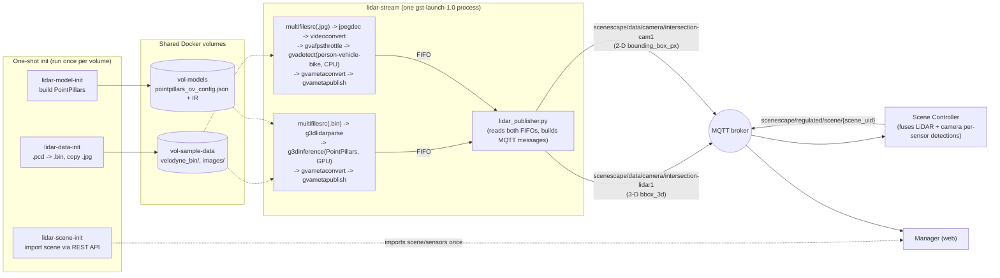

<!-- SPDX-FileCopyrightText: (C) 2026 Intel Corporation -->
<!-- SPDX-License-Identifier: Apache-2.0 -->

# Run the LiDAR-Intersection Fusion Demo

- **Time to Complete:** 30-45 minutes (plus first-time PointPillars model build)

> **Disclaimer: demo-only, not for production use.** This demo has known
> limitations that make it unsuitable as a benchmark or production reference:
>
> - **PointPillars model quality is limited:** the LiDAR branch does not
>   reliably detect all vehicles/cyclists in every frame - expect missed and
>   inconsistent detections, not a complete/accurate 3-D detection record.
> - **The recorded clip is very short:** playback is a single ~25-second,
>   251-frame sequence (`LIDAR_START_INDEX`-`LIDAR_STOP_INDEX`, looped), not a
>   representative long-running capture.
> - **LiDAR/camera synchronization is a recorded-playback artifact:** see
>   [LiDAR/camera stream synchronization](#lidarcamera-stream-synchronization-recorded-playback-only)
>   below - it does not reflect how real, independently-clocked sensors
>   behave.

This guide walks through running the **LiDAR-Intersection fusion demo**, a
separate, opt-in Scenescape demo that fuses a recorded LiDAR point-cloud
stream with a recorded camera image sequence of the same real-world
intersection. It is fully independent from the default apriltag/queuing demo:
all of its data, scene configuration, and pipeline assets live under
[sample_data/lidar_intersection/](../../../sample_data/lidar_intersection)
and it is started with its own dedicated `make demo-lidar` target, so it
never affects the standard `make demo` deployment.

> **Note:** The scene itself is seeded using Scenescape's existing
> [scene import](./build-a-scene/create-new-scene.md#importing-the-scene)
> feature - no Manager DB-fixture changes needed. All demo-only source
> changes (default vehicle/cyclist objects, debug source labels in the UI,
> and forwarding a `source` field through scene_common and Analytics) are
> kept as one patch per component under
> `sample_data/lidar_intersection/patches/` and are applied to the source
> tree automatically by `make build-core-lidar` only - a normal
> `make build-core`/`make build-all` never touches these files. See
> [Demo-only patches](#demo-only-patches) below for details.

## What this demo adds

| Asset                                                              | Purpose                                                                                                                                                                                                               |
| ------------------------------------------------------------------ | --------------------------------------------------------------------------------------------------------------------------------------------------------------------------------------------------------------------- |
| `sample_data/lidar_intersection/docker-compose.lidar-override.yml` | Opt-in Compose override adding the `lidar-scene-init`, `lidar-data-init`, `lidar-model-init`, and `lidar-stream` services                                                                                             |
| `sample_data/lidar_intersection/lidar_publisher.py`                | Runs the LiDAR (PointPillars) and camera (person-vehicle-bike) GStreamer pipelines and publishes detections over MQTT                                                                                                 |
| `sample_data/lidar_intersection/convert_pcd_to_bin.py`             | Converts the manually-downloaded dataset's `.pcd` LiDAR frames to the `.bin` format `lidar_publisher.py`/DLStreamer expect - see [Prerequisites](#prerequisites)                                                      |
| `sample_data/lidar_intersection/reencode_jpegs.py`                 | Re-encodes the dataset's `.jpg` camera frames at a lower JPEG quality (same resolution) so decode/detect/preview keep up with `CAM_FRAME_RATE`                                                                        |
| `sample_data/lidar_intersection/patches/`                          | Demo-only patches, one per component (Manager, scene_common, Analytics), applied automatically when building with `make build-core-lidar`                                                                             |
| `sample_data/lidar_intersection/`                                  | Scene config, map image, scene-import ZIP, and the PointPillars model installer, all scoped to this demo (the recorded LiDAR/camera frames themselves are NOT part of the repo - see [Prerequisites](#prerequisites)) |

## Architecture



`lidar-data-init`/`lidar-model-init`/`lidar-scene-init` are one-shot
containers (`restart: "no"`) that populate the two shared volumes and seed
the scene once; `lidar-stream` waits for all three to finish successfully,
then is the only long-running service (`docker compose logs -f lidar-stream`
in the steps below watches it).

### PointPillars model initialization

`lidar-model-init` runs
[model_installer/install-pointpillars](../../../sample_data/lidar_intersection/model_installer/install-pointpillars),
which turns a pinned upstream commit into everything `g3dinference` needs at
runtime, all written into `vol-models`:

1. **Get the source**: reuses a sibling `openvino_contrib` checkout if one is
   already present (`OPENVINO_CONTRIB_DIR`/`POINTPILLARS_ROOT`), otherwise
   does a `--filter=blob:none --sparse` git clone of
   [openvinotoolkit/openvino_contrib](https://github.com/openvinotoolkit/openvino_contrib)
   restricted to `modules/3d/pointPillars`, checked out at a pinned commit
   (`OPENVINO_CONTRIB_REF`, defaults to the commit that introduced the
   module) - not a moving target, so re-runs are reproducible.
2. **Copy the pretrained IR model**: copies the four
   `pointpillars_ov_*.{xml,bin}` files from that checkout's `pretrained/`
   directory into `vol-models/public/pointpillars/FP16/`.
3. **Build the OpenVINO extension**: compiles
   `libov_pointpillars_extensions.so` (a custom OpenVINO op needed for
   PointPillars' voxelization/scatter layers) via the checkout's own
   `ov_extensions/build.sh`, using a Python with `openvino` installed
   (auto-detected) and `cmake`/`g++` (installed via `apt-get` if missing) -
   then copies the built `.so` alongside the IR files.
4. **Write the runtime config**: generates
   `pointpillars_ov_config.json` (voxel size/range, max points/voxels, and
   paths to the IR files + extension library) - this is the file
   `LIDAR_MODEL_CONFIG` points `g3dinference` at.

Steps 2-4 are skip-if-already-done (checks for existing files before
copying/building), so re-running `lidar-model-init` on a volume that already
has the model is fast; only the first run on a fresh `vol-models` actually
clones/builds anything (the several-minutes-first-run cost mentioned in
[Enable the demo](#enable-the-demo)).

## Prerequisites

- Complete [Installation](../get-started/installation.md) Steps 1-2 (get the
  source and build the container images) at least once.
- **Download the recorded LiDAR/camera dataset manually** - it is not
  committed to this repo because it's too large (hundreds of MB of `.pcd`
  point clouds and `.jpg` images):

1. Download the [V2X-Seq-SPD-Example](https://drive.google.com/file/d/1gjOmGEBMcipvDzu2zOrO9ex_OscUZMYY/view) `.zip` archive.

   > 📌 **Source**: Official sample dataset provided by Tsinghua University (AIR-THU).

   > ⚠️ **Manual Download Required**: Google Drive's virus scan prompt for large files makes scripted downloads (`wget`/`curl`) fail. **Please download this file manually** via your browser and move it to your `Scenescape` directory.

2. Extract it so the result is
   `sample_data/lidar_intersection/V2X-Seq-SPD-Example/infrastructure-side/`,
   containing (at least) an `image/` directory of `.jpg` frames, a
   `velodyne/` directory of `.pcd` frames, and a `data_info.json` file (this
   is the path `docker-compose.lidar-override.yml`'s `lidar-data-init`
   service expects by default; override it with the `LIDAR_RAW_DATASET_DIR`
   environment variable if you'd rather extract it elsewhere):

   ```bash
   unzip V2X-Seq-SPD-Example.zip -d sample_data/lidar_intersection
   ls sample_data/lidar_intersection/V2X-Seq-SPD-Example/infrastructure-side
   ```

3. This is a one-time step per checkout - the extracted folder is
   git-ignored (`sample_data/lidar_intersection/V2X-Seq-SPD-Example/` in
   `.gitignore`) and `lidar-data-init` re-converts it into the shared
   Docker volume on every `make demo-lidar`.

This dataset is the infrastructure-side subset of the **V2X-Seq-SPD**
dataset from the [DAIR-V2X-Seq](https://github.com/AIR-THU/DAIR-V2X-Seq)
project (Tsinghua University, Apache-2.0) - see that repository for the
full dataset, license terms, and citation details.

- An Intel GPU is used **by default** for the LiDAR (PointPillars) inference
  branch, and requires the host to have `/dev/dri` and the Intel GPU driver
  installed. The camera branch defaults to CPU (a lighter model that runs
  fine without a GPU). Install/verify drivers with the
  [DL Streamer prerequisites script](https://github.com/open-edge-platform/dlstreamer/blob/main/scripts/DLS_install_prerequisites.sh)
  (`./DLS_install_prerequisites.sh`) or see the
  [DL Streamer system requirements](https://docs.openedgeplatform.intel.com/dev/edge-ai-libraries/dlstreamer/get_started/system_requirements.html)
  and [install guide](https://docs.openedgeplatform.intel.com/dev/edge-ai-libraries/dlstreamer/get_started/install/install_guide_ubuntu.html)
  for details (NPU is not used by this demo, but the same script covers it).
  > **Performance note:** running the LiDAR branch without a GPU
  > (`LIDAR_DEVICE=CPU`, see [Using GPU acceleration](#using-gpu-acceleration))
  > works on any target, but PointPillars 3-D inference on CPU is
  > significantly slower than on GPU and can noticeably drop below the
  > `LIDAR_FRAME_RATE` target (choppy playback, growing detection latency).
  > Prefer GPU whenever available.

## Enable the demo

Run the dedicated `demo-lidar` target instead of `make demo` (a basic demo
only - no ReID or tracker):

```bash
export SUPASS=<password>
make demo-lidar
```

This starts four extra containers, on top of the normal demo services:

| Service            | Role                                                                                                                                                                                                                                                                                                                                         |
| ------------------ | -------------------------------------------------------------------------------------------------------------------------------------------------------------------------------------------------------------------------------------------------------------------------------------------------------------------------------------------- |
| `lidar-scene-init` | One-shot: seeds the "Lidar Intersection" scene, camera, and sensor via the Scene Import REST API (idempotent - skips if the scene already exists)                                                                                                                                                                                            |
| `lidar-data-init`  | One-shot: converts the manually-downloaded raw dataset's `.pcd` LiDAR frames to `.bin` (via `convert_pcd_to_bin.py`) and re-encodes its `.jpg` camera frames at a lower JPEG quality (via `reencode_jpegs.py`) into the shared sample-data volume - only mounts the `image/`/`velodyne/` subdirectories, see [Prerequisites](#prerequisites) |
| `lidar-model-init` | One-shot: builds and installs the PointPillars OpenVINO model + GStreamer inference extension into the shared models volume (first run only; can take several minutes)                                                                                                                                                                       |
| `lidar-stream`     | Long-running: runs both GStreamer pipelines and publishes fused-ready detections over MQTT                                                                                                                                                                                                                                                   |

Check the one-shot containers completed successfully, and that `lidar-stream`
is running:

```bash
docker compose ps lidar-scene-init lidar-data-init lidar-model-init lidar-stream
docker compose logs -f lidar-stream
```

You should see log lines like:

```text
[lidar-publisher] lidar_sensor=intersection-lidar1 cam_sensor=intersection-cam1 ...
[camera-publisher] Connected to broker.scenescape.intel.com:1883
[lidar-publisher] frames=100 fps=10.0 objects={'vehicle': 2, 'cyclist': 1}
```

`lidar-data-init` (`docker compose logs lidar-data-init`) converts the
dataset and exits:

```text
Converting 251 frames from /src/velodyne -> /dst/lidar_intersection/velodyne_bin
  50/251 done
  100/251 done
  150/251 done
  200/251 done
  250/251 done
  251/251 done
Conversion complete.
Re-encoding 251 frames from /src/image -> /dst/lidar_intersection/images at quality=50
  50/251 done
  100/251 done
  150/251 done
  200/251 done
  250/251 done
  251/251 done
Re-encoding complete.
lidar_intersection data ready
```

`lidar-model-init` (`docker compose logs lidar-model-init`) builds/installs
the PointPillars model. On the first run (several minutes: clones
`openvino_contrib` and compiles the OpenVINO extension):

```text
[install-pointpillars] MODELS_PATH=/home/pipeline-server/models
[install-pointpillars] Sparse-cloning openvino_contrib into /tmp/pointpillars-cache/openvino_contrib at ref d131b42505ee77e064638e0b38e6a84b52b779d6...
[install-pointpillars] Using sparse-cloned source: /tmp/pointpillars-cache/openvino_contrib/modules/3d/pointPillars
[install-pointpillars] Copying pointpillars_ov_nn.bin
[install-pointpillars] Copying pointpillars_ov_nn.xml
[install-pointpillars] Copying pointpillars_ov_pillar_layer.xml
[install-pointpillars] Copying pointpillars_ov_postproc.xml
[install-pointpillars] Building PointPillars OpenVINO extension...
[install-pointpillars] Extension built: /tmp/pointpillars-cache/openvino_contrib/modules/3d/pointPillars/ov_extensions/build/libov_pointpillars_extensions.so
[install-pointpillars] Copying extension to /home/pipeline-server/models/public/pointpillars/FP16/libov_pointpillars_extensions.so
[install-pointpillars] Config written: /home/pipeline-server/models/public/pointpillars/FP16/pointpillars_ov_config.json
[install-pointpillars] Done. Set LIDAR_MODEL_CONFIG=/home/pipeline-server/models/public/pointpillars/FP16/pointpillars_ov_config.json
```

On later runs (model already present on `vol-models`), it skips the clone/build
and finishes in seconds:

```text
[install-pointpillars] MODELS_PATH=/home/pipeline-server/models
[install-pointpillars] Using sparse-cloned source: /tmp/pointpillars-cache/openvino_contrib/modules/3d/pointPillars
[install-pointpillars] Already present: pointpillars_ov_nn.bin
[install-pointpillars] Already present: pointpillars_ov_nn.xml
[install-pointpillars] Already present: pointpillars_ov_pillar_layer.xml
[install-pointpillars] Already present: pointpillars_ov_postproc.xml
[install-pointpillars] Extension already built: /tmp/pointpillars-cache/openvino_contrib/modules/3d/pointPillars/ov_extensions/build/libov_pointpillars_extensions.so
[install-pointpillars] Config written: /home/pipeline-server/models/public/pointpillars/FP16/pointpillars_ov_config.json
[install-pointpillars] Done. Set LIDAR_MODEL_CONFIG=/home/pipeline-server/models/public/pointpillars/FP16/pointpillars_ov_config.json
```

## Verify demo is working

### Scene is seeded automatically

`lidar-scene-init` waits for the Manager (`web`) to become healthy, then
imports
[sample_data/lidar_intersection/LidarIntersection-scene-import.zip](../../../sample_data/lidar_intersection/LidarIntersection-scene-import.zip)
via the Scene Import REST API (`POST /api/v1/import-scene/`) - no manual
step, and no Manager source or DB-fixture changes are needed. It checks
`GET /api/v1/scenes` first and skips the import if a scene named "Lidar
Intersection" already exists, so it's safe to leave enabled across restarts;
after a full `make demo-close` (which wipes volumes) it re-imports cleanly
on the next `make demo-lidar`.

```bash
docker compose logs lidar-scene-init
```

On the first run you should see:

```text
lidar-scene-init: importing 'Lidar Intersection' scene...
lidar-scene-init: done
```

On later runs (scene already imported), it exits early instead:

```text
lidar-scene-init: 'Lidar Intersection' scene already exists, skipping import
```

After it runs, a new **Lidar Intersection** scene appears with the
`intersection-cam1` camera and `intersection-lidar1` LiDAR sensor already
positioned and calibrated.

> **Manual re-import:** if you ever need to force a re-import (e.g. after
> editing `LidarIntersection-scene-import.zip`), delete the existing "Lidar
> Intersection" scene from the UI (or via the API) and re-run
> `docker compose up -d lidar-scene-init`, or import the same ZIP manually
> via **Scenes -> + Import Scene** in the UI, or `curl -F
zipFile=@sample_data/lidar_intersection/LidarIntersection-scene-import.zip`
> against `/api/v1/import-scene/` (see
> [Importing the scene](./build-a-scene/create-new-scene.md#importing-the-scene)
> for the full token/curl pattern).

### What to expect in the UI

Open the **Lidar Intersection** scene in the UI:

- **3D view** (default): tracked vehicles and cyclists appear as marks moving
  through the intersection. Marks are labeled/styled by detection source
  (lidar vs camera - see the debug UI changes in
  [Demo-only patches](#demo-only-patches)), so you can tell which sensor(s)
  are currently contributing to a given tracked object; a vehicle or cyclist
  seen by both sensors is fused into a single tracked mark rather than
  appearing twice.
- **2D view**: switching to `intersection-cam1` shows the replayed camera
  frames with 2-D detection boxes overlaid. `intersection-lidar1` has no
  camera picture and always shows offline/no-preview in this view - that is
  expected for a LiDAR sensor (see
  [Troubleshooting](#troubleshooting)).

### Verify fusion via MQTT

Inspect the raw per-sensor detections directly (the broker is not published
to the host by default, so sniff traffic from inside the container):

```bash
docker compose exec broker mosquitto_sub -h localhost -p 1883 \
  --cafile /mosquitto/secrets/certs/scenescape-ca.pem --insecure -v \
  -t 'scenescape/data/camera/intersection-lidar1' \
  -t 'scenescape/data/camera/intersection-cam1'
```

Each message includes a `"source"` sensor id and category-grouped
`objects`; over time you should see the same real-world vehicle tracked
by both sensors and fused into a single tracked object in the scene.

## Stopping the demo

```bash
make demo-close
```

This stops and removes all demo services and volumes, including the LiDAR
demo containers - the same command used for any other demo, no separate
teardown step is needed.

## Using GPU acceleration

The LiDAR branch defaults to `LIDAR_DEVICE=GPU`, with the `lidar-stream`
service's `devices`/`group_add`/`device_cgroup_rules` already enabled to
pass through `/dev/dri`. Make sure the host has an Intel GPU driver
installed first (see [Prerequisites](#prerequisites)). The camera branch
defaults to `CAM_DEVICE=CPU`; set `CAM_DEVICE=GPU` too if you want the
camera detector to also use the GPU.

**Why GPU is the default, not just an optional speed-up:** PointPillars is a
voxel-based 3-D CNN, noticeably heavier than the 2-D `person-vehicle-bike`
detector the camera branch uses, and it runs in the same `gst-launch-1.0`
process/host that also has to keep decoding and detecting camera frames.
On CPU, PointPillars inference routinely can't keep up with the default
`LIDAR_FRAME_RATE=10`. The
[pace gate](#lidarcamera-stream-synchronization-recorded-playback-only)
keeps `lag` bounded, so the symptom is not runaway lag but **both** branches'
`fps=` values sitting below `LIDAR_FRAME_RATE`. Prefer GPU; fall back to CPU
only when none is available, and expect choppier playback.

**Falling back to CPU** (e.g. no GPU available): in
`sample_data/lidar_intersection/docker-compose.lidar-override.yml`,
comment out the `devices`, `group_add`, and `device_cgroup_rules` entries
under the `lidar-stream` service, and set `LIDAR_DEVICE=CPU` under the same
service's `environment` section. CPU inference works but is noticeably
slower (see the performance note in [Prerequisites](#prerequisites)).

## Configuration reference

The `lidar-stream` service reads its configuration from environment
variables (see the commented examples in
`sample_data/lidar_intersection/docker-compose.lidar-override.yml`):

| Variable                  | Default               | Description                                                                                    |
| ------------------------- | --------------------- | ---------------------------------------------------------------------------------------------- |
| `LIDAR_SENSOR_ID`         | `intersection-lidar1` | Sensor id used for the MQTT topic and payload                                                  |
| `LIDAR_DEVICE`            | `GPU`                 | OpenVINO device for PointPillars inference (`CPU` fallback is much slower)                     |
| `LIDAR_SCORE_THRESHOLD`   | `0.70`                | Minimum detection confidence to publish                                                        |
| `LIDAR_FRAME_RATE`        | `10`                  | Target playback frame rate                                                                     |
| `LIDAR_LOOP`              | `true`                | Loop the recorded frame sequence                                                               |
| `CAM_SENSOR_ID`           | `intersection-cam1`   | Sensor id used for the MQTT topic and payload                                                  |
| `CAM_DEVICE`              | `CPU`                 | OpenVINO device for the camera detector                                                        |
| `CAM_SCORE_THRESHOLD`     | `0.8`                 | Minimum detection confidence to publish                                                        |
| `CAM_DETECTION_LABELS`    | `vehicle,cyclist`     | Comma-separated category allow-list                                                            |
| `LIDAR_CAM_LAG_TOLERANCE` | `2`                   | Max frames one branch may run ahead of the other before it is paced back (keeps `lag` bounded) |

`lidar-data-init` (the dataset conversion step) has its own variable, set as
a `docker compose`/Makefile-level environment variable rather than inside
the compose file itself:

| Variable                | Default                                                | Description                                                                                                                     |
| ----------------------- | ------------------------------------------------------ | ------------------------------------------------------------------------------------------------------------------------------- |
| `LIDAR_RAW_DATASET_DIR` | `./sample_data/lidar_intersection/V2X-Seq-SPD-Example` | Host path to the extracted raw dataset (must contain an `infrastructure-side/` directory) - see [Prerequisites](#prerequisites) |
| `JPEG_QUALITY`          | `50`                                                   | JPEG re-encode quality (1-95) applied to camera frames by `reencode_jpegs.py` - lower is faster to decode/detect but blockier   |

## Demo-only patches

Three small patches - one per component (Manager, scene_common, Analytics) -
are kept out of the normal source tree and applied only for this demo. They
add:

- Default `vehicle`/`cyclist` objects, and debug UI styling that labels
  tracked marks by detection source (lidar vs camera - see
  [What to expect in the UI](#what-to-expect-in-the-ui)).
- Pass-through of the `source` field through scene_common and Analytics so
  it reaches the regulated/UI-facing output end-to-end.

`make build-core-lidar` (and therefore `make demo-lidar`) applies the
patches automatically, builds the `manager`, `analytics`, and shared
`scene_common` images with them applied, then automatically reverts them.
Your working tree stays clean throughout - `git status` should never show
`manager/`/`scene_common/`/`analytics/` files as modified because of this
demo. To manually apply or remove the patches (e.g. to inspect a diff
without building):

```bash
make apply-lidar-patch    # apply all three patches to the working tree
make revert-lidar-patch   # revert them back to the unpatched source
```

> **Note:** a hard kill (`kill -9`) of a build can skip the automatic
> revert. If `git status` shows patched `manager/`/`scene_common/`/
> `analytics/` files afterward, run `make revert-lidar-patch` to clean up.

## Rotation/orientation handling

LiDAR gives real 3-D orientation (`rotation` on each detection) directly from
PointPillars, used as-is. The Controller's existing (unpatched) camera-only
heading inference (`inferRotationFromVelocity()`, gated by
`has_detection_rotation` being false and the class's `rotation_from_velocity`
flag) still applies to `intersection-cam1`'s 2-D detections: when enabled,
heading is inferred from the Kalman-estimated velocity direction with
hysteresis (`SPEED_THRESHOLD_ON`/`OFF`) to avoid flapping at low speed.

The `vehicle`/`cyclist` default assets seeded by patch `0001` (above) set
`rotation_from_velocity=true` so this existing feature is active out of the
box for this demo's camera-sourced tracks. No LiDAR-specific rotation fix is
applied - PointPillars' own front/back heading ambiguity (a known limitation
of oriented-bbox 3-D detectors) is not corrected here. If you reset the
objects library or add these classes another way, re-enable it per class
from the Manager UI's asset config (or `manager_asset3d.rotation_from_velocity`
directly) to keep this behavior.

## LiDAR/camera stream synchronization (recorded-playback only)

`lidar_publisher.py` replays two independent pre-recorded file sequences (the
`.bin` LiDAR frames and the `.jpg` camera frames) as two branches of one
`gst-launch-1.0` process, each paced by its own `multifilesrc`/
`gvafpsthrottle`. Because PointPillars can take several seconds to load and
compile on first use while the camera branch starts producing frames almost
immediately, the camera branch would otherwise race ahead of the LiDAR
branch by a growing number of file-index positions before LiDAR ever
publishes its first detection.

To keep the two recorded sequences aligned, the script:

- Holds the camera branch back until LiDAR's own first frame is processed
  (`_lidar_ready` in `lidar_publisher.py`), logged as
  `[lidar-publisher] first LiDAR frame processed - releasing camera stream`.
- Then keeps both branches paced to each other with a **bidirectional
  back-pressure gate**: whichever branch gets more than
  `LIDAR_CAM_LAG_TOLERANCE` frames ahead of the other stops draining its own
  FIFO, which fills the pipe and back-pressures that branch's GStreamer chain
  so it physically slows to the sibling's rate. This bounds the drift in
  **either** direction (camera-ahead or LiDAR-ahead), so the coupled pair
  effectively plays back at the rate of whichever branch is momentarily
  slower.
- Logs a running `cam=<count> (lag=<n>)` value alongside every 100th LiDAR
  frame in `docker compose logs lidar-stream`, so you can see at a glance
  whether the two streams are keeping pace with each other.

**This is purely a recorded-playback artifact and does not apply to real
sensors.** A real LiDAR unit and a real camera each publish their own
hardware/NTP-timestamped detections continuously and independently as they
capture live data - there is no shared "file index"/`multifilesrc` counter to
keep aligned, and no GPU-model-load-vs-camera-startup race to reconcile,
since a live LiDAR sensor is already running and producing detections
continuously well before (and after) any given camera comes online. The
Scene Controller's per-sensor Hungarian association/fusion already handles
sensors that start, stop, or report at different rates generically - this
script-level startup-flush/pace-gate logic exists only to make a
pre-recorded demo behave sensibly, not because live multi-sensor fusion
needs it. With the pace gate, `lag` stays bounded to roughly
`±LIDAR_CAM_LAG_TOLERANCE` once the demo is running; if you see it stuck at
that bound while **both** branches' `fps=` values sit below
`LIDAR_FRAME_RATE`, that means one branch genuinely can't keep up and is
holding the other back (see
[Using GPU acceleration](#using-gpu-acceleration)) - raise the LiDAR to GPU
or lower the target frame rate rather than letting the two drift apart.

## Troubleshooting

- **`lidar-scene-init` fails to authenticate:** confirm `SUPASS` matches the
  password used for the running deployment (it must be the same value passed
  to `make demo-lidar`); check `docker compose logs lidar-scene-init`.
- **`lidar-model-init` fails or times out:** it compiles a GStreamer
  extension from `openvino_contrib` source on first run and needs outbound
  network access (respects `HTTPS_PROXY`/`https_proxy`); check `docker
compose logs lidar-model-init`.
- **`lidar-data-init` fails (`No such file or directory` for `image`/`velodyne`, or `pip install` errors):** confirm you completed the manual dataset download in
  [Prerequisites](#prerequisites) and extracted it to
  `sample_data/lidar_intersection/V2X-Seq-SPD-Example/infrastructure-side/`
  (or set `LIDAR_RAW_DATASET_DIR` to wherever you extracted it) - only its
  `image/` and `velodyne/` subdirectories are actually mounted/used;
  `pip install` failures usually mean no outbound network access (respects
  `HTTPS_PROXY`/`https_proxy`, same as `lidar-model-init`). Check `docker
compose logs lidar-data-init`.
- **No detections published:** confirm `lidar-data-init` completed
  successfully (`docker compose logs lidar-data-init`) - the pipelines need
  the converted `.bin`/`.jpg` frames in the shared sample-data volume.
- **Scene appears empty (or missing) after `make demo-close` + a fresh `make
demo-lidar`:** check `docker compose logs lidar-scene-init` -
  it depends on `web` being healthy first, so a slow Manager startup can
  briefly delay the import; the container exits after one attempt and is not
  retried automatically. Re-trigger it with `docker compose up -d
lidar-scene-init` if needed.
- **A LiDAR-sourced vehicle/cyclist's heading occasionally flips ~180 degrees
  (front/back) even while moving in a straight line:** this is a known
  PointPillars/oriented-bbox-detector limitation (see
  [Rotation/orientation handling](#rotationorientation-handling)) and is not
  corrected in this demo - it only affects LiDAR-sourced tracks, since
  camera-sourced tracks infer heading from velocity instead of a raw detector
  yaw. If a camera-sourced track's heading looks frozen or jumpy instead,
  confirm `rotation_from_velocity` is still `true` for that class in the
  Manager's asset config (Django `manager_asset3d` table).
- **`intersection-cam1` shows "offline"/no picture in the UI:** the Manager
  UI only marks a camera online once it gets a reply to its "getimage"
  request; `lidar_publisher.py` answers this for `intersection-cam1` by
  reading the current camera frame's `.jpg` file directly off disk and
  publishing it as-is (no re-encoding). If it still shows offline, check
  `docker compose logs lidar-stream` for frame-read errors, and confirm
  `lidar-data-init` completed (the preview needs the same extracted `.jpg`
  frames as detection). `intersection-lidar1` has no camera picture and will
  always show offline/no-preview - that's expected for a LiDAR sensor.
- **`cam=... (lag=...)` grows past `±LIDAR_CAM_LAG_TOLERANCE` in `docker
compose logs lidar-stream`:** the bidirectional pace gate normally holds
  `lag` within roughly `±LIDAR_CAM_LAG_TOLERANCE` (default 2). A brief
  overshoot right after startup is fine (FIFO/read-ahead buffering), but a
  `lag` that keeps growing means the gate is not engaging - check that neither branch has
  crashed (`[camera-publisher]`/`[lidar-publisher] FATAL`/`Done` lines). If
  `lag` instead sits pinned at the tolerance while **both** `fps=` values are
  below `LIDAR_FRAME_RATE`, the streams are aligned but one branch can't keep
  up - see
  [LiDAR/camera stream synchronization](#lidarcamera-stream-synchronization-recorded-playback-only)
  and [Using GPU acceleration](#using-gpu-acceleration) (usually the LiDAR
  branch running on CPU); move LiDAR to GPU or lower `LIDAR_FRAME_RATE`.
