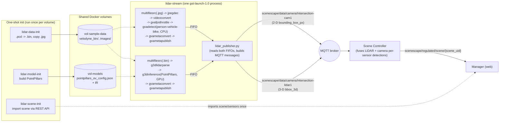

<!-- SPDX-FileCopyrightText: (C) 2026 Intel Corporation -->
<!-- SPDX-License-Identifier: Apache-2.0 -->

# Run the LiDAR-Intersection Fusion Demo

- **Time to Complete:** 30-45 minutes (plus first-time PointPillars model build)

> **Disclaimer: demo-only, not for production use.** This demo has known
> limitations that make it unsuitable as a benchmark or production reference:
>
> - **PointPillars model quality is limited:** the LiDAR branch does not
>   reliably detect all vehicles/cyclists in every frame - expect missed and
>   inconsistent detections, not a complete/accurate 3-D detection record.
> - **The recorded clip is very short:** playback is a single ~25-second,
>   251-frame sequence (`LIDAR_START_INDEX`-`LIDAR_STOP_INDEX`, looped), not a
>   representative long-running capture.
> - **LiDAR/camera synchronization is a recorded-playback artifact:** see
>   [LiDAR/camera stream synchronization](#lidarcamera-stream-synchronization-recorded-playback-only)
>   below - it does not reflect how real, independently-clocked sensors
>   behave.

This guide walks through running the **LiDAR-Intersection fusion demo**, a
separate, opt-in Scenescape demo that fuses a recorded LiDAR point-cloud
stream with a recorded camera image sequence of the same real-world
intersection. It is fully independent from the default apriltag/queuing demo:
all of its data, scene configuration, and pipeline assets live under
[sample_data/lidar_intersection/](../../../sample_data/lidar_intersection)
and it is started with its own `LIDAR_DEMO` environment variable, so it never
affects the standard `make demo` deployment.

> **Note:** The scene itself is seeded using Scenescape's existing
> [scene import](./build-a-scene/create-new-scene.md#importing-the-scene)
> feature - no Manager DB-fixture changes needed. All demo-only source
> changes (default vehicle/cyclist objects, debug source labels in the UI,
> and forwarding a `source` field through scene_common and Analytics) are
> kept as one patch per component under
> `sample_data/lidar_intersection/patches/` and are applied to the source
> tree automatically by `make build-core`/`make build-all` only when
> `LIDAR_DEMO=true` - a normal build/demo never touches these files. See
> [Demo-only patches](#demo-only-patches) below for details.

## What this demo adds

| Asset                                                              | Purpose                                                                                                                                                                                                               |
| ------------------------------------------------------------------ | --------------------------------------------------------------------------------------------------------------------------------------------------------------------------------------------------------------------- |
| `sample_data/lidar_intersection/docker-compose.lidar-override.yml` | Opt-in Compose override adding the `lidar-scene-init`, `lidar-data-init`, `lidar-model-init`, and `lidar-stream` services                                                                                             |
| `sample_data/lidar_intersection/lidar_publisher.py`                | Runs the LiDAR (PointPillars) and camera (person-vehicle-bike) GStreamer pipelines and publishes detections over MQTT                                                                                                 |
| `sample_data/lidar_intersection/convert_pcd_to_bin.py`             | Converts the manually-downloaded dataset's `.pcd` LiDAR frames to the `.bin` format `lidar_publisher.py`/DLStreamer expect - see [Prerequisites](#prerequisites)                                                      |
| `sample_data/lidar_intersection/patches/`                          | Demo-only patches, one per component (Manager, scene_common, Analytics), applied automatically when building with `LIDAR_DEMO=true`                                                                                   |
| `sample_data/lidar_intersection/`                                  | Scene config, map image, scene-import ZIP, and the PointPillars model installer, all scoped to this demo (the recorded LiDAR/camera frames themselves are NOT part of the repo - see [Prerequisites](#prerequisites)) |

## Architecture



`lidar-data-init`/`lidar-model-init`/`lidar-scene-init` are one-shot
containers (`restart: "no"`) that populate the two shared volumes and seed
the scene once; `lidar-stream` is the only long-running service, and is what
`docker compose logs -f lidar-stream` in the steps below is watching.

### PointPillars model initialization

`lidar-model-init` runs
[model_installer/install-pointpillars](../../../sample_data/lidar_intersection/model_installer/install-pointpillars),
which turns a pinned upstream commit into everything `g3dinference` needs at
runtime, all written into `vol-models`:

1. **Get the source**: reuses a sibling `openvino_contrib` checkout if one is
   already present (`OPENVINO_CONTRIB_DIR`/`POINTPILLARS_ROOT`), otherwise
   does a `--filter=blob:none --sparse` git clone of
   [openvinotoolkit/openvino_contrib](https://github.com/openvinotoolkit/openvino_contrib)
   restricted to `modules/3d/pointPillars`, checked out at a pinned commit
   (`OPENVINO_CONTRIB_REF`, defaults to the commit that introduced the
   module) - not a moving target, so re-runs are reproducible.
2. **Copy the pretrained IR model**: copies the four
   `pointpillars_ov_*.{xml,bin}` files from that checkout's `pretrained/`
   directory into `vol-models/public/pointpillars/FP16/`.
3. **Build the OpenVINO extension**: compiles
   `libov_pointpillars_extensions.so` (a custom OpenVINO op needed for
   PointPillars' voxelization/scatter layers) via the checkout's own
   `ov_extensions/build.sh`, using a Python with `openvino` installed
   (auto-detected) and `cmake`/`g++` (installed via `apt-get` if missing) -
   then copies the built `.so` alongside the IR files.
4. **Write the runtime config**: generates
   `pointpillars_ov_config.json` (voxel size/range, max points/voxels, and
   paths to the IR files + extension library) - this is the file
   `LIDAR_MODEL_CONFIG` points `g3dinference` at.

Steps 2-4 are skip-if-already-done (checks for existing files before
copying/building), so re-running `lidar-model-init` on a volume that already
has the model is fast; only the first run on a fresh `vol-models` actually
clones/builds anything (the several-minutes-first-run cost mentioned in
[Step 1](#step-1-enable-the-demo)).

## Prerequisites

- Complete [Installation](../get-started/installation.md) Steps 1-2 (get the
  source and build the container images) at least once.
- **Download the recorded LiDAR/camera dataset manually** - it is not
  committed to this repo because it's too large (hundreds of MB of `.pcd`
  point clouds and `.jpg` images):

1. Download the [V2X-Seq-SPD-Example](https://drive.google.com/file/d/1gjOmGEBMcipvDzu2zOrO9ex_OscUZMYY/view) `.zip` archive.

   > 📌 **Source**: Official sample dataset provided by Tsinghua University (AIR-THU).

   > ⚠️ **Manual Download Required**: Google Drive's virus scan prompt for large files makes scripted downloads (`wget`/`curl`) fail. **Please download this file manually** via your browser and move it to your `Scenescape` directory.

2. Extract it so the result is
   `sample_data/lidar_intersection/V2X-Seq-SPD-Example/infrastructure-side/`,
   containing (at least) an `image/` directory of `.jpg` frames, a
   `velodyne/` directory of `.pcd` frames, and a `data_info.json` file (this
   is the path `docker-compose.lidar-override.yml`'s `lidar-data-init`
   service expects by default; override it with the `LIDAR_RAW_DATASET_DIR`
   environment variable if you'd rather extract it elsewhere):

   ```bash
   unzip V2X-Seq-SPD-Example.zip -d sample_data/lidar_intersection
   ls sample_data/lidar_intersection/V2X-Seq-SPD-Example/infrastructure-side
   ```

3. This is a one-time step per checkout - the extracted folder is
   git-ignored (`sample_data/lidar_intersection/V2X-Seq-SPD-Example/` in
   `.gitignore`) and `lidar-data-init` re-converts it into the shared
   Docker volume on every `make demo LIDAR_DEMO=true`.

This dataset is the infrastructure-side subset of the **V2X-Seq-SPD**
dataset from the [DAIR-V2X-Seq](https://github.com/AIR-THU/DAIR-V2X-Seq)
project (Tsinghua University, Apache-2.0) - see that repository for the
full dataset, license terms, and citation details.

- An Intel GPU is used **by default** for the LiDAR (PointPillars) inference
  branch, and requires the host to have `/dev/dri` and the Intel GPU driver
  installed. The camera branch defaults to CPU (a lighter model that runs
  fine without a GPU). Install/verify drivers with the
  [DL Streamer prerequisites script](https://github.com/open-edge-platform/dlstreamer/blob/main/scripts/DLS_install_prerequisites.sh)
  (`./DLS_install_prerequisites.sh`) or see the
  [DL Streamer system requirements](https://docs.openedgeplatform.intel.com/dev/edge-ai-libraries/dlstreamer/get_started/system_requirements.html)
  and [install guide](https://docs.openedgeplatform.intel.com/dev/edge-ai-libraries/dlstreamer/get_started/install/install_guide_ubuntu.html)
  for details (NPU is not used by this demo, but the same script covers it).
  > **Performance note:** running the LiDAR branch without a GPU
  > (`LIDAR_DEVICE=CPU`, see [Using GPU acceleration](#using-gpu-acceleration))
  > works on any target, but PointPillars 3-D inference on CPU is
  > significantly slower than on GPU and can noticeably drop below the
  > `LIDAR_FRAME_RATE` target (choppy playback, growing detection latency).
  > Prefer GPU whenever available.

## Step 1: Enable the demo

Add `LIDAR_DEMO=true` to any of the normal `make demo*` targets. For example,
to start the core demo plus the LiDAR-Intersection fusion demo:

```bash
export SUPASS=<password>
make demo LIDAR_DEMO=true
```

This starts four extra containers, on top of the normal demo services:

| Service            | Role                                                                                                                                                                                                                                                                                   |
| ------------------ | -------------------------------------------------------------------------------------------------------------------------------------------------------------------------------------------------------------------------------------------------------------------------------------- |
| `lidar-scene-init` | One-shot: seeds the "Lidar Intersection" scene, camera, and sensor via the Scene Import REST API (idempotent - skips if the scene already exists)                                                                                                                                      |
| `lidar-data-init`  | One-shot: converts the manually-downloaded raw dataset's `.pcd` LiDAR frames to `.bin` (via `convert_pcd_to_bin.py`) and copies its `.jpg` camera frames into the shared sample-data volume - only mounts the `image/`/`velodyne/` subdirectories, see [Prerequisites](#prerequisites) |
| `lidar-model-init` | One-shot: builds and installs the PointPillars OpenVINO model + GStreamer inference extension into the shared models volume (first run only; can take several minutes)                                                                                                                 |
| `lidar-stream`     | Long-running: runs both GStreamer pipelines and publishes fused-ready detections over MQTT                                                                                                                                                                                             |

Check the one-shot containers completed successfully, and that `lidar-stream`
is running:

```bash
docker compose ps lidar-scene-init lidar-data-init lidar-model-init lidar-stream
docker compose logs -f lidar-stream
```

You should see log lines like:

```text
[lidar-publisher] lidar_sensor=intersection-lidar1 cam_sensor=intersection-cam1 ...
[camera-publisher] Connected to broker.scenescape.intel.com:1883
[lidar-publisher] frames=100 fps=10.0 objects={'vehicle': 2, 'cyclist': 1}
```

## Step 2: Scene is seeded automatically

`lidar-scene-init` waits for the Manager (`web`) to become healthy, then
imports
[sample_data/lidar_intersection/LidarIntersection-scene-import.zip](../../../sample_data/lidar_intersection/LidarIntersection-scene-import.zip)
via the Scene Import REST API (`POST /api/v1/import-scene/`) - no manual
step, and no Manager source or DB-fixture changes are needed. It checks
`GET /api/v1/scenes` first and skips the import if a scene named "Lidar
Intersection" already exists, so it's safe to leave enabled across restarts;
after a full `make demo-close` (which wipes volumes) it re-imports cleanly
on the next `make demo LIDAR_DEMO=true`.

```bash
docker compose logs lidar-scene-init
```

After it runs, a new **Lidar Intersection** scene appears with the
`intersection-cam1` camera and `intersection-lidar1` LiDAR sensor already
positioned and calibrated.

> **Manual re-import:** if you ever need to force a re-import (e.g. after
> editing `LidarIntersection-scene-import.zip`), delete the existing "Lidar
> Intersection" scene from the UI (or via the API) and re-run
> `docker compose up -d lidar-scene-init`, or import the same ZIP manually
> via **Scenes -> + Import Scene** in the UI, or `curl -F
zipFile=@sample_data/lidar_intersection/LidarIntersection-scene-import.zip`
> against `/api/v1/import-scene/` (see
> [Importing the scene](./build-a-scene/create-new-scene.md#importing-the-scene)
> for the full token/curl pattern).

## Step 3: Verify fusion is working

1. Open the **Lidar Intersection** scene in the UI - tracked vehicles and
   cyclists should appear moving through the intersection, sourced from
   either sensor.
2. Or inspect the raw per-sensor detections directly (the broker is not
   published to the host by default, so sniff traffic from inside the
   container):

   ```bash
   docker compose exec broker mosquitto_sub -h localhost -p 1883 \
     --cafile /mosquitto/secrets/certs/scenescape-ca.pem --insecure -v \
     -t 'scenescape/data/camera/intersection-lidar1' \
     -t 'scenescape/data/camera/intersection-cam1'
   ```

   Each message includes a `"source"` sensor id and category-grouped
   `objects`; over time you should see the same real-world vehicle tracked
   by both sensors and fused into a single tracked object in the scene.

## Stopping the demo

```bash
make demo-close
```

This stops and removes all demo services and volumes, including the LiDAR
demo containers - the same command used for any other demo, no separate
teardown step is needed.

## Using GPU acceleration

The LiDAR branch defaults to `LIDAR_DEVICE=GPU`, with the `lidar-stream`
service's `devices`/`group_add`/`device_cgroup_rules` already enabled to
pass through `/dev/dri`. Make sure the host has an Intel GPU driver
installed first (see [Prerequisites](#prerequisites)). The camera branch
defaults to `CAM_DEVICE=CPU`; set `CAM_DEVICE=GPU` too if you want the
camera detector to also use the GPU.

**Why GPU is the default, not just an optional speed-up:** PointPillars is a
voxel-based 3-D CNN, noticeably heavier than the 2-D `person-vehicle-bike`
detector the camera branch uses, and it runs in the same `gst-launch-1.0`
process/host that also has to keep decoding and detecting camera frames.
On CPU, PointPillars inference routinely can't keep up with the default
`LIDAR_FRAME_RATE=10`, and unlike the one-time startup skew described in
[LiDAR/camera stream synchronization](#lidarcamera-stream-synchronization-recorded-playback-only)
below, this shows up as a **lag that keeps growing** frame after frame
instead of settling to a small constant offset - watch the `lag=` value in
`docker compose logs lidar-stream` (a steadily increasing number, not just a
steady small one, means the LiDAR branch itself is falling behind in real
time, not just recovering from GPU warm-up). Prefer GPU whenever the host
supports it; only fall back to CPU if no GPU is available, and expect a
noticeably choppier LiDAR branch when you do.

**Falling back to CPU** (e.g. no GPU available): in
`sample_data/lidar_intersection/docker-compose.lidar-override.yml`,
comment out the `devices`, `group_add`, and `device_cgroup_rules` entries
under the `lidar-stream` service, and set `LIDAR_DEVICE=CPU` under the same
service's `environment` section. CPU inference works but is noticeably
slower (see the performance note in [Prerequisites](#prerequisites)).

## Configuration reference

The `lidar-stream` service reads its configuration from environment
variables (see the commented examples in
`sample_data/lidar_intersection/docker-compose.lidar-override.yml`):

| Variable                | Default               | Description                                                                |
| ----------------------- | --------------------- | -------------------------------------------------------------------------- |
| `LIDAR_SENSOR_ID`       | `intersection-lidar1` | Sensor id used for the MQTT topic and payload                              |
| `LIDAR_DEVICE`          | `GPU`                 | OpenVINO device for PointPillars inference (`CPU` fallback is much slower) |
| `LIDAR_SCORE_THRESHOLD` | `0.70`                | Minimum detection confidence to publish                                    |
| `LIDAR_FRAME_RATE`      | `10`                  | Target playback frame rate                                                 |
| `LIDAR_LOOP`            | `true`                | Loop the recorded frame sequence                                           |
| `CAM_SENSOR_ID`         | `intersection-cam1`   | Sensor id used for the MQTT topic and payload                              |
| `CAM_DEVICE`            | `CPU`                 | OpenVINO device for the camera detector                                    |
| `CAM_SCORE_THRESHOLD`   | `0.8`                 | Minimum detection confidence to publish                                    |
| `CAM_DETECTION_LABELS`  | `vehicle,cyclist`     | Comma-separated category allow-list                                        |

`lidar-data-init` (the dataset conversion step) has its own variable, set as
a `docker compose`/Makefile-level environment variable rather than inside
the compose file itself:

| Variable                | Default                                                | Description                                                                                                                     |
| ----------------------- | ------------------------------------------------------ | ------------------------------------------------------------------------------------------------------------------------------- |
| `LIDAR_RAW_DATASET_DIR` | `./sample_data/lidar_intersection/V2X-Seq-SPD-Example` | Host path to the extracted raw dataset (must contain an `infrastructure-side/` directory) - see [Prerequisites](#prerequisites) |

## Demo-only patches

Three small patches - one per affected component - are kept out of the normal
source tree and applied on top of it only for this demo:

`sample_data/lidar_intersection/patches/0001-manager-default-assets-and-source-labels.patch` (Manager):

| Change                                                                                                      | File(s)                                                                                                                                                                          |
| ----------------------------------------------------------------------------------------------------------- | -------------------------------------------------------------------------------------------------------------------------------------------------------------------------------- |
| Seed default `vehicle`/`cyclist` objects (size, tracking radius, mark color, `rotation_from_velocity=true`) | `manager/src/manager/management/commands/init_default_assets.py` (new), `manager/src/manager/migrations/0003_default_asset3d_objects.py` (new), `manager/config/scenescape-init` |
| Debug UI: label/style marks by detection source (lidar vs camera), add cyclist mark styling                 | `manager/src/manager/static/js/marks.js`, `manager/src/manager/static/js/assetmanager.js`, `manager/src/manager/static/css/style.css`                                            |

`sample_data/lidar_intersection/patches/0002-scene-common-source-passthrough.patch` (scene_common):

| Change                                                                                                                               | File(s)                                                                                             |
| ------------------------------------------------------------------------------------------------------------------------------------ | --------------------------------------------------------------------------------------------------- |
| Forward the same `source` field through the shared detections-builder/ingestion helpers so it reaches the regulated/UI-facing output | `scene_common/src/scene_common/detections_builder.py`, `scene_common/src/scene_common/ingestion.py` |

`sample_data/lidar_intersection/patches/0003-analytics-source-passthrough.patch` (Analytics):

| Change                                                                                                                                                                                                                 | File(s)                                       |
| ---------------------------------------------------------------------------------------------------------------------------------------------------------------------------------------------------------------------- | --------------------------------------------- |
| Forward the same `source` field through the Analytics service's own tracked-object representation - the Analytics split re-derives objects through an allowlisted dataclass, so it needs the field added independently | `analytics/src/analytics/analytics_models.py` |

No Controller patch is needed: the Controller's own `data/scene/<id>/<type>`
topic already includes arbitrary detection fields like `source` for free
(`prepareObjDict()` seeds its output dict from the tracked object's `info`,
which retains whatever the publisher sent). Only the Analytics service's
internal ingestion/object model needed explicit wiring, since it reconstructs
its own curated object representation from the incoming MQTT data instead of
keeping the full `info` dict around. Fusion/tracking logic itself is
unmodified by any of these patches - they only add a pass-through for one
debug-only field.

`make build-core`/`make build-all` apply all three patches to the working tree
automatically (and only) when `LIDAR_DEMO=true`, build the `manager`,
`analytics`, and shared `scene_common` base images with them
applied, then automatically revert them (an `EXIT` trap also reverts on
build failure or `Ctrl+C`) - the patches only need to be on disk while
those images are being built (they're baked into the image layers), so:

```bash
SUPASS=<password> make build-core demo LIDAR_DEMO=true
```

builds the patched images, reverts the source tree back to normal, and
starts the demo, all in one step. Your working tree stays clean throughout -
`git status` should never show `manager/`/`scene_common/`/
`analytics/` files as modified because of this demo, so there's nothing
extra to commit/push for it beyond this demo's own files under
`sample_data/lidar_intersection/`, `Makefile`, and docs. The apply/revert
cycle is idempotent - re-running the same command does not re-apply, fail,
or leave anything applied. To manually apply or remove the patches (e.g. to
inspect a diff without building):

```bash
make apply-lidar-patch    # apply all three patches to the working tree
make revert-lidar-patch   # revert them back to the unpatched source
```

**How `apply-lidar-patch`/`revert-lidar-patch` actually work:** each target
loops over the same 3 patch files (`LIDAR_PATCH_FILES` in the `Makefile`) one
at a time, in order (`0001` -> `0002` -> `0003`), and for each one:

- `apply-lidar-patch`: tries `git apply --check <patch>` first; if it applies
  cleanly, applies it for real. If that check fails, it tries
  `git apply --check -R <patch>` ("does this look already applied?") and
  skips with a log line if so - this is what makes repeated invocations
  idempotent (e.g. building twice in a row with `LIDAR_DEMO=true`). If
  neither check succeeds, it prints an error naming the offending patch and
  stops immediately (the remaining patches in the list are not attempted),
  instead of silently building partially-patched or unpatched images.
- `revert-lidar-patch`: the mirror image - checks `git apply --check -R
<patch>` and reverts it if currently applied, otherwise skips it as
  already-unpatched.

Since each patch only touches one component's files, they don't depend on
each other and can be applied/reverted individually if needed (e.g. to
inspect just the scene_common patch: `git apply --check
sample_data/lidar_intersection/patches/0002-scene-common-source-passthrough.patch`),
but `make apply-lidar-patch`/`revert-lidar-patch` always process all 3
together for the normal build workflow.

> **Note:** a hard kill (`kill -9`) of the build can still skip the
> `EXIT` trap. If `git status` shows patched `manager/` /
> `scene_common/` / `analytics/` files afterward, run
> `make revert-lidar-patch`.

## Rotation/orientation handling

LiDAR gives real 3-D orientation (`rotation` on each detection) directly from
PointPillars, used as-is. The Controller's existing (unpatched) camera-only
heading inference (`inferRotationFromVelocity()`, gated by
`has_detection_rotation` being false and the class's `rotation_from_velocity`
flag) still applies to `intersection-cam1`'s 2-D detections: when enabled,
heading is inferred from the Kalman-estimated velocity direction with
hysteresis (`SPEED_THRESHOLD_ON`/`OFF`) to avoid flapping at low speed.

The `vehicle`/`cyclist` default assets seeded by patch `0001` (above) set
`rotation_from_velocity=true` so this existing feature is active out of the
box for this demo's camera-sourced tracks. No LiDAR-specific rotation fix is
applied - PointPillars' own front/back heading ambiguity (a known limitation
of oriented-bbox 3-D detectors) is not corrected here. If you reset the
objects library or add these classes another way, re-enable it per class
from the Manager UI's asset config (or `manager_asset3d.rotation_from_velocity`
directly) to keep this behavior.

## LiDAR/camera stream synchronization (recorded-playback only)

`lidar_publisher.py` replays two independent pre-recorded file sequences (the
`.bin` LiDAR frames and the `.jpg` camera frames) as two branches of one
`gst-launch-1.0` process, each paced by its own `multifilesrc`/
`gvafpsthrottle`. Because PointPillars can take several seconds to load and
compile on first use while the camera branch starts producing frames almost
immediately, the camera branch would otherwise race ahead of the LiDAR
branch by a growing number of file-index positions before LiDAR ever
publishes its first detection.

To keep the two recorded sequences aligned, the script:

- Holds the camera branch's published output back (frames are read from its
  FIFO but discarded, not published/counted) until LiDAR's own first frame
  is processed (`_lidar_ready` in `lidar_publisher.py`), logged as
  `[lidar-publisher] first LiDAR frame processed - releasing camera stream`.
- Logs a running `cam=<count> (lag=<n>)` value alongside every 100th LiDAR
  frame in `docker compose logs lidar-stream`, so you can see at a glance
  whether the two streams are keeping pace with each other.

**This is purely a recorded-playback artifact and does not apply to real
sensors.** A real LiDAR unit and a real camera each publish their own
hardware/NTP-timestamped detections continuously and independently as they
capture live data - there is no shared "file index"/`multifilesrc` counter to
keep aligned, and no GPU-model-load-vs-camera-startup race to reconcile,
since a live LiDAR sensor is already running and producing detections
continuously well before (and after) any given camera comes online. The
Scene Controller's per-sensor Hungarian association/fusion already handles
sensors that start, stop, or report at different rates generically - this
script-level startup-flush/lag-tracking logic exists only to make a
pre-recorded demo behave sensibly, not because live multi-sensor fusion
needs it. A small, constant `lag` value (e.g. `lag=1`) once the demo is
running is expected and not a bug; a `lag` that keeps growing indicates the
camera branch is genuinely falling behind (see
[Using GPU acceleration](#using-gpu-acceleration) for the LiDAR-side
equivalent of this same growing-lag symptom).

## Troubleshooting

- **`lidar-scene-init` fails to authenticate:** confirm `SUPASS` matches the
  password used for the running deployment (it must be the same value passed
  to `make demo LIDAR_DEMO=true`); check `docker compose logs lidar-scene-init`.
- **`lidar-model-init` fails or times out:** it compiles a GStreamer
  extension from `openvino_contrib` source on first run and needs outbound
  network access (respects `HTTPS_PROXY`/`https_proxy`); check `docker
compose logs lidar-model-init`.
- **`lidar-data-init` fails (`No such file or directory` for `image`/`velodyne`, or `pip install` errors):** confirm you completed the manual dataset download in
  [Prerequisites](#prerequisites) and extracted it to
  `sample_data/lidar_intersection/V2X-Seq-SPD-Example/infrastructure-side/`
  (or set `LIDAR_RAW_DATASET_DIR` to wherever you extracted it) - only its
  `image/` and `velodyne/` subdirectories are actually mounted/used;
  `pip install` failures usually mean no outbound network access (respects
  `HTTPS_PROXY`/`https_proxy`, same as `lidar-model-init`). Check `docker
compose logs lidar-data-init`.
- **No detections published:** confirm `lidar-data-init` completed
  successfully (`docker compose logs lidar-data-init`) - the pipelines need
  the converted `.bin`/`.jpg` frames in the shared sample-data volume.
- **Scene appears empty (or missing) after `make demo-close` + a fresh `make
demo LIDAR_DEMO=true`:** check `docker compose logs lidar-scene-init` -
  it depends on `web` being healthy first, so a slow Manager startup can
  briefly delay the import; the container exits after one attempt and is not
  retried automatically. Re-trigger it with `docker compose up -d
lidar-scene-init` if needed.
- **A LiDAR-sourced vehicle/cyclist's heading occasionally flips ~180 degrees
  (front/back) even while moving in a straight line:** this is a known
  PointPillars/oriented-bbox-detector limitation (see
  [Rotation/orientation handling](#rotationorientation-handling)) and is not
  corrected in this demo - it only affects LiDAR-sourced tracks, since
  camera-sourced tracks infer heading from velocity instead of a raw detector
  yaw. If a camera-sourced track's heading looks frozen or jumpy instead,
  confirm `rotation_from_velocity` is still `true` for that class in the
  Manager's asset config (Django `manager_asset3d` table).
- **`intersection-cam1` shows "offline"/no picture in the UI:** the Manager
  UI only marks a camera online once it gets a reply to its "getimage"
  request; `lidar_publisher.py` answers this for `intersection-cam1` by
  reading the current camera frame's `.jpg` file directly off disk and
  publishing it as-is (no re-encoding). If it still shows offline, check
  `docker compose logs lidar-stream` for frame-read errors, and confirm
  `lidar-data-init` completed (the preview needs the same extracted `.jpg`
  frames as detection). `intersection-lidar1` has no camera picture and will
  always show offline/no-preview - that's expected for a LiDAR sensor.
- **`cam=... (lag=...)` keeps growing in `docker compose logs lidar-stream`
  instead of staying at a small constant value:** see
  [LiDAR/camera stream synchronization](#lidarcamera-stream-synchronization-recorded-playback-only)
  and [Using GPU acceleration](#using-gpu-acceleration) - a small constant
  lag is normal, but a steadily growing one usually means the LiDAR branch
  is running on CPU and can't keep up with `LIDAR_FRAME_RATE`.
