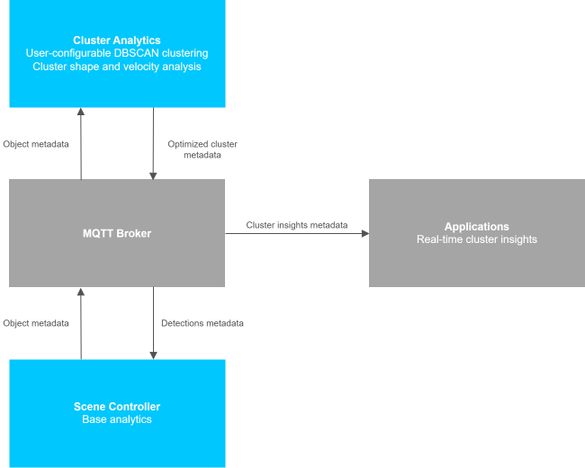
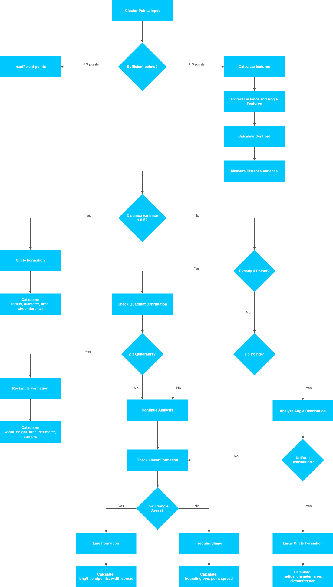
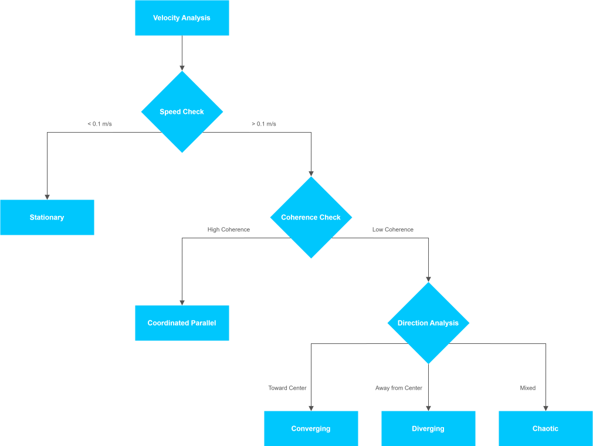

# How It Works

## Architecture

### Data Flow Diagram



### DBSCAN Clustering Configuration

#### User-Configurable Parameters

The `config.json` file allows customization of DBSCAN clustering parameters:

- **`eps`** - Maximum distance (in meters) between objects to be considered in the same cluster
- **`min_samples`** - Minimum number of objects required to form a cluster

These parameters can be configured globally (default) or per object category.

#### Configuration File Structure

The service uses a `config.json` file located in the `config/` directory:

```json
{
  "dbscan": {
    "default": {
      "eps": 1,
      "min_samples": 3
    },
    "category_specific": {
      "person": {
        "eps": 2,
        "min_samples": 2
      },
      "vehicle": {
        "eps": 4.0,
        "min_samples": 2
      },
      "bicycle": {
        "eps": 1.5,
        "min_samples": 2
      },
      "motorcycle": {
        "eps": 2.5,
        "min_samples": 2
      },
      "truck": {
        "eps": 5.0,
        "min_samples": 2
      },
      "bus": {
        "eps": 6.0,
        "min_samples": 2
      }
    }
  }
}
```

#### Parameter Descriptions

- **`default`**: Fallback parameters for object categories not explicitly configured
- **`category_specific`**: Per-category parameters optimized for different object types:
  - `person` - Optimized for people clustering (social distancing, queues)
  - `vehicle` - Optimized for vehicle parking, traffic clusters
  - `bicycle` - Optimized for bike racks, group riding
  - `motorcycle` - Moderate spacing for motorcycle clusters
  - `truck` - Large vehicle spacing requirements
  - `bus` - Bus stops, depot formations

### Shape Detection and Analysis

- **ML-based Shape Classification**: Detects geometric patterns using feature extraction
- **Size Calculations**: Provides precise measurements for each detected shape type
- **Supported Shapes**:
  - **Circle**: radius, diameter, area, circumference
  - **Rectangle**: width, height, area, perimeter, corner points
  - **Line**: length, endpoints, width spread
  - **Irregular**: bounding box dimensions, point spread

#### Shape Detection Logic



### Velocity Analysis and Movement Patterns

- **Movement Classification**: 6 distinct movement patterns
- **Velocity Statistics**: Comprehensive speed and direction analysis
- **Pattern Types**:
  - `stationary` - Objects with minimal movement
  - `coordinated_parallel` - Synchronized movement in same direction
  - `converging` - Objects moving toward cluster center
  - `diverging` - Objects moving away from cluster center
  - `loosely_coordinated` - Some coordination but not highly synchronized
  - `chaotic` - Random or unpredictable movement patterns

#### Velocity Analysis Logic



## WebUI Features and Real-time Visualization

The integrated WebUI provides a comprehensive interface for cluster analysis monitoring and configuration:

### Interactive Visualization

- **Real-time Canvas**: Live updating visualization of objects and clusters
- **Pan and Zoom**: Navigate through scene data with mouse controls
- **Object Display**: Individual objects colored by cluster assignment
- **Cluster Shapes**: Visual representation of detected cluster geometries
- **Movement Vectors**: Optional display of cluster movement with adjustable scaling
- **Auto-fit**: Automatic view adjustment to focus on current scene data

### Dynamic Parameter Configuration

- **Per-Category Controls**: Independent parameter adjustment for each object category
- **Real-time Updates**: Changes apply immediately with automatic re-clustering
- **Scene-Specific Settings**: Each scene maintains its own parameter configuration
- **Reset to Defaults**: Quick restoration of default parameters per category
- **Visual Feedback**: Immediate visualization of parameter change effects

### Scene Management

- **Multi-Scene Support**: Switch between available scenes dynamically
- **Auto-Discovery**: Scenes are automatically discovered from MQTT traffic
- **Current Data Focus**: Always displays current state without historic accumulation
- **Object Count Display**: Real-time object and cluster statistics

### Advanced Controls

- **Refresh Rate**: Configurable from real-time to custom intervals
- **Movement Vector Scaling**: Adjustable visualization scale for velocity vectors
- **Connection Status**: Live MQTT connection monitoring
- **Parameter Validation**: Intelligent validation based on actual scene data

### Insufficient Points Handling

- **Individual Object Coloring**: Objects are colored by category when clusters cannot be formed
- **Clear Messaging**: Visual indication when clustering is not possible
- **Dynamic Thresholds**: Uses user-configured min_samples rather than global defaults

## Production Data Analysis

### Real Deployment Performance

Based on actual production deployment on `broker.scenescape.intel.com`:

- **Active Scenes**: "Queuing" (`302cf49a-97ec-402d-a324-c5077b280b7b`), "Retail" (`3bc091c7-e449-46a0-9540-29c499bca18c`)
- **Object Volume**: 62 person objects per frame in busy queuing scenarios
- **Cluster Formation**: Typically 2 clusters formed (42-43 objects in main cluster, 4 objects in secondary cluster)
- **Noise Points**: 15-17 unclustered objects (24-27% noise ratio)
- **Shape Patterns**: 100% circle formations observed in production
- **Movement Types**: Mix of "chaotic" (main clusters) and "stationary" (small clusters)

### Performance Characteristics

- **Processing Speed**: Real-time analysis of 60+ objects per frame
- **Network Connectivity**: Reliable MQTT connectivity to production broker
- **Shape Detection**: Consistent circle detection with radius measurements 0.16-0.87 meters
- **Velocity Analysis**: Accurate movement classification with coherence measurements

## Usage Examples

### Real-time Monitoring

Subscribe to the `ANALYTICS_CLUSTERS` topic to receive live cluster updates:

```bash
mosquitto_sub -h broker.scenescape.intel.com -t "scenescape/analytics/clusters/+" -v
```

### Processing Cluster Data

Example Python code to process cluster metadata with tracking information:

```python
import json
import paho.mqtt.client as mqtt

def on_message(client, userdata, message):
    try:
        cluster_batch = json.loads(message.payload.decode())

        scene_name = cluster_batch['scene_name']
        scene_id = cluster_batch['scene_id']
        total_clusters = len(cluster_batch['clusters'])

        print(f"\n=== Scene: {scene_name} ({scene_id}) ===")
        print(f"Total Clusters: {total_clusters}")

        # Process individual clusters
        for cluster in cluster_batch['clusters']:
            cluster_id = cluster['id']
            category = cluster['category']
            object_count = cluster['objects_count']

            # Tracking information
            tracking = cluster['tracking']
            first_seen = tracking['first_seen']
            last_seen = tracking['last_seen']

            print(f"\n--- Cluster {cluster_id[:8]}... ---")
            print(f"  Category: {category}")
            print(f"  Objects: {object_count}")
            print(f"  First seen: {first_seen}")
            print(f"  Last seen: {last_seen}")

            # Movement and shape analysis
            movement_type = cluster['velocity_analysis']['movement_type']
            shape = cluster['shape_analysis']['shape']

            print(f"  Movement: {movement_type}")
            print(f"  Shape: {shape}")

            # Shape-specific measurements
            if shape == "circle":
                radius = cluster['shape_analysis']['size']['radius']
                print(f"  Circle radius: {radius:.2f}m")
            elif shape == "rectangle":
                width = cluster['shape_analysis']['size']['width']
                height = cluster['shape_analysis']['size']['height']
                print(f"  Rectangle: {width:.2f}m x {height:.2f}m")

    except Exception as e:
        print(f"Error processing cluster data: {e}")
        import traceback
        traceback.print_exc()

client = mqtt.Client()
client.on_message = on_message
client.connect("broker.scenescape.intel.com", 1883, 60)
client.subscribe("scenescape/analytics/clusters/+")
client.loop_forever()
```
