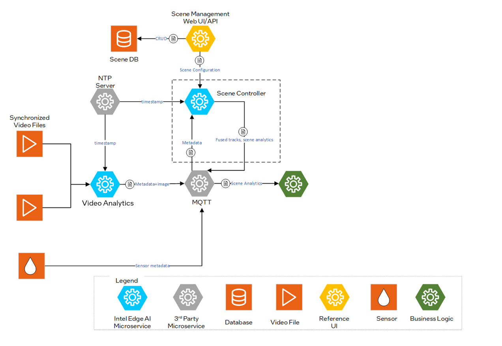
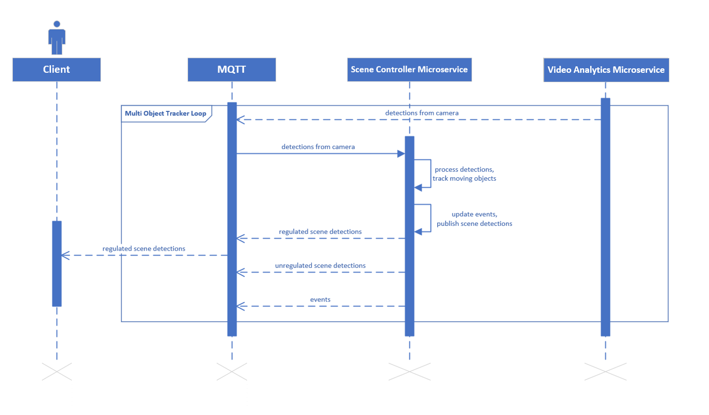

<!--hide_directive
<div class="component_card_widget">
  <a class="icon_github" href="https://github.com/open-edge-platform/scenescape/tree/main/controller">
     GitHub project
  </a>
  <a class="icon_document" href="https://github.com/open-edge-platform/scenescape/blob/main/controller/README.md">
     Readme
  </a>
</div>
hide_directive-->

# Scene Controller Service

Scene Controller Microservice fuses multimodal sensor data to enable spatial analytics at the
edge for multiple use cases.

## Overview

The Scene Controller Microservice answers the fundamental question of `What, When and Where`. It receives object detections from multimodal inputs (primarily multiple cameras), contextualizes them in a common reference frame, fuses them and tracks objects over time.

The Scene Controller's output provides various insights for the tracked objects in a scene, including location, object visibility across cameras, velocity, rotation, center of mass. Additionally, base analytics like regions of interest, tripwires, and sensor regions are supported out of the box to enable developers to build their applications quickly and realize business goals.

To deploy the scene controller service, refer to the [Get Started](./get-started.md) guide. The service supports configuration through specific arguments and flags, which default to predefined values unless explicitly modified.

### Configurable Arguments and Flags

`--maxlag`: Maximum allowable delay for incoming messages. If a message arrives more than 1 second late, it will be discarded by the Scene Controller. This threshold can be adjusted to accommodate longer inference times, ensuring no messages are discarded. Discarded messages will appear as "FELL BEHINDS" in the service logs.

`--broker`: Hostname or IP of the MQTT broker, optionally with `:port`.

`--brokerauth`: Authentication credentials for the MQTT broker. This can be provided as `user:password` or as a path to a JSON file containing the authentication details.

`--resturl`: Specifies the URL of the REST server used to provide scene configuration details through the REST API.

`--restauth`: Authentication credentials for the REST server. This can be provided as `user:password` or as a path to a JSON file containing the authentication details.

`--rootcert`: Path to the CA (Certificate Authority) certificate used for verifying the authenticity of the server's certificate.

`--cert`: Path to the client certificate file used for secure communication.

`--ntp`: NTP server.

`--tracker_config_file`: Path to the JSON file containing the tracker configuration. This file is used to enable and manage time-based parameters for the tracker.

`--reid_config_file`: Path to the JSON file containing Re-ID (Re-Identification) configuration. This file controls Re-ID specific settings such as stale feature timeout, feature accumulation thresholds, and similarity scoring. See [Extended Re-ID](./Extended-ReID.md) for details.

`--schema_file`: Specifies the path to the JSON file that contains the metadata schema. By default, it uses [metadata.schema.json](https://github.com/open-edge-platform/scenescape/blob/main/controller/src/schema/metadata.schema.json). This schema outlines the structure and format of the messages processed by the service.

`--visibility_topic`: Specifies the topic for publishing visibility information, which includes the visibility of objects in cameras. Options are `unregulated`, `regulated`, or `none`.

`--analytics-only`: Enables analytics-only mode (experimental feature). In this mode, the Scene Controller consumes tracked objects from a separate Tracker service via MQTT instead of performing tracking internally. The tracker is not initialized, and camera/scene data processing is skipped. Child scenes are not supported. This mode can also be enabled via the `CONTROLLER_ENABLE_ANALYTICS_ONLY` environment variable set to `true`.

### Configuration

For detailed configuration guidance:

- Tracker configuration: See [How to Configure the Tracker](./how-to-configure-tracker.md)
- Re-ID configuration: See [Extended Re-ID](./Extended-ReID.md)

## Controller Input Message Format

The Scene Controller subscribes to the MQTT topic `scenescape/data/camera/{camera_id}` and
receives camera detection metadata from visual analytics pipelines. Messages are validated
against the `detector` definition in
[metadata.schema.json](https://github.com/open-edge-platform/scenescape/blob/main/controller/src/schema/metadata.schema.json).

### Top-Level Message Fields

| Field | Type | Required | Description |
|-------|------|:--------:|-------------|
| `id` | string | Yes | Camera or sensor identifier |
| `timestamp` | string (ISO 8601 UTC) | Yes | Acquisition time of the frame |
| `objects` | object | Yes | Category-keyed map; each value is an array of detections (e.g. `{"person": [...]}`) |
| `rate` | number ≥ 0 | No | Camera framerate (frames per second) when the message was produced |
| `sub_detections` | array of string | No | Sub-detection labels run on this frame (e.g. `["license_plate"]`) |

### Detection Object Fields (`objects.<category>[*]`)

| Field | Type | Required | Description |
|-------|------|:--------:|-------------|
| `category` | string | Yes | Object class label (e.g. `"person"`, `"car"`) |
| `bounding_box` | object | One of ① | Normalized image-space bounding box (`x`, `y`, `width`, `height`) |
| `bounding_box_px` | object | One of ① | Pixel-space bounding box (`x`, `y`, `width`, `height`; optional `z`, `depth`) |
| `translation` | array[3] of number | One of ① | 3D world position (`x`, `y`, `z`) in metres |
| `size` | array[3] of number | One of ① | 3D object dimensions (`x`, `y`, `z`) in metres |
| `confidence` | number > 0 | No | Inference confidence score for this detection |
| `id` | integer ≥ 0 | No | Per-frame detection index |
| `rotation` | array[4] of number | No | Object orientation as a quaternion |
| `center_of_mass` | object | No | Depth-estimation region of interest in pixels (`x`, `y`, `width`, `height`) |
| `distance` | number | No | Distance from the camera to the detection in metres |
| `metadata` | object | No | Semantic attribute bag (see [Semantic Metadata Fields](#semantic-metadata-fields)) |

> **① One-of constraint**: every detection must contain exactly one of:
> `bounding_box` **or** `bounding_box_px` (2D image-based detection), **or** both `translation` and `size` (3D world-space detection).

### Semantic Metadata Fields (`objects.<category>[*].metadata.<attr>`)

| Field | Type | Required | Description |
|-------|------|:--------:|-------------|
| `label` | any | Yes | Detected value for this attribute (e.g. `"Male"` for gender, `true` for a boolean) |
| `model_name` | string | Yes | Name of the model that produced this attribute |
| `confidence` | number [0, 1] | No | Confidence score for the detected attribute |

### Example Camera Detection Message

The following example shows a typical message published by a camera pipeline (debug fields
omitted; `embedding_vector` truncated for readability):

```json
{
  "id": "atag-qcam1",
  "timestamp": "2026-03-26T21:01:31.486Z",
  "rate": 10.03,
  "objects": {
    "person": [
      {
        "id": 1,
        "category": "person",
        "confidence": 0.998,
        "bounding_box_px": {
          "x": 419,
          "y": 64,
          "width": 192,
          "height": 411
        },
        "center_of_mass": {
          "x": 482,
          "y": 165,
          "width": 64,
          "height": 102.75
        },
        "metadata": {
          "age": {
            "label": "39",
            "model_name": "age_gender"
          },
          "gender": {
            "label": "Male",
            "model_name": "age_gender",
            "confidence": 0.979
          },
          "reid": {
            "embedding_vector": "<base64-encoded string>",
            "model_name": "torch-jit-export"
          }
        }
      }
    ]
  }
}
```

For the full schema definition, see
[metadata.schema.json](https://github.com/open-edge-platform/scenescape/blob/main/controller/src/schema/metadata.schema.json).

## Architecture



Figure 1: Architecture Diagram

## Sequence Diagram: Scene Controller Workflow

The Client receives regulated scene detections via MQTT, which are the result of processing and filtering raw detections. The pipeline begins when the Scene Controller Microservice receives detections from the camera. It processes these to track moving objects, then publishes scene detections and events through MQTT. These messages may include both regulated (filtered and formatted) and unregulated (raw) scene detections. A Multi Object Tracker Loop is involved in managing detections within MQTT.



_Figure 2: Scene Controller Sequence diagram_

## Supporting Resources

- [Get Started Guide](./get-started.md)
- [How to Configure the Tracker](./how-to-configure-tracker.md)
- [Extended Re-ID](./Extended-ReID.md)
- [API Reference](./api-reference.md)

<!--hide_directive
:::{toctree}
:hidden:

get-started.md
how-to-configure-tracker.md
Extended-ReID.md
api-reference.md

:::
hide_directive-->
