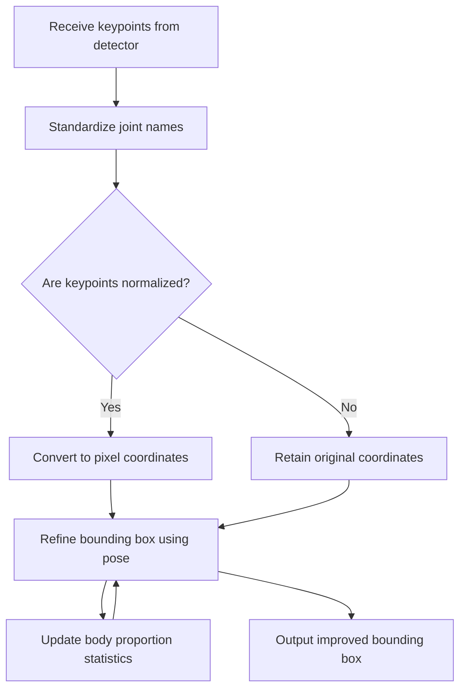

<!--
SPDX-License-Identifier: Apache-2.0
(C) 2026 Intel Corporation
-->

# Person Pose Package Design

## Overview

The `person_pose` package in the SceneScape Controller microservice provides utilities for refining and adjusting person bounding boxes using pose keypoints and learned body proportions. It is designed to improve the accuracy of person localization by leveraging pose estimation outputs, such as those from keypoint detectors, and maintaining adaptive statistics about human body proportions.

## Flowchart: Person Pose Adjustment Pipeline

## Key Behaviors and Components

- **Bounding box refinement**: Adjusts the detected region around a person using pose keypoints and learned body proportions, resulting in more accurate localization.
- **Keypoint normalization and scaling**: Converts incoming keypoints from various formats to a standard set of joint names, and scales them to the appropriate coordinate system (pixel or normalized) as needed.
- **Body proportion statistics**: Maintains adaptive statistics about human body proportions for each detected individual, using recent observations to improve future bounding box adjustments.

## Design Details

### 1. Keypoint Standardization and Preparation

- Joint names from different sources are mapped to a standard set of names, ensuring consistency regardless of the input format.
- Incoming keypoints are parsed and the most reliable observation for each joint is selected.
- Keypoints are checked to determine if they are normalized (values between 0 and 1) and, if so, are scaled to pixel coordinates using either the bounding box or the frame resolution.

### 2. Learning and Using Body Proportions

- The system tracks median body proportions (such as ratios between ankles, nose, hips, etc.) for each detected person, using a unique identifier (e.g., camera, track ID, label).
- For each individual, a rolling window of recent samples is maintained for each ratio, along with counts of detections and observations, and timestamps for when the person was last seen.
- Stale statistics are pruned, and the system only uses learned medians when enough observations have been collected to ensure reliability.

### 3. Refining Person Localization

- The system uses pose keypoints and learned body proportions to refine the detected region around each person.
- It supports both direct and estimated methods for determining foot position, applies safety margins, and adapts its approach based on the confidence of the keypoint data.
- The behavior can be tuned with parameters such as the number of samples to remember, how long to keep statistics, and how many observations are needed before using learned proportions.

## Usage Pattern

1. Parse and standardize incoming keypoints from the detector.
2. Scale keypoints to the appropriate coordinate system if needed.
3. Refine the detected region around each person using pose information and update the body proportion statistics for future improvements.

## Extensibility

- The package is designed to be extensible for new keypoint formats, additional body ratios, or alternative adjustment strategies.

## See Also

- [controller.md](../../../../docs/user-guide/microservices/controller/controller.md): Controller service overview
- [data_formats.md](../../../../docs/user-guide/microservices/controller/data_formats.md): Data formats and keypoint message structure
