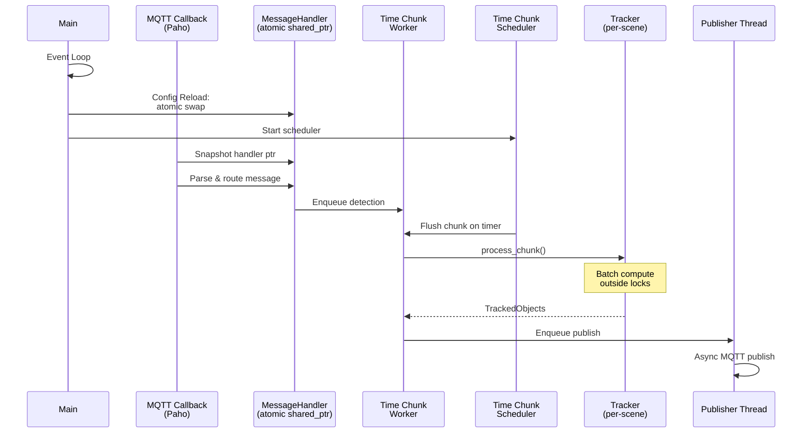

# Tracker Service - Design Document

C++ microservice for real-time multi-object tracking across physical scenes. Receives detection messages via MQTT, tracks objects per scene, publishes world coordinates.

**Principles:**
- **Scene Isolation**: Independent tracking state per scene
- **Low-Contention Path**: Tracking compute runs outside critical sections; no coarse global locks
- **Dynamic Config**: Runtime updates for scene topology via operator trigger
- **Fail-Fast**: Invalid config causes immediate exit

## Architecture

**Flow:** MqttClient → MessageHandler → Tracker (per scene) → Publisher → MQTT Broker

**Message Processing:**
1. Parse JSON (simdjson, zero-copy)
2. Lookup camera → scene (shared lock)
3. Get tracker pointer (shared lock)
4. Process detections (compute-heavy, outside global config locks)
5. Publish tracks (async MQTT)

## Threading Model

1. **Main**: Event loop, lifecycle, config reload
2. **MQTT Callback**: Paho message receive/dispatch (hot path)
3. **Publisher**: Background thread for batching; uses async client
4. **Time Chunking**: Per-processor workers + scheduler
   - Scheduler: Global timer thread that triggers chunk flushes
   - Workers: Per-processor threads that batch detections within time windows before tracking

### Lifecycle

- **Startup**: Ready when MQTT connected + subscribed
- **Config update**: Atomic handler swap; diff subscriptions; no restart
- **Broker outage**: Readiness=false, liveness=true; exponential backoff reconnect; tracking state preserved; missed detections not replayed
- **OTLP outage**: Buffer with capped retry; drop telemetry on overflow; never block hot path
- **Backpressure**: Drop-oldest with per-reason counters
- **Shutdown**: SIGTERM/SIGINT → drain (2s timeout) → flush OTLP → exit

## Concurrency

- Atomic handler swap: `atomic<shared_ptr<MessageHandler>>` for lock-free message dispatch
- Fine-grained shared mutexes for routing/tracker/processor lookups
- Tracking compute runs outside locks

## Deployment

**Container:** Distroless, non-root (1000:1000), shell-less, health server on port 8080

**Docker Compose:** exec healthcheck `["CMD", "/scenescape/tracker", "--ready"]`; mount config/certs read-only

**Kubernetes (Helm):** httpGet probes on `/healthz` and `/readyz`; ConfigMap for config, Secret for TLS/passwords

## Configuration

**Precedence:** CLI > Environment > File (JSON)

**Dynamic Reload:** Scene/camera topology only; atomic handler swap with subscription diff; service-level settings require restart

Refer to Tracker Configuration Schema for full details.

## Stack

**Languages:** C++20, CMake 3.28+, Conan 2.0  
**Libraries:** Paho MQTT C++, simdjson, RapidJSON, OpenCV, OpenTelemetry, Quill, RobotVision (tracking)  
**Container:** Multi-stage Docker (Debian → distroless), ~150 MB

## Observability

**OTLP-only:** Metrics, traces, and logs exported via OTLP/HTTP

Key signals: message counters/latency, drop-by-reason, MQTT connectivity, resource usage. Require OTEL resource attributes. Redact secrets/PII.

## MQTT Topics

**Input:** `scenescape/data/camera/{camera_id}` - Detection messages (camera ID, timestamp, objects with bbox/confidence/id)  
**Output:** `scenescape/data/scene/{scene_id}/{thing_type}` - Track messages (scene ID, timestamp, objects with world position/velocity/visibility)

## Healthchecks

**Endpoints:** `/healthz` (liveness), `/readyz` (readiness on port 8080)

**Compose:** exec `["CMD", "/scenescape/tracker", "--ready"]` (shell-less binary subcommand)  
**Kubernetes:** httpGet probes

---

See [README.md](README.md) and `docs/adr/0007-tracker-service.md` for details.
