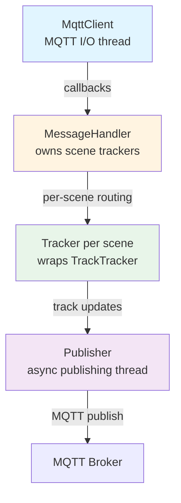
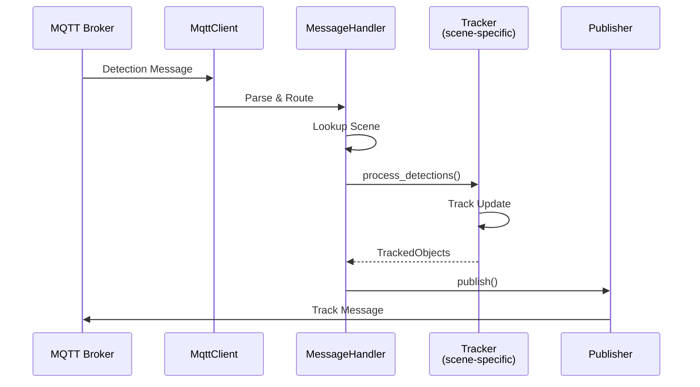
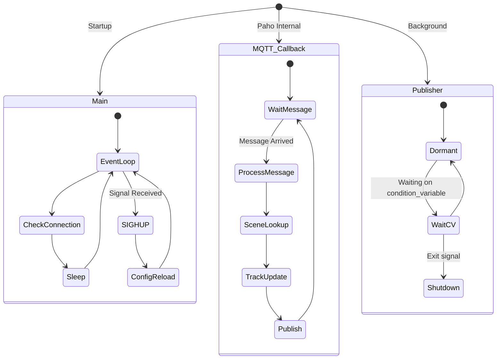
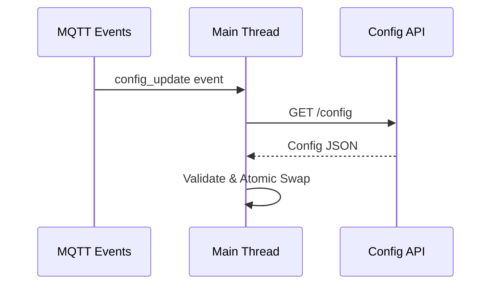

# Tracker Service - Design Document

C++ microservice for real-time multi-object tracking across physical scenes. Receives detection messages via MQTT, tracks objects per scene, publishes world coordinates.

**Principles:**
- **Scene Isolation**: Independent tracking state per scene
- **Lock-Free Fast Path**: Processing happens outside critical sections
- **Dynamic Config**: Runtime updates without restart (SIGHUP or REST API)
- **Fail-Fast**: Invalid config causes immediate exit

## Architecture

### Component Hierarchy



### Data Flow



**Message Processing (~60 Hz per camera):**
1. Parse JSON (simdjson, zero-copy)
2. Lookup camera → scene (shared lock)
3. Get tracker pointer (shared lock)
4. Process detections (NO LOCKS - compute-heavy)
5. Publish tracks (sync MQTT)

## Threading Model



**Threads:**
1. **Main**: Event loop, handles SIGHUP for config reload
2. **MQTT Callback** (Paho): Processes messages (single-threaded, no parallelization)
3. **Publisher** (dormant): Infrastructure for future async publishing

## Locking

**Locks:**
- `routing_mutex_` (shared): Camera → scene lookups (<1 µs)
- `trackers_mutex_` (shared): Scene → tracker lookups (<1 µs)  
- `handler_mutex_` (exclusive): Protects config reload (held during entire message processing)

**Lock-Free Fast Path:**

```cpp
Tracker* tracker = nullptr;
{
    std::shared_lock lock(trackers_mutex_);
    tracker = scene_trackers_.find(scene_id)->second.get();
}  // Lock released

auto tracks = tracker->process_detections(detectionMsg);  // NO LOCKS (100µs-1ms)
```

Tracking computation dominates latency; holding locks would serialize all scenes.

## Memory

**Per Scene:** ~50-100 KB (tracker state) + ~1 KB (camera configs)  
**Per Message:** ~5 KB (transient, not retained)  
**Total:** <10 MB for 10 scenes, 40 cameras

## Configuration

**Source:** `config/config.json` or `$TRACKER_CONFIG_PATH`  
**Validation:** Each camera in exactly one scene (fail-fast on error)

**Dynamic Reload (SIGHUP):**
1. Validate new config
2. Build new MessageHandler
3. Update MQTT subscriptions
4. Atomic swap under `handler_mutex_`
5. Destroy old handler

Track continuity lost on reload (acceptable - rare event). No in-flight message loss.

## Future Extensions

### REST API Config Updates

MQTT event triggers HTTP fetch from centralized config server:



**Mechanisms:**
- **File (SIGHUP)**: Dev/testing, fast iteration
- **REST API**: Production, centralized management
- **Hybrid**: Both enabled, operator choice

**Config versioning** prevents stale updates. Fail-fast for SIGHUP, graceful degradation for REST API.

### Time Chunking

Batch detections per scene, call tracker at fixed FPS instead of per-message:

```json
{
  "time_chunking": {"enabled": true, "fps": 15}
}
```

Buffer latest detection from each camera. Timer thread (per scene) flushes buffer every `1000/fps` ms.

**Benefits:**
- 16x fewer tracker calls (240 → 15/sec for 4 cams @ 60 Hz)
- Better cache locality (batch processing)
- Lower lock contention

**Cost:** +1 thread per scene, ~20 KB memory, up to 66ms latency (15 FPS)

## Performance

**Latency:** 300 µs - 2 ms per message (dominated by track processing 100 µs - 1 ms)  
**Throughput:** 500 msg/sec (single-threaded), 2.1x headroom for single scene  
**Bottleneck:** 10 scenes @ 60 Hz = 2,400 msg/sec exceeds capacity (needs parallelization)

## Testing

- `test_tracker_metrics.py`: k6 load test with metrics validation
- E2E MQTT flow validation
- Planned: latency profiling, cache analysis, lock contention

## Stack

**Languages:** C++20, CMake 3.28+, Conan 2.0  
**Libraries:** Paho MQTT C++, simdjson, RapidJSON, OpenCV, OpenTelemetry, Quill, RobotVision (tracking)  
**Container:** Multi-stage Docker (Debian → distroless), ~150 MB  
**Resources:** 0.5-1 CPU core, 50 MB RAM (10 scenes)

## Observability

**Metrics:** `mqtt_messages_received_total`, `mqtt_handler_duration` (per camera)  
**Traces:** `mqtt_message_received` → `handle_detection` → `process_camera_detection` → `update_tracks` / `publish_tracks`  
**Logs:** Quill (async, structured)

## MQTT Message Formats

### Input: Detection Messages

**Topic:** `scenescape/data/camera/{camera_id}`

**Format:**
```json
{
  "id": "camera_id",
  "timestamp": "2025-12-17T10:30:00.000Z",
  "rate": 15.0,
  "objects": {
    "person": [
      {
        "category": "person",
        "confidence": 0.95,
        "center_of_mass": {"x": 100, "y": 200, "width": 50, "height": 150},
        "bounding_box_px": {"x": 75, "y": 125, "width": 150, "height": 450},
        "id": 1
      }
    ]
  }
}
```

**Fields:**
- `id` - Camera identifier
- `timestamp` - Detection timestamp (ISO 8601)
- `rate` - Detection rate in Hz
- `objects` - Object detections grouped by category (person, vehicle, etc.)
  - `category` - Object type
  - `confidence` - Detection confidence [0-1]
  - `center_of_mass` - Center point and dimensions in pixels
  - `bounding_box_px` - Bounding box in pixel coordinates
  - `id` - Object ID from vision pipeline (used for tracking association)

### Output: Track Messages

**Topic:** `scenescape/data/scene/{scene_id}/{thing_type}`

**Example:** `scenescape/data/scene/lobby/person`

**Format:**
```json
{
  "id": "scene_id",
  "timestamp": "2025-12-17T10:30:00.123Z",
  "name": "Building Lobby",
  "objects": [
    {
      "id": 1,
      "category": "person",
      "type": "person",
      "translation": [1.5, 2.3, 0.0],
      "size": [0.5, 0.4, 1.75],
      "velocity": [0.8, 0.3, 0.0],
      "rotation": [0, 0, 0, 1],
      "visibility": ["cam1"],
      "similarity": null,
      "first_seen": "2025-12-17T10:30:00.123Z"
    }
  ]
}
```

**Fields:**
- `id` - Scene identifier
- `timestamp` - Processing timestamp (ISO 8601)
- `name` - Human-readable scene name
- `objects` - Array of tracked objects:
  - `id` - Object track ID (from vision pipeline)
  - `category` / `type` - Object category (currently always "person")
  - `translation` - Position in meters `[x, y, z]` (z=0 for ground plane)
  - `size` - Dimensions in meters `[length, width, height]`
  - `velocity` - Velocity in m/s `[vx, vy, 0.0]` (z-component always 0)
  - `rotation` - Orientation quaternion `[0, 0, 0, 1]` (always identity, reserved)
  - `visibility` - Array of camera IDs that can see this object
  - `similarity` - Reserved for future use (always null)
  - `first_seen` - First detection timestamp (ISO 8601)

---

See [README.md](README.md) for user documentation and `docs/adr/0007-tracker-service.md` for architecture decisions.
