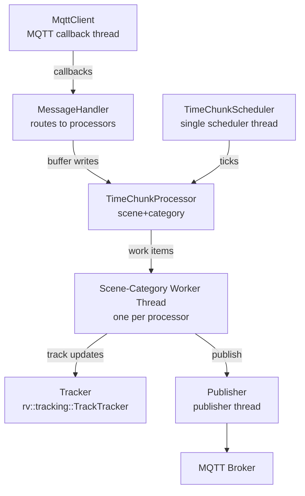
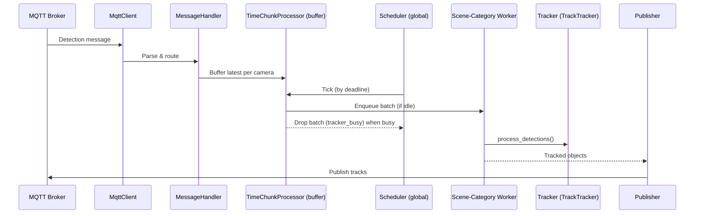

# Tracker Service - Design v2

C++ microservice for real-time multi-object tracking across physical scenes. This v2 design introduces a single global scheduler for time-chunk processing and one dedicated worker thread per scene+category, enabling proactive back-pressure while preserving tracker state isolation and lock-free compute.

Principles
- Scene+Category Isolation: Independent tracking state; single-writer per tracker
- Lock-Free Compute: Tracking executes without shared locks in a dedicated worker
- Deterministic Scheduling: One global scheduler coordinates all processors by deadlines
- Proactive Back-Pressure: Drop-before-enqueue when workers are busy
- Dynamic Config: Runtime updates without restart (SIGHUP or REST API)
- Fail-Fast: Invalid config causes immediate exit

## Architecture

### Component Hierarchy

### Data Flow

## Threading Model

Threads
- Main: Startup, lifecycle, SIGHUP-triggered config reload
- MQTT callback thread (Paho): Receives messages and writes to processor buffers
- Scheduler thread (single): Global time-chunk scheduler; decides per-processor dispatch by deadlines; enqueues or drops; never runs tracking
- Scene-category worker threads: One per (scene, category); run tracking only; single-writer to tracker state
- Publisher thread: Background thread for publishing (ready for async publishing)
- Config watch thread (optional): Watches files or API for config changes

Naming
- Use "scene-category worker thread" (or "worker thread") to avoid confusion with the `TrackTracker` class and `tracker_*` metrics.

## Time Chunking & Scheduler

Configuration
- Time chunking: always enabled
- `time_chunking.fps`: required integer FPS per processor (e.g., 15 => 66ms interval)

Scheduler Design
- Per-processor entry: `{ processor*, interval, next_deadline, jitter, key }`
- Deterministic jitter: Derived from the processor key to de-phase equal intervals
- Data structures: Min-heap by `next_deadline` + index map for O(1) unregister
- Wake strategy: `cv.wait_until(next_deadline)`; on wake, service all due processors
- Dispatch:
  - Pop buffer => `batch`
  - If `batch` empty: reschedule `next_deadline`
  - If worker busy (or tracker reports busy): drop `batch`, increment `dropped{reason="tracker_busy"}`
  - Else: enqueue `batch` to worker (non-blocking), notify
  - Catch-up: advance `next_deadline += k*interval` until it exceeds `now` (no drift)
- The scheduler never executes tracking logic

TimeChunkProcessor
- Buffer holds the latest detection per camera; overwrites older frames to bound memory
- Exposes non-blocking `try_enqueue_tick()` used by the scheduler
- Owns one scene-category worker thread that runs tracking sequentially per batch

## Back-Pressure & Dropped Messages

Dropped Reasons (Prometheus label `reason`)
- `fell_behind`: Emitted on the MQTT callback path when a detection is stale or buffer policy requires dropping (producer-side pressure)
- `tracker_busy`: Emitted by the scheduler when a processor’s worker is still executing at tick time (consumer-side busy); proactive drop-before-enqueue

Semantics
- `fell_behind` happens pre-buffer (input path)
- `tracker_busy` happens at scheduling time (consumer path)
- Both increment the same dropped counter with different `reason` values

## Locking

- `routing_mutex_` (shared): Camera => scene lookups (<1 us)
- `trackers_mutex_` (shared): Scene => processor/tracker lookups (<1 us)
- `handler_mutex_` (exclusive): Config reload + atomic handler swap
- Buffer is producer/consumer safe (MQTT callback <-> scheduler)
- Tracking runs lock-free on the scene-category worker (single-writer)

## Memory

Per processor
- Tracker state: ~50-100 KB
- Camera configs: ~1 KB
- Buffer: O(#cameras), bounded (latest wins)
- Worker thread + queue: ~100-200 KB

Global
- Scheduler state: O(#processors) entries + min-heap metadata

Typical total: <20-30 MB for ~10 scenes x 2 categories (moderate camera counts)

## Configuration & Reload

Source
- `config/config.json` or `$TRACKER_CONFIG_PATH`

Validation
- Every camera belongs to exactly one scene (fail-fast)
- Processors are created lazily per scene+category on first detection

Dynamic Reload (SIGHUP)
- Validate new config and build a new `MessageHandler`
- Update MQTT subscriptions
- Atomic swap under `handler_mutex_`
- Unregister old processors from the scheduler, stop their workers, then destroy the old handler
- Track continuity resets on reload (acceptable)

## Observability

Metrics (Prometheus via OTEL)
- `mqtt_messages_received_total`: Total MQTT messages received
- `scenescape_tracker_mqtt_handler_duration_milliseconds`: Histogram per camera for MQTT parse+route
- `scenescape_tracker_tracking_duration_milliseconds`: Histogram for tracking time (worker path)
- `scenescape_tracker_reliable_tracks`, `scenescape_tracker_total_tracks`: Gauges (UpDownCounters) updated after tracking
- `scenescape_controller_mqtt_messages_dropped_total{reason}`:
  - `reason="fell_behind"`: producer-side/buffer pressure
  - `reason="tracker_busy"`: scheduler-side consumer busy

Tracing (OTLP => Jaeger)
- `process_camera_detection` (root)
  - attributes: `camera.id`, `message.timestamp`, `objects.count`
- `kalman_tracking` (child)
  - attributes: `detections.count`, `tracks.count`, `duration_ms`
- `publish_tracks` (child)
  - attributes: `mqtt.topic`, `tracks.count`

Logs (Quill)
- Scheduler lifecycle: started/stopped, processor registrations
- Back-pressure: "Dropping N messages (tracker_busy) for scene/category ..."
- Verbosity controlled by config log level

## Performance

- Per-processor budget: `1000 / fps` ms (e.g., 66ms at 15 FPS)
- Scheduler proactively drops `tracker_busy` when a worker overruns the next tick
- Throughput scales with number of scene-category workers (independent processing)
- Deterministic jitter reduces burst alignment across processors

## Testing

- `test/test_tracker_metrics.py` orchestrates k6 load testing and validates:
  - `mqtt_messages_received_total` counters
  - MQTT handler and tracking duration histograms
  - Active track gauges
  - Dropped counter by reason (`fell_behind`, `tracker_busy`)

## Migration Notes (v1 -> v2)

- Timer threads: Removed per-processor timer threads; added one global scheduler thread
- Workers: Added one scene-category worker thread per processor as the sole executor of tracking
- Back-pressure: `tracker_busy` now proactive (drop-before-enqueue in scheduler); `fell_behind` unchanged (MQTT path)
- Semantics: Tracking occurs only on worker threads; the scheduler never runs tracking
- Metrics: Names/labels preserved; `tracker_busy` will now appear under sustained overload

## Related

- README.md: Quick start & operations
- AGENTS.md: Build, testing, SSL, Docker Compose, profiling
- controller/src/robot_vision: RobotVision tracking API
