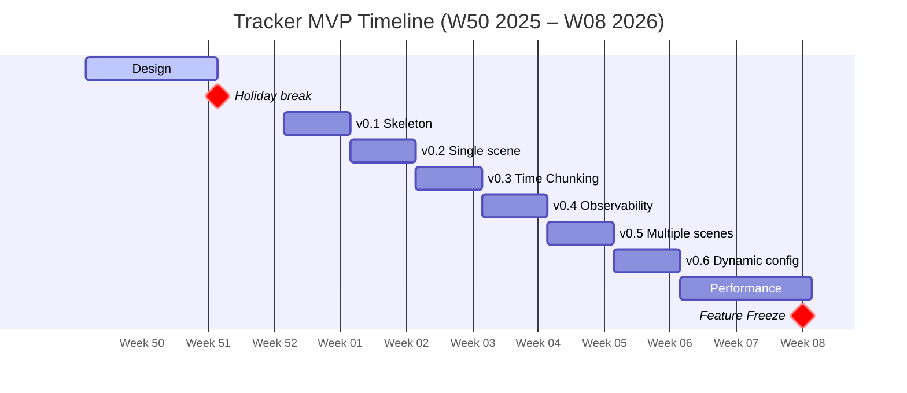

# Tracker Service MVP

## Scope
- Experimental feature, disabled by default; manual validation by developers is sufficient.
- Minimum functionality needed for Out Of the Box Scenes with 300 objects @ 4 cameras @ 15 FPS:
  - new Tracker Service:
    - multiple scenes & cameras dynamically configured via UI    
    - MQTT RX: /data/camera/*, coordinate transform, tracking, MQTT TX: /data/scene/*
    - minimal metrics & tracing support
    - time chunking
  - Controller analytics only mode
  - Docker compose deployment with feature flag

## Out of Scope
- K8s deployment
- NTP time correction
- Reidentification (VDMS)
- Coordinate Transform-only mode (no tracker)
- Detailed tracker config (max_unreliable_frames, non_measurement_frames_dynamic, non_measurement_frames_static, etc.)
- Developing new Analytics Service → Controller will be used in "analytics only" mode
- New metrics

## Acceptance Criteria

- Unit tests for code changes (fast, deterministic).
- Service tests with all externals mocked; local no‑auth MQTT and local OTLP allowed.
- CI green (build, lint, format, tests); no interface changes; feature off by default.
- MQTT topics and payload schema not changed
- Load & functionality tested

## Phases

### Design
  - [ITEP-80790](https://jira.devtools.intel.com/browse/ITEP-80790): ADR 
  - [ITEP-82221](https://jira.devtools.intel.com/browse/ITEP-82221): POC 
  - [ITEP-TODO](https://jira.devtools.intel.com/browse/ITEP-TODO): Design doc
  - [ITEP-TODO](https://jira.devtools.intel.com/browse/ITEP-TODO): How-to guide

### Implementation 

- v0.1 Skeleton
  - [ITEP-TODO](https://jira.devtools.intel.com/browse/ITEP-TODO): Controller with analytics-only mode
  - [ITEP-TODO](https://jira.devtools.intel.com/browse/ITEP-TODO): RobotVision CMake refactor
  - [ITEP-TODO](https://jira.devtools.intel.com/browse/ITEP-TODO): Tracker Service skeleton (build, Dockerfile, logging, tests)
  - [ITEP-TODO](https://jira.devtools.intel.com/browse/ITEP-TODO): Compose with new feature flag `--tracker-service`
  - [ITEP-TODO](https://jira.devtools.intel.com/browse/ITEP-TODO): CI build/lint/test
- v0.2 Single Scene configured statically
  - [ITEP-TODO](https://jira.devtools.intel.com/browse/ITEP-TODO): MQTT RX on /data/camera/*
  - [ITEP-TODO](https://jira.devtools.intel.com/browse/ITEP-TODO): Coordinate transform + RobotVision tracking
  - [ITEP-TODO](https://jira.devtools.intel.com/browse/ITEP-TODO): MQTT TX on /data/scene/*
- v0.3 Time Chunking
  - [ITEP-TODO](https://jira.devtools.intel.com/browse/ITEP-TODO): Time-chunking 
- v0.4 Observability 
  - [ITEP-TODO](https://jira.devtools.intel.com/browse/ITEP-TODO): Metrics
  - [ITEP-TODO](https://jira.devtools.intel.com/browse/ITEP-TODO): Tracing
- v0.5 Multiple Scenes configured statically
  - [ITEP-TODO](https://jira.devtools.intel.com/browse/ITEP-TODO): Config for multi-camera/scene (TBD)
  - [ITEP-TODO](https://jira.devtools.intel.com/browse/ITEP-TODO): Parallel handling per camera (TBD)
- v0.6 Dynamic Configuration via UI
  - [ITEP-TODO](https://jira.devtools.intel.com/browse/ITEP-TODO): API integration + reconfiguration (TBD)

### Performance
  - [ITEP-TODO](https://jira.devtools.intel.com/browse/ITEP-TODO): Baseline profile: flamegraph, tracing, metrics
  - [ITEP-TODO](https://jira.devtools.intel.com/browse/ITEP-TODO): Perf improvements

## References
- [Proof Of Concept](https://github.com/open-edge-platform/scenescape/pull/614)
- [ADR 7: Tracker Service](../docs/adr/0007-tracker-service.md)
