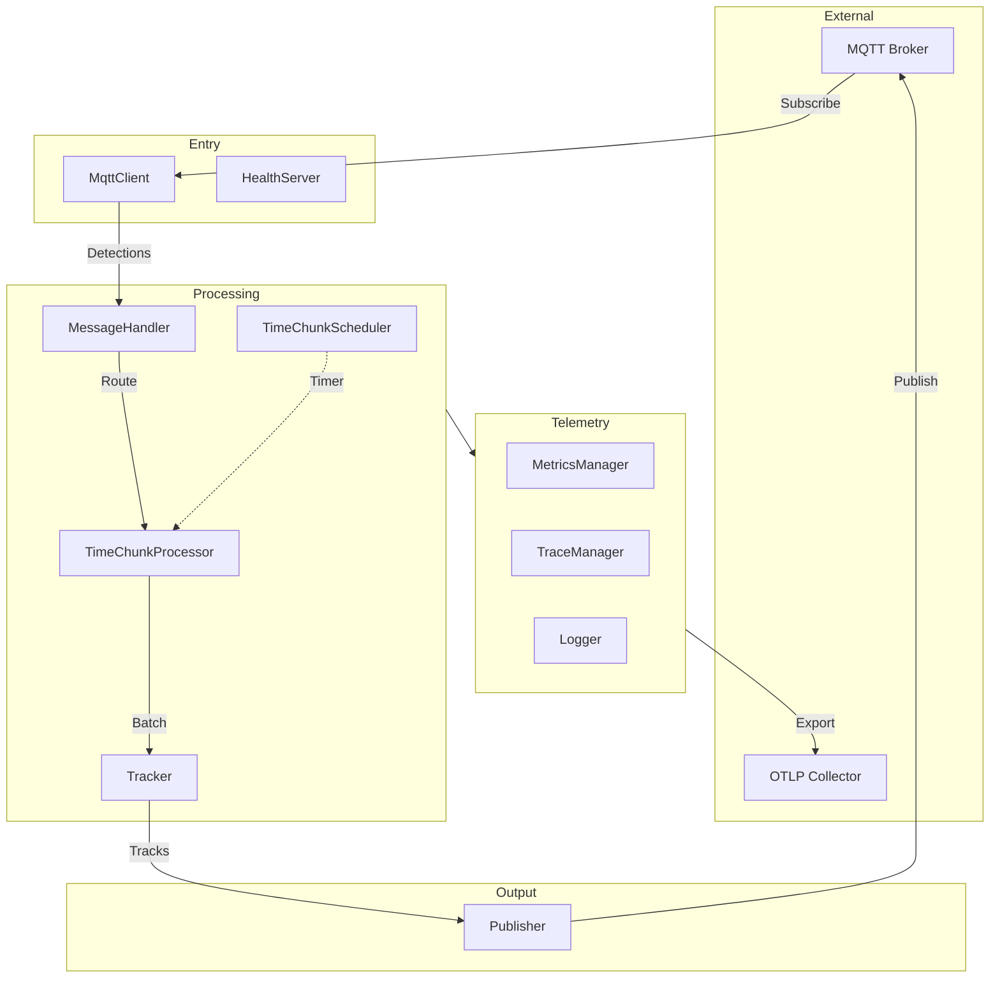
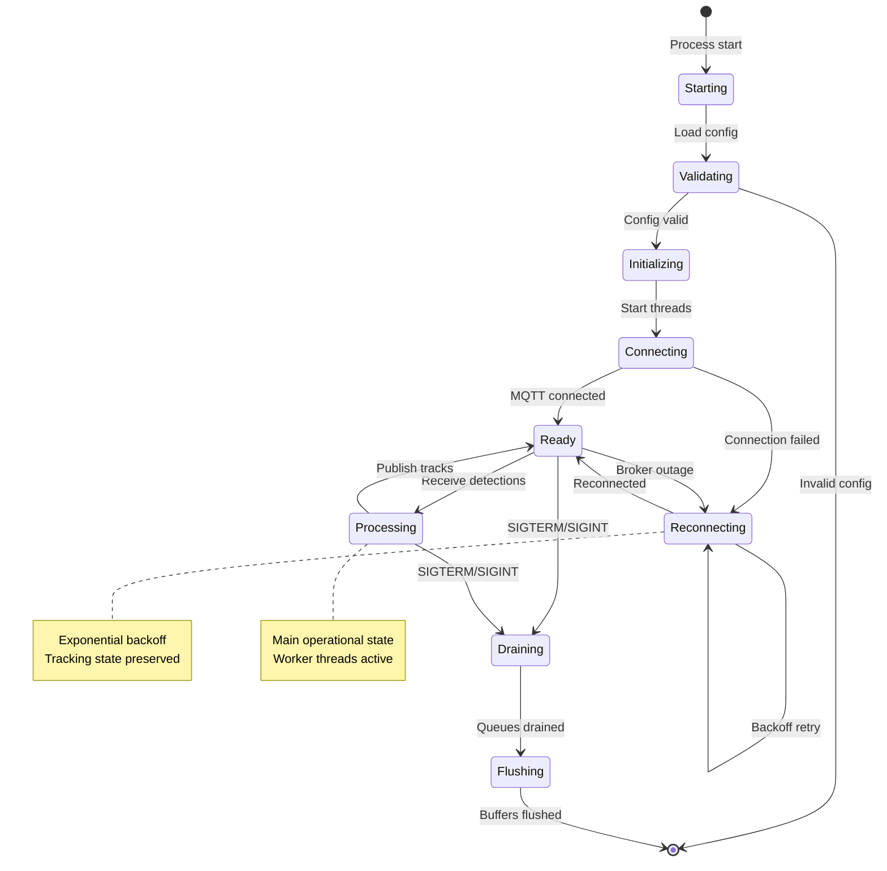

# Tracker Service Architecture

> **Maintainer Note:** Keep this document updated when modifying components, threading model, or lifecycle. This lives close to code to encourage updates alongside implementation changes.

This document describes the internal architecture of the Tracker Service. For high-level design, goals, and SLIs, see [Design Document](../../docs/design/tracker-service.md).

---

## Key Components

## Component Responsibilities

| Component          | Responsibility                             | Technology            |
| ------------------ | ------------------------------------------ | --------------------- |
| MqttClient         | MQTT connectivity, subscription management | Paho C++, SSL/TLS     |
| MessageHandler     | Parse JSON, route to scene processors      | simdjson              |
| TimeChunkScheduler | Global timer for batch processing          | C++ std::thread       |
| TimeChunkProcessor | Buffer detections per scene+category       | Bounded queues        |
| Tracker            | Coordinate transform + Kalman filtering    | RobotVision, OpenCV   |
| Publisher          | Async MQTT publishing with backpressure    | Paho async, RapidJSON |
| HealthServer       | HTTP probes for K8s liveness/readiness     | Port 8080             |
| MetricsManager     | Metrics collection and export              | OpenTelemetry         |
| TraceManager       | Distributed tracing spans                  | OpenTelemetry         |
| Logger             | Structured async logging                   | Quill                 |

---

## Threading Model

| Thread              | Pattern           | Description                                        |
| ------------------- | ----------------- | -------------------------------------------------- |
| Main                | Event Loop        | Startup, reconnect logic, signal handling          |
| MqttCallback        | Single-threaded   | Parses JSON (simdjson), routes to processors       |
| TimeChunkScheduler  | Scheduled-Task    | Global timer triggers batch flush (15 FPS default) |
| TimeChunkProcessors | Worker Pool       | Per scene+category processing threads              |
| Publisher           | Producer-Consumer | Async MQTT publishing with bounded queue           |
| HealthServer        | HTTP Server       | Liveness/readiness probes on port 8080             |

**Synchronization:** Shared mutexes for routing maps (read-heavy), tracking compute runs outside locks, atomic flags for health status, drop-oldest backpressure with metrics.

---

## Lifecycle

---

## Stack

| Category   | Technology             | Purpose                             |
| ---------- | ---------------------- | ----------------------------------- |
| Language   | C++20                  | Performance, parallelism            |
| Build      | CMake 3.28+, Conan 2.0 | Build system, dependency management |
| MQTT       | Paho C++               | Broker communication                |
| JSON Parse | simdjson               | High-performance parsing            |
| JSON Write | RapidJSON              | Track serialization                 |
| Tracking   | RobotVision, OpenCV    | Kalman filter, coordinate transform |
| Telemetry  | OpenTelemetry C++      | Metrics, traces, logs               |
| Logging    | Quill                  | Async structured logging            |
| Container  | Distroless             | Minimal attack surface (~150 MB)    |

---

## Configuration

Configuration schemas with examples:

- [config.schema.json](../schemas/config.schema.json) — Service configuration (MQTT, OTLP, processing)
- [scenes.schema.json](../schemas/scenes.schema.json) — Scene topology (file or API mode)

**Scene Sources:**

- **File mode**: Load from local JSON file at startup
- **API mode**: Fetch from Manager API with token auth; subscribe to update notifications

---

## Scalability

**MVP: Static Scene Partitioning** — Multiple instances with non-overlapping scene assignments via separate config files. Simple, no coordination, but requires manual failover.

**Future: Lease-Based Dynamic Scaling** — See [ADR-0008](https://github.com/open-edge-platform/scenescape/pull/841) for automatic scene assignment via Manager API leases.

---

## Related Documentation

- [Design Document](../../docs/design/tracker-service.md) — Goals, SLIs, deployment, risks
- [ADR-0007: Tracker Service](../../docs/adr/0007-tracker-service.md) — Architectural decision record
- [README](../README.md) — Quick start and build instructions
