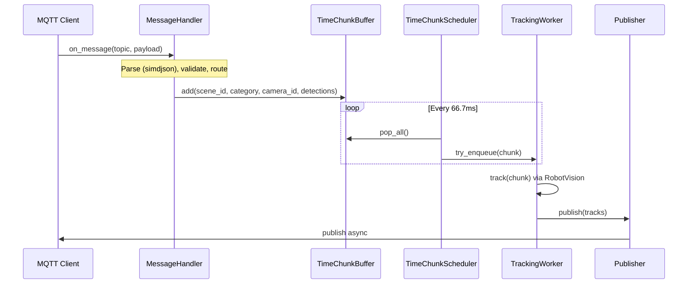
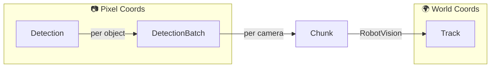
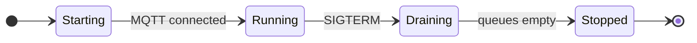

# Tracker Service Implementation Guide

> **Implementation Status:** This document describes the _planned_ implementation architecture. Code examples are reference designs. See the [Tracker README](../README.md) for current build status.

For high-level design, goals, SLIs, and observability details, see [Design Document](../../docs/design/tracker-service.md).

---

## Table of Contents

- [Time-Chunk Processing Pipeline](#time-chunk-processing-pipeline)
- [Message Flow](#message-flow)
- [Error Handling](#error-handling)
- [RobotVision Integration](#robotvision-integration)
- [Core Data Structures](#core-data-structures)
- [Synchronization](#synchronization)
- [Lifecycle](#lifecycle)

---

## Time-Chunk Processing Pipeline

The tracker aggregates detections into fixed time intervals ("chunks") before processing. This enables multi-camera fusion, improves tracker efficiency, and decouples camera FPS from output rate. See [ADR-0003: Scaling Controller Performance](../../docs/adr/0003-scaling-controller-performance.md) for rationale and alternatives considered.

### Chunk Timing

```
Camera A:    |--D1--|--D2--|--D3--|--D4--|--D5--|
Camera B:      |--D1--|--D2--|--D3--|--D4--|
Chunk:       [=======CHUNK 0=======][=======CHUNK 1=======]
             0ms                   66.7ms                 133.3ms
```

- **Default interval**: 66.7ms (15 FPS, configurable via `time_chunking_fps`)
- **Timer**: `std::condition_variable::wait_for()` with `steady_clock` (~1-10ms jitter, acceptable for 15 FPS)

### Buffer Structure

Per-scene, per-category, per-camera buffer with **keep-latest** semantics:

```cpp
// Type aliases for readability
using CameraMap   = std::unordered_map<std::string, DetectionBatch>;  // camera_id → batch
using CategoryMap = std::unordered_map<std::string, CameraMap>;       // category → cameras
using SceneMap    = std::unordered_map<std::string, CategoryMap>;     // scene_id → categories

struct TimeChunkBuffer {
    SceneMap buffer_;
    std::mutex mutex_;

    void add(const std::string& scene_id, const std::string& category,
             const std::string& camera_id, DetectionBatch&& detections);
    auto pop_all() -> SceneMap;  // Atomic swap, clears buffer
};
```

### Scheduler Loop

```cpp
void TimeChunkScheduler::run() {
    while (!stop_requested_) {
        wait_for_interval();  // 66.7ms default

        SceneMap snapshot = buffer_.pop_all();
        for (auto& [scene_id, categories] : snapshot) {
            for (auto& [category, cameras] : categories) {
                dispatch(scene_id, category, std::move(cameras));
            }
        }
    }
}

void TimeChunkScheduler::dispatch(const std::string& scene_id,
                                   const std::string& category,
                                   CameraMap&& cameras) {
    auto key = std::make_pair(scene_id, category);
    if (!workers_.contains(key)) create_worker(scene_id, category);

    // Convert map to sorted vector for deterministic ordering
    std::vector<DetectionBatch> batches;
    for (auto& [camera_id, batch] : cameras) {
        batches.push_back(std::move(batch));
    }
    std::sort(batches.begin(), batches.end(),
        [](auto& a, auto& b) { return a.timestamp < b.timestamp; });

    Chunk chunk{scene_id, category, steady_clock::now(), std::move(batches)};
    if (!queues_[key].try_enqueue(std::move(chunk))) {
        metrics_.increment_dropped(scene_id, category, "tracker_busy");
    }
}
```

Workers are created lazily on first detection per scene+category. Each owns a dedicated thread and RobotVision instance.

---

## Message Flow



### Memory Management

Allocations occur at format boundaries (JSON parse, RobotVision conversion, JSON serialize). Between stages, move semantics transfer heap pointers without copying detection data.

| Stage                      | Allocations                               |
| -------------------------- | ----------------------------------------- |
| Parse JSON → Detection     | Create Detection objects (unavoidable)    |
| Buffer → Scheduler → Queue | None (pointer swap via `std::move`)       |
| Detection → TrackedObject  | Create TrackedObject (RobotVision format) |
| TrackedObject → Track      | Create Track objects (output format)      |
| Track → JSON               | Serialize output string                   |

**Optimization**: Use `reserve()` to avoid reallocations during parsing and conversion:

```cpp
detections.reserve(config_.max_objects_per_frame);  // e.g., 300
rv_objects.reserve(chunk.total_detections());
```

Object pools are a future optimization if profiling shows allocation as a bottleneck.

---

## Error Handling

All errors increment `scenescape_tracker_messages_dropped_total{scene, category, reason}`.

| Scenario                             | Action                                |
| ------------------------------------ | ------------------------------------- |
| Lag > `max_lag_seconds` (default 1s) | Drop with `reason="fell_behind"`      |
| Malformed JSON                       | Drop with `reason="parse_error"`      |
| Schema validation fail               | Drop with `reason="validation_error"` |
| Queue full (backpressure)            | Drop with `reason="tracker_busy"`     |
| Unknown camera                       | Drop with `reason="unknown_camera"`   |
| Out-of-order in chunk                | Sort by timestamp before tracking     |
| No detections in chunk               | Skip dispatch; Kalman filter predicts |

### Backpressure Strategy

Bounded queue (capacity=2) per scene+category. Drop **current** chunk if full—preserve in-flight work:

```cpp
if (!queue.try_enqueue(std::move(chunk))) {
    metrics_.increment_dropped(scene_id, category, "tracker_busy");
    return;  // Drop this chunk
}
```

Per-scene+category isolation ensures overload in one doesn't affect others.

---

## RobotVision Integration

### API Boundary

| Tracker Service                      | RobotVision                    |
| ------------------------------------ | ------------------------------ |
| Detection parsing, validation        | Track ID assignment            |
| Coordinate transform (pixel → world) | Kalman filter state            |
| Scene/category routing               | Detection-to-track association |
| Reliable track extraction            | Track lifecycle, prediction    |

### Coordinate Transformation

```cpp
rv::tracking::TrackedObject to_rv_object(const Detection& det,
                                          const Transform& cam_to_world,
                                          const CameraIntrinsics& intrinsics) {
    // Project bounding box center to world coordinates
    Point2D pixel_center{
        det.bounding_box_px.x + det.bounding_box_px.width / 2.0,
        det.bounding_box_px.y + det.bounding_box_px.height / 2.0
    };
    auto world_pos = cam_to_world.project_to_ground(pixel_center, intrinsics);

    rv::tracking::TrackedObject obj;
    obj.x = world_pos.x;
    obj.y = world_pos.y;
    obj.z = 0.0;  // Ground plane
    obj.classification = {det.confidence, 1.0 - det.confidence};
    obj.attributes["uuid"] = det.uuid;
    return obj;
}
```

### TrackingWorker

Each worker handles one scene+category pair:

```cpp
void TrackingWorker::process_chunk(Chunk&& chunk) {
    std::vector<std::vector<rv::tracking::TrackedObject>> rv_batches;
    for (const auto& batch : chunk.camera_batches) {
        std::vector<rv::tracking::TrackedObject> rv_objects;
        for (const auto& det : batch.detections) {
            rv_objects.push_back(to_rv_object(det, transforms_.at(batch.camera_id), intrinsics_));
        }
        rv_batches.push_back(std::move(rv_objects));
    }

    tracker_.track(rv_batches, chunk.chunk_time, rv::tracking::DistanceType::Euclidean, radius_);
    publisher_.enqueue(scene_id_, category_, extract_reliable_tracks());
}
```

---

## Core Data Structures



### Detection (Input)

Single detected object from inference, in **pixel coordinates**. Multiple detections per frame (e.g., 50 people in a crowded lobby).

```cpp
struct BoundingBoxPx { int x, y, width, height; };

struct Detection {
    int64_t id;
    std::string category;
    double confidence;
    BoundingBoxPx bounding_box_px;
    std::string uuid;
};
```

### DetectionBatch

All detections from a **single camera frame**. Unit stored in TimeChunkBuffer.

```cpp
struct DetectionBatch {
    std::string camera_id;
    std::chrono::steady_clock::time_point timestamp;
    std::vector<Detection> detections;
    ObservabilityContext obs_ctx;
};
```

### Chunk

Aggregated batches from **multiple cameras** within one time interval (66.7ms). Dispatched to TrackingWorker.

```cpp
struct Chunk {
    std::string scene_id;
    std::string category;
    std::chrono::steady_clock::time_point chunk_time;
    std::vector<DetectionBatch> camera_batches;  // Sorted by timestamp

    bool is_sentinel() const { return scene_id.empty(); }
};
```

### Track (Output)

RobotVision output in **world coordinates**. Persistent identity with Kalman-filtered state.

```cpp
struct Track {
    int64_t id;                 // RobotVision-assigned persistent ID
    std::string category;
    Point3D position;           // World coordinates
    Vector3D velocity;          // Kalman-filtered estimate
    Size3D size;
    std::string uuid;           // Preserved from detection
    double confidence;
};
```

### ObservabilityContext

Carries trace context and stage timestamps through the pipeline for distributed tracing and latency metrics.

```cpp
struct ObservabilityContext {
    // W3C Trace Context (from MQTT user properties)
    std::array<uint8_t, 16> trace_id;
    std::array<uint8_t, 8> span_id;
    std::string tracestate;

    // Stage timestamps for latency calculation
    std::chrono::steady_clock::time_point receive_time;
    std::chrono::steady_clock::time_point publish_time;
    // ... intermediate stages: parse_time, buffer_time, dispatch_time, track_time

    auto to_traceparent() const -> std::string;
    static auto from_mqtt_properties(const mqtt::properties& props)
        -> std::optional<ObservabilityContext>;
};
```

See [Design Document](../../docs/design/tracker-service.md#observability) for metrics and tracing details.

---

## Synchronization

**Mutex Hierarchy** (acquire in order):

1. `buffer_mutex_` (TimeChunkBuffer)
2. `queue_mutex_` (TrackerQueue)
3. `transforms_mutex_` (Camera transforms)

**Key Patterns:**

```cpp
// Minimal lock scope
auto TimeChunkBuffer::pop_all() -> BufferSnapshot {
    std::lock_guard lock(mutex_);
    auto snapshot = std::move(buffer_);
    buffer_.clear();
    return snapshot;
}

// Shutdown signaling
std::atomic<bool> stop_requested_{false};
void request_stop() {
    stop_requested_.store(true, std::memory_order_release);
    cv_.notify_all();
}
```

---

## Lifecycle



### Startup

1. Load config, apply `TRACKER_*` env overrides
2. Load scene config (file or Manager API)
3. Initialize telemetry
4. Start scheduler thread
5. Connect MQTT, subscribe to `scenescape/data/camera/+`

### Shutdown

1. SIGTERM received
2. Stop scheduler, drain queues (2s timeout)
3. Send sentinel to workers
4. Flush publisher, disconnect MQTT
5. Export final telemetry

### Reconnection

- **MQTT**: Scheduler continues; client reconnects with backoff
- **OTEL**: Best-effort; service continues if collector unavailable

---

## Related Documentation

- [Design Document](../../docs/design/tracker-service.md) — Goals, SLIs, deployment, observability
- [ADR-0007: Tracker Service](../../docs/adr/0007-tracker-service.md) — Architectural decisions
- [Tracker Service Horizontal Scaling](https://github.com/open-edge-platform/scenescape/pull/841) — Future scaling design
- [Schemas](../schemas/) — `detection.schema.json`, `track.schema.json`, `config.schema.json`
